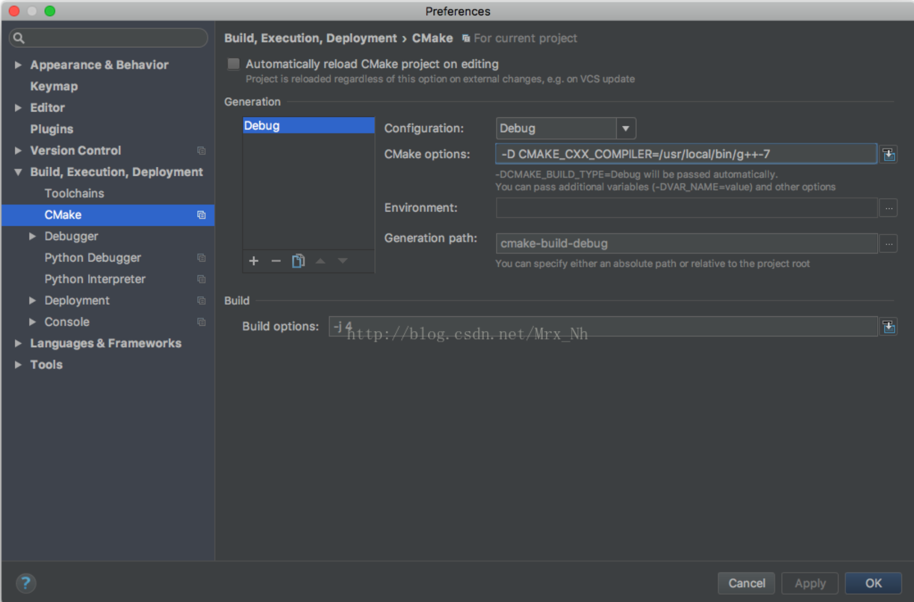

## 简介

<!--more-->

C++，使用 CLion编程; 

首先，Mac OS 自带的g++编译器版本比较低，许多c++的新特性都不支持，所以可以先在终端下下载g++ 的新版本，如g++7，代开Clion后在preference里找到Cmake并修改参数如下：

`-D CMAKE_CXX_COMPILER=/usr/local/bin/g++-7`




与服务器交互配置：

https://www.cnblogs.com/pugang/p/9734547.html

## CLion 学习之读懂 CMakeLists.txt

有当我们使用 CLion 自动生成一个简单的 C 项目，目录如下：

```
├── CMakeLists.txt
├── cmake-build-debug
└── main.c
```

main.c

```c++
#include <stdio.h>

int main() {
    printf("Hello, World!\n");
    return 0;
}
```

CMakeLists.txt

```cmake
cmake_minimum_required(VERSION 3.8)
project(demo1)

set(CMAKE_C_STANDARD 99)

set(SOURCE_FILES main.c)
add_executable(demo1 ${SOURCE_FILES})
```

`CMakeLists.txt`是什么呢？ CLion 的编译肯定是依赖这个文件了。有了这个文件，我们就可以直接使用 ide 里面的 run 和 debug 了，相比使用 gdb 来断点调试，开发效率简直有质的飞跃了哈。（不过，很多问题需要线上追踪的话，只能 gdb 了）

CMake 是一个**跨平台的自动化建构系统**，它使用一个名为 CMakeLists.txt 的文件来**描述构建过程**，可以产生标准的构建文件，如 Unix 的 Makefile 或Windows Visual C++ 的 projects/workspaces 。

# CMakeLists.txt 语法

```cmake
# 限定了 CMake 的版本
cmake_minimum_required(VERSION 3.8)

# 该命令表示项目的名称是 main 
project(demo1)

# set(变量 值)
set(CMAKE_C_STANDARD 99)
set(SOURCE_FILES main.c)

# ${xxx} 引用上面定义的 xxx 变量
# add_executable 表示把变量 SOURCE_FILES 编译成一个名称为 demo1 的可执行文件。
add_executable(demo1 ${SOURCE_FILES})
```