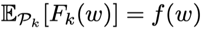
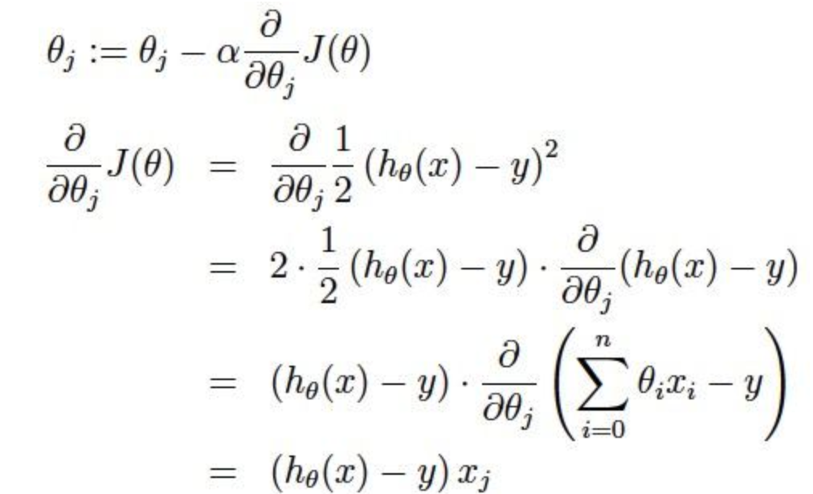
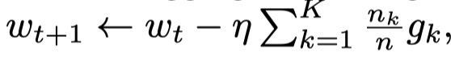
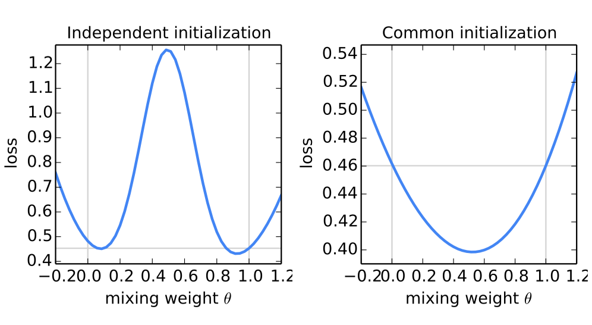
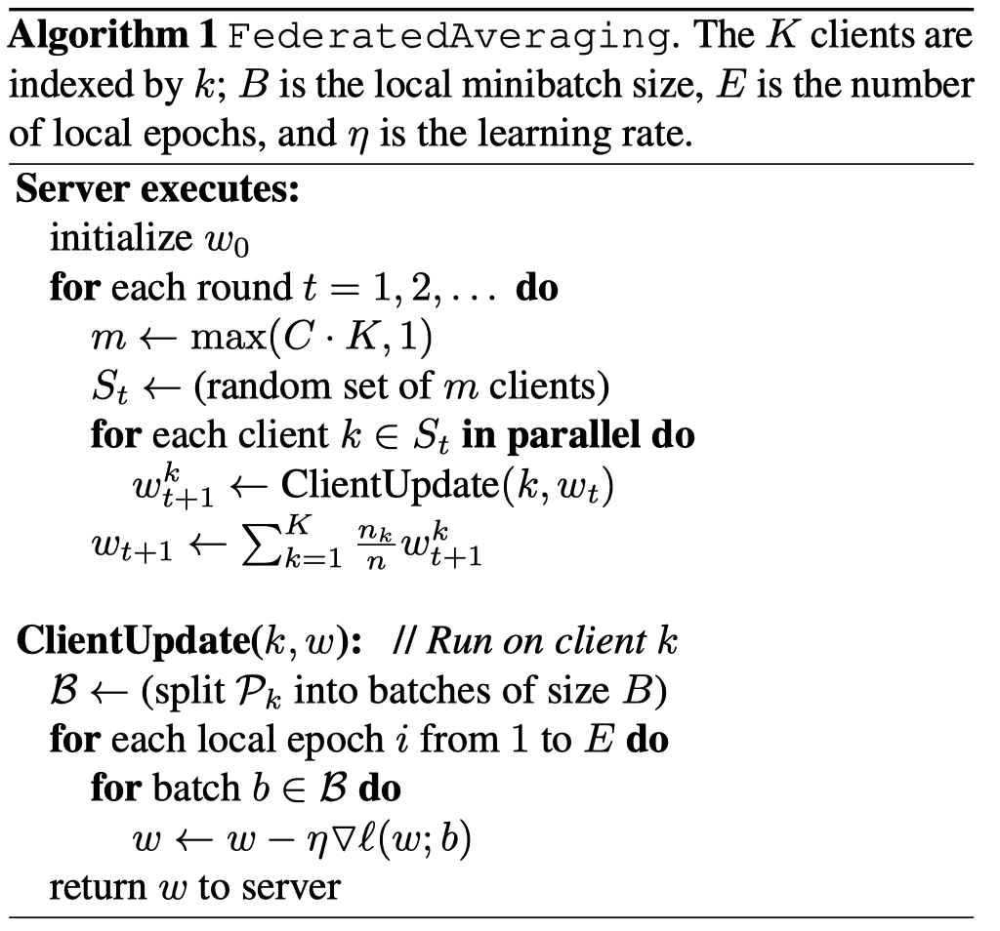

> title: 基于分散数据的深度网络通信高效学习

<!--more-->
# Abstract
现代移动设备可以访问适合学习模型的大量数据，这反过来可以极大地改善设备上的用户体验。例如，语言模型可以改善语音识别和文本输入，图像模型可以自动选择好照片。然而，这种丰富的数据通常是隐私敏感的，数量大或两者兼而有之，这可能妨碍使用传统方法记录到数据中心并在那里进行训练。我们提倡一种替代方案，即将**训练数据分布在移动设备上，并学习共享模型是通过聚合本地计算的更新模型得到**。我们将这种分散的方法称为联合学习。

我们提出了一种**基于迭代模型平均的联合学习**深度网络的实用方法，并进行了广泛的经验评估，考虑了五种不同的模型结构和四种数据集。这些实验证明该方法对于**非平衡和非IID数据分布**是稳健的，这是该设置的一个定义特征。**通信成本**是主要的约束条件，与同步随机梯度下降相比，我们显示所需通信轮次减少了10-100倍。

# 1 Introduction
手机和平板电脑越来越多地成为许多人的主要计算设备[30,2]。 这些设备上的强大传感器（包括摄像头，麦克风和GPS），加上它们经常携带的事实，意味着它们可以访问前所未有的大量数据，其中大部分是私有的。
在这些数据上学到的模型有望通过为更智能的应用程序提供动力来大大提高可用性，但**数据的敏感性意味着将其存储在集中位置存在风险和责任**。

我们研究了一种学习技术，该技术允许用户集体获得从这些丰富数据训练的共享模型的好处，而无需集中存储它。我们称之为联合学习，因为学习任务是由一个由中央服务器(server)协调的参与设备（我们称之为客户端client）的松散联合解决的。

每个客户端都有一个从未上传到服务器的**本地训练数据集**。相反，**每个客户端计算服务器维护的当前全局模型的更新，并且仅传递此更新**。 这是2012年白宫关于消费者数据隐私的报告[39]提出的重点收集或数据最小化原则的直接应用。由于这些更新特定于改进当前模型，因此一旦应用它们就没有理由存储它们。

这种方法的主要优点是**模型训练**与**直接访问原始训练数据**的需要脱钩。显然，仍然需要一些信任的服务器协调训练。但是，对于可以根据每个客户端上可用数据指定训练目标的应用程序，联合学习可以通过将攻击面限制为仅设备而非设备和云来显着降低隐私和安全风险。

我们的主要贡献：

1. 确定移动设备分散数据训练问题是一个重要的研究方向;
2. 选择可应用于此设置的简单实用的算法;
3. 对一些方法进行广泛的实证评估。

更具体地说，我们引入了**FederatedAveraging**算法，**该算法将每个客户端上的本地随机梯度下降（SGD）与服务器用来执行模型平均。**我们对该算法进行了广泛的实验，证明它对非平衡和非IID数据分布具有鲁棒性，并且可以减少在分散数据上训练深度网络所需的通信量。

## Federated Learning
联合学习的理想问题具有以下特性：
1）对来自移动设备的真实数据的训练提供了优于数据中心通常可用的代理数据训练的明显优势。 
2）该数据对隐私敏感或规模大（与模型的大小相比），因此最好不要仅仅为了模型训练（使用聚焦​​收集原则）而将其记录到数据中心。 
3）对于监督任务，可以从用户交互中自然地推断出数据上的标签。

许多支持移动设备智能行为的模型符合上述标准。作为两个例子，我们考虑图像分类，例如预测哪些照片最有可能在未来多次被观看或共享;和语言模型，可以通过改进解码，下一个单词预测，甚至预测整个回复来改善触摸屏键盘上的语音识别和文本输入[10]。这些任务的潜在训练数据（用户拍摄的所有照片以及他们在移动键盘上键入的所有内容，包括密码，URL，消息等）都可能对隐私敏感。绘制这些示例的分布也可能与容易获得的代理数据集大不相同：聊天和文本消息中的语言使用通常与标准语言语料库（例如，维基百科和其他Web文档）大不相同;人们拍摄手机的照片可能与典型的Flickr照片完全不同。最后，这些问题的标签可以直接使用：输入的文本是自我标记的，用于学习语言模型，照片标签可以通过自然用户与照片应用程序的交互来定义（照片被删除，共享或查看）。

这两项任务都非常适合学习神经网络。对于图像分类，前馈深度网络，特别是卷积网络，众所周知提供最先进的结果[26,25]。对于语言建模任务，递归神经网络，特别是LSTM，已经取得了最先进的结果[20,5,22]。

## Privacy？？
与持久数据的数据中心训练相比，联合学习具有明显的隐私优势。持有“匿名”数据集仍然可以通过与其他数据的连接将用户隐私置于风险之中[37]。相反，为联合学习传输的信息是改进特定模型所必需的最小更新（当然，隐私利益的强度取决于更新的内容）更新本身可以（并且应该）是短暂的。它们永远不会包含比原始训练数据更多的信息（通过数据处理不等式），并且通常包含的内容要少得多。此外，聚合算法不需要更新源，因此可以在不通过诸如Tor [7]的混合网络或通过可信第三方识别元数据的情况下发送更新。我们将在本文末尾简要讨论将**联合学习与安全多方计算和差异隐私相结合**的可能性。

## Federated Optimization
我们将联合学习中**隐含的优化问题称为联合优化**，将连接（和对比）绘制为分布式优化。联合优化具有几个关键属性，可将其与典型的分布式优化问题区分开来：

- **Non-IID** 给定客户端上的训练数据通常基于特定用户对移动设备的使用，因此任何特定用户的本地数据集将不代表真实分布。
- **Unbalanced** 同样，一些用户将比其他用户更多地使用服务或应用程序，从而导致不同数量的本地培训数据。
- **Massively distributed** 我们希望参与优化的客户端数量远远大于每个客户端的平均示例数量。
- **Limited communication**移动设备经常处于脱机状态或连接缓慢或昂贵。

这项工作中，我们的**重点是优化**的**非IID和不平衡属性**，以及**通信约束的关键性质**。部署的联合优化系统还必须解决许多实际问题：随着数据的添加和删除而变化的客户端数据集;客户可用性与复杂方式的本地数据分布相关（例如，美国英语使用者的电话可能会在不同时间插入英国英语的发言者）;客户端不响应或发送损坏更新。

这些问题超出了目前的工作范围;相反，我们使用适合实验的受控环境，但仍解**决客户端可用性**以及**不平衡**和**非IID数据**的关键问题。我们假设**一个同步更新方案，进行多轮通信。有一组固定的$K$客户端，每个客户端都有一个固定的本地数据集。在每轮的开始，随机选择部分$C$个客户端，并且服务器将当前全局算法状态发送到这些客户端中的每一个（例如，当前模型参数）**。我们只选择一小部分客户来提高效率，因为我们的实验显示，在超过某一点时添加更多客户的收益递减。然后，**每个选定的客户端基于全局状态及其本地数据集执行本地计算，并向服务器发送更新。然后，服务器将这些更新应用于其全局状态，并重复该过程。**

虽然我们关注非凸神经网络目标，但我们考虑的算法适用于任何有限目标的式子：

$\min _ { w \in \mathbb { R } ^ { d } } f ( w ) \quad \text { where } \quad f ( w ) \stackrel { \text { def } } { = } \frac { 1 } { n } \sum _ { i = 1 } ^ { n } f _ { i } ( w )$         （1）

对于机器学习问题，我们把 $f _ { i } ( w ) =\ell \left( x _ { i } , y _ { i } ; w \right) $ 由 损失函数 和模型参数 $w$ 组成。

我们假设数据被分区有$K$个客户端上，$p_{k}$是客户端$k$上的数据点索引集合, $n _ { k } = \left| \mathcal { p } _ { k } \right|$.大小
因此我们重写式子(1)为:
$f ( w ) = \sum _ { k = 1 } ^ { K } \frac { n _ { k } } { n } F _ { k } ( w ) \quad$ where $\quad F _ { k } ( w ) = \frac { 1 } { n _ { k } } \sum _ { i \in \mathcal { P } _ { k } } f _ { i } ( w )$

总数据集大小是n；左边是式子是说`1..K`个客户端训练数据，客户端K的数据集是$n _ { k }$, 加权平均$F _ { k } ( w )$; 同时右边是的式子是指每一个$F _ { k } ( w )$有平均梯度

如果通过在客户端上随机均匀地分布训练样例来形成分区$p_{k}$；然后我们将会有 ;就是client k的期望。这是通常由分布式优化算法做出的IID假设;我们指的是这不成立的情况($F _ { k }$坏的分布预测)

在数据中心优化中，**通信成本**相对较小，计算成本占主导地位，最近的重点主要是使用GPU降低这些成本。相反，在联合优化中，通信成本占主导地位-我们通常会受到1MB/s或更低的上传带宽的限制。此外，客户通常只会在充电，插入和未计量的Wi-Fi连接时自愿参与优化。此外，我们希望每个客户每天只参加少量的更新轮次。另一方面，由于任何单个设备上的数据集与总数据集大小相比较小，并且现代智能手机具有相对较快的处理器（包括GPU），与许多模型类型的通信成本相比，计算变得基本上是免费的。

因此，我们的目标是**使用额外的计算**，**以减少训练模型所需的通信轮次数**。我们可以通过两种主要方式添加计算：
1）增加并行性，我们使用**更多客户端独立工作**在每个通信轮次之间
2）**增加每个客户端的计算**，而不是像梯度计算那样执行简单的计算，每个客户端在每个通信轮次之间执行更复杂的计算。
我们研究了这两种方法，但是**我们实现的加速主要是因为在每个客户端上添加更多计算**；一旦在客户端上使用最低级别的并行性。

## Related Work
McDonald等人已经研究了通过迭代平均局部训练的模型进行的分布式训练[28]感知器和Povey[31]用于语音识别DNN。张[42]研究了一种采用“软”平均的异步方法“soft” averaging。这些工作仅考虑群集/数据中心设置（最多16个workers，基于快速网络的挂钟时间），并且不考虑非平衡和非IID的数据集，这些属性对联合学习设置至关重要。我们将这种**算法类型调整为联合设置并执行适当的实证评估**，这些评估会提出与数据中心设置相关的不同问题，并且需要不同的方法。

使用与我们相似的动机，Neverova等。 [29]还讨论了在设备上保留敏感用户数据的优势。 Shokri和Shmatikov [35]的工作在几个方面有关：**他们专注于训练深层网络，强调隐私的重要性，并通过在每轮通信中共享一部分参数来解决通信成本**;然而，他们也不考虑**不平衡和非IID数据**，并且实证评估是有限的。

在凸设置中，分布式优化和估计问题已经引起了人们的重视[4,15,33]，并且一些算法确实专注于通信效率[45,34,40,27,43]。除了假设凸性之外，这个现有工作通常要求客户端的数量远小于每个客户端的示例数量，数据以IID方式分布在客户端上，并且每个节点具有相同的数量数据点 - **联合优化设置中违反了所有这些假设**。异步分布式SGD也已应用于训练神经网络，例如Dean等人。 [12]，但这些方法在联合设置中需要大量的更新。分布式一致性算法（例如，[41]）放宽了IID假设，但对于很多客户端的通信约束优化仍然不是很好。

我们考虑是单次的简单的平均对参数化的算法家族来说，其中每一个client解决model的最小损失在本地数据上，这些模型将会被平均分配到最终模型上。在IID数据的凸案例中已经广泛研究了这种方法，并且众所周知，在最坏的情况下，**生成的全局模型几乎等于单个客户端上训练模型的训练效果。**

## 理解随机梯度下降，
首先要知道梯度下降法，故先介绍梯度下降法：
### 梯度下降法
大多数机器学习或者深度学习算法都**涉及某种形式的优化**。优化指的是**改变 $x$以最小化或最大化某个函数 $f(x)$**的任务。 我们通常以**最小化 $f(x)$ 指代大多数最优化问题**。 最大化可经由最小化算法最小化 $-f(x)$ 来实现。

我们把要最小化或最大化的函数称为**目标函数或准则**。 当我们对其进行最小化时，我们也把它称为**代价函数、损失函数或误差函数**。
下面，我们假设一个损失函数为$J ( \theta ) = \frac { 1 } { 2 } \sum _ { i = 1 } ^ { m } \left( h _ { \theta } ( x ) - y \right) ^ { 2 }$;其中$h _ { \theta } ( x ) = \theta _ { 0 } + \theta _ { 1 } x _ { 1 } + \theta _ { 2 } x _ { 2 } \ldots + \theta _ { n } x _ { n }$;然后要使得最小化它

**梯度下降**：我们知道曲面上**方向导数的最大值的方向就代表了梯度的方向**，因此我们在做**梯度下降的时候，应该是沿着梯度的反方向进行权重的更新，可以有效的找到全局的最优解**。这个 $\theta_i$ 的更新过程可以描述为

[a表示的是步长或者说是学习率（learning rate）]

**随机梯度下降**：在每次更新时用1个样本，可以看到多了随机两个字，随机也就是说我们用样本中的一个例子来近似我所有的样本，来调整θ，因而随机梯度下降是会带来一定的问题，因为计算得到的并不是准确的一个梯度，对于**最优化问题，凸问题**，虽然不是每次迭代得到的损失函数都向着全局最优方向， 但是大的整体的方向是向全局最优解的，最终的结果往往是在全局最优解附近。但是相比于批量梯度，这样的方法更快，更快收敛，虽然不是全局最优，但很多时候是我们可以接受的，所以这个方法用的也比上面的多。

# 2 The FederatedAveraging Algorithm
最近深度学习的众多成功应用几乎完全依赖于随机梯度下降（SGD）的变体进行优化;事实上，许多进步可以被理解为**通过使用简单的基于梯度的方法使模型的结构（以及因此损失函数）更适合于优化**。因此，我们很自然地**从SGD开始构建用于联合优化的算法**。

SGD可以自然地应用于联合优化问题，其中每轮通信完成一个batch数量梯度计算（例如在随机选择的客户端上）。这种方法计算效率很高，但需要大量的训练才能生成出良好的模型(即使使用像批量标准化这样的高级方法，Ioffe和Szegedy也会在尺寸为60的minibatches上训练MNIST 50000步).我们在CIFAR-10实验中考虑了这个基线。

在联合设置中，涉及更多客户端的挂钟时间成本很低，因此对于我们的基线，我们**使用大批量同步SGD**;experiments by Chen et al.表明这种方法在数据中心设置中是最先进的，它在性能上优于异步方法。为了要在联合设置中应用此方法，我们在**每一轮中选择一小部分$C$客户，并计算这些客户持有的所有数据的损失梯度**。因此，$C$部分控制着global batch size的大小，C=1对应于全批（非随机）梯度下降。**我们将此基线算法称为FederatedSGD**（或FedSGD）。FedSGD的典型实现：C=1, 一个固定的学习率η**每个client k计算$g _{k} = \nabla F (w_{t})$;**当前模型的本地数据的平均梯度$w_{t}$;每个中心服务器聚合这些梯度并且引用这些更新; 因为$\sum _ { k = 1 } ^ { K } \frac { n _ { k } } { n } g _ { k } = \nabla f \left( w _ { t } \right)$。一个相等的更新$\forall k , w _ { t + 1 } ^ { k } \leftarrow w _ { t } - \eta g _ { k }$。也就是说，**每个客户端使用其本地数据在当前模型上本地采用梯度下降的一步**，然后**服务器对所得模型进行加权平均**。

一旦以这种方式编写算法，我们可以通过**迭代本地更新为每个客户端添加更多计算**$w ^ { k } \leftarrow w ^ { k } - \eta \nabla F _ { k } \left( w ^ { k } \right)$在平均步骤之前多次。我们称这种方法为FederatedAveraging（或FedAvg）。

**计算量**由三个关键参数控制：
$C$:每轮执行计算的客户端的比例;
$E$:然后每个客户在每轮上对其本地数据集进行的训练传递次数
$B$:用于客户端更新的本地小批量大小。
我们写B =∞表示完整的本地数据集被视为单个小批量。因此，在该算法族的一个两端，我们可以取B =∞和E = 1，这与FedSGD完全对应。对于具有$n_{k}$个本地示例的客户端，每轮本地更新的数量由给出$u _ { k } = E \frac { n _ { k } } { B }$; 算法1中给出了完整的伪代码

图1: 通过平均两个模型的参数生成的模型的完整MNIST训练集的损失 w and w 0 using θw + (1 − θ)w 0 for 50 evenly spaced values θ ∈ [−0.2, 1.2]; 使用SGD在不同的小数据集上训练模型w和w 0。对于左图，使用不同的随机种子初始化w和w 0;对于右图，使用共享种子。**请注意不同的y轴刻度。水平线给出了由w或w 0实现的最佳损耗（它们非常接近与对应于θ= 0和θ= 1处的垂直线）**。通过共享初始化，**对模型进行平均可以显着减少总训练集的损失**（比任何一个父模型的损失要好得多）。

θ是参数，控制调节；总的损失函数：

对于一般的非凸目标，参数空间中的平均模型可能产生任意不良的模型。
遵循Goodfellow等人的方法 [17]。当我们对从不同初始条件训练的两个MNIST数字识别模型进行平均时，我们看到了这种不良行为（图1，左）。对于该图，父模型w和w 0均在来自MNIST训练集的600个实例的非重叠IID样本上进行训练。训练是通过SGD进行的，固定学习率为0.1，对于50个50（或E = 20次通过大小为600的minibatch）的240个更新。这大约是模型开始过拟合其本地数据集的训练量。

最近的研究表明，在实践中，足够过度参数化的NN的损失表面出乎意料地得到了很好的支持，特别是不像以前认为的那样容易出现局部最小值。事实上，当我们从相同的随机初始化开始两个模型然后再次在不同的数据子集上独立训练时（如上所述），我们发现原始的参数平均效果出奇的好(Figure 1, right):这两个模型的平均值, $\frac { 1 } { 2 } w + \frac { 1 } { 2 } w ^ { \prime }$;在整个MNIST训练集上实现的损失显着低于通过独立训练任何一个小数据集所获得的最佳模型。虽然图1从随机初始化开始，但请注意每轮FedAvg使用共享的起始模型，因此同样的直觉也适用。

# 3 Experimental Results

# 4 Conclusions and Future Work
我们的实验表明联合学习可以变得切实可行，因为FedAvg使用相对较少的几轮通信训练高质量模型，如各种模型架构的结果所示：多层感知器，两个不同的卷积NN，双层字符LSTM和大规模字级LSTM。

虽然联合学习提供了许多实用的隐私保护，但通过差异隐私[14,13,1]提供更强有力的保证，安全的多方计算[18]，或者它们的组合是未来工作的一个有趣方向。请注意，这两类技术最自然地应用于FedAvg等同步算法。

这项工作之后，Bonawitz等人。 [6]为联邦学习引入了一种有效的安全聚合协议，Konecn'y等。 [23]提出了进一步降低通信成本的算法。

[6] Keith Bonawitz, Vladimir Ivanov, Ben Kreuter, Anto- nio Marcedone, H. Brendan McMahan, Sarvar Patel, Daniel Ramage, Aaron Segal, and Karn Seth. Practical secure aggregation for federated learning on user-held data. In NIPS Workshop on Private Multi-Party Machine Learning, 2016.
用于用户持有数据的联合学习的实用安全聚合。在NIPS私人多方机器学习研讨会上

[23] JakubKoneˇcn´y, H. Brendan McMahan, Felix X. Yu, Peter Richtarik, Ananda Theertha Suresh, and Dave Bacon. Federated learning: Strategies for improving communication efficiency. In NIPS Workshop on Private Multi-Party Machine Learning, 2016.
联合学习：提高沟通效率的策略。在NIPS私人多方机器学习研讨会

