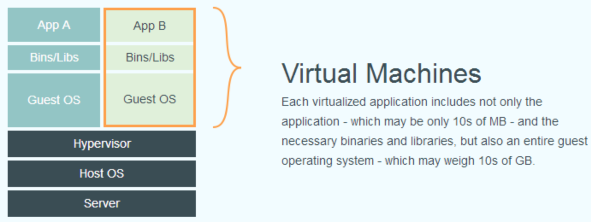
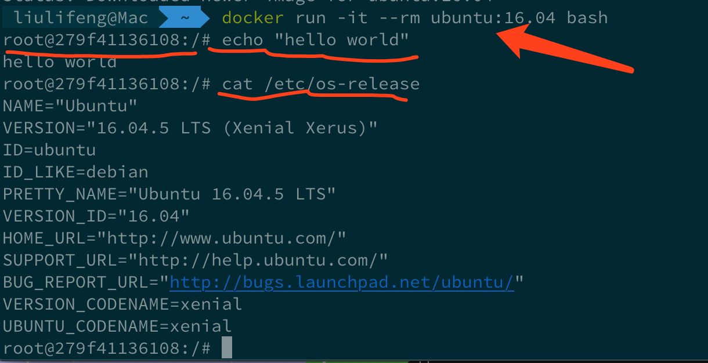
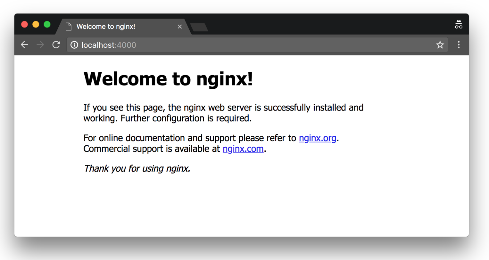
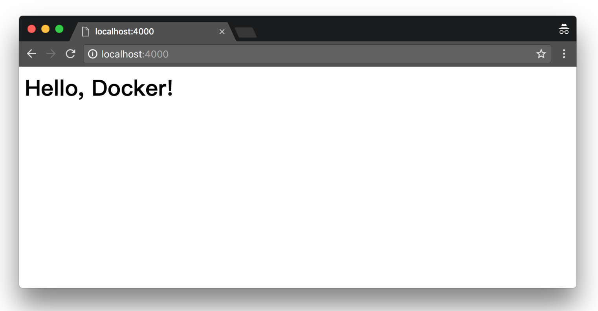
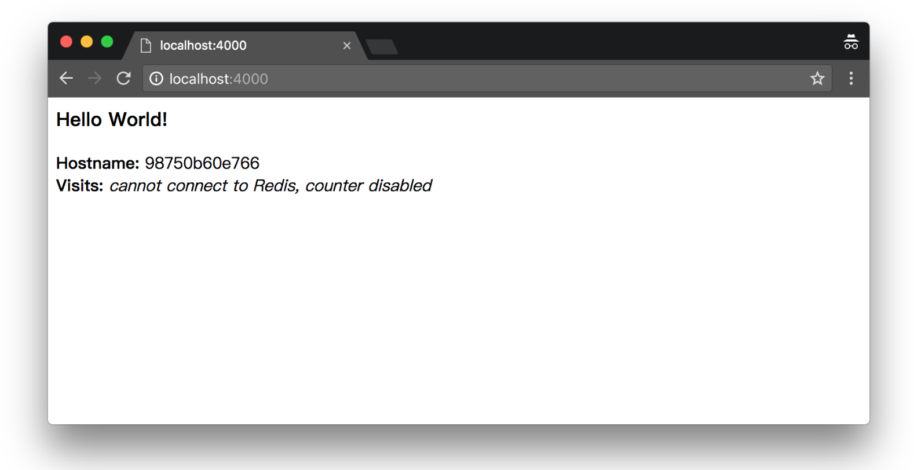

## 简介
本文记录的是作为一个新手，从了解 Docker 是什么、Docker 技术包含哪些概念到上手使用、安装以及发布 Docker 镜像的整个过程。作者在学习过程中参阅了诸多文档和教程，在此一并感谢，与此同时本文结尾也列出了参考文献的链接，供读者进一步参考。遵循简介、入门、上手到深入的顺序，本文根据个人学习实践过程进行书写，结构如下：

<!--more-->

- Docker 简介
    - 1.1 Docker 概念扫盲：什么是 Docker？
    - 1.2 Docker 和虚拟机的区别与特点
- Docker 基本概念
    - 2.1 核心概念：镜像、容器与仓库
    - 2.2 Docker 三剑客
- Docker 安装与使用
    - 3.1 Docker 安装、运行与加速
    - 3.2 Hello World
- 镜像使用与发布
    - 4.1 镜像的获取与使用
    - 4.2 通过 commit 命令理解镜像构成
    - 4.3 利用 Dockerfile 定制镜像
- 总结
- 参考

其中第一章与第二章非常详细地介绍了 Docker 的相关概念与基本组成，主要是概论介绍等文字描述，第三章与第四章偏重于上手实践，从 Docker 环境安装、运行加速、镜像使用、镜像构成到镜像定制与发布，分解了各步骤的流程，通过教程加注解的形式加深读者印象。其中建立镜像的示例代码可以从 [GitHub](https://github.com/hijiangtao/friendlyhello-docker) 打包下载。

# 一、Docker 简介
谈到 Docker，不论我们是否实践过，都应该对它或多或少有一个印象，即“环境一次创建，多端一致性运行”，因为它正解决了曾经困扰我们已久“这段代码在我电脑上运行没问题啊”的烦恼。首先，简单介绍一下 Docker 技术是什么。
## 1.1 Docker 概念扫盲：什么是 Docker？
Docker 是一个开放源代码软件项目，项目主要代码在2013年开源于 [GitHub](https://github.com/moby/moby)。它是云服务技术上的一次创新，**让应用程序布署在软件容器下的工作可以自动化进行，借此在 Linux 操作系统上，提供一个额外的软件抽象层，以及操作系统层虚拟化的自动管理机制**。

Docker 利用 Linux **核心中的资源分脱机制**，例如 *cgroups，以及 Linux 核心名字空间（name space）*，来创建独立的软件容器（containers），属于操作系统层面的虚拟化技术。由于隔离的进程独立于宿主和其它的隔离的进程，因此也称其为容器。Docker 在容器的基础上进行了进一步的封装，从文件系统、网络互联到进程隔离等等，极大的简化了容器的创建和维护，使得其比虚拟机技术更为轻便、快捷。Docker 可以在单一 Linux 实体下运作，避免因为创建一个虚拟机而造成的额外负担。

## 1.2 Docker 和虚拟机的区别与特点
对于新手来说，第一个觉得困惑的地方可能就是不清楚 Docker 和虚拟机之间到底是什么关系。以下两张图分别介绍了虚拟机与 Docker 容器的结构。


对于虚拟机技术来说，传统的虚拟机需要模拟整台机器包括硬件，每台虚拟机都需要有自己的操作系统，虚拟机一旦被开启，预分配给他的资源将全部被占用。每一个虚拟机包括应用，必要的二进制和库，以及一个完整的用户操作系统。
![](./Docker快速入门/images/DockerStructure.png

容器技术和我们的宿主机共享硬件资源及操作系统，可以实现资源的动态分配。容器包含应用和其所有的依赖包，但是与其他容器共享内核。**容器在宿主机操作系统中，在用户空间以分离的进程运行**。容器内没有自己的内核，也没有进行硬件虚拟

具体来说与虚拟机技术对比，Docker 容器存在以下几个特点：

1. 更快的启动速度：因为 Docker 直接运行于宿主内核，无需启动完整的操作系统，因此启动速度属于秒级别，而虚拟机通常需要几分钟去启动。
2. 更高效的资源利用率：由于容器不需要进行硬件虚拟以及运行完整操作系统等额外开销，Docker 对系统资源的利用率更高。
3. 更高的系统支持量：Docker 的架构可以共用一个内核与共享应用程序库，所占内存极小。同样的硬件环境，Docker 运行的镜像数远多于虚拟机数量，对系统的利用率非常高。
4. 持续交付与部署：对开发和运维人员来说，最希望的就是**一次创建或配置，可以在任意地方正常运行**。使用 Docker 可以通过**定制应用镜像来实现持续集成、持续交付、部署**。**开发人员可以通过 Dockerfile 来进行镜像构建，并进行集成测试**，而运维人员则可以直接在生产环境中快速部署该镜像，甚至进行自动部署。
5. 更轻松的迁移：由于 Docker 确保了执行环境的一致性，使得应用的迁移更加容易。Docker 可以在很多平台上运行，无论是物理机、虚拟机、公有云、私有云，甚至是笔记本，其运行结果是一致的。因此用户可以很轻易的将在一个平台上运行的应用，迁移到另一个平台上，而不用担心运行环境的变化导致应用无法正常运行的情况。
6. 更轻松的维护与扩展：Docker 使用的**分层存储以及镜像**的技术，使得应用重复部分的复用更为容易，也使得应用的维护更新更加简单，基于基础镜像进一步扩展镜像也变得非常简单。此外，Docker 团队同各个开源项目团队一起维护了一大批高质量的 官方镜像，既可以直接在生产环境使用，又可以作为基础进一步定制，大大的降低了应用服务的镜像制作成本。
7. 更弱的隔离性：Docker 属于进程之间的隔离，虚拟机可实现系统级别隔离。
8. 更弱的安全性：Docker 的租户 root 和宿主机 root 等同，一旦容器内的用户从普通用户权限提升为 root 权限，它就直接具备了宿主机的 root 权限，进而可进行无限制的操作。虚拟机租户 root 权限和宿主机的 root 虚拟机权限是分离的，并且利用硬件隔离技术可以防止虚拟机突破和彼此交互，而容器至今还没有任何形式的硬件隔离，这使得容器容易受到攻击。

# 二、Docker 基本概念
##2.1 核心概念：镜像、容器与仓库

Docker 主要包含三个基本概念，分别是镜像、容器和仓库，理解了这三个概念，就理解了 Docker 的整个生命周期。以下简要总结一下这三点，详细介绍可以移步[Docker 从入门到实践](https://yeasy.gitbooks.io/docker_practice/content/basic_concept/)对应章节。

- 镜像：Docker 镜像是一个特殊的**文件系统**，除了**提供容器运行时所需的程序、库、资源、配置等文件**外，还包含了一些为运行时**准备的一些配置参数**（如匿名卷、环境变量、用户等）。**镜像不包含任何动态数据，其内容在构建之后也不会被改变。**
- 容器：**容器的实质是进程**，但与直接在宿主执行的进程不同，容器进程运行于属于自己的独立的命名空间容器可以被创建、启动、停止、删除和暂停等等，说到镜像与容器之间的关系，可以类比面向对象程序设计中的类和实例。
- 仓库：镜像构建完成后，可以很容易的在当前宿主机上运行，但是，如果需要在其它服务器上使用这个镜像，我们就**需要一个集中的存储、分发镜像的服务**，Docker Registry 就是这样的服务。**一个 Docker Registry 中可以包含多个仓库；每个仓库可以包含多个标签；每个标签对应一个镜像，其中标签可以理解为镜像的版本号**。

## 2.2 Docker 三剑客
- **docker-compose**：Docker 镜像在创建之后，往往需要自己手动 pull 来获取镜像，然后执行 run 命令来运行。当服务需要用到多种容器，容器之间又产生了各种依赖和连接的时候，部署一个服务的手动操作是令人感到十分厌烦的。

dcoker-compose 技术，就是通过一个 `.yml` 配置文件，将所有的容器的部署方法、文件映射、容器连接等等一系列的配置写在一个配置文件里，最后只需要执行 `docker-compose up` 命令就会像执行脚本一样的去一个个安装容器并自动部署他们，极大的便利了复杂服务的部署。

- **docker-machine**：Docker 技术是基于 Linux 内核的 cgroup 技术实现的，那么问题来了，在非 Linux 平台上是否就不能使用 docker 技术了呢？答案是可以的，不过显然需要**借助虚拟机去模拟出 Linux 环境来**。

docker-machine 就是 docker 公司官方提出的，用于在各种平台上快速创建具有 docker 服务的虚拟机的技术，甚至可以通过指定 driver 来定制虚拟机的实现原理（一般是 virtualbox）

- **docker-swarm**：swarm 是基于 docker 平台实现的集群技术，他可以通过几条简单的指令快速的创建一个 docker 集群，接着在集群的共享网络上部署应用，最终实现分布式的服务。

# 三、Docker 安装与使用
Docker 按版本划分，可以区分为 CE 和 EE。CE 即社区版（免费，支持周期三个月），EE 即企业版，强调安全，付费使用。
## 3.1 Docker 安装、运行与加速
本部分只介绍 macOS 上的安装，其余操作系统上的使用方法可以参见[官网](https://docs.docker.com/install/)。

Docker for Mac 要求系统最低为 macOS 10.10.3 Yosemite。如果系统不满足需求，可以安装 Docker Toolbox。

安装方法有两种：homebrew 和手动下载安装。Homebrew-Cask 已经支持 Docker for Mac，如果使用该方式，你只需要运行如下命令：
`brew cask install docker`
若是手动下载，也很容易。从[这里](https://docs.docker.com/docker-for-mac/install/#install-and-run-docker-for-mac)选择合适你的版本下载 dmg 文件，然后拖进应用中即可。

启动应用之后，你可以在命令行查看 Docker 版本（Docker 不同技术对应的版本用不同命令进行查看）：

```
docker --version
> Docker version 18.03.0-ce, build 0520e24

docker-compose --version
> docker-compose version 1.20.1, build 5d8c71b

docker-machine --version
> docker-machine version 0.14.0, build 89b8332
```
当然了，由于某些原因，国内从 Docker Hub 上拉取内容会非常缓慢，这个时候就可以配置一个镜像加速器环境。详情说明可以移步[Docker 中国官方镜像加速](https://www.docker-cn.com/registry-mirror)，对于 macOS 用户，在任务栏点击应用图标 -> Perferences… -> Daemon -> Registry mirrors，在列表中填写加速器地址 `https://registry.docker-cn.com` 即可。修改完成之后，点击 `Apply & Restart` 即可。

## 3.2 Hello World
大多数编程语言以及一些软件的第一个示例都是 `Hello Wolrd`，Docker 也不例外，运行 `docker run hello-world` 验证一下吧（该命令下 Docker 会在本地查找镜像是否存在，但因为环境刚装上所以肯定不存在，之后 Docker 会去远程 `Docker registry server` 下载这个镜像），以下为运行信息。

```
Unable to find image 'hello-world:latest' locally
latest: Pulling from library/hello-world
d1725b59e92d: Pull complete
Digest: sha256:0add3ace90ecb4adbf7777e9aacf18357296e799f81cabc9fde470971e499788
Status: Downloaded newer image for hello-world:latest

Hello from Docker!
This message shows that your installation appears to be working correctly.

To generate this message, Docker took the following steps:
 1. The Docker client contacted the Docker daemon.
 2. The Docker daemon pulled the "hello-world" image from the Docker Hub.
    (amd64)
 3. The Docker daemon created a new container from that image which runs the
    executable that produces the output you are currently reading.
 4. The Docker daemon streamed that output to the Docker client, which sent it
    to your terminal.

To try something more ambitious, you can run an Ubuntu container with:
 $ docker run -it ubuntu bash

Share images, automate workflows, and more with a free Docker ID:
 https://hub.docker.com/

For more examples and ideas, visit:
 https://docs.docker.com/get-started/
```
网上有不少文章说到 macOS 的特殊配制，即由于 Docker 引擎使用了特定于 Linux 内核的特性，需要安装一个轻量级的虚拟机（如 VirtualBox）来保证在 macOS 上正常运行 Docker。于是建议下载官方提供的 Boot2Docker 来运行 Docker 守护进程。但是查看了项目动态后发现，由于 Docker for Mac 和 Docker for Windows 的发布，这一操作已不被推荐，即两个客户端环境中已经继承了该功能。

>Boot2Docker is officialy in maintenance mode – it is recommended that users transition from Boot2Docker over to Docker for Mac or Docker for Windows instead. From https://github.com/boot2docker/boot2docker

所以在看到任何教程准备上手之前，最好看看教程本身依赖的环境版本以及软件最新的发布动态，这个习惯对于本文的作者来说也不例外。

# 四、镜像使用与发布
## 4.1 镜像的获取与使用
之前提到 Docker Hub 上有大量优秀的镜像，下面先来说说如何获取镜像。和 git 类似，docker 也使用 pull 命令，其格式如下：
`docker pull [选项] [Docker Registry 地址[:端口号]/]仓库名[:标签]`

其中 Docker 镜像仓库地址若不写则默认为 `Docker Hub`，而仓库名是两段式名称，即 `<用户名>/<软件名>`。对于 Docker Hub，如果不给出用户名，则默认为 library，也就是官方镜像。我们拉取一个 ubuntu 16.04 镜像试试：

```
docker pull ubuntu:16.04

# 输出信息
16.04: Pulling from library/ubuntu
d3938036b19c: Pull complete
a9b30c108bda: Pull complete
67de21feec18: Pull complete
817da545be2b: Pull complete
d967c497ce23: Pull complete
Digest: sha256:9ee3b83bcaa383e5e3b657f042f4034c92cdd50c03f73166c145c9ceaea9ba7c
Status: Downloaded newer image for ubuntu:16.04
```
上面的命令中没有给出 Docker 镜像仓库地址，因此将会从 Docker Hub 获取镜像。而镜像名称是 ubuntu:16.04，因此将会获取官方镜像 `library/ubuntu` 仓库中标签为 16.04 的镜像。这里需要说明的是，由于 Docker for Mac 的支持即前文所述的原因，在 Docker 容器中使用的操作系统不必与主机操作系统相匹配。比如，你可以在 CentOS 主机中运行 Ubuntu，反之亦然。好了，下载完毕我们通过如下命令运行一个容器：
```
docker run -it --rm \
    ubuntu:16.04 \
    bash
```
运行完成后你便可以使用诸多命令来测试环境了，比如再来一遍 Hello Wolrd：
`echo "Hello World"`


或者查看系统信息：

```
cat /etc/os-release

# 输出信息
AME="Ubuntu"
VERSION="16.04.4 LTS (Xenial Xerus)"
ID=ubuntu
ID_LIKE=debian
PRETTY_NAME="Ubuntu 16.04.4 LTS"
VERSION_ID="16.04"
HOME_URL="http://www.ubuntu.com/"
SUPPORT_URL="http://help.ubuntu.com/"
BUG_REPORT_URL="http://bugs.launchpad.net/ubuntu/"
VERSION_CODENAME=xenial
UBUNTU_CODENAME=xenial
```
`docker run` 就是**运行容器**的命令，这里简要的说明一下上面用到的参数，详细用法可以查看 help。

- `-it`：这是两个参数，一个是 `-i` 表示**交互式操作**，一个是 `-t` 为**终端**。我们这里打算进入 bash 执行一些命令并查看返回结果，因此我们**需要交互式终端**。
- `--rm`：**这个参数是说容器退出后随之将其删除**。默认情况下，为了排障需求，退出的容器并不会立即删除，除非手动 docker rm。
- `ubuntu:16.04`：这是指用 `ubuntu:16.04` 镜像为基础来启动容器。
- `bash`：**放在镜像名后的是命令，这里我们希望有个交互式 Shell**，因此用 bash。

Docker 镜像还有一些常用操作，比如：

- `docker image ls` - 列出本地已下载镜像
- `docker image rm [选项] <镜像1> [<镜像2> ...]` - 删除镜像
- `docker logs <id/container_name>` - 查看容器日志
- `docker ps` - 列出当前所有正在运行的容器
- `docker ps -l` - 列出最近一次启动的容器
- `docker search image_name` - 从 Docker Hub 检索镜像
- `docker history image_name` - 显示镜像历史
- `docker push new_image_name` - 发布镜像

## 4.2 通过 commit 命令理解镜像构成

>`docker commit` 命令除了学习之外，还有一些特殊的应用场合，比如被入侵后保存现场等。但是，不要使用 `docker commit`定制镜像，定制镜像应该使用 Dockerfile 来完成。

以下通过定制化一个 web 服务器，来说明镜像的构成。

`docker run --name webserver -d -p 4000:80 nginx`

首先，以上命令会用 nginx 镜像启动一个容器，命名为 webserver，并映射在 4000 端口，接下来我们用浏览器去访问它，效果如下所示。


现在，假设我们非常不喜欢这个欢迎页面，我们希望改成欢迎 Docker 的文字，我们可以使用 `docker exec` 命令进入容器，修改其内容。
    
```
docker exec -it webserver bash
root@7603bd94b5e:/# echo '<h1>Hello, Docker!</h1>' > /usr/share/nginx/html/index.html
root@27603bd94b5e:/# exit
exit
```
这时刷新浏览器，我们发现效果变了。

我们修改了容器的文件，也就是改动了容器的存储层。我们可以通过 `docker diff` 命令看到具体的改动。

```
docker diff webserver

# 输出
C /root
A /root/.bash_history
C /run
A /run/nginx.pid
C /usr/share/nginx/html/index.html
C /var/cache/nginx
A /var/cache/nginx/client_temp
A /var/cache/nginx/fastcgi_temp
A /var/cache/nginx/proxy_temp
A /var/cache/nginx/scgi_temp
A /var/cache/nginx/uwsgi_temp
```
当我们运行一个容器的时候（如果不使用卷的话），我们做的任何文件修改都会被记录于容器存储层里。而 Docker 提供了一个 `docker commit` 命令，可以将容器的存储层保存下来成为镜像。换句话说，**就是在原有镜像的基础上，再叠加上容器的存储层，并构成新的镜像**。以后我们运行这个新镜像的时候，就会拥有原有容器最后的文件变化。

假设以上操作已经符合我们的定制了，接下来就将它保存下来。commit 语法格式如下：

`docker commit [选项] <容器ID或容器名> [<仓库名>[:<标签>]]`
我们在命令行输入（其中 author、message 等信息可以省略）：

```
docker commit \
--author "fallenk liu_lf@zju.edu.cn" \
--message "modify:Nginx default page to Hello Docker" \
webserver \
nginx:v2
sha256:6acf14e575436f39e7f9ab4cf1f25cb5654a1da2ad5dc8e87bd84e50ffbd3f94
```
接下来我们可以在本地镜像列表中看到这个新镜像：

```
docker image ls
REPOSITORY                      TAG                 IMAGE ID            CREATED             SIZE
nginx                           v2                  6acf14e57543        57 seconds ago      109MB
distributed-ai-common           latest              014f5e339e9f        6 hours ago         433MB
<none>                          <none>              0d5f904acc10        6 hours ago         433MB
<none>                          <none>              5312319017e9        7 hours ago         361MB
ipfs/ipfs-cluster               latest              5b0dbf973d5c        2 weeks ago         49.9MB
dadarek/wait-for-dependencies   latest              a525977c5119        2 weeks ago         4.03MB
nginx                           latest              62f816a209e6        2 weeks ago         109MB
golang                          alpine              57915f96905a        3 weeks ago         310MB
ipfs/go-ipfs                    release             0cc220aa3738        3 weeks ago         43.2MB
ubuntu                          16.04               4a689991aa24        5 weeks ago         116MB
hello-world                     latest              4ab4c602aa5e        2 months ago        1.84kB
 liulifeng@Mac  ~ 
```
也可以查看这个镜像最新版的历史记录：

```
docker history nginx:v2
IMAGE               CREATED             CREATED BY                                      SIZE                COMMENT
6acf14e57543        2 minutes ago       nginx -g daemon off;                            164B                modify:Nginx default page to Hello Docker
62f816a209e6        2 weeks ago         /bin/sh -c #(nop)  CMD ["nginx" "-g" "daemon…   0B
<missing>           2 weeks ago         /bin/sh -c #(nop)  STOPSIGNAL [SIGTERM]         0B
```
当然也可以查看当前主机的所有容器，并终止我们启动的 webserver：

```
# 查看所有容器
docker container ls -a
CONTAINER ID        IMAGE                           COMMAND                  CREATED             STATUS                           PORTS                                                                              NAMES
b5d1c94dc4f1        hello-world                     "/hello"                 10 seconds ago      Exited (0) 11 seconds ago                                                                                           musing_wilson
fb5adbea6106        nginx                           "nginx -g 'daemon of…"   15 minutes ago      Up 15 minutes                    0.0.0.0:4000->80/tcp                                                               webserver
bf9ee212201b        ubuntu:16.04                    "bash"                   17 minutes ago      Exited (0) 17 minutes ago
# 终止 webserver
$ docker container stop webserver
webserver
# 再次查看所有容器，确保 webserver 终止
$ docker container ls -a
CONTAINER ID        IMAGE               COMMAND                  CREATED             STATUS                      PORTS               NAMES
27603bd94b5e        nginx               "nginx -g 'daemon of…"   21 minutes ago      Exited (0) 27 seconds ago                       webserver
fdb4b0c9a5e1        hello-world         "/hello"                 2 hours ago         Exited (0) 2 hours ago                          angry_bhabha
```
接下来我们运行这个新镜像，记得浏览器访问应该打开 http://localhost:4001：

```
docker run --name web2 -d -p 4001:80 nginx:v2

# 输出
190e998ff582aac8a3dd4188040c499270e2891ae05b74f54c456d450fc06950
```
但是实际环境中并不推荐如上所示的 commit 用法，具体可以查看《Docker 从入门到实践》中的描述，总结下来为三点：

1. 由于 commit 命令的执行，有很多文件被改动或添加了。这还仅仅是最简单的操作，如果是安装软件包、编译构建，那会有大量的无关内容被添加进来，如果不小心清理，将会导致镜像极为臃肿。
2. 使用 commit 生成的镜像也被称为黑箱镜像，换句话说，就是除了制作镜像的人知道执行过什么命令、怎么生成的镜像，别人根本无从得知。
3. 不符合分层存储的概念，即除当前层外，之前的每一层都是不会发生改变的。

本节最后再说一点，细心的读者肯定观察到我们启动 `webserver` 的时候 `docker run` 命令用到了 -d 参数，那么不用这个命令会有什么效果呢？我们来试一下：

```
docker run ubuntu:16.04 /bin/sh -c "while true; do echo hello world; sleep 1; done"

# 输出
hello world
hello world
hello world
hello world
```
容器会把输出的结果 (STDOUT) 打印到宿主机上面。是的，这个参数的作用就是让 Docker 容器在后台以**守护态（Daemonized）形式运行，即后台运行**。

>-d Run container in background and print container ID

如果我们在如上命令中加入 -d 命令，那么这些 hello world 信息就需要通过如下命令来查看了，其中 ID 是容器的名称：
`docker logs ID`

## 4.3 利用 Dockerfile 定制镜像
利用 Dockerfile，之前提及的无法重复的问题、镜像构建透明性的问题、体积的问题就都会解决。**Dockerfile 是一个文本文件**，其内包含了一条条的指令(Instruction)，每一条指令构建一层，因此每一条指令的内容，就是描述该层应当如何构建。
在本机上登陆你的 Docker 账户，以便之后发布使用，如果没有请到 https://cloud.docker.com/ 注册一个。本机登陆命令：

`docker login`
所谓定制镜像，那一定是以一个镜像为基础，在其上进行定制。本部分以一个简单的 web 服务器为例，记录定制镜像的操作步骤。首先，新建一个文件夹 newdocker 并进入：

`mkdir newdocker && cd newdocker`
然后在当前目录新建一个 Dockerfile 文件，内容如下所示：

```
# Dockerfile

# 使用 Python 运行时作为基础镜像
FROM python:2.7-slim

# 设置 /app 为工作路径
WORKDIR /app

# 将当前目录所有内容复制到容器的 /app 目录下
ADD . /app

# 安装 requirements.txt 中指定的包
RUN pip install --trusted-host pypi.python.org -r requirements.txt

# 对容器外开放80端口
EXPOSE 80

# 定义环境变量
ENV NAME World

# 当容器启动时运行 app.py 
CMD ["python", "app.py"]
```
以上内容中，我们用 FROM 指定基础镜像，在 Docker Store 上有非常多的高质量的官方镜像，服务类镜像如 nginx、redis、mongo、mysql、httpd、php、tomcat 等；各种语言应用镜像如 node、openjdk、python、ruby、golang 等；操作系统镜像如 ubuntu、debian、centos、fedora、alpine。除了选择现有镜像为基础镜像外，Docker 还存在一个特殊的镜像，名为 scratch。直接 FROM scratch 会让镜像体积更加小巧。

RUN 指令是用来执行命令行命令的。由于我们的例子中只有一行 RUN 代码，我们来看看多行 RUN 的情况，如下代码所示：

```
RUN apt-get update
RUN apt-get install -y gcc libc6-dev make
RUN wget -O redis.tar.gz "http://download.redis.io/releases/redis-3.2.5.tar.gz"
RUN mkdir -p /usr/src/redis
RUN tar -xzf redis.tar.gz -C /usr/src/redis --strip-components=1
RUN make -C /usr/src/redis
RUN make -C /usr/src/redis install
```

>Dockerfile 中每一个指令都会建立一层，RUN 也不例外。每一个 RUN 的行为，就和刚才我们手工建立镜像的过程一样：新建立一层，在其上执行这些命令，执行结束后，commit 这一层的修改，构成新的镜像。

>而上面的这种写法，创建了 7 层镜像。这是完全没有意义的，而且很多运行时不需要的东西，都被装进了镜像里，比如编译环境、更新的软件包等等。结果就是产生非常臃肿、非常多层的镜像，不仅仅增加了构建部署的时间，也很容易出错。 这是很多初学 Docker 的人常犯的一个错误

正确的写法应该这样：

```
RUN buildDeps='gcc libc6-dev make' \
    && apt-get update \
    && apt-get install -y $buildDeps \
    && wget -O redis.tar.gz "http://download.redis.io/releases/redis-3.2.5.tar.gz" \
    && mkdir -p /usr/src/redis \
    && tar -xzf redis.tar.gz -C /usr/src/redis --strip-components=1 \
    && make -C /usr/src/redis \
    && make -C /usr/src/redis install \
    && rm -rf /var/lib/apt/lists/* \
    && rm redis.tar.gz \
    && rm -r /usr/src/redis \
    && apt-get purge -y --auto-remove $buildDeps
```
值得注意的是最后添加了清理工作的命令，删除了为了编译构建所需要的软件，清理了所有下载、展开的文件，并且还清理了 apt 缓存文件。

好了，以上内容走的有些远，我们回到 Dockerfile。由于以上代码用到了 app.py 和 requirements.txt 两个文件，接下来我们来进一步完善，requirements.txt 内容如下：

```
Flask
Redis
```
app.py 内容如下：

``` python
from flask import Flask
from redis import Redis, RedisError
import os
import socket

# Connect to Redis
redis = Redis(host="redis", db=0, socket_connect_timeout=2, socket_timeout=2)

app = Flask(__name__)

@app.route("/")
def hello():
    try:
        visits = redis.incr("counter")
    except RedisError:
        visits = "<i>cannot connect to Redis, counter disabled</i>"

    html = "<h3>Hello {name}!</h3>" \
           "<b>Hostname:</b> {hostname}<br/>" \
           "<b>Visits:</b> {visits}"
    return html.format(name=os.getenv("NAME", "world"), hostname=socket.gethostname(), visits=visits)

if __name__ == "__main__":
    app.run(host='0.0.0.0', port=80)
```
我们不探讨以上代码具体的实现，其实简单来看我们可以知道这是用 python 写的一个简单的 web 服务器。其中需要注意的地方是由于没有运行 Redis （我们只安装了 Python 库，而不是 Redis 本身），所以在运行镜像时应该期望在这部分产生错误消息（见下文图）。到这里，当前目录应该是这样的：

```
ls
# 输出
Dockerfile		app.py			requirements.txt
```
接着，我们在当前目录开始构建这个镜像吧。

```
# -t 可以给这个镜像取一个名字（tag）
docker build -t friendlyhello .
```
以上代码用到了 `docker build` 命令，其格式如下：

`docker build [选项] <上下文路径/URL/->`
值得注意的是上下文路径这个概念。在本例中我们用 `.` 定义，那么什么是上下文环境呢？这里我们需要了解整 build 的工作原理。

> Docker 在运行时分为 Docker 引擎（也就是服务端守护进程）和客户端工具。Docker 的引擎提供了一组 REST API，被称为 Docker Remote API，而如 docker 命令这样的客户端工具，则是通过这组 API 与 Docker 引擎交互，从而完成各种功能。因此，虽然表面上我们好像是在本机执行各种 docker 功能，但实际上，一切都是使用的远程调用形式在服务端（Docker 引擎）完成。

docker build 得知这个路径后，会将路径下的所有内容打包，然后上传给 Docker 引擎。当我们代码中使用到了诸如 COPY 等指令时，服务端会根据该指令复制调用相应的文件。但由于整个文件中

构建完毕，新镜像放在哪里呢？

```
docker image ls

# 输出
REPOSITORY          TAG                 IMAGE ID            CREATED             SIZE
friendlyhello       latest              73ff8ff81235        5 minutes ago       151MB
nginx               v2                  48bcb7b903a4        About an hour ago   109MB
ubuntu              16.04               c9d990395902        4 days ago          113MB
hello-world         latest              e38bc07ac18e        5 days ago          1.85kB
nginx               latest              b175e7467d66        6 days ago          109MB
python              2.7-slim            b16fde09c92c        3 weeks ago         139MB
```
接下来，我们运行它（若是要后台运行则记得加上 -d 参数）：

`docker run -p 4000:80 friendlyhello`



你可以通过浏览器查看效果，也可以通过 `curl` 命令获得相同的内容：

```
curl http://localhost:4000

# 输出结果
<h3>Hello World!</h3><b>Hostname:</b> 98750b60e766<br/><b>Visits:</b> <i>cannot connect to Redis, counter disabled</i>
```
接下来我们发布这个镜像到 Docker Hub。首先，你可以给这个镜像打上一个 tag（可选项）：

```
# tag 格式
 docker tag image username/repository:tag

# 本例中的运行命令
docker tag friendlyhello fallenk/friendlyhello:v1
```
接着将它发布：

```
# push 格式
docker push username/repository:tag

# 本例中的运行命令
docker push hijiangtao/friendlyhello:v1
```
至此，大功告成。现在你可以在任意一台配有 docker 环境的机器上运行该镜像了。
`docker run -p 4000:80 fallenk/friendlyhello:v1`
如果我们经常更新镜像，可以尝试使用自动创建（Automated Builds）功能来简化我们的流程，这一块可以结合 GitHub 一起操作，对于需要经常升级镜像内程序来说，这会十分方便。本文中所述的镜像就托管在 [GitHub](https://github.com/hijiangtao/friendlyhello-docker)。
使用自动构建前，首先要要将
 GitHub 或 Bitbucket 帐号连接到 Docker Hub。如果你使用了这种方式，那么每次你 `git commit` 之后都应该可以在你的 `docker cloud` 上看到类似下方的镜像构建状态。


# 五、总结
整体来说，Docker 是一个越看越有意思的概念，值得我们深入了解。但是其中也存在很多技巧，比如就 Docker 技术三剑客来说，这些是官方插件，简化了 Docker在多服务和多机器环境下的功能配置，但若没有弄懂 Docker 之前就去了解反而会让自己越看越绕。另一方面则是随着时间的推移，很多曾经 Docker 推荐的方式正在被淘汰，比如在非 Linux 环境下的 Boot2Docker，这也需要我们学习者在了解的过程中对做好区分，否则也会事倍功半。

本文着重总结了 Docker 的概念与简单的上手实践，对于 Docker 的广泛运用场景没有做过多介绍，但其实我们可以利用 Docker 做很多有意思的事情，作为一个可以用于流水线管理、能够应用以离、具有快速高效部署等诸多特点的技术，往好的方面想可以允许我们快速实现应用在线上部署的表现一致化，远离“这段代码在我电脑上运行没问题啊”的烦恼并减轻硬件服务器负担，往不好的方面想可以通过服务器超售大赚一笔…

## 开发流程
开发人员：开发docker镜像，使用Dockerfile定制镜像，再使用docker-compose在`.yml`文件配置容器的部署方法、文件映射、容器连接等一系列的配置写在一个配置文件中。
定制完成后发布。
其他人获取到镜像后，运行。

# 六、参考
[Docker](https://en.wikipedia.org/wiki/Docker_(software))
[Docker 从入门到实践](https://legacy.gitbook.com/book/yeasy/docker_practice)
[Docker容器与虚拟机区别](http://www.cnblogs.com/pangguoping/articles/5515286.html)
[Docker三剑客实践之部署集群](http://marklux.cn/blog/55)
[Get Started with Docker](https://docs.docker.com/get-started/part2/)

