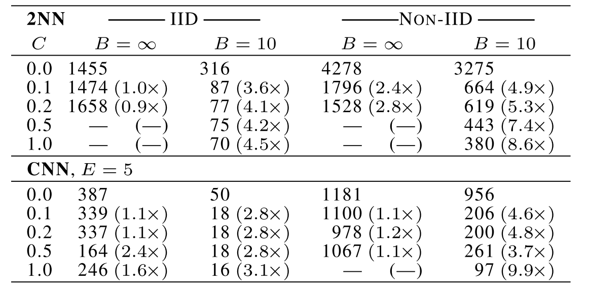
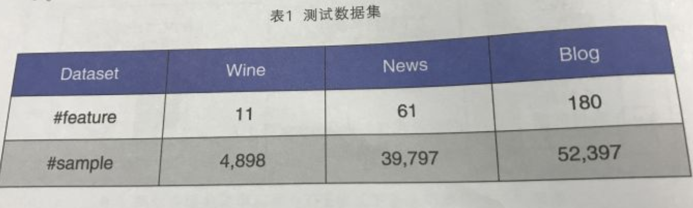

# Introduction

Investigate current larger federated learning projects' datasets.

motivated by both image classification and language modeling tasks, 

<!--more-->

### models

2000 models, presented CIFAR10; a large language modeling task

intial study: three model families on two datasets;  

1) MNIST 2NN：A simple multilayer-perceptron with 2-hidden layers with 200 units each using ReLu activations (199,210 total parameters), which we refer to as the MNIST 2NN.

2) A CNN with two 5x5 convolution layers (the first with 32 channels, the second with 64, each followed with 2x2 max pooling), a fully connected layer with 512 units and ReLu activation, and a final softmax output layer (1,663,370 total parameters). 

## FL paper

Communication-Efficient Learning of Deep Networks from Decentralized Data
arXiv:1602.05629v3

### datasets

two ways of partitioning the MNIST data over clients: 

IID, where the data is shuffled, and then partitioned into 100 clients each receiving 600 examples,

Non-IID, where we first sort the data by digit label, divide it into 200 shards of size 300, and assign each of 100 clients 2 shards. most client will only have example of two digits;  

Balanced, we performed additional experiments on unbalanced versions of these datasets, and found them to in fact be slightly easier for FedAvg.

Table 1: Effect of the client fraction C on the MNIST 2NN with E = 1 and CNN with E = 5. **Note C = 0.0 corre- sponds to one client per round; since we use 100 clients for the MNIST data, the rows correspond to 1, 10 20, 50, and 100 clients**. Each table entry gives the number of rounds of communication necessary to achieve a test-set accuracy of 97% for the 2NN and 99% for the CNN, along with the speedup relative to the C = 0 baseline. **Five runs with the large batch size did not reach the target accuracy in the allowed time**.

### language modeling task

The Complete Works ofWilliam Shakespeare: William Shakespeare. The Complete Works of William Shakespeare. Publically available at https: //www.gutenberg.org/ebooks/100.

对于语言建模，我们从威廉·莎士比亚的完整作品中建立了一个数据集[32]。我们为每个游戏中的每个说话角色构建一个客户数据集，至少有两行。这产生了一个包含1146个客户端的数据集。

> [《A Berkeley View of Systems Challenges for AI》](https://link.zhihu.com/?target=https%3A//www2.eecs.berkeley.edu/Pubs/TechRpts/2017/EECS-2017-159.html)

Berkeley: Shared learning on confidential data

## 微众银行AI团队

“联邦迁移学习”新方法和它打造的开源“联邦学习”框架FATE(Federated AI Technology Enabler)

针对金融行业:

> Secure Federated Transfer Learning: 

1) NUS-WIDE data set ([seng Chua et al. 2009] seng Chua, T.; Tang, J.; Hong, R.; Li,Nus-wide: A real-world web image database from national university of singapore. In CIVR)--由Flickr图像的数百个低级特征以及它们的关联标签和地面实况标签组成。

2) Kaggle’s Default-of-Credit-Card-Clients ([Kaggle ] Kaggle. Default of credit card clients dataset:https://www.kaggle.com/uciml/default-of-credit- card-clients-dataset.--包括重叠样本的数量，隐藏的共同表示的维度和特征的数量

> SecureBoost: A Lossless Federated Learning Framework

1) Credit: https://www.kaggle.com/c/GiveMeSomeCredit/data -- 它涉及分类用户是否会遭受严重财务问题的问题。它包含总共150000个实例和10个属性。

2) https://www.kaggle.com/uciml/default-of-credit-card-clients-dataset

## pysyft

pytorch

Boston Housing and Pima Indian Diabetes datasets: https://archive.ics.uci.edu/ml/support/diabetes

Vincent Sigillito. Pima indian diabetes dataset. Obtained from UCI, 1990. https://www.kaggle.com/kumargh/pimaindiansdiabetescsv

## **Gboard的联盟学习**

> [Federated Learning Of Out-Of-Vocabulary Words](https://link.zhihu.com/?target=https%3A//arxiv.org/abs/1903.10635)

the public Reddit dataset: Rami Al-Rfou, Marc Pickett, Javier Snaider, Yun- hsuan Sung, Brian Strope, and Ray Kurzweil. 2016. Conversational contextual cues: The case of person- alization and history for response ranking. arXiv preprint arXiv:1606.00372.； https://bigquery.cloud.google.com/

> ### Applied Federated Learning: Improving Google Keyboard Query Suggestions

## Multi-Institutional-DL-Modeling-wo-Sharing-Patient-Data

宾夕法尼亚大学，医学:联盟学习在现实世界医学成像中的第一个概念验证应用

BraTS 2018 training dataset [6-9]：

1) the actual BraTS distribution, i.e. the real-world data distribution, and 2) simulated distributions of 4 to 32 institutions, in steps of powers of two.

https://www.med.upenn.edu/sbia/brats2018/data.html

## 蚂蚁金服

用于中和信贷

共享学习分为两个方案，一是基于TEE的可信计算平台方案，二是基于MPC的多方联合建模方案（非常类似于联邦学习）

蚂蚁金服给出了一些实验数据，实验数据虽然没有给出明确的出处，但是总体感觉是用了一些推荐系统研究用的开放数据集

## 创业公司

https://s20.ai/home

Healthcare；分析病患计费记录来发现欺诈报销或者计费案例; Smart Grid; Genomics;

https://splitlearning.github.io/

>  Reducing leakage in distributed deep learning for sensitive health data

Some example classes from images of colorectal histology dataset

https://www.kaggle.com/kmader/colorectal-histology-mnist and mnist

> Split learning for health: Distributed deep learning without sharing raw patient data

CIFAR 10 and CIFAR 100 datasets

> Private federated learning on vertically partitioned data via entity resolution and additively homomorphic encryption

https://archive.ics.uci.edu/ml/datasets.php

## 华为

https://arxiv.org/pdf/1807.08127.pdf

