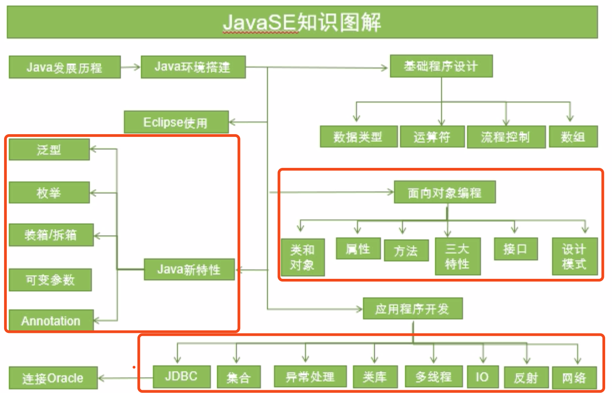
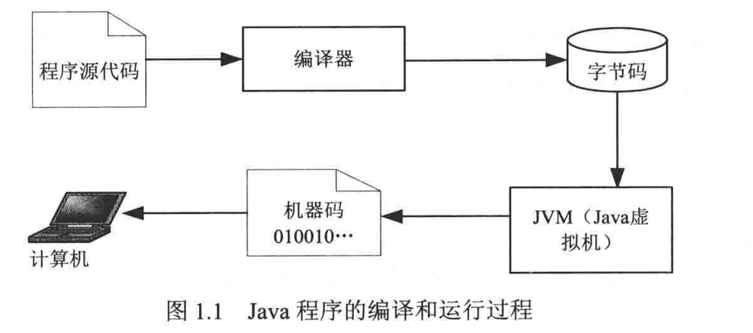
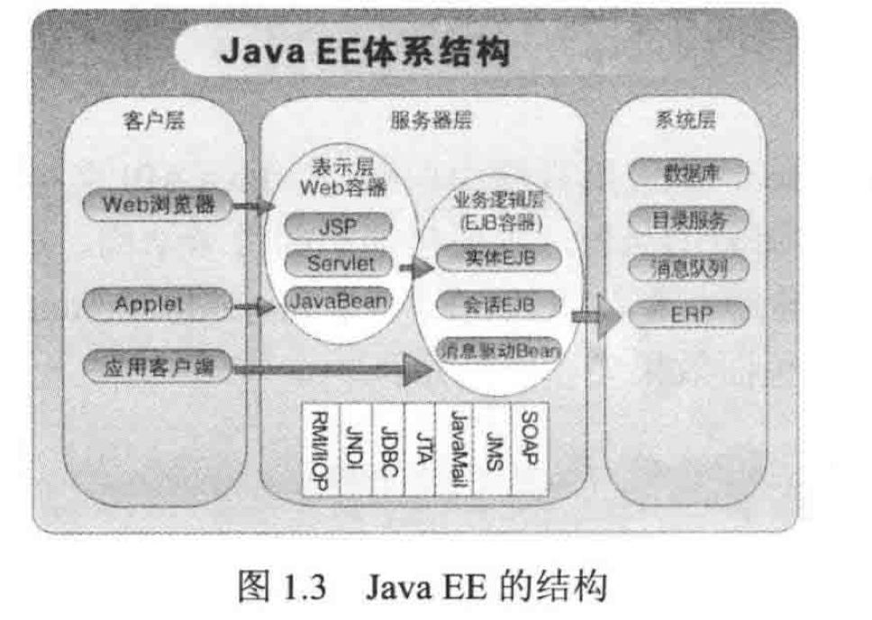

# 基础入门

<!--more-->

## 语言介绍

1. 面向对象；编译型，解释型；
2. 程序代码经过编译之后转换为Java字节码的中间语言，Java虚拟机(JVM)对字节码解释并运行；编译只进行一次，解释是每次程序运行时都会进行；编译后的字节码采用一种针对JVM优化过的机器码形式保存，虚拟机将字节码解释为机器码，然后在计算机上运行。

3. Java版本
    1. Java SE 桌面版
    2. Java EE 企业版，分布式网络程序，网站，核心EJB(企业Java组件模型)
    3. Java ME 嵌入式，

4. 学好Java
    1. 明确目标，大方向，按照方向努力学习，认真研究
    2. 书不用太多，基础打好。系统学习
    3. 了解设计模式，编写程序代码，要学习设计模式！可读性
    4. 不要死记语法，理解，类比记忆
    5. 多实践，多思考，多请教，手动编写，运行程序，分析结构；编程思想，请教他人，不耻下问！！！
    6. ！！多阅读源代码，_多了解他人的程序代码，分析编程者的编程思想和设计模式_

## Java语言的特性
1. 简单：与C++类似；自动回收
2. 面相对象
3. 解释器：java字节码解释器
4. 多线程

