# 综述- Nerual Architecture Search

神经网络架构搜索，顾名思义，就是让**机器自己去学习如何构架一个神经网络**，得到比人类专家手工设计的网络更好的效果。这个思路是非常一脉相承的，就像机器学习到深度学习，也是**完成了人类专家手工提取特征到由机器自己学习特征**这样的步骤转换。

<!--more-->

而现在的深度学习网络架构，虽然获得了不错的效果，但是细究起来，其实是没有非常牢固的理论根据的，依靠的是人类的先验与设计。

所以，在考虑有限制的空间内获得效果更好的网络这一问题上，架构搜索能够给出一些答案。

# Introduction of NAS

TODO 主参考论文：Neural Architecture Search: A Survey 【[pdf](https://arxiv.org/abs/1808.05377)】

作者：[Thomas Elsken](https://arxiv.org/search/stat?searchtype=author&query=Elsken%2C+T), [Jan Hendrik Metzen](https://arxiv.org/search/stat?searchtype=author&query=Metzen%2C+J+H), [Frank Hutter](https://arxiv.org/search/stat?searchtype=author&query=Hutter%2C+F)

首先，我们先整体讨论一下神经网络架构搜索到底是怎样进行的。通常来说，我们需要考虑三个方面：**搜索空间**、**搜索策略**和**评价策略**。

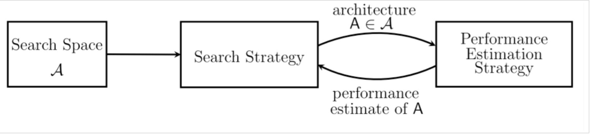

**搜索空间（SearchSpace）**: 搜索空间定义了**搜索的范围，其实就是在哪搜索**。通过结合一些过去研究者架构设计方面的经验，可以通过减小搜索空间和简化搜索过程来提高搜索的性能。当然，这样同时也引入了人为的主观臆断，可能会妨碍寻找到超越当前人类知识的新的架构构建块（building blocks）。

**搜索策略（SearchStrategy）**：搜索策略定义的则**怎样去搜索**。一方面，我们希望能快速找到性能良好的架构，另一方面，也应避免过早收敛到次优架构（sub optimal architeture）区域。

**性能评估策略（Performaceestimation strategy）**：NAS 的**目标是希望能够自动的在给定的数据集上找到一个高性能的架构**。性能评估则是指**评估此性能的过程**：最简单的方式是按照**通常的方式对一个标准架构训练和验证来获得结果**，但遗憾的是这样的计算成本太高了，并且同时限制了可以搜索的网络架构的数量。因此，最近的许多研究都集中在探索新的方法来降低这些性能评估的成本。

### 搜索空间（Search Space）

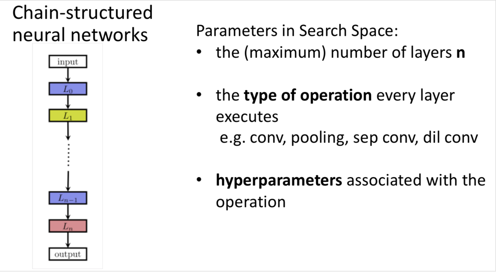

如图所示的就是一个相对简单的搜索空间，称为**链式神经网络（Chain-stuctured Neural Network）**，很简单就是一个链表，第$ 𝑖−1$层的输出作为第 $i$ 层的输入，可以表示为$ 𝐴=𝐿_{n}∘…𝐿_{1}∘𝐿_{0}$。而针对于这样一个 search space，我们就需要考虑这些参数：

- 网络的(最大)**层数𝑛**
- 每一层执行的**操作类型**，比如 pooling， convolution 这样的基础操作，或者更高级的一些操作，如depthwise separable convolutions 或 dilated convolutions。
- 每一层与这个操作相关的 **hyperparameters**，比如对于一个一般的 convolutional 层来说，有 filter 的 numbers，keneral 的 size 和 strides 的 length，而对于 fully-connected 层来说就说是 units 的 number 了。

而需要注意的是，与**每层相关的 hyperparameters 是取决于这一层的操作类型**，因此对于 Search Space 的参数化的结果并不是一个固定的长度（fixed-length），而是一个条件空间（conditioanl space）。

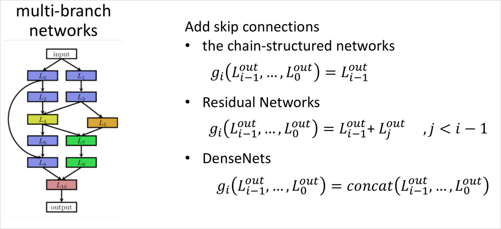

最近的很多关于 NAS 的研究中都引入了人工设计出的如跳跃连接(skip connections)这样的架构元素，可以用来构建如图 2 右所示的**复杂的多分支网络（multi-branch networks）**。对于这样的结构，第 i 层的输入不再仅仅是前一层的输入，而需要表示为一个组合函数的形式。

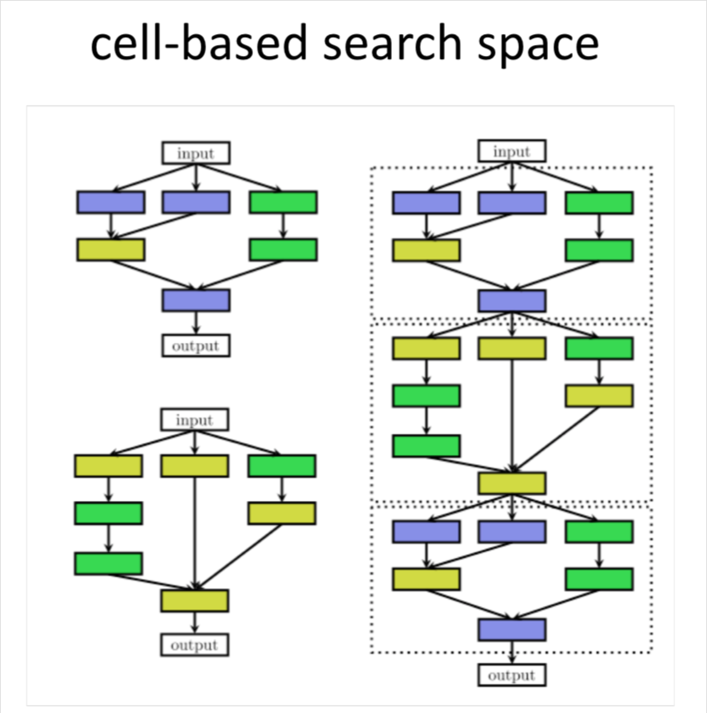

这种 cell-based 的 search space 也应用在了很多后来的研究中。然而，当使用基于 cell 的搜索空间时，出现了一种新的选择问题，即**如何选择元架构（Micro-architecture）**：应该使用多少 cells 以及如何连接它们来构建实际模型？

理想情况下，Meta-architecture 也应作为 NAS 的一部分自动优化;否则，如果大多数复杂性已经由 meta-architecture 解决，那么很容易就把问题变成进行 meta-architecture engineer，这样对 Cell 的搜索就变得过于简单了。

### 搜索策略（Search Strategy）

到现在，已经有许多不同的搜索策略用于 NAS，主要有如下这些：

- 随机搜索（random search）
- 贝叶斯优化（Bayesian optimazation）
- 进化方法（evolutionaray methods）
- 强化学习（Reinforcement Learning, RL）
- 梯度方法（gradient-based methods）

自 2013 年开始，Bayesian optimazation（BO）就在 NAS 研究中取得了一些成功，**基于 BO** 发现了当时最优的 vison architectures，在 CIFAR-10 上取得最优 architeture，以及实现了第一个超过人类专家赢得竞赛的 automaticallytuned 神经网络。

在 16 年 Google Brain 发表的 [10] 中通过**强化学习的搜索策略**在 CIFAR-10 和 Penn Treebank 数据集上取得很好表现后，NAS 成为机器学习社区的主流研究课题之一。

关于其他几个算法，会在后续介绍，这边简单介绍一下进化算法和贝叶斯优化。

**贝叶斯优化（BO）**是**用于 hyperparameters 优化中最流行的方法**，但是由于 typical BO toolboxes 是**基于高斯过程且主要集中于低维连续性优化问题**，所以它并没有被很多组应用于 NAS 中。[17] 中派生了 kennel function 来使用基于 GP 的 BO 方法，但还没有实现过最优的结果。相比之下，一些研究中使用**基于树的模型或随机森林来搜索非常高维的条件空间时实现了在很多问题上的最优性能**，这些方法同时优化神经架构和它们的 hyperparameters。虽然缺乏完整的比较，但初步证据表明这些方法可以超过进化算法 [18]。

关于 进化算法：

更近期的一些研究中**有不是使用基于梯度的方法来优化权重，而使用进化算法来优化神经结构本身**。是用进化算法演化一组模型，在每个进化步骤中，对来自群体的至少一个模型进行采样，并将它们作为父母通过繁衍或者突变来产生后代。在 NAS 中，突变表示本地化的操作，例如添加或移除层，改变层的超参数，添加跳跃连接，以及改变训练超参数。在对后代进行训练之后，评估它们的适应性（例如，在验证集上的表现）后再将它们添加到种群中。

### 性能评估策略（Performace Estimation Strategy）

上一节讨论的搜索策略旨在找到**某些性能度量（如准确度）最大化的架构 A**，为了引导它们的搜索过程，这些策略需要**考虑如何评判给定架构的性能高低**。最简单的方法是在训练数据上训练 A 并评估其在验证数据上的表现。然而，从头开始训练每个要评估的架构经常会产生大约数千 GPU 天的计算需求

为了加快搜索过程，**需要在相对较少的评估的基础**上并在相对较大的搜索空间中进行良好的预测

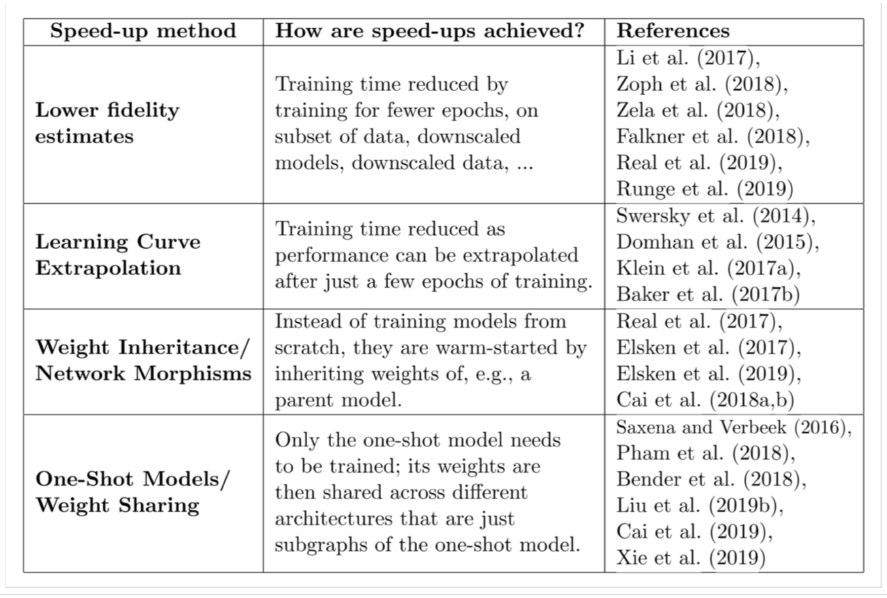

- Lower Fidelit Estimates

这种 lower fidelities 可以表示**为较短的训练时间**，对训练子集的训练，使用较低分辨率的图像，或者是用更少的 filter。虽然这些 lower fidelities 降低了计算成本，但与此同时它们也会在测试中引入偏差，因为性能通常会被低估。当然只要搜索策略只依赖于相对排名时，这不会有什么问题。

- Learning Curve Extrapolation

提出方法来**推断初始学习曲线并终止那些预测表现不佳以加速架构搜索过程**。另外一些研究者则通过基于架构的超参数来预测哪些部分学习曲线最有希望。

- Weight Inheritance/ Network Morphisms

??**基于之前已经训练过的其他架构的权重来初始化新架构的权重**。实现这一目标的一种方法，称为 network morphisms，它允许修改架构的同时保持网络所代表的功能不变。这就允许连续的增加网络容量并保持高性能而无需从头开始训练。对几个时期的持续训练也可以利用 network morphisms 引入额外容量。

- One-Shot Models/ Weight Sharing

??它将**所有架构都视为一个超级图的不同子图，并在架构之间共享权重**。那么只需要一次性训练单个模型的权重，然后通过继承权重来评估架构（它们只是一次性模型的子图），而无需再进行任何单独的训练。比如ENAS、Darts。

## NAS & NASNet & ENAS

### NAS

Neural Architecture Search with Reinforcement Learning 【[pdf](https://arxiv.org/abs/1611.01578)】

它是NSANet的前置，比较详细的介绍了Google的**NAS的整体设计**，包括**具体的目标函数**以及**实现skip connection的具体方法**，主要是提出了**用强化学习的方法来完成搜索神经网络架构**。

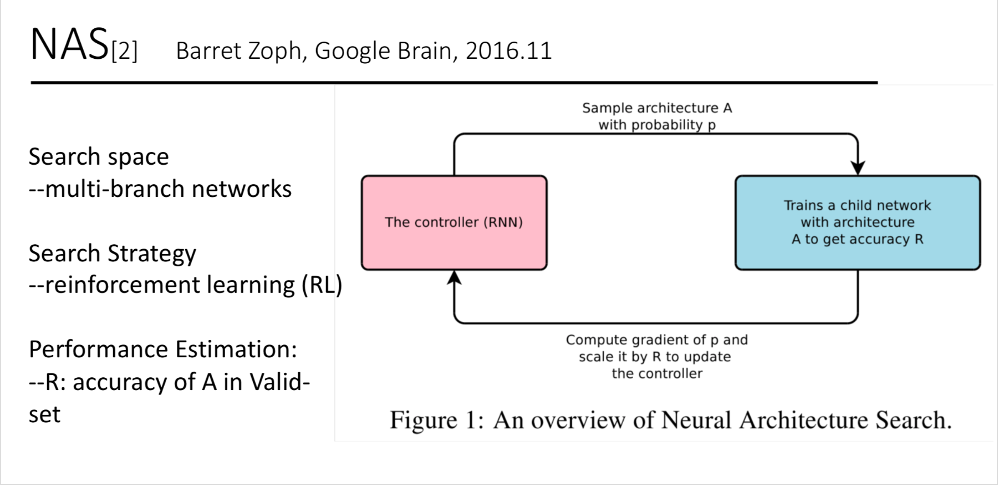

通过一个controllerRNN在搜索空间（search space）中得到一个网络结构（论文中称为child network），然后用这个网络结构在数据集上训练，在验证集上测试得到准确率R，再将这个准确率回传给controller，controller继续优化得到另一个网络结构，如此反复进行直到得到最佳的结果，整个过程称为Neural Architecture Search。

#### **How to use a controller RNN to generate an CNN model**

**控制器生成的是网络架构中的超参数，NAS中假定预测的inference中只含卷积层**。

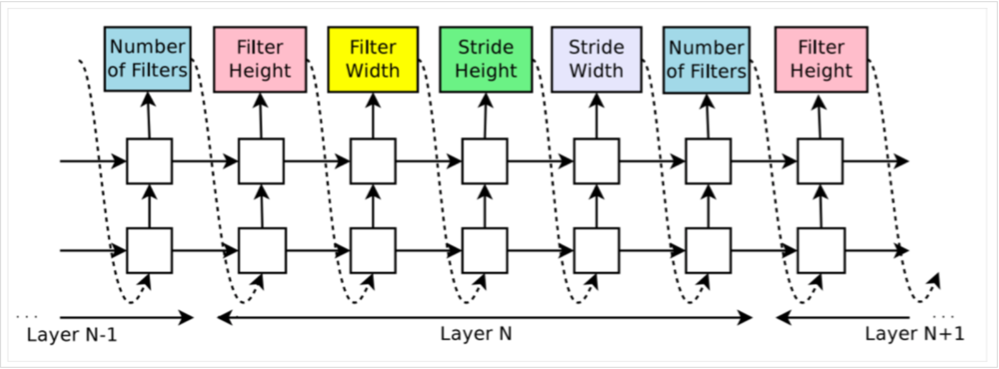

对于Layer N，控制器可以预测**该层的filter width，filter height，stride height，stride width，filter的个数，每一个预测都是通过softmax分类**，并作为下一个预测的输入。实验中的停止条件是，**层的个数超过了某个指定的数值**。当然这个数值在训练的过程中也可以变化。

最终得到的是LSTM产生的一个序列化的tokens，记为$θ_{c}$。

#### **How to train a controller RNN with REINFORCE**

将NAS与强化学习做一个对应，那么控制器LSTM就是Agent，控制器预测产生$θ_{c}$对应为活动$𝑎_{1:T}$，子网络在验证集上的准确率R作为reward signal。

那么，就得到了目标函数：

$\boldsymbol{J}\left(\boldsymbol{\theta}_{c}\right)=\boldsymbol{E}_{P\left(a_{1 : T} ; \theta_{c}\right)}[\boldsymbol{R}]$

鉴于R是不连续的，我们采用policy gradient来迭代更新$θ_{c}$，具体采用了REINFORCE规则：

$\nabla_{\theta_{c}} J\left(\theta_{c}\right)=\sum_{t=1}^{T} E_{P\left(a_{1 : T} ; \theta_{c}\right)}\left[\nabla_{\theta_{c}} \log P\left(a_{t} | a_{(t-1) : 1} ; \theta_{c}\right) R\right]$

对上述公式作一个先验近似：

$\frac{1}{m} \sum_{k=1}^{m} \sum_{t=1}^{T} \nabla \theta_{c} \log P\left(a_{t} | a_{(t-1) : 1} ; \theta_{c}\right) R_{k}$

由于baseline fuction b不依赖与当下action，本式依然是一个无偏估计。b采用的之前架构准确率的指数加权平均（exponential moving average）。

#### **How to add skip connections and other layer types**

NAS采用注意力机制。具体来说，通过添加在第N层添加N-1个anchor，来确定是否要与之前的某一层跳跃连接。anchor通过两层（本层和上一层）的hidden state，用sigmoid来判断：

$\mathrm{P}(\text { Layer j is an input to layer i })=\operatorname{sigmoid}\left(v^{\mathrm{T}} \tanh \left(W_{\mathrm{prev}} * h_{j}+W_{\mathrm{curr}} * h_{i}\right)\right)$

公式中的$𝑊_{𝑝}𝑟𝑒𝑣$、$𝑊_{𝑐}𝑢𝑟𝑟$和$𝑣$是可训练变量。这些行为依然是概率分布的，因此REINFORCE方法不会有大的改动。

由下图可以形象的了解anchor point是怎样添加跳跃连接的。

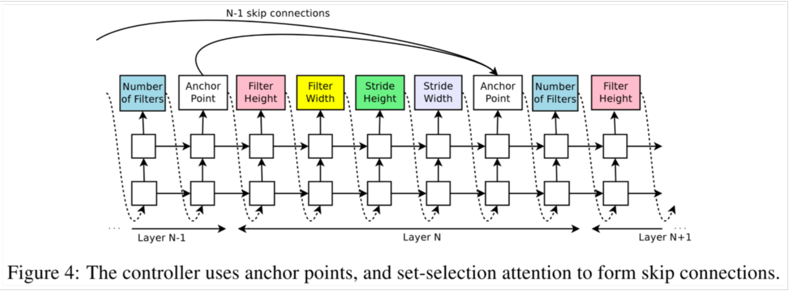

本篇的实验结果并无太多参考意义，因为很快作者就出了NASNet。NAS最大的意义还是在提出了一种神经网络搜索的框架结构。

实验中采用了2层35个隐藏单元的LSTM，使用800个GPU训练了28天，一共22400 GPU-Hours，一共训练了12800个架构。

### NASNet

论文： Learning Transferable Architectures for Scalable Image Recognition 【[pdf](https://arxiv.org/abs/1707.07012)】

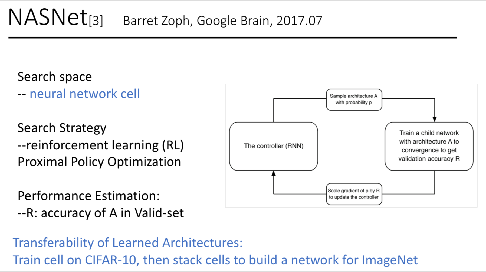

相较于NAS的优化：

一种新的搜索空间- NASNet search space—-a generic convolutional cell

一种新的正则化技术，ScheduledDropPath，使得NASNet模型的泛化能力更好(实验细节，不太重要)

#### **NASNet cell**

不再进行整个网络的搜索，而是**定义了cell单元作为building block**。通过堆叠cell形成最后的网络。

具体讨论的话，对于CNN网络，采用了两种cell，**normal cell**和**reduction cell**。normal cell的输出保持维度不变，而reduction cell用于收缩维度，具体来说就是步长为2。两种单元是不同的架构，堆叠在一起形成了最后的网络架构。

控制器RNN输出的是两种cell的超参，最后以下图形式堆叠为子网络，进行训练和验证，得到验证集准确率R回馈到控制器。

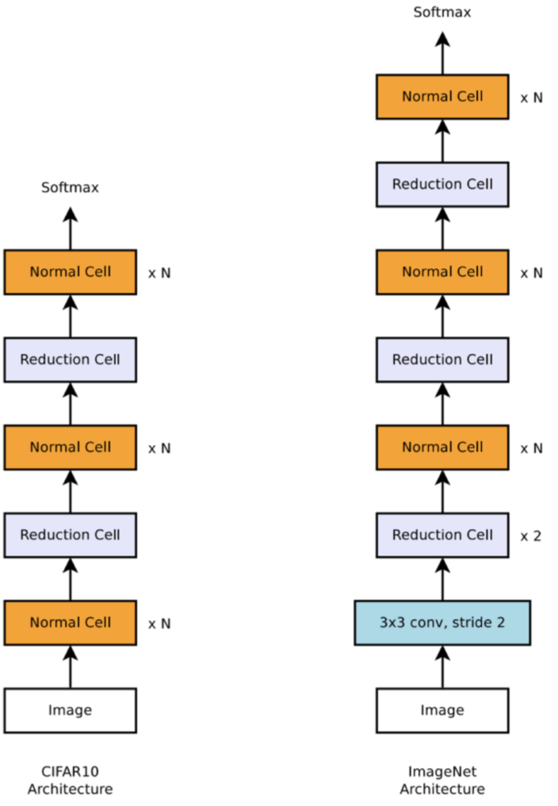

在NASNet的搜索空间中，每个cell的有两个初始隐藏状态输入$ℎ𝑖_{i}$和$ℎ_{𝑖−1}$，分别是前两个层的输出。控制器RNN会跟根据这两个initial hidden states预测卷积cell的剩余结构。

控制器对每个cell的预测分为B个bolck（此处的block可以理解为一个操作），每个block又有5个不同的softmax分类器进行5个预测步骤。

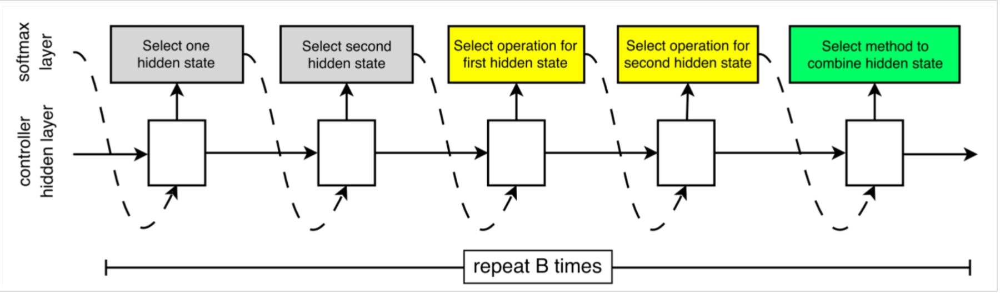

在算法中，用之前已经存在的隐藏态作为序列分块的可能输入来填入新建的hidden state。B=5时效果较好，即一个cell中包含5个操作。

为了使RNN能同时预测Normal Cell和Reduction Cell，我们简单设定控制器有2*5B个预测步骤。前5B给Normal Cell，后5B给Reduction Cell。

#### **实验结果**

在具体训练阶段，控制器采用Proximal Policy Optimazation（PPO）策略，用RNN控制一个全局工作序列系统来生成一个子网络的备选池。

训练时长为500个GPU训练4天，总计2000GPU时。比初始NAS快了7倍，但是还是非常奢侈。

训练得到的卷积cell：

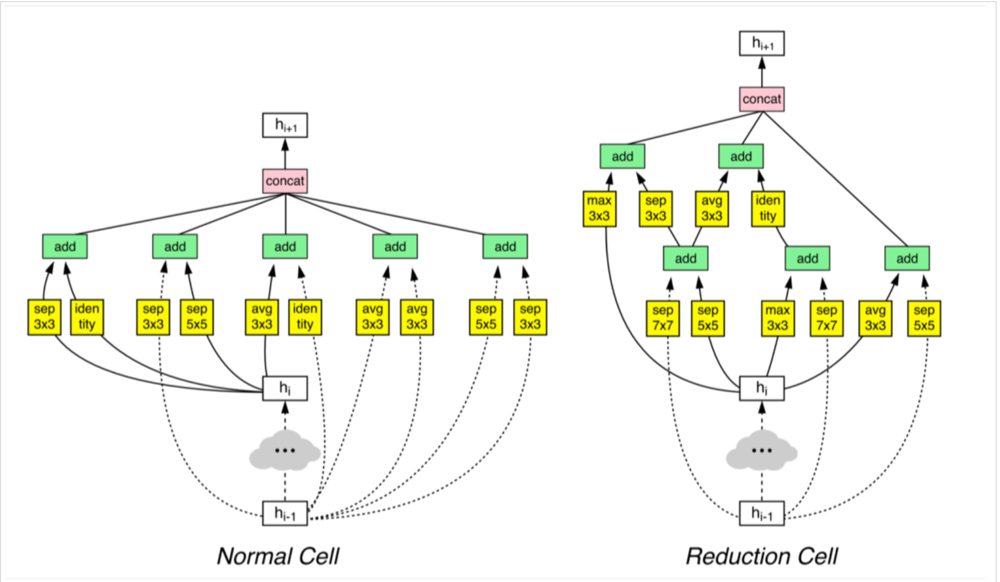

CIFAR-10上的训练效果：

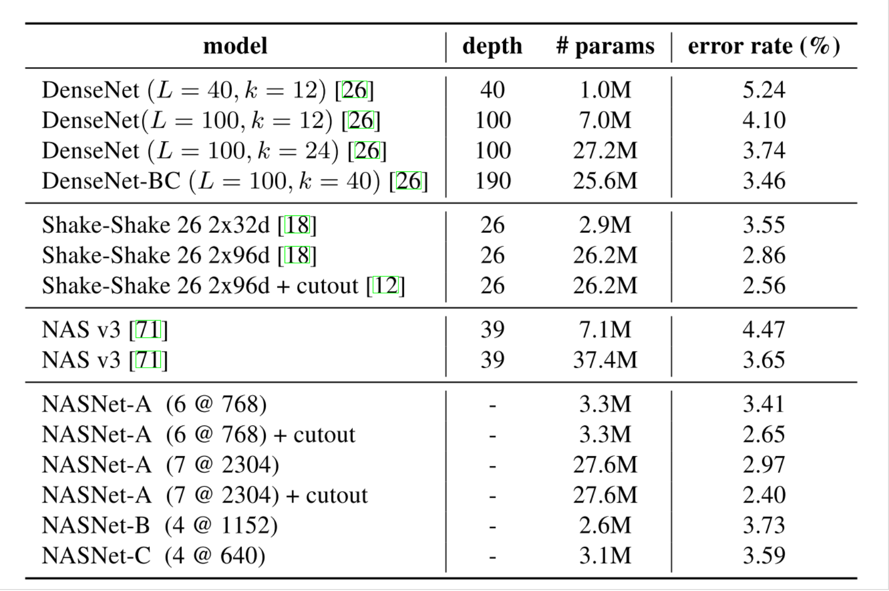

cell泛化到ImageNet的图像分类任务：

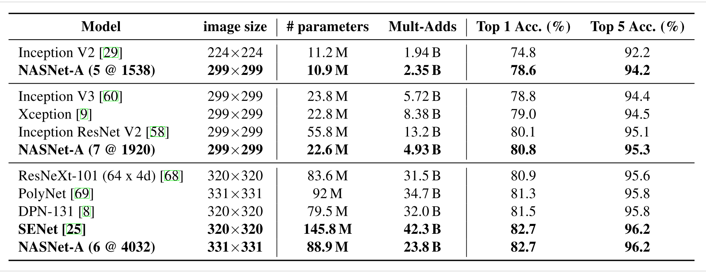

### ENAS

论文：Efficient Neural Architecture Search via Parameter Sharing 【[pdf](https://arxiv.org/abs/1802.03268)】【[code-tf](https://github.com/melodyguan/enas)】【[code-python](https://github.com/carpedm20/ENAS-pytorch)】

在ENAS中，控制器通过在大型计算图中**搜索最优子图来发现神经网络结构**。利用**策略梯度对控制器进行训练**，通过**权重共享**，快速选择验证集上期望报酬最大的子图。

**最关键是利用子模型之间共享参数，大大减少了训练时长。**采用了控制器参数与子网络参数相互迭代的方式进行训练。

本处为了通篇逻辑，也使用ENAS中CNN cell的训练过程来描述。RNN网络训练过程请参考原文。

#### **搜索空间**

基本沿用NASNet。

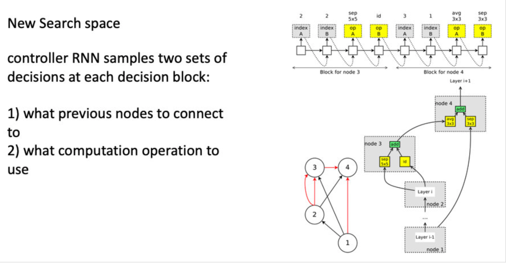

用一个例子来说明搜索空间的机制，这里是B = 4个节点(参见图5)。

1. 节点1,2是输入节点，因此不需要为它们做任何决策。设ℎ1h1,ℎ2h2为这些节点的输出。
2. 在节点3:控制器采样前两个节点和两个操作。在左上角的图5中，它对节点1、节点2分别选取了操作sep conv 5x5和identity。这意味着$h_{3}=\operatorname{sep}_{c} o n v_{5} x 5\left(h_{2}\right)+i d\left(h_{2}\right)$。
3. 在节点4:控制器采样节点3、节点1为 avg pooling3x3和sep conv 3x3。这意味着$h_{4}=a v g_{p} o o l_{3} x 3\left(h_{3}\right)+\operatorname{sep}_{c} o n v_{3} \times 3\left(h_{1}\right)$。
4. 由于除h4之外的所有节点都被用作至少另一个节点的输入，因此惟一的松散端h4被视为单元的输出。如果有多个松散的端点，它们将沿着深度维度连接起来，形成单元格的输出。

#### **架构搜索与训练权重迭代进行**

在ENAS,有两套可学的参数:控制器LSTM的参数θ,和子模型的共享参数ω。ENAS的培训过程包括两个交叉阶段。

1. 第一阶段通过一整个训练集训练子模型共享参数$w$。在本文的Penn Treebank实验中，ω是训练大约400 steps,每个minibatch使用64个样本,采用梯度反向传播+梯度截断（**Truncated Gradient**）进行优化，每隔35 steps进行一次隔断。同时,在CIFAR-10上,ω是45,000张训练图像,分为minibatches大小128,∇ω计算使用标准的反向传播。
2. 第二阶段训练参数控制器LSTM的参数θ, 对于固定数量的步骤,通常在我们的实验设置为2000。这两个阶段在ENAS的培训期间交替进行。

**Deriving Architectures.**

如何在训练好的ENAS模型中派生出全新的结构。首先从训练好的策略π(m, θ)中采样几个模型。针对每个模型，通过验证集的一个minibatch计算reward。选取其中reward最高的模型从零开始预训练。

#### **实验结果**

## Latest architecture search algorithms

上述NAS三篇论文是一脉相承，一点点改进过来的。其实我最开始接触的论文是Darts，当时感觉这个结构是全新的。再一路看下来，会发现Darts也是在ENAS上又做了搜索策略部分的革新，整体的架构也还是继承下来的。