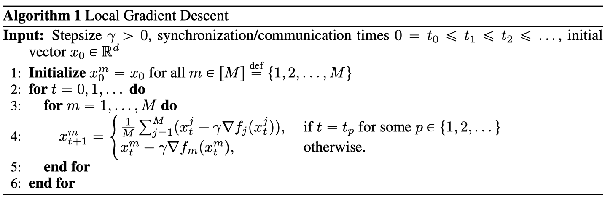
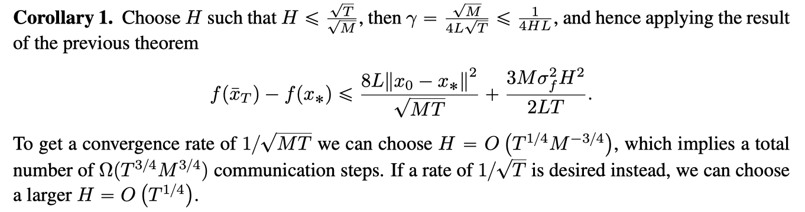
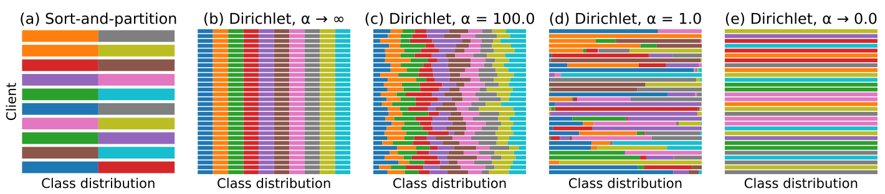
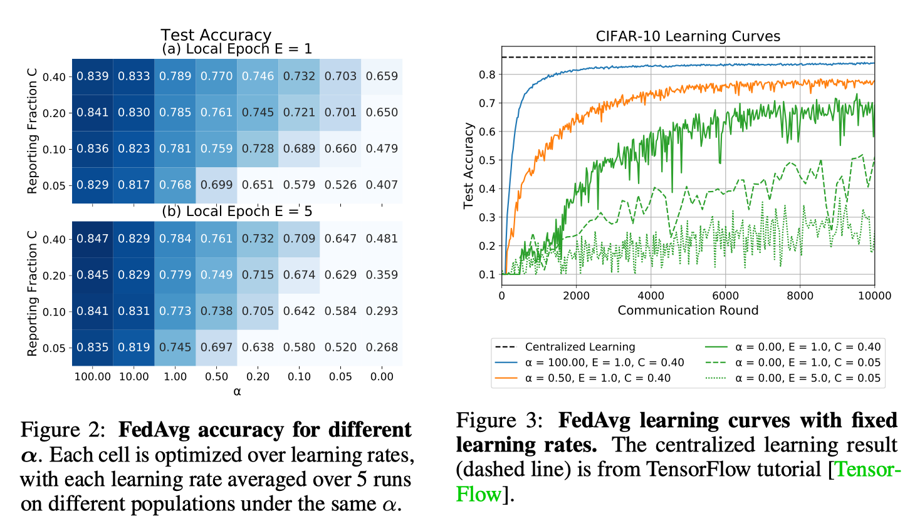
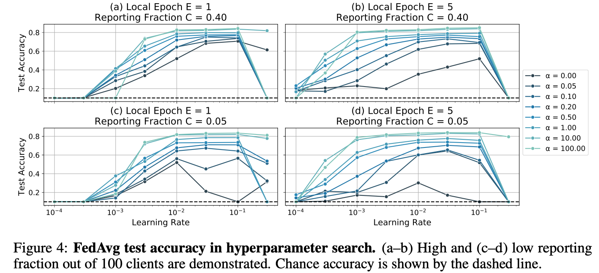
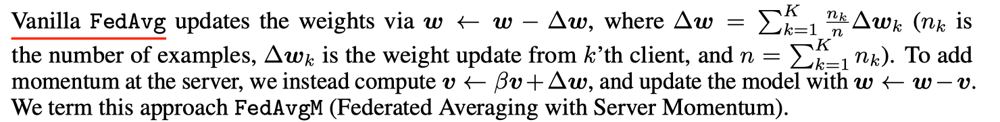
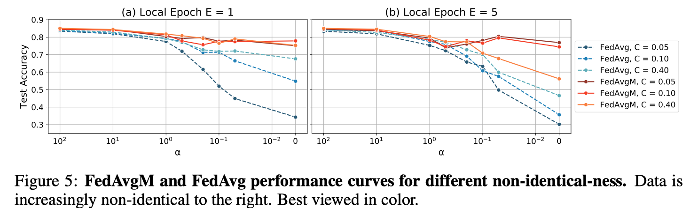
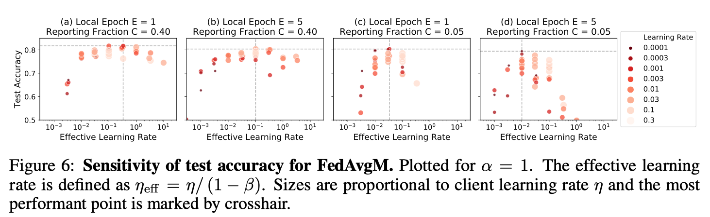

数据集分析

<!--more-->

# Paper1:  First Analysis of Local GD on Heterogeneous Data

异构数据的局部GD分析

## Abstract

我们提供了**局部梯度下降的第一个收敛性分析**，以**最小化 光滑和凸函数以及其他任意函数的平均值**。这种形式的问题和局部梯度下降作为一种解决方法在联邦学习中具有重要意义，其中每个函数都是基于用户在移动设备上存储的私有数据，不同用户的数据可以任意异构。我们表明，在低精度的情况下，该方法具有与梯度下降相同的通信复杂性。

## Introduction

我们对解决**最优化问题感兴趣**

$\min _{x \in \mathbb{R}^{d}}\left\{f(x) \stackrel{\text { def }}{=} \frac{1}{M} \sum_{m=1}^{M} f_{m}(x)\right\}$

这是在有监督的机器学习模型的训练中产生的。我们假设$f_{m}: \mathbb{R}^{d} \rightarrow \mathbb{R}$ 是L-光滑凸函数，我们将$x_{*}$ 作为$f$固定的最小值。

我们的主要兴趣是在这样的情况下，每个功能都基于单个设备上可用的数据，并且跨设备的数据分布可以任意异构。这种情况出现在联合学习中，在这种情况下，机器学习模型是根据消费者设备（如移动电话）上可用的数据进行训练的。在联合学习中，由于隐私的原因，禁止将本地数据传输到单个数据中心进行集中培训，并且频繁的通信是不可取的，因为它昂贵且具有侵入性。因此，最近的几项工作旨在以**尽可能少的通信回合的分布式方式构建新的解决方法**（1）。

大规模问题通常用一阶方法来解决，因为它们在维度和数据大小上都有很好的伸缩性。一个有吸引力的选择是局部梯度下降，它将优化过程分为几个阶段。每一个阶段的开始都是以一个模型的形式在所有M个设备上平均一步的通信。每个epoch的其余部分不涉及任何通信，致力于执行从平均模型开始的固定数量的梯度下降步骤，并基于所有M设备独立并行执行的本地功能。详见算法一。

这种方法的随机版本是**联邦平均算法的核心，联邦平均算法最近被用于联邦学习应用**中，见[7，10]。本质上，**联邦平均是局部随机梯度下降（SGD）的一个变种**，参与设备随机采样。该算法已经在一些机器学习应用中得到应用，如移动键盘预测[5]，并在[7]中探讨了提高其通信效率的策略。尽管这种方法在经验上取得了成功，但人们对它的收敛特性知之甚少，而且观察到当执行过多的局部步骤时，它会发生发散[10]。这并不是很确定，因为大多数常见的假设都没有得到满足；特别是，数据通常非常非i.i.d.[10]，因此局部梯度可以指向不同的方向。数据的这个属性可以写入任何向量x和索引i，j as

$\left\|\nabla f_{i}(x)-\nabla f_{j}(x)\right\| \gg 1$

不幸的是，如果不假设rf i-pxq和rf j-pxq的相异性有界，就很难分析局部方法。由于这个原因，几乎所有先前的工作都假设有界的相异性〔8, 16, 17，18〕，并解决了联合学习的其它较不具挑战性的方面，例如分散的通信、目标的非凸性或不平衡的数据划分。实际上，简化分析的一个常用方法是假设局部函数的Lipschitzness性，$\left\|\nabla f_{i}(x)\right\| \leqslant G$ 对于任意的x和i。我们认为这种假设是病态的，在寻求有意义的收敛界时应该避免。首先，在无约束强凸极小化中，这一假设无法得到满足，使得[14]等著作中的分析值得怀疑。其次，存在至少一种方法，其收敛性在有界梯度下得到保证[6 ]，但在实践中该方法发散[3, 12 ]。最后，在有界梯度假设下

$\left\|\nabla f_{i}(x)-\nabla f_{j}(x)\right\| \leqslant\left\|\nabla f_{i}(x)\right\|+\left\|\nabla f_{j}(x)\right\| \leqslant 2 G$

换言之，我们无法控制函数之间的差异。由于G边界不仅是不同的，而且是梯度本身，这使得这些陈述不那么有见地，甚至是空洞的。例如，如果数据实际上是i.i.d，它就不会很紧，因为在这种情况下G将保持一个正常数。相比之下，我们将表明rate应该取决于一个更有意义的数量，

$\sigma_{f}^{2} \stackrel{\text { def }}{=} \frac{1}{M} \sum_{m=1}^{M}\left\|\nabla f_{m}\left(x_{*}\right)\right\|^{2}$, where x ˚ is a minimizer of f. 

显然，σf总是有限的，它是局部方法方差的自然度量。除此之外，它还允许我们在数据实际上是i.i.d.的情况下获得紧边界。我们注意到，在[13]中已经尝试获得更一般的收敛性声明，但遗憾的是，它们的保证比小批量随机梯度下降（SGD）的保证差得多，使得它们的贡献较小。

我们还注意到，上述工作中的边界[8]不仅使用有界梯度，而且还提供了一个悲观的 $\mathcal{O}\left(H^{2} / T\right)$ rate。其中H是每个epoch中的局部步数，T是该方法的总步数。实际上，这要求H是$\mathcal{O}(1)$，以使速率与强凸函数的SGD的速率一致。因此，这项工作的主要贡献是将部分参与视为联合平均。

当数据是相同分布的，并且在每个节点上使用随机梯度而不是全梯度时，所得到的方法在文献中以不同的名称进行了广泛的探索，见例如[1，14，15，19]。[11] 提出了一种异步局部算法，该算法在不减小步长的情况下收敛到精确解，但其增加H的好处受到常数因子的限制。[9] 似乎是第一个提出本地方法的工作，但没有显示出该工作的比率。

## Convergence of Local GD

局部GD的收敛性

## 假设和符号 Assumptions and notation

在介绍我们的主要结果之前，让我们首先明确地阐述我们的假设。

**Assumption 1**.  (1)的极小值集是非空的。更多的是，对于每一个 $m \in[M] \stackrel{\text { def }}{=}\{1,2, \ldots, M\}$ , $f_{m}$ 是是凸的和L-光滑的。即，对 $x, y \in \mathbb{R}^{d}$ , 满足以下不等式:

$0 \leqslant f_{m}(x)-f_{m}(y)-\left\langle\nabla f_{m}(y), x-y\right\rangle \leqslant \frac{L}{2}\|x-y\|^{2}$

此外，我们假设算法1在有界同步间隔下运行。也就是说，我们假设:

$H \stackrel{\text { def }}{=} \max _{p \geqslant 0}\left|t_{p}-t_{p+1}\right|$ 

是受限的。给出向量 $x_{t}^{1}, x_{t}^{2}, \ldots, x_{t}^{M} \in \mathbb{R}^{d}$, 我们定义了平均迭代,t时刻的迭代方差和平均梯度:

$\hat{x}_{t} \stackrel{\text { def }}{=} \frac{1}{M} \sum_{m=1}^{M} x_{t}^{m}$,  $V_{t} \stackrel{\text { def }}{=} \frac{1}{M} \sum_{m=1}^{M}\left\|x_{t}^{m}-\hat{x}_{t}\right\|^{2}$,  $g_{t} \stackrel{\text { def }}{=} \frac{1}{M} \sum_{m=1}^{M} \nabla f_{m}\left(x_{t}^{m}\right)$

分别是。关于f的Bregman散度是通过

$D_{f}(x, y) \stackrel{\text { def }}{=} f(x)-f(y)-\langle\nabla f(y), x-y\rangle$

注意，在这种情况下,$y=x_{*}$, 我们有 $D_{f}\left(x, x_{*}\right)=f(x)-f\left(x_{*}\right)$

### 分析 Analysis

第一引理Lemma使我们能够找到局部GD的一个单步最优差的递推：

**Lemma 1**. 在 Assumption 1 和对于  $\gamma \geqslant 0$ 我们有：

$\left\|r_{t+1}\right\|^{2} \leqslant\left\|r_{t}\right\|^{2}+\gamma L(1+2 \gamma L) V_{t}-2 \gamma(1-2 \gamma L) D_{f}\left(\hat{x}_{t}, x_{*}\right)$

当$r_{t} \stackrel{\text { def }}{=} \hat{x}_{t}-x_{*}$,  特别是，$\text { if } \gamma \leqslant \frac{1}{4 L}, \text { then }\left\|r_{t+1}\right\|^{2} \leqslant\left\|r_{t}\right\|^{2}+\frac{3}{2} \gamma L V_{t}-\gamma D_{f}\left(\hat{x}_{t}, x_{*}\right)$

我们现在把方差variances之和$V_{t}$ 限制在一个epoch上。基于epoch的界限直观上是我们想要的，因为我们只对每个epoch结束时产生的$\hat{x}_{t_{p}}$点感兴趣。

**Lemma 2.** 假设Assumption 1成立和 $p \in \mathbb{N}$, 定义 $v=t_{p+1}-1$ 和 假设 Algorithm 1以同步间隔$H \geqslant 1$运行, 并且恒定的步长 $ \gamma > 0$ 如此 $\gamma \leqslant \frac{1}{4 L H}$,  那么下面的不等式成立：

$\begin{aligned}
&\sum_{t=t_{p}}^{v} V_{t} \leqslant 5 L \gamma^{2} H^{2} \sum_{i=t_{p}}^{v} D_{f}\left(\hat{x}_{i}, x_{*}\right)+\sum_{i=t_{p}}^{v} 8 \gamma^{2} H^{2} \sigma_{f}^{2}\\
&\sum_{t=t_{p}}^{v} \frac{3}{2} L V_{t}-D_{f}\left(\hat{x}_{t}, x_{*}\right) \leqslant-\frac{1}{2} \sum_{t=t_{p}}^{v} D_{f}\left(\hat{x}_{i}, x_{*}\right)+\sum_{t=t_{p}}^{v} 12 L \gamma^{2} H^{2} \sigma_{f}^{2}
\end{aligned}$

结合前两个引理，在下一个定理theorem中建立了局部GD的收敛性：

**Theorem  1:**  对于 本地GD运行与恒定的步长 $ \gamma > 0$ 如此 $\gamma \leqslant \frac{1}{4 L H}$，基于Assumption 1， 我们有：

$f\left(\bar{x}_{T}\right)-f\left(x_{*}\right) \leqslant \frac{2\left\|x_{0}-x_{*}\right\|^{2}}{\gamma T}+24 \gamma^{2} \sigma_{f}^{2} H^{2} L$,  

其中 $\bar{x}_{T} \stackrel{\text { def }}{=} \frac{1}{T} \sum_{t=0}^{T-1} \hat{x}_{t}$

### Local GD vs GD

为了解释上述界限，我们可能会问：有多少沟通回合是足够保证的 $f\left(\bar{x}_{T}\right)-f\left(x_{*}\right) \leqslant \epsilon ?$,  为了回答这个问题，我们需要最小化$\frac{T}{H}$ , 受约束于 $0<\gamma \leqslant \frac{1}{4 L}, \frac{2\left\|x_{0}-x_{*}\right\|^{2}}{\gamma T} \leqslant \frac{\epsilon}{2}$,  和 $24 \gamma^{2} \sigma_{f}^{2} H^{2} L \leqslant \frac{\epsilon}{2}$,  在 变量$T, H 和 \gamma$。 我们可以很容易从约束条件中推断出: 

$\frac{T}{H} \geqslant \frac{16\left\|x_{0}-x_{*}\right\|^{2}}{\epsilon} \max \left\{L, \sigma_{f} \sqrt{\frac{3 L}{\epsilon}}\right\}$

另一方面，下界为 $0<\gamma \leqslant \frac{1}{4 L}$, 只要我们选择:

$T=T(\gamma) \stackrel{\text { def }}{=} \frac{4\left\|x_{0}-x_{*}\right\|^{2}}{\epsilon \gamma} \quad \text { and } \quad H=H(\gamma) \stackrel{\text { def }}{=} \frac{1}{4 \max \left\{L, \sigma_{f} \sqrt{\frac{3 L}{\epsilon}}\right\} \gamma}$

最小的$H$ 达到下界为 $H\left(\frac{1}{4 L}\right)=\min \{1, \sqrt{\frac{\epsilon L}{3 \sigma_{f}^{2}}}\}$

此外，请注意，只要目标精度不太高, 特别是 $\epsilon \geqslant \frac{3 \sigma^{2}}{L}$, 然后 $\max \left\{L, \sigma_{f} \sqrt{3 L / \epsilon}\right\}=L$, 然后[6]说表示本地GD的通信数量（参数设置为 $H=H(\gamma)$ 和 $T=T(\gamma)$

## Local GD vs Minibatch SGD

公式（5）清楚地表明了局部GD的收敛与小批量SGD的收敛速率之间的相似性，根据在最佳σf处的预期2噪声建立了一个1 {T到邻域的收敛。 彼此在最佳x处。

下一个推论表明，SGD和本地GD之间的类比进一步扩展到收敛速度。

## Experiments

为了验证该理论，我们对逻辑回归进行了实验，其中使用了2正则化和来自LIBSVM库的数据集[2]。我们使用一台具有3.20GHz内核的24个Intel®Xeon®Gold 6146 CPU的机器，并且通过MPI for Python软件包处理通信[4]。

由于我们的体系结构导致了计算和通信之间的非常特殊的折衷，因此我们还提供了通信时间相对于梯度计算时间为1或更低的情况的图表。在所有实验中，我们使用全梯度rf m和恒定步长L。选择2的正则化量1的顺序为n，其中n是数据总量。数据分区不是i.i.d.并根据原始数据集中的索引完成。

我们观察到理论与数值结果之间存在非常紧密的匹配。在通信比梯度计算贵得多的情况下，局部方法对于不精确的收敛要快得多。尽管对于我们的体系结构而言，这并不是一个很大的优势，主要是因为计算整个梯度需要花费大量时间。

# Paper2: Measuring the Effects of Non-Identical Data Distribution for Federated Visual Classification

联邦视觉分类中非同一数据分布效应的测量

## Abstract

联合学习使视觉模型能够以保护隐私的方式使用来自移动设备的真实数据进行训练。考虑到它们的分布性质，这些设备上的数据统计可能会有很大的不同。在这项工作中，我们将通过联合学习来研究**这些不相同的数据分布对视觉分类的影响**。我们提出了**一种合成具有连续一致性范围的数据集的方法**，并为联邦平均算法提供了性能指标。结果表明，随着分布的不同，性能下降，并**提出了一种基于服务器动量的缓解策略**。在CIFAR-10上的实验表明，在一系列不可识别的情况下，分类性能得到了改善，在最倾斜的设置下，分类精度从30.1%提高到76.9%。

## Introduction

联邦学习（FL）[McMahan等人，2017]是一个隐私保护框架，用于从位于边缘设备上的分散用户数据中训练模型。使用联邦平均算法（FedAvg），在每个联邦学习回合中，每个参与设备（也称为客户机）从中央服务器接收初始模型，在其本地数据集上执行随机梯度下降（SGD）并将梯度发回。然后，服务器从参与的客户端聚合所有渐变并更新启动模型。虽然在数据中心培训中，批次通常可以假设为IID（独立且相同分布），但这种假设在联合学习环境中不太可能成立。在这项工作中，我们特别研究了不同的数据分布对每个客户的影响，假设数据是独立于不同的本地分布绘制的。我们**考虑了一系列连续的非一致分布，并给出了一系列超参数和优化策略的经验结果**。

## Related Work

几位作者探索了在由图像分类数据集生成的非相同客户端数据分区上的FedAvg算法。McMahan等人。[2017]从MNIST数据集中合成病理性非同一用户分裂，按类标签对训练样本进行排序，并划分成碎片，使每个客户端分配2个碎片。他们证明了非相同客户机上的FedAvg仍然收敛到99%的准确率，尽管比相同客户机进行了更多轮。以类似的分类和划分方式，Zhao等人。[2018]和Sattler等人。[2019]在CIFAR-10数据集上生成极端分区，形成总共10个客户端的总体。这些设置有些不切实际，因为实际的联合学习通常会涉及到比简单分区更大的客户机池和更复杂的分布。

其他作者则关注客户机上更真实的数据分布。例如，Caldas等人。[2018]使用扩展MNIST[Cohen等人，2017]在数字写入器上进行分区，而不是简单地在数字类上进行分区。与我们的工作密切相关，Yurochkin等人。[2019]**使用浓度参数为0.5的Dirichlet分布合成非同一数据集。我们扩展了这一概念，探索了浓度α的连续范围，并详细探索了最优超参数和优化设置**。

理论方面的前期工作研究了FedAvg变量在不同条件下的收敛性。Sahu等人。〔2018〕引入客户目标的近似项，并证明收敛性保证。Li等人。[2019]分析强凸问题在适当抽样和平均方案下的FedAvg。

## Synthetic Non-Identical Client Data

合成的不同分布client数据

在我们的视觉分类任务中，我们假设在每个客户机上，训练示例都是独立绘制的，类标签遵循向量q$(q_{i}>= 0, 0<i<N, ||q||_{1} = 1)$参数化的N个类上的分类分布。 为了合成一个不完全相同的客户群，我们从Dirichlet分布中得到q∼Dir（αp），其中**p表示N个类上的先验类分布**，α>0是控制客户间一致性的浓度参数。我们用8个α值进行实验，以产生覆盖同一光谱的总体。对于α趋向于无穷大，所有客户机的分布都与先前的相同；对于α············，在**另一个极端，每个客户机只持有随机选择的一个类的示例**。

在这项工作中，我们使用CIFAR-10【Krizhevsky等人，2009年】图像分类数据集，其中包含来自10个类的60000个图像（50000个用于训练，10000个用于测试）。我们**产生了由100个客户组成的平衡群体，每个客户持有500张图片**。我们将先前的分布设置为在10个类中均匀分布，与我们报告性能的测试集相同。对于每个客户机，给定一个α，我们对q进行采样，并为客户机分配来自10个类的相应数量的图像。图1显示了不同浓度参数下从Dirichlet分布中提取的种群。

图1：具有不同客户的合成种群。用不同的颜色表示class之间的分布。（a） 从排序和分区方案生成的10个客户端，每个客户端分配2个类。（b-e）分别由不同浓度参数α的Dirichlet分布产生的群体，每个群体30个随机客户。

## Experiments and Results

鉴于以上数据集的准备工作，我们现在开始在从相同到不相同的分布范围内对vanilla FedAvg算法的性能进行基准测试。

我们使用与McMahan等人相同的CNN架构和符号。[2017]除了使用0.004的权重衰减，并且不应用学习率衰减计划。该模型不是CIFAR-10数据集上的最新技术，但足以显示我们调查的相对性能。

FedAvg在客户机批处理大小B=64、本地epoch计数E∈{1，5}、报告分数C∈{0.05，0.1，0.2，0.4}（分别对应每轮参与的5，10，20，40个客户机）下运行，共10000个通信轮。我们在客户学习率的网格上执行超参数搜索

### Classification Performance with Non-Identical Distributions

图2显示了作为Dirichlet浓度参数α函数的分类性能（较大的α意味着更相同的分布）。当客户接近一个class时，测试精度在低α附近发生显著变化。增加报告分数C会产生递减的回报，而对于相同分布的客户机数据集来说，性能的提高尤其微不足道。有趣的是，对于固定优化轮次预算的情况，更频繁地同步权重（E=1）并不总是提高非相同数据的准确性。

除了降低训练结束时的准确度外，我们还观察到在数据不完全相同的情况下，训练误差的波动性更大，见图3。在10000个通信回合内，以小报告率运行难以收敛。

图2：不同α的FedAvg精度。每个细胞在学习率上进行优化，在相同α下，每个学习率在不同种群上平均运行5次以上。

图3：固定学习率的FedAvg学习曲线。集中学习结果（虚线）来自TensorFlow教程[Tensor-Flow]。

图4：超参数搜索中的FedAvg测试精度。（a-b）100名客户中报告分数高（c-d）低。机会准确度用虚线表示。

**超参数敏感性**。除了影响测试集的整体准确性外，由C和α指定的学习条件对超参数敏感性也有显著影响。在大α的同一端，一系列的学习率（大约两个数量级）可以在测试集上产生良好的精度。然而，当C和α值较小时，需要仔细调整学习率以达到良好的精度。见图4。

### Accumulating Model Updates with Momentum

用动量累积模型更新

在SGD的基础上利用动量通过梯度历史的累积来抑制振荡，在加速网络训练方面取得了巨大的成功。这似乎与FL特别相关，因为参与方可能拥有稀疏的数据分布，并持有有限的标签子集。在本小节中，我们将测试服务器上的动量对FedAvg性能的影响。

Vanilla FedAvg通过w☆w负极∏w更新权重，其中∏w=k=1 n n∏w k（n k是pk示例数，∏w k是来自第k个客户端的权重更新，n=k=1 n k）。为了在服务器上增加动量，我们计算了v☆βv+☆w，并用w☆w-v更新了模型。我们称这种方法为FedAvgM（服务器动量联合平均）

在实验中，我们使用了具有动量β∈{0，0.7，0.9，0.97，0.99，0.997}的Nesterov加速梯度[Nesterov，2007]。模型架构、客户批处理大小B和学习率η与前一小节中的vanilla FedAvg相同。服务器优化器的学习速率保持不变，为1.0。

**服务器动量的影响**。图5显示了在有或没有服务器动量的情况下，使用非相同数据进行学习的效果。与FedAvg相比，FedAvgM的测试精度持续提高，在许多情况下，性能接近集中学习基线（86.0%）。例如，当E=1和C=0.05时，FedAvgM的性能保持相对恒定且在75%以上，而FedAvg的精度则迅速下降到35%左右。

图5:FedAvgM和FedAvg在不同非相同性下的性能曲线。右边的数据越来越不一样了。最好用彩色观看。

**对C和E的超参数依赖性**。对FedAvgM来说，**超参数调整更困难，因为它涉及额外的超参数β**。在图6中，我们根据有效学习率（定义为ηe ffe=η/（1-β）[Shallue等人，2018年]绘制了准确度曲线，这表明了每一组学习条件的最佳ηeff。**值得注意的是，当报告分数C较大时，选择ηe ffe更容易，两个数量级的值范围产生合理的测试精度**。相反，当每轮只有少数客户报告时，ηeff的可行窗口可以小到只有一个数量级。为了防止客户端更新出现分歧，我们还必须使用低绝对学习率和高动量的组合。局部历元参数E也影响学习率的选择。广泛的局部优化增加了客户权重更新的方差，因此需要更低的ηeff来抵消噪声。

图6:FedAvgM试验精度灵敏度。绘制α=1。有效学习率定义为ηeff=η/（1-β）。大小与客户学习率η成正比，最有效的点用十字线标记。