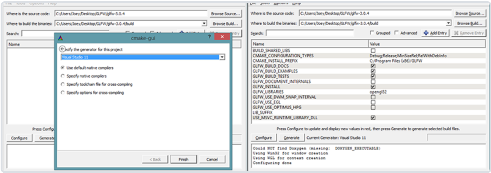

# 学习方向

目的(学习什么) - 结构(新知识的整体框架，运行流程) - 使用(如何使用，入门)
[网址](https://learnopengl-cn.github.io/)

学会：核心是现代OpenGL；理解图形编程和OpenGL背后的原理。
首先讨论核心的图形学概念，OpenGL怎样将像素绘制到屏幕上，以及如何利用黑科技做出一些很酷的效果。
<!--more-->
# 第一节

## 前置知识

OpenGL是一个图形API，并不是一个独立的平台，它需要一个编程语言来工作，在这里我们使用的是C++, 学习C++ ，[网址](www.learncpp.com); 学习线性代数、几何、三角学。

## 结构

1. 入门 2.光照 3.模型加载 3.高级OpenGL 4. 高级光照 5.特效 6.PBR 7.实战

# 入门
## OpenGL

定义： OpenGL本身并不是一个API，它仅仅是一个由Khronos组织制定并维护的规范(Specification)。

OpenGL规范严格规定了每个函数该如何执行，以及它们的输出值。至于内部具体每个函数是如何实现(Implement)的，将由OpenGL库的开发者自行决定（译注：这里开发者是指编写OpenGL库的人）。因为OpenGL规范并没有规定实现的细节，具体的OpenGL库允许使用不同的实现，只要其功能和结果与规范相匹配（亦即，作为用户不会感受到功能上的差异）。

实际的OpenGL库的开发者通常是显卡的生产商。

### 核心模式与立即渲染模式

早期的OpenGL使用**立即渲染模式**（Immediate mode，也就是固定渲染管线）
核心模式：使用现代的函数

### 扩展
OpenGL的一大特性就是对扩展(Extension)的支持，当一个显卡公司提出一个新特性或者渲染上的大优化，通常会以扩展的方式在驱动中实现。如果一个程序在支持这个扩展的显卡上运行，开发者可以使用这个扩展提供的一些更先进更有效的图形功能。

```
if(GL_ARB_extension_name)
{
    // 使用硬件支持的全新的现代特性
}
else
{
    // 不支持此扩展: 用旧的方式去做
}
```

### 状态机
OpenGL自身是一个巨大的状态机(State Machine)：一系列的变量描述OpenGL此刻应当如何运行。OpenGL的状态通常被称为OpenGL上下文(Context)。我们通常使用如下途径去更改OpenGL状态：**设置选项，操作缓冲**。最后，我们使用当前OpenGL上下文来渲染。

假设当我们想告诉OpenGL去画线段而不是三角形的时候，我们通过改变一些上下文变量来改变OpenGL状态，从而告诉OpenGL如何去绘图。一旦我们改变了OpenGL的状态为绘制线段，下一个绘制命令就会画出线段而不是三角形。

当使用OpenGL的时候，我们会遇到一些状态设置函数(State-changing Function)，这类函数将会改变上下文。以及状态使用函数(State-using Function)，这类函数会根据当前OpenGL的状态执行一些操作。只要你记住OpenGL本质上是个大状态机，就能更容易理解它的大部分特性。

### 对象
OpenGL库是用C语言写的，同时也支持多种语言的派生，但其内核仍是一个C库。由于C的一些语言结构不易被翻译到其它的高级语言，因此OpenGL开发的时候**引入了一些抽象层*。“对象(Object)”就是其中一个。

在OpenGL中一个对象是指*一些选项的集合*，它代表*OpenGL状态的一个子集*。比如，我们可以用一个对象来代表绘图窗口的设置，之后我们就可以设置它的大小、支持的颜色位数等等。可以把对象看做一个C风格的结构体(Struct)：

```
struct object_name {
    float  option1;
    int    option2;
    char[] name;
};
```
当我们使用一个对象时，通常看起来像如下一样（把OpenGL上下文看作一个大的结构体）：

```
// OpenGL的状态
struct OpenGL_Context {
    ...
    object* object_Window_Target;
    ...     
};
```

```
// 创建对象
unsigned int objectId = 0;
glGenObject(1, &objectId);
// 绑定对象至上下文
glBindObject(GL_WINDOW_TARGET, objectId);
// 设置当前绑定到 GL_WINDOW_TARGET 的对象的一些选项
glSetObjectOption(GL_WINDOW_TARGET, GL_OPTION_WINDOW_WIDTH, 800);
glSetObjectOption(GL_WINDOW_TARGET, GL_OPTION_WINDOW_HEIGHT, 600);
// 将上下文对象设回默认
glBindObject(GL_WINDOW_TARGET, 0);
```
这一小段代码展现了你以后使用OpenGL时常见的工作流。我们

1. 首先创建一个对象，然后用一个id保存它的引用（实际数据被储存在后台）。
2. 然后我们将对象绑定至上下文的目标位置（例子中窗口对象目标的位置被定义成GL_WINDOW_TARGET）。
3. 接下来我们设置窗口的选项。
4. 最后我们将目标位置的对象id设回0，解绑这个对象。
5. 设置的选项将被保存在objectId所引用的对象中，一旦我们重新绑定这个对象到GL_WINDOW_TARGET位置，这些选项就会重新生效。

使用对象的一个好处是在程序中，我们不止可以定义一个对象，并设置它们的选项，每个对象都可以是不同的设置。在我们执行一个使用OpenGL状态的操作的时候，只需要绑定含有需要的设置的对象即可。

比如说我们有一些作为3D模型数据（一栋房子或一个人物）的容器对象，在我们想绘制其中任何一个模型的时候，只需绑定一个包含对应模型数据的对象就可以了（当然，我们需要先创建并设置对象的选项）。拥有数个这样的对象允许我们指定多个模型，在想画其中任何一个的时候，直接将对应的对象绑定上去，便不需要再重复设置选项了。

## 创建窗口
在我们画出出色的效果之前，首先要做的就是创建一个*OpenGL上下文(Context)*和一个用于*显示的窗口*。然而，这些操作在每个系统上都是不一样的，OpenGL有目的地从这些操作抽象(Abstract)出去。这意味着我们不得不自己处理创建窗口，定义OpenGL上下文以及处理用户输入。

有一些库：节省了我们书写操作系统相关代码的时间，提供给我们一个窗口和上下文用来渲染;有GLUT，SDL，SFML和GLFW

### GLFW
GLFW是一个专门针对OpenGL的C语言库，它提供了一些渲染物体所需的最低限度的接口。它允许用户创建OpenGL上下文，定义窗口参数以及处理用户输入。本节和下一节的目标是建立GLFW环境，并保证它恰当地创建OpenGL上下文并显示窗口。这篇教程会一步步从获取、编译、链接GLFW库讲起。

### 构建GLFW
GLFW可以从它官方网站的下载页上获取。GLFW已经有针对Visual Studio 2013/2015的预编译的二进制版本和相应的头文件，为了完整性我们将从编译源代码开始。所以我们需要下载源代码包。

下载源码包之后，将其解压并打开。我们只需要里面的这些内容：
    
- 编译生成的库
- include文件夹

从源代码编译库可以保证生成的库是兼容你的操作系统和CPU的，而预编译的二进制文件可能会出现兼容问题（甚至有时候没提供支持你系统的文件）。提供源代码所产生的一个问题在于不是每个人都用相同的IDE开发程序，因而提供的工程/解决方案文件可能和一些人的IDE不兼容。所以人们只能从.c/.cpp和.h/.hpp文件来自己建立工程/解决方案，这是一项枯燥的工作。但因此也诞生了一个叫做CMake的工具。

### CMake
CMake是一个工程文件生成工具。用户可以使用预定义好的CMake脚本，根据自己的选择（像是Visual Studio, Code::Blocks, Eclipse）生成不同IDE的工程文件。这允许我们从GLFW源码里创建一个Visual Studio 2015工程文件，之后进行编译。首先，我们需要从这里下载安装CMake。当CMake安装成功后，你可以选择从命令行或者GUI启动CMake，由于我不想让事情变得太过复杂，我们选择用GUI。

CMake需要一个源代码目录和一个存放编译结果的目标文件目录。源代码目录我们选择GLFW的源代码的根目录，然后我们新建一个 build 文件夹，选中作为目标目录。


在设置完源代码目录和目标目录之后，点击Configure(设置)按钮，让CMake读取设置和源代码。我们接下来需要选择工程的生成器，由于我们使用的是Visual Studio 2015，我们选择 Visual Studio 14 选项（因为Visual Studio 2015的内部版本号是14）。CMake会显示可选的编译选项用来配置最终生成的库。这里我们使用默认设置，并再次点击Configure(设置)按钮保存设置。保存之后，点击Generate(生成)按钮，生成的工程文件会在你的build文件夹中。

### 编译
在build文件夹里可以找到GLFW.sln文件，用Visual Studio 2015打开。因为CMake已经配置好了项目，所以我们直接点击Build Solution(生成解决方案)按钮，然后编译的库glfw3.lib（注意我们用的是第3版）就会出现在src/Debug文件夹内。

库生成完毕之后，我们需要让IDE知道库和头文件的位置。有两种方法：

1. 找到IDE或者编译器的/lib和/include文件夹，添加GLFW的include文件夹里的文件到IDE的/include文件夹里去。用类似的方法，将glfw3.lib添加到/lib文件夹里去。虽然这样能工作，但这不是推荐的方式，因为这样会让你很难去管理库和include文件，而且重新安装IDE或编译器可能会导致这些文件丢失。
2. 推荐的方式是建立一个新的目录包含所有的第三方库文件和头文件，并且在你的IDE或编译器中指定这些文件夹。我个人会使用一个单独的文件夹，里面包含Libs和Include文件夹，在这里存放OpenGL工程用到的所有第三方库和头文件。这样我的所有第三方库都在同一个位置（并且可以共享至多台电脑）。然而这要求你每次新建一个工程时都需要告诉IDE/编译器在哪能找到这些目录。

完成上面步骤后，我们就可以使用GLFW创建我们的第一个OpenGL工程了！

mac 配置环境：https://www.jianshu.com/p/25d5fbf792a2

### GLAD

因为OpenGL只是一个标准/规范，具体的实现是由驱动开发商针对特定显卡实现的。由于OpenGL驱动版本众多，它大多数函数的位置都无法在编译时确定下来，需要在运行时查询。所以任务就落在了开发者身上，开发者需要在运行时获取函数地址并将其保存在一个函数指针中供以后使用。取得地址的方法因平台而异。

```
// 定义函数原型
typedef void (*GL_GENBUFFERS) (GLsizei, GLuint*);
// 找到正确的函数并赋值给函数指针
GL_GENBUFFERS glGenBuffers  = (GL_GENBUFFERS)wglGetProcAddress("glGenBuffers");
// 现在函数可以被正常调用了
GLuint buffer;
glGenBuffers(1, &buffer);
```
你可以看到代码非常复杂，而且很繁琐，我们需要对每个可能使用的函数都要重复这个过程。幸运的是，有些库能简化此过程，其中GLAD是目前最新，也是最流行的库。
### 配置GLAD
GLAD是一个开源的库，它能解决我们上面提到的那个繁琐的问题。GLAD的配置与大多数的开源库有些许的不同，GLAD使用了一个[在线服务](http://glad.dav1d.de/)。在这里我们能够告诉GLAD需要定义的OpenGL版本，并且根据这个版本加载所有相关的OpenGL函数。

使用：打开GLAD的在线服务，将*语言(Language)设置为C/C++*，*在API选项中，选择3.3以上的OpenGL(gl)版本*（我们的教程中将使用3.3版本，但更新的版本也能正常工作）。之后将*模式(Profile)设置为Core*，并且**保证生成加载器(Generate a loader)的选项是选中的**。现在可以先（暂时）忽略拓展(Extensions)中的内容。都选择完之后，**点击生成(Generate)按钮来生成库文件**。

GLAD现在应该提供给你了一个zip压缩文件，包含两个头文件目录，和一个glad.c文件。将两个头文件目录（glad和KHR）复制到你的Include文件夹中（或者增加一个额外的项目指向这些目录），并添加glad.c文件到你的工程中。

