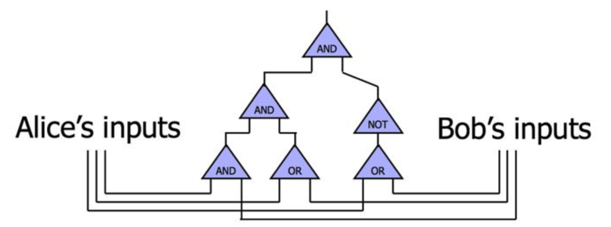
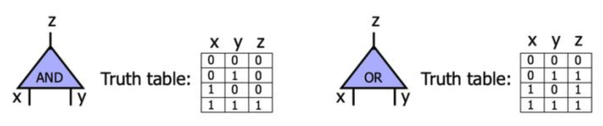
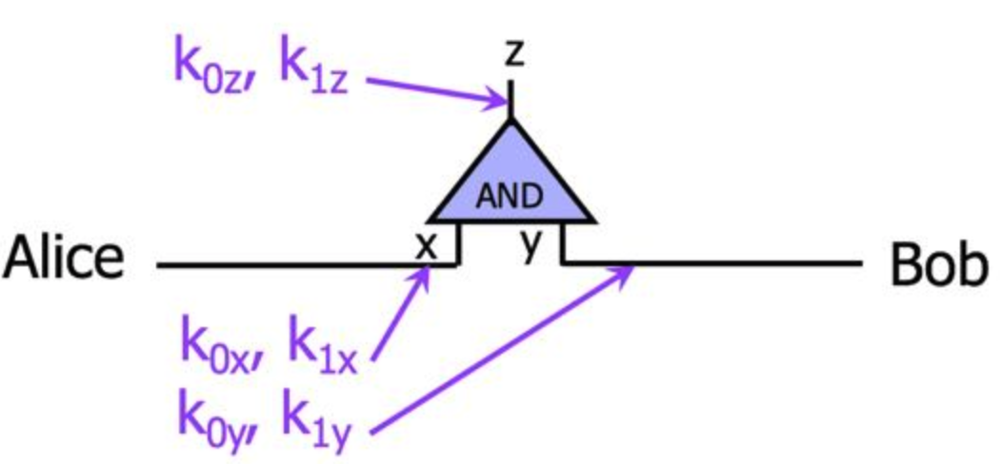
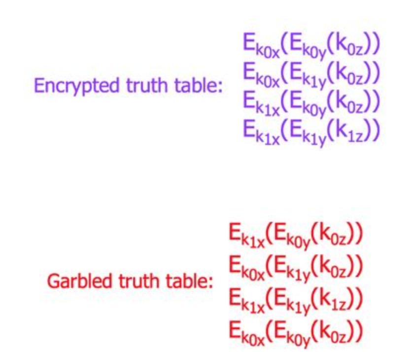
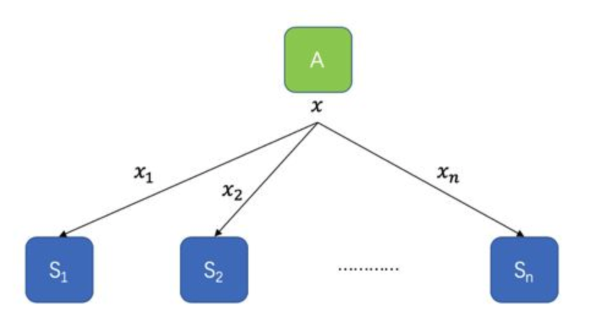
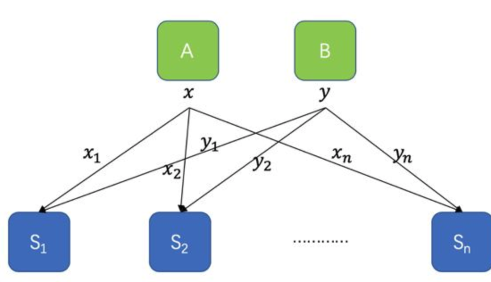
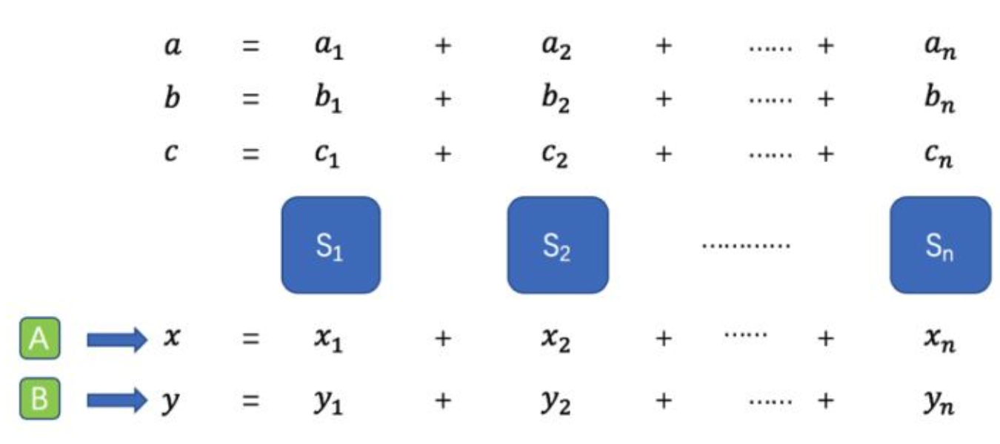

# 密码学
密码学是研究**密码编制、密码破译和密钥管理**的一门综合性应用科学。
术语：
<!--more-->
- 明文：被隐蔽的消息称作明文，通常用m表示。 Message，Plaintext
- 密文：将明文隐蔽后的结果称作密文，通常用c表示。 Ciphertext
- 加密（ Encryption ）：将明文变换成密文的过程称作加密。
- 脱密（ Decryption ）：合法用户由密文恢复出明文的过程称作脱密。
- 密钥( key ) ：**控制或参与密码变换**的可变参数。密钥又分为加密密钥和脱密密钥。
- 密码体制：一个密码体制由五部分组成：明文空间（M）；密文空间（C）；密钥空间（K）；加密变换E; 脱密变换 D 。

对密码体制的基本要求:

- (1)即使达不到理论上是不可破的，也应当是实际上不可破的。
- (2)一切秘密蕴涵于密钥之中，即只要敌手不知道密钥，就不能由已知信息推出未知的明文信息。
- (3)加密算法和脱密算法适用于密钥空间中的所有元素。弱密钥要尽可能的少！
- (4)具有很好的实现性能。

# 安全计算初探
安全计算，中文全称为安全多方计算，英文全称为Secure Multi-party Computation，缩写为SMC或 MPC，指的是在保护数据安全的前提下实现多方计算。

那什么是多方计算呢？其实就是其字面意思：多个参与者将各自的数据凑在一起，并在这个大数据集上进行一定的计算，并得到最后的计算结果。形式化的描述就是：假定有 $n$ 个参与方 $P_1, P_2, \dots, P_n $，他们各自拥有自己的数据集 $a_1, a_2, \dots, a_n$ 。那么多方计算的目的就是得到某个函数 f 的输出，该函数的输入就是上面的 $a_i$ 们，即 $f(a_1, a_2, \dots, a_n)$ 。举个简单的例子：假定五道口某工科学校想统计该校男生的恋爱经历分布情况，那 $a_i$ 取值就是0（母胎单）或1（被甩过）。在这种情况下$f$就是简单的求和，即 $f(a_1, a_2, \dots, a_n) = \sum_{i}a_i$。

保护数据安全的多方计算: 就是保护各个参与方所拥有数据的安全;安全计算解决的就是这个问题。有了安全计算，大家都不用把确切数据告诉别人（或曰：真实数据从未离开过自己），最后仍然能得到联合计算的结果。在我们的例子中大家不需要告诉别人自己的感情经历就能让学校得到统计结果。

安全计算的用途:，凡是一个计算任务需要用到来自多个参与者的数据，但各个参与者又不想（或不被允许）交换或公开数据，那安全计算就适用于这样的计算任务。
比如，某机构组织了一场拍卖且有多个参与方报价，但大家都不想在自己未中标的情况下让别人知道自己出价多少，也就是说，除了最后的中标者需要让卖方知道自己的出价，其他人都不想透露自己的出价。安全多方计算就适用于此场景。

再如，一家借贷公司A想预测贷款给一个试图借贷的客户的风险，但A公司只知道该客户的很简单的信息（如姓名、性别和年龄等）以及在自家借贷的历史，一些很关键的信息（如社保、健康状况等）却不为A公司所知。同时另一家政府机构B知道这些信息，但这些信息按规定是保密的。这时候双方就可以在不交换原始数据的情况下直接用预测模型预测风险。

# 安全计算实现方法概览
研究计算理论的学者们四十多年当中已经提出了很多种实现安全计算的方法。总的来说，大致可归为两类：一类是基于噪音的，另一类不是基于噪音的。

## 基于噪音的安全计算方法
基于噪音的安全计算方法，最主要代表是目前很火的差分隐私（differential privacy）。这类方法的思想是，对计算过程用噪音干扰，让原始数据淹没在噪音中，使别有用心者无法从得到的结果反推原始数据。这就好像我们拿到一张打了马赛克的图片，虽然可能可以猜出马赛克后面大概长啥样，但很难知道马赛克后面的所有细节。

有一点值得注意：这个干扰既可以是**数据源，也可以是模型参数和输出**。也就是说，参与者既可以对自己的原始数据加噪音使得原始数据从来没在计算过程中出现过，也可以在模型训练的时候改变通过改变模型参数影响输出结果，也可以直接在输出暴露前在输出上加噪音从而使得从计算结果无法反推输入。

比如我们要计算一个函数 $f(x_1, x_2, \dots, x_n, \theta)$ ，那么对输入进行干扰后得到的结果便是 $f(x_1 + r_1, x_2+r_2, \dots, x_n+r_n, \theta)$ ，对参数进行干扰后得到的结果为 $f(x_1, x_2, \dots, x_n, \theta + r_{\theta})$ ，对输出进行干扰后的结果是 $f(x_1, x_2, \dots, x_n, \theta) + r$ 。

这种方法的优点是效率高（毕竟**只需要生成服从特定分布的随机数即可**），缺点是最后得到的结果不够准确，而且在复杂的计算任务中结果会和无噪音的结果相差很大导致结果无法使用。

## 非噪音方法
非噪音方法一般是**通过密码学方法将数据编码或加密**，得到一些奇怪的数字，而且这些奇怪的数字有一些神奇的性质，比如看上去很随机但其实保留了原始数据的线性关系，或者顺序明明被打乱但人们却能从中很容易找到与原始数据的映射关系。如果将计算过程比作炒菜，那数据就是炒菜的原料，输出就是最后做出来的美味佳肴。而实现安全计算方法，就好像是让厨师闭着眼睛炒菜一般。

这一类方法主要包括三种：混淆电路（Garbled Circuit）、同态加密（Homomorphic Encryption）和密钥分享（Secret Sharing）。这些方法一般是在源头上就把数据加密或编码了，计算操作方看到的都是密文，因此只要特定的假设条件满足，这类方法在计算过程中是不会泄露信息的。

比如计算函数 $f(x_1, x_2, \dots, x_n, \theta)$ 的时候，实际操作的是 $f(\hat{x_1}, \hat{x_2}, \dots, \hat{x_n}, \theta)$ （这里 $\hat{x}_i$ 是  $x_i$ 的密文）。相比于前一类基于噪音的方法，这种方法的优点是不会对计算过程加干扰，因此我们最终得到的是准确值，且有密码学理论加持，安全性有保障，缺点则是由于使用了很多密码学方法，整个过程中无论是计算量还是通讯量都非常庞大，对于一些复杂的任务（如训练几十上百层的CNN等），短时间内可能无法完成。而且对于密码学基础薄弱的程序猿来说，要实现前一类基于噪音的方法没啥难度，但要实现后一类方法则还是要费不少功夫的。

#差分隐私Differential Privacy介绍
差分隐私，英文名为differential privacy，顾名思义，保护的是**数据源中一点微小的改动导致的隐私泄露问题**。比如有一群人出去聚餐，那么其中某人是否是单身狗就属于差分隐私。

为了更形式化地描述差分隐私，我们需要先定义相邻数据集。现给定两个数据集D和D’, 若它们有且仅有一条数据不一样，那我们就称此二者为相邻数据集。以上面数据集为例：假定有 $n$ 个人，他们是否是单身狗，形成一个集合 $\{a_1,a_2, …, a_n\}$ （其中 $a_i = 0或1$），那么另一个集合当中只有一个人改变了单身状态，形成另一个集合 $\{a_1’, a_2’, …, a_n’\}$ ，也就是只存在一个 $i$ 使得 $a_i \ne a_i’$ ，那么这两个集合便是相邻集合。

那么对于一个随机化算法 A （所谓随机化算法，是指**对于特定输入，该算法的输出不是固定值，而是服从某一分布**），其分别作用于两个相邻数据集得到的两个输出分布难以区分。差分隐私形式化的定义为：
$Pr\{A(D) = O\} ≤e^\epsilon \cdot Pr\{A(D’) = O\} $
也就是说，如果该算法作用于任何相邻数据集，得到一个特定输出 $O$ 的概率应差不多，那么我们就说这个算法能达到差分隐私的效果。也就是说，观察者通过观察输出结果很难察觉出数据集一点微小的变化，从而达到保护隐私的目的。

那如何才能得到差分隐私呢？最简单的方法是**加噪音**，也就是**在输入或输出上加入随机化的噪音，以期将真实数据掩盖掉**。比较常用的是加拉普拉斯噪音（Laplace noise）。由于拉普拉斯分布的数学性质正好与差分隐私的定义相契合，因此很多研究和应用都采用了此种噪音。还是以前面那个数据集为例，假设我们想要知道到底有多少人是单身狗，我们只需要计算 $\sum a_i$ ，那么为了掩盖具体数值，实际输出值应为 $O=\sum a_i + r_{lap}$ ，相应地，另一个数据集输出的是 $O’= \sum a_i’+r_{lap}’$ 。这使得观察者分不清最终的输出是由哪个数据集产生的。

前面描述的是差分隐私的严格定义。还有一种稍微放宽一点的定义为：
$Pr\{A(D) = O\} \le e^\epsilon \cdot Pr\{A(D’) = O\} + \delta $
其中 $\delta$ 是一个比较小的常数。要获取这种差分隐私，我们可以使用高斯噪音（Gaussian noise）。

当然，对输入或输出加噪音会使得最终的输出结果不准确。而且由于噪音是为了掩盖一条数据，所以很多情况下数据的多少并不影响加的噪音的量。那么在数据量很大的情况下，噪音的影响很小，这时候就可以放心大胆地加噪音了，但数据量很小的情况下，噪音的影响就显得比较大，会使得最终结果偏离准确值较远而变得不可用。也有些算法不需要加噪音就能达到差分隐私的效果，听起来很美好，但这种算法通常要求数据满足一定的分布，这一点在现实中通常很难满足。

## 混淆电路Garbled Circuit介绍
先明确一下混淆电路解决的是什么问题。通俗的说，就是一堆人各自拥有其隐私数据，他们想把这些数据合起来算点什么，但又不想把数据交给别人，混淆电路解决的就是此类问题。我们先来考虑一个经典问题——百万富翁问题。两个身价也就那么百来万的人觉得自己是富翁，他们在某会所里碰见，因为某种原因需要比个高下方能取得某种资格，但又觉得自己那些存款数目是多大秘密似的舍不得告诉别人，于是他俩遮遮掩掩地将数据拆散、打乱、加密，最后算出了结果并只解密结果。
那么，我现在要说说混淆电路具体是如何工作的了。注意关键词“电路（circuit）”，我们知道可计算问题都可以转换为一个个电路，于是就有了加法电路、比较电路和乘法电路等等。当然，更复杂的计算过程，如深度学习等等，也是可以转换成电路的。一个电路是由一个个门（gate）组成的，比如与门、非门、或门、与非门等等。
TODO

如上图所示，封面中的两个人Alice和Bob想要搞点事情，他们搞了个电路（比如比较电路，或者emmmm什么电路），电路里面有一些门，每个门包括输入线（input wire）和输出线（output wire）。混淆电路就是通过加密和扰乱这些电路的值来掩盖信息的。在最经典的混淆电路中，加密和扰乱是以门为单位的。每个门都有一张真值表。比如下图就是与门的真值表和或门的真值表。下面就以与门为例来说明混淆电路的工作原理。

Alice和Bob想计算一个与门。该门两个输入线 x 和 y 和一个输出线 z ，每条线有0和1两个可能的值。Alice首先给每条线指定两个随机的key，分别对应0和1。

然后，Alice用这些密钥加密真值表，并将该表打乱后发送给Bob。加密过程就是将真值表中每一行对应的 x 和 y  的密钥加密 z 的密钥。这一加密+打乱的过程，就是混淆电路（garbled circuit）的核心思想。

那Bob收到加密表后，如何计算呢？首先Alice把自己的输入对应的key发给Bob，比如Alice的输入是0，那就发 $k_{0x}$ ，输入是1就发 $k_{1x}$ 。同时把和Bob有关的key都发给Bob，也就是 $k_{0y}$ 和 $k_{1y}$ 。然后Bob根据自己的输入挑选相关的key。由于Bob收到的这些key都是随机数，所以其实并没有任何有效信息泄露。Bob根据收到的 $k_x$ 和自己的 $k_y$ ，对上述加密表的每一行尝试解密，最终只有一行能解密成功，并提取出相应的 $k_z$ 。

Bob将kz发给Alice，Alice通过对比是 k_{0z} 还是 k_{1z} 得知计算结果是0还是1。由于整个过程大家收发的都是密文或随机数，所以没有有效信息泄露。

# 密钥分享Secret Sharing介绍
密钥分享的基本思路是将**每个数字 x 拆散成多个数 $x_1,x_2,\dots,x_n$ ，并将这些数分发到多个参与方 $S_1,S_2,\dots,S_n$ 那里**。然后每个参与方拿到的都是原始数据的一部分，一个或少数几个参与方无法还原出原始数据，只有大家把各自的数据凑在一起时才能还原真实数据。计算时，各参与方直接用它自己本地的数据进行计算，并且在适当的时候交换一些数据（交换的数据本身看起来也是随机的，不包含关于原始数据的信息），**计算结束后的结果仍以secret sharing的方式分散在各参与方那里，并在最终需要得到结果的时候将某些数据合起**来。这样的话，密钥分享便保证了计算过程中各个参与方看到的都是一些随机数，但最后仍然算出了想要的结果。

那密钥分享具体是怎么运作的呢？我们先从一个最简单的方法讲起。假设A这个人有一个秘密数字 $x$ ，他想将其分发到$S_1,S_2,\dots,S_n$那里。那么A首先要做的便是生成 $n-1$ 个随机数 $r_1, r_2, \dots, r_n$ ，然后计算第 $n$ 个数 $r_n = x - \sum_{i=1}^{n-1}r_i$ ，最后A令 $x_1=r_1, x_2 = r_2, \dots, x_n = r_n$ ，并将它们发给$S_1,S_2,\dots,S_n$。上面这种简单的方法具有如下几条性质：

1. 各个数字 $x_1, x_2, \dots, x_n$ 都是随机分布的，单独一个或若干个并不泄露任何信息；
2. 当所有$x_1, x_2, \dots, x_n$合在一起时，可以还原 $x$ ，因为 $x = \sum_{i=1}^n x_i$ ;
3. 这种方案具有加法同态的性质，也就是说，各参与方可以在不交换任何数据的情况下直接计算对秘密数据求和。什么意思呢？假设还有另一个人B，他也有一个秘密数字 $y$ ,并且和A一起将数据分发给了$S_1,S_2,\dots,S_n$，

为了做加法， $S_1$ 计算 $z_1=x_1+y_1 ,S_2$ 计算 $z_2=x_2+y_2  , …, S_n$ 计算 $z_n=x_n+y_n$ ,

每个参与方都只对本地的随机数进行操作，不交换数据。而且根据secret sharing的性质，我们其实可以看到： $\sum_{i=1}^nz_i = \sum_{i=1}^nx_i + \sum_{i=1}^ny_i$ 。也就是说，我们得到的是 $z= x+y$ 的密钥分享，而这个求和的结果可以不暴露出来，继续用来做其他事情。

上面是一个简单的密钥分享的方法，满足了加法同态，且保证了只有n个参与方全部联合才能把数据解开。但有时候我们并不希望必须凑齐n个人才能解开，一方面是因为数据是分散在多个人手里的，要是有一个人不小心掉线了甚至是故意使坏，那数据就无法恢复了，另一方面很多时候我们不需要这么强的安全性，比如我们可以相信10个人里面至少一半是好人，而好人是不会偷偷把数据解开的，那么我们只需要保证4个或更少的人无法将数据解开就行了，而只有凑齐了5个或更多的人才能将数据解开。这种密钥分享叫做阈值密钥分享（threshold secret sharing）.

更具体地说，我们可以定义一种名为 $(t,n)$ 阈值密钥分享的方案，此类方案允许任意 $t$个参与方将秘密数据解开，但任何不多于 $t-1$ 个参与方的小团体都无法将秘密数据解开。前面提到的那种简单方案其实是 $t=n$ 时的特殊情况。Shamir大神在1979年就提出了阈值密钥分享方案，且该方案支持任意的 $t$ 。该方案运作方式如下：假设A想要使用 $(t,n)$ 阈值密钥分享技术将某秘密数字 $s$ 分享给$S_1,S_2,\dots,S_n$，那么他首先生成一个 $t-1$ 次多项式多项式 $f(x)=a_0 + a_1 x + a_2 x^2 + \dots + a_{t-1}x^{t-1}$ ，其中 $a_0$ 就等于要分享的秘密数字 $s$ ，而 $a_1, a_2, \dots, a_{t-1}$ ，则是A生成的随机数。随后A只需将$s_1 = f(1), s_2 = f(2), \dots, s_n = f(n)$ 分别发给$S_1,S_2,\dots,S_n$即可。到了这一步，稍微有点线性代数基础的同学应该很容易看出来， $f(1), f(2), \dots, f(n)$ 中任意 t 个凑在一起都可以解出，而任意 $t-1$ 个凑在一起都无法得到 $a_0$ （即 $s$ ）的确切解。通过这一点便达到了 $(t,n)$ 阈值的要求。Shamir密钥分享方法也是满足加法同态的（因为多项式本身满足这一性质），有兴趣的同学可以自己验证一下。

说到这里，大家可以看到我们可以很容易地使用密钥分享技术在参与方不交换任何信息的情况下完成保护隐私的加法操作，但本文一开始提到的更重要的乘法操作呢？在完全不交换信息的情况下，要完成乘法是很难实现的，但如果在计算前或计算过程中适当交换信息，要完成乘法操作却有不少解决方案。

我们先考虑最简单的一种情况：一个秘密数字 $x$和一个公开数字 $y$ 相乘，目标是得到一个数字 z 的密钥分享，其中满足 $z=x \times y$ 。这个做起来其实挺简单的。假设我们使用最开始说的那种简单的密钥分享方法，即，那么我们的目标就是让$S_1,S_2,\dots,S_n$分别得到 $z_1, z_2, \dots, z_n$ ，且满足 $z = \sum_{i=1}^nz_i$ 。要达成此目标，只需让 $S_1 计算 z_1 = x_1 \times y ,S_2$ 计算 $z_2 = x_2 \times y ,..., S_n$ 计算 $z_n = x_n \times y$ ,这个应该很容易理解。好吧这里仍然不需要参与方交换信息。

但如果 y 不是公开数字呢？也就是说$S_1,S_2,\dots,S_n只拥有 y_1, y_2, \dots, y_n$ ，而不知道 $y$ 的确切值。这时候上面说的方法就不管用了。在不交换信息的情况下，$S_1,S_2,\dots,S_n$只能分别算出 $x_1 \times y_1, x_2 \times y_2, \dots, x_n \times y_n$ ，但无法计算交叉项。欲求交叉项，必有信息交换，不过这个信息的交换，既可以发生在计算前，也可以发生在计算过程中，或者两个阶段都有信息交换。下面介绍一下如何使用预计算生成乘积元组的方法解决乘法问题。

我们假设有某种神奇的方法（具体怎么做就不展开了），使得$S_1,S_2,\dots,S_n$能在计算发生前预先得到两个随机数 a 和 b 的秘密分享，以及 a 和 b 的乘积 c 的秘密分享，而且它们都不知道 a 和 b 和 c 的真实值，如下图所示：

现在有A和B分别分享了两个数字 x 和 y ，参与方需要算出 x 和 y 的乘积 z 的密钥分享。这时候可以借助前面生成的随机乘积元组。我们先令 $s=x-a 以及 t = y - b$ ，然后我们可以看到
$x \times y = (x - a + a) \times (y - b + b) = (s+a) \times (t + b) = s \times t + s \times b + t \times a + c$
参与方$S_1,S_2,\dots,S_n$可以联合起来将 s 和 t 的值解开，由于 a 和 b 都是值未知的随机数，因此 s 和 t 的值并不会暴露关于 a 和 b 的信息。上面那个式子中， $s\times t$ 可以直接用公开的 s 和 t 算出来， $s \times b 以及 t \times a$ 的密钥分享则可以用前面的秘密数与公开数的乘法得到，而 c 的密钥分享则是一开始就存在，因此这几项合起来便能得到 $z = x \times y$ 的密钥分享。

需要注意的是，每个这样的秘密数字的乘法都会消耗一组随机乘积元组，不过由于随机乘积元组的值和计算时的 x 和 y 的值是无关的，因此这样的元组可以由参与方在空闲的时候预先生成一大堆，等需要用上的时候再拿出来消耗掉。

在密钥分享中，由于每次计算后得到的仍然是密钥分享，因此各操作可以串起来，直到算到最终结果，再将其暴露出来。有了加法和乘法，我们理论上可以进行各种计算，比如除法和指数都可以用加法和乘法去拟合，浮点数运算也可以模拟，具体就不展开了。

[1] Shamir, Adi. "How to share a secret." Communications of the ACM 22.11 (1979): 612-613.

[2] Beaver, Donald, and Shaft Goldwasser. "Multiparty computation with faulty majority." Conference on the Theory and Application of Cryptology. Springer, New York, NY, 1989.

