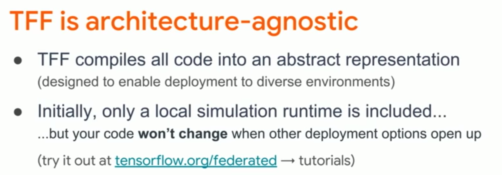
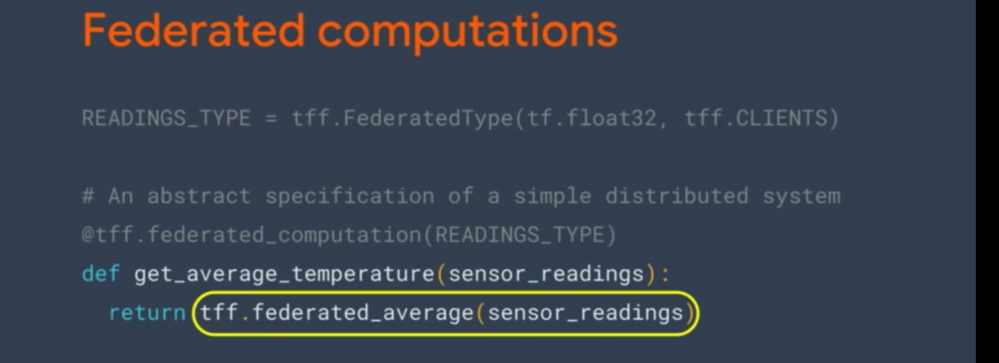
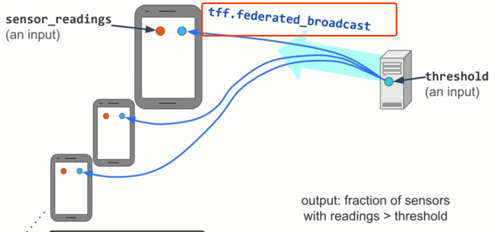

## TensorFlow Federated (TFF): Machine Learning on Decentralized Data (TF Dev Summit ‘19)

[video url](https://www.youtube.com/watch?v=1YbPmkChcbo)

<!--more-->

# Intro

TensorFlow Federated (TFF) is an open-source framework for **machine learning and other computations on decentralized data**. TFF has been developed to **facilitate open research and experimentation with Federated Learning (FL)**, an approach to machine learning where a shared global model is trained across many participating clients that keep their training data locally.

1. server distribute initial model to clients;
2. each client train model on local own data[不用convergence收敛，训练一些会儿]
   1. each client produce new model trained and send it to server
3. **In practice, we send updates but not models**, implementation detail

6. in server, combined model

7. train with many many rounds

8. many extensions to add

9. TFF将代码编译成抽象表示 可运行在不同环境  伪代码，简介

10. 优点：同一书写界面

11. FL API训练模型，实现联合学习； FC API实现联合学习算法 ，本地环境模拟

12. 分层，从各个方面参与TFF的学习

13. FL API 训练流程如上； FC API内容如下

    

14. FC API实现优点: 1.为分布式计算的语言 2. 类Python的API 3. 部署时的方便

    

15. 在clients端的数据为一等公民，有类型{float32}@CLIENTS

16. 在server端融合模型，数据类型是float32@SERVER

17. 将联邦操作认为是协议

18. FC API时，设置 数据类型； 定义联合学习算法内容

19. 较为复杂的例子：两个输入，检测数据，门槛值；如何执行？以下

20. 第一步： 分发threshold值给每一个客户端

21. 使用类似于MapReduce的方式计算以上

    

22. 使用 tff.federated_average聚合；此为一个完整的例子

23. 代码方面展示，如何创建底层的联合学习的算法； 表达联合学习的算法

24. 未来需要工作方向； 联合学习模型和数据集的增加；发展新的联合学习算法；改进FC API底层；部署环境增加

