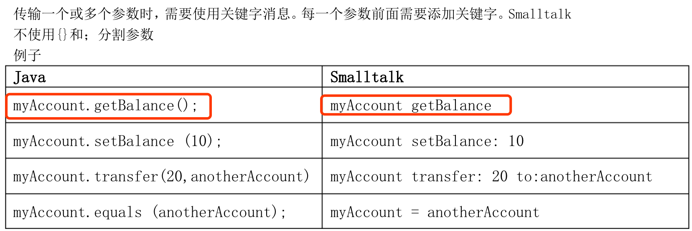
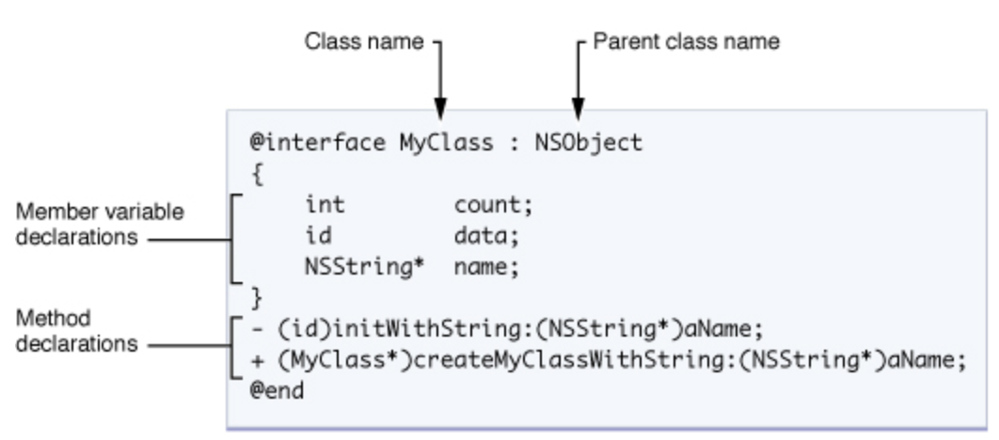
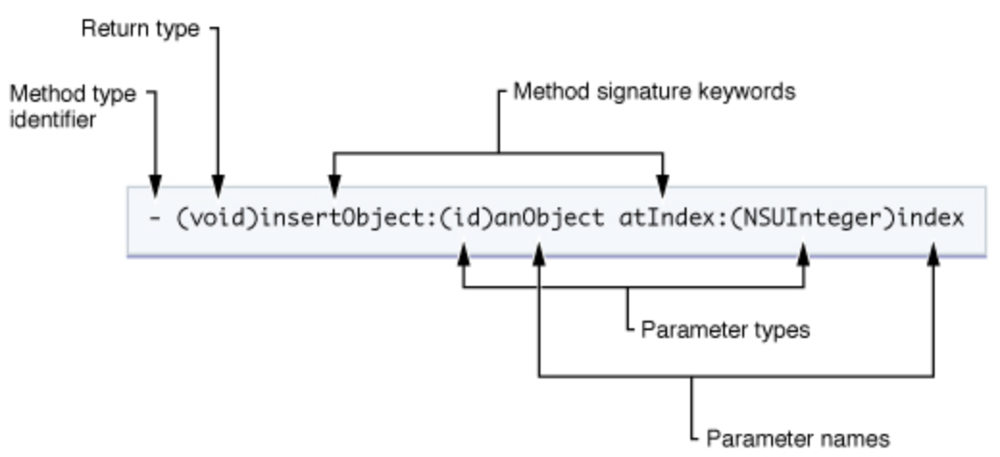
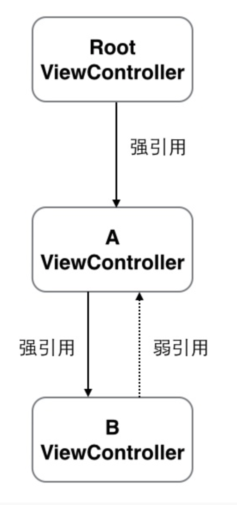
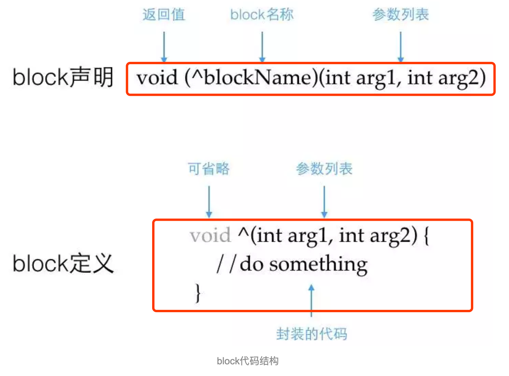
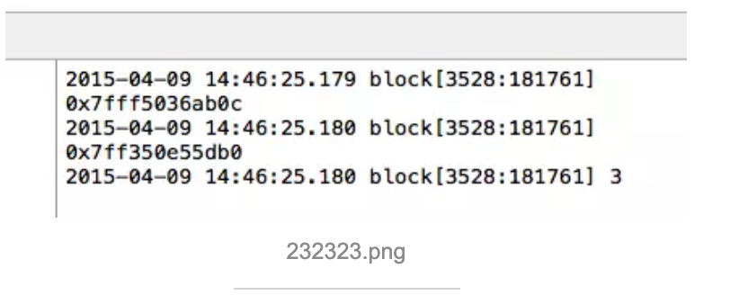

# Objective-C入门教程
Objective-C 通过提供**类定义，方法以及属性的语法**，还有其他可以提高**类的动态扩展能力的结构**等，扩展了标准的 ANSI C 语言。类的语法和设计主要是基于 Smalltalk。

<!--more-->

##Smalltalk
- 基本规则非常简洁优雅。
- 所有一切都是物体,所有的计算都通过消息（message）来触发。你向某个物体发送消息，然后就会发生某些事情。
- 几乎所有Smalltalk中的可执行表达式都是这样的形式：<接受消息的物体> <消息>。
- 消息激发方法（method），一个消息会对应什么方法是由接受消息的物体决定的。
- 方法是Smalltalk的代码单元。你可以认为**方法就是你常用的编程语言中的函数或者过程**。方法是计算发生的地方。
- 每一个物体都是某类（class）事物的一个**实例**（instance）。例如，物体12属于SmallInteger（小整数）类，物体'abc'属于String(字串)类。一个物体的数据和行为将由它所属的类决定。



- Smalltalk中，类是真实的对象。创建实例，只需向class发送new。针对类的方法称为类方法（类似于Java的staticmethods）。
- Smalltalk没有构造函数。如果你想执行实例初始化,你可以重定义“new”类方法来初始化实例
- Objective-C被描述为盖在C语言上的薄薄一层，因为Objective-C的原意就是在C语言主体上加入面向对象的特性。

## Objective-C代码的文件扩展名

| 扩展名 | 内容类型 |
| --- | --- | --- |
| .h | 	头文件。头文件包含类，类型，函数和常数的声明。 |
| .m	 |源代码文件。这是典型的源代码文件扩展名，可以包含 Objective-C 和 C 代码。|
| .mm |源代码文件。带有这种扩展名的源代码文件，除了可以包含Objective-C和C代码以外还可以包含C++代码。仅在你的Objective-C代码中确实需要使用C++类或者特性的时候才用这种扩展名。|

- `#import` 选项和 `#include` 选项完全相同，只是它可以确保相同的文件只会被包含一次。Objective-C 的例子和文档都倾向于使用 `#import`，你的代码也应该是这样的。

## 语法
- Objective-C的面向对象语法源于Smalltalk消息传递风格。

## 消息传递
Objective-C最大的特色是承自Smalltalk的消息传递模型（message passing），此机制与今日C++式之主流风格差异甚大。Objective-C里，与其说**对象互相调用方法，不如说对象之间互相传递消息**更为精确。此二种风格的主要差异在于调用方法/消息传递这个动作。C++里**类别与方法的关系严格清楚，一个方法必定属于一个类别，而且在编译时（compile time）就已经紧密绑定，不可能调用一个不存在类别里的方法**。但在Objective-C，类别与消息的关系比较松散，**调用方法视为对对象发送消息，所有方法都被视为对消息的回应。所有消息处理直到运行时（runtime）才会动态决定，并交由类别自行决定如何处理收到的消息。**也就是说，一个类别不保证一定会回应收到的消息，如果类别收到了一个无法处理的消息，程序只会抛出异常，不会出错或崩溃。

C++里，送一个消息给对象（或者说调用一个方法）的语法如下：
`obj.method(argument);`

Objective-C则写成：
`[obj method: argument];`

这里以一个汽车类（car class）的简单例子来解释Objective-C的消息传递特性：
`[car fly];`

典型的C++意义解读是"**调用car类别的fly方法**"。若car类别里头没有定义fly方法，那编译肯定不会通过。但是Objective-C里，我们应当解读为"**发提交一个fly的消息给car对象**"，**fly是消息，而car是消息的接收者**。car收到消息后会决定如何回应这个消息，若car类别内定义有fly方法就运行方法内之代码，若car内不存在fly方法，则程序依旧可以通过编译，运行期则抛出异常。

此二种风格各有优劣。C++强制要求**所有的方法都必须有对应的动作，且编译期绑定使得函数调用非常快速**。缺点是**仅能借由virtual关键字提供有限的动态绑定能力**。Objective-C天生即具备鸭子类型之动态绑定能力，因为**运行期才处理消息，允许发送未知消息给对象**。可以送消息给整个对象集合而不需要一一检查每个对象的类型，也具备消息转送机制。同时空对象nil接受消息后默认为不做事，所以送消息给nil也不用担心程序崩溃。

## 字符串
- 大多数框架把字符串传递给NSString对象。NSString类提供了字符串的类包装.
- 因为这种字符串使用的非常频繁，Objective-C提供了一个助记符可以**方便地从常量值创建NSString对象。**要使用这个助记符，你需要做的全部事情，是在普通的双引号字符串前放置一个@符号。

```
NSString* myString = @"My String\n";
NSString* anotherString = [NSString stringWithFormat:@"%d %s", 1, @"String"];

// 从一个C语言字符串创建Objective-C字符串
NSString*  fromCString = [NSString stringWithCString:"A C string" 
encoding:NSASCIIStringEncoding];
```

## 类
如同所有其他的面向对象语言，**类**是 Objective-C 用来**封装数据，以及操作数据的行为的基础结构**。对象就是类的运行期间实例，它包含了**类声明的实例变量自己的内存拷贝，以及类成员的指针**。Objective-C 的类规格说明包含了两个部分：定义（interface）与实现（implementation）。定义（interface）部分包含了**类声明和实例变量的定义，以及类相关的方法**。实现（implementation）部分包含了**类方法的实际代码**。

下图展现了声明一个叫做 MyClass 的类的语法，这个类继承自 NSObject 基础类。类声明总是**由 @interface 编译选项开始，由 @end 编译选项结束**。类名之后的（用冒号分隔的）是父类的名字。类的实例（或者成员）变量声明在被大括号包含的代码块中。**实例变量块后面就是类声明的方法的列表。每个实例变量和方法声明都以分号结尾。**

类的定义文件遵循C语言之惯例以.h为后缀，实现文件以.m为后缀。


### Interface
定义部分，清楚定义了**类的名称、数据成员和方法**。 以关键字@interface作为开始，@end作为结束。

```
@interface MyObject: NSObject 
{
    int memberVar1; //实例变量
    int memberVar2;
}

+(return_type) class_method; 类方法
-(return_type) instance_method1; //实例方法
-(return_type) instance_method2: (int) p1;
-(return_type) instance_method3: (int) p1 andPar: (int) p2;
@end
```
方法前面的 +/- 号代表函数的类型：加号（+）代表类方法（class method），不需要实例就可以调用，与C++ 的静态函数（static member function）相似。减号（-）即是一般的实例方法（instance method）。

Objective-C定义一个新的方法时，**名称内的冒号（:）代表参数传递，不同于C语言以数学函数的括号来传递参数**。Objective-C方法使得参数可以夹杂于名称中间，不必全部附缀于方法名称的尾端，可以提高程序可读性。设定颜色RGB值的方法为例：

```
- (void) setColorToRed: (float)red Green: (float)green Blue:(float)blue; /* 宣告方法*/
[myColor setColorToRed: 1.0 Green: 0.8 Blue: 0.2]; /* 呼叫方法*/
```
这个方法的签名是setColorToRed:Green:Blue:。每个冒号后面都带着一个float类别的参数，分别代表红，绿，蓝三色。

### Implementation
实现区块则**包含了公开方法的实现，以及定义私有（private）变量及方法**。 以关键字@implementation作为区块起头，@end结尾。

```
@Implementation MyObject {
    int memberVar3; //私有变量
}
+(return_type) class_method {
    .... //method implementation
}
-(return_type) instance_method1 {
     ....
}
-(return_type) instance_method2: (int) p1 {
    ....
}
-(return_type) instance_method3: (int) p1 andPar: (int) p2 {
    ....
}
@end
```
值得一提的是不只Interface区块可定义实体变量，Implementation区块也可以定义实体变量，两者的差别在于访问权限的不同，Interface区块内的实体变量默认权限为protected，宣告于implementation区块的实体变量则默认为private，故在Implementation区块定义私有成员更匹配面向对象之封装原则，因为如此类别之私有信息就不需曝露于公开interface（.h文件）中。

### 创建对象
Objective-C创建对象需通过alloc以及init两个消息。**alloc的作用是分配内存，init则是初始化对象。** init与alloc都是定义在NSObject里的方法，**父对象收到这两个信息并做出正确回应后，新对象才创建完毕**。以下为范例：

`MyObject * my = [[MyObject alloc] init];`

在Objective-C 2.0里，若创建对象不需要参数，则可直接使用new
`MyObject * my = [MyObject new];`
仅仅是语法上的精简，效果完全相同。

若要自己定义初始化的过程，可以重写init方法，来添加额外的工作。（用途类似C++ 的构造函数constructor）

### 方法
Objective-C 中的类可以声明两种类型的方法：实例方法和类方法。**实例方法就是一个方法，它在类的一个具体实例的范围内执行**。也就是说，在你调用一个实例方法前，你必须首先创建类的一个实例。而类方法，比较起来，也就是说，不需要你创建一个实例。

方法声明包括**方法类型标识符，返回值类型，一个或多个方法标识关键字，参数类型和名信息**。下图展示 insertObject:atIndex: 实例方法的声明。声明由一个减号(-)开始，这表明这是一个实例方法。方法实际的名字(insertObject:atIndex:)是所有方法标识关键的级联，包含了冒号。冒号表明了参数的出现。如果方法没有参数，你可以省略第一个(也是唯一的)方法标识关键字后面的冒号。本例中，这个方法有两个参数。


当你想**调用一个方法，你传递消息到对应的对象**。这里**消息就是方法标识符，以及传递给方法的参数信息**。发送给对象的所有消息都会动态分发，这样有利于实现Objective-C类的多态行为。也就是说，如果**子类定义了跟父类的具有相同标识符的方法，那么子类首先收到消息，然后可以有选择的把消息转发（也可以不转发）给他的父类**。

消息被中括号( [ 和 ] )包括。中括号中间，接收消息的对象在左边，消息（包括消息需要的任何参数）在右边。例如，给myArray变量传递消息insertObject:atIndex:消息，你需要使用如下的语法：

`[myArray insertObject:anObj atIndex:0];`

为了避免声明过多的本地变量保存临时结果，Objective-C允许你使用**嵌套消息**。**每个嵌套消息的返回值可以作为其他消息的参数或者目标**。例如，你可以用任何获取这种值的消息来代替前面例子里面的任何变量。所以，如果你有另外一个对象叫做myAppObject拥有方法，可以访问数组对象，以及插入对象到一个数组，你可以把前面的例子写成如下的样子：
`[[myAppObject getArray] insertObject:[myAppObject getObjectToInsert] atIndex:0];`

虽然前面的例子都是传递消息给某个类的实例，但是你也可以传递消息给类本身。当给类发消息，你指定的方法必须被定义为类方法，而不是实例方法。你可以认为类方法跟C++类里面的静态成员有点像（但是不是完全相同的）。

类方法的典型用途是**用做创建新的类实例的工厂方法，或者是访问类相关的共享信息的途径**。类方法声明的语法跟实例方法的几乎完全一样，只有一点小差别。与实例方法使用减号作为方法类型标识符不同，类方法使用加号( + )。

下面的例子演示了一个类方法如何作为类的工厂方法。在这里，arrayWithCapacity是NSMutableArray类的类方法，为类的新实例分配内容并初始化，然后返回给你。

```
NSMutableArray*   myArray = nil; // nil 基本上等同于 NULL

// 创建一个新的数组，并把它赋值给 myArray 变量
myArray = [NSMutableArray arrayWithCapacity:0];
```
### 属性
属性是用来代替**声明存取方法的便捷方式**。属性不会在你的类声明中创建一个新的实例变量。他们**仅仅是定义方法访问已有的实例变量的速记方式而已。**暴露实例变量的类，可以使用属性记号代替getter和setter语法。类还可以使用属性暴露一些“虚拟”的实例变量，他们是部分数据动态计算的结果，而不是确实保存在实例变量内的。

实际上可以说，属性节约了你必须要写的大量多余的代码。因为大多数存取方法都是用类似的方式实现的，属性避免了为类暴露的每个实例变量提供不同的getter和setter的需求。取而代之的是，你用属性声明指定你希望的行为，然后在编译期间合成基于声明的实际的getter和setter方法。

属性声明应该放在类接口interface的方法声明那里。基本的定义使用**@property编译选项**，紧跟着**类型信息和属性的名字**。你还可以用定制选项对属性进行配置，这决定了存取方法的行为。下面的例子展示了一些简单的属性声明：

```
@interface Person : NSObject {
    @public
        NSString *name;
    @private
        int age;
}

@property(copy) NSString *name;
@property(readonly) int age;

-(id)initWithAge:(int)age;
@end
```
属性的访问方法由@synthesize关键字来实现，它由属性的声明自动的产生一对访问方法。另外，也可以选择使用@dynamic关键字表明访问方法会由程序员手工提供。

```
@implementation Person
@synthesize name;
@dynamic age;

-(id)initWithAge:(int)initAge
{
    age = initAge; // 注意：直接赋给成员变量，而非属性
    return self;
}

-(int)age
{
    return 29; // 注意：并非返回真正的年龄
}
@end
```

属性可以利用传统的**消息表达式**、**点表达式**或**"valueForKey:"**/**"setValue:forKey:"**方法对来访问。

```
Person *aPerson = [[Person alloc] initWithAge: 53];
aPerson.name = @"Steve"; // 注意：点表达式，等于[aPerson setName: @"Steve"];
NSLog(@"Access by message (%@), dot notation(%@), property name(%@) and direct instance variable access (%@)",
      [aPerson name], aPerson.name, [aPerson valueForKey:@"name"], aPerson->name);
```

为了利用**点表达式来访问实例的属性**，需要使用"self"关键字：

```
-(void) introduceMyselfWithProperties:(BOOL)useGetter
{
    NSLog(@"Hi, my name is %@.", (useGetter ? self.name : name)); // NOTE: getter vs. ivar access
}
```

类或协议的属性可以被动态的读取。

```
int i;
int propertyCount = 0;
objc_property_t *propertyList = class_copyPropertyList([aPerson class], &propertyCount);

for ( i=0; i < propertyCount; i++ ) {
    objc_property_t *thisProperty = propertyList + i;
    const char* propertyName = property_getName(*thisProperty);
    NSLog(@"Person has a property: '%s'", propertyName);
}
```
## 快速枚举
比起利用NSEnumerator对象或在集合中依次枚举，Objective-C 2.0提供了**快速枚举的语法**。在Objective-C 2.0中，以下循环的功能是相等的，但性能特性不同。

```
// 使用NSEnumerator
NSEnumerator *enumerator = [thePeople objectEnumerator];
Person *p;

while ( (p = [enumerator nextObject]) != nil ) {
    NSLog(@"%@ is %i years old.", [p name], [p age]);
}

// 使用依次枚举
for ( int i = 0; i < [thePeople count]; i++ ) {
    Person *p = [thePeople objectAtIndex:i];
    NSLog(@"%@ is %i years old.", [p name], [p age]);
}

// 使用快速枚举
for (Person *p in thePeople) {
    NSLog(@"%@ is %i years old.", [p name], [p age]);
}
```
快速枚举可以比标准枚举产生更有效的代码，由于枚举所调用的方法被使用NSFastEnumeration协议提供的指针算术运算所代替了。

## 协议（Protocol）
协议是**一组没有实现的方法列表**，任何的类均**可采纳协议并具体实现**这组方法。

协议类似于Java与C#语言中的"接口"。在Objective-C中，有两种定义协议的方式：由编译器保证的"正式协议"，以及为特定目的设定的"非正式协议"。

- 非正式协议为一个可以选择性实现的一系列方法列表。optional 非正式协议已经被废弃不再使用。
- 正式协议类似于Java中的"接口"，它是一系列方法的列表，任何类都**可以声明自身实现了某个协议**。在Objective-C 2.0之前，一个类必须实现它声明匹配的协议中的所有方法，否则编译器会报告错误，表明这个类没有实现它声明匹配的协议中的全部方法。Objective-C 2.0版本允许标记协议中某些方法为可选的（Optional），这样编译器就不会强制实现这些可选的方法。协议经常应用于**Cocoa中的委托及事件触发**。例如文本框类通常会包括一个委托（delegate）对象，该对象可以实现一个协议，该协议中可能包含一个实现文字输入的自动完成方法。若这个委托对象实现了这个方法，那么文本框类就会在适当的时候触发自动完成事件，并调用这个方法用于自动完成功能。
- Objective-C中协议的概念与Java中接口的概念并不完全相同，即一个类可以在不声明它匹配某个协议的情况下，实现这个协议所包含的方法，也即实质上匹配这个协议，而这种差别对外部代码而言是不可见的。**正式协议的声明不提供实现，它只是简单地表明匹配该协议的类实现了该协议的方法，保证调用端可以安全调用方法**。

### 语法
协议以关键字@protocol作为区块起始，@end结束，中间为方法列表。

```
@protocol Locking
- (void)lock;
- (void)unlock;
@end
```
这是一个协议的例子，多线程编程中经常要确保一份共享资源同时只有一个线程可以使用，会在使用前给该资源挂上锁 ，以上即为一个表明有"锁"的概念的协议，**协议中有两个方法，只有名称但尚未实现**。
下面的SomeClass宣称他采纳了Locking协议：

```
@interface SomeClass : SomeSuperClass <Locking>
@end
```
一旦SomeClass表明他采纳了Locking协议，SomeClass就有义务实现Locking协议中的两个方法。

```
@implementation SomeClass
- (void)lock {
  // 實現lock方法...
}
- (void)unlock {
  // 實現unlock方法...
}
@end
```
由于SomeClass已经确实遵从了Locking协议，故调用端可以安全的发送lock或unlock消息给SomeClass实体变量，不需担心他没有办法回应消息。

插件是另一个使用抽象定义的例子，可以在不关心插件的实现的情况下定义其希望的行为。

## 动态类型
类似于Smalltalk，Objective-C具备动态类型：即**消息可以发送给任何对象实体，无论该对象实体的公开接口中有没有对应的方法。**对比于C++这种静态类型的语言，编译器会挡下对（void*）指针调用方法的行为。但在Objective-C中，你可以对id发送任何消息（id很像void*，但是被严格限制只能使用在对象上），编译器仅会发出"该对象可能无法回应消息"的警告，程序可以通过编译，而实际发生的事则取决于运行期该对象的真正形态，若该对象的确可以回应消息，则依旧运行对应的方法。

一个对象收到消息之后，他有三种处理消息的可能手段，**第一是回应该消息并运行方法，若无法回应，则可以转发消息给其他对象，若以上两者均无，就要处理无法回应而抛出的例外。只要进行三者之其一，该消息就算完成任务而被丢弃。若对"nil"（空对象指针）发送消息，该消息通常会被忽略，取决于编译器选项可能会抛出例外。**

虽然Objective-C具备动态类型的能力，但编译期的静态类型检查依旧可以应用到变量上。以下三种声明在运行时效果是完全相同的，但是三种声明提供了一个比一个更明显的类型信息，附加的类型信息让编译器在编译时可以检查变量类型，并对类型不符的变量提出警告。

下面三个方法，差异仅在于参数的形态：
`- setMyValue:(id) foo;`
id形态表示参数"foo"可以是任何类的实例。
`- setMyValue:(id <aProtocol>) foo;`
id<aProtocol>表示"foo"可以是任何类的实例，但必须采纳"aProtocol"协议。
`- setMyValue:(NSNumber*) foo;`
该声明表示"foo"必须是"NSNumber"的实例。

动态类型是一种强大的特性。在缺少泛型的静态类型语言（如Java 5以前的版本）中实现容器类时，程序员需要写一种针对通用类型对象的容器类，然后在通用类型和实际类型中不停的强制类型转换。无论如何，类型转换会破坏静态类型，例如写入一个"整数"而将其读取为"字符串"会产生运行时错误。这样的问题被泛型解决，但容器类需要其内容对象的类型一致，而对于动态类型语言则完全没有这方面的问题。

## 转发
Objective-C允许对一个对象发送消息，不管它是否能够响应之。除了**响应或丢弃消息**以外，对象也可以**将消息转发到可以响应该消息的对象**。转发可以用于简化特定的设计模式，例如观测器模式或代理模式。
Objective-C运行时在Object中定义了一对方法：

转发方法：

```
- (retval_t) forward:(SEL) sel :(arglist_t) args; // with GCC
- (id) forward:(SEL) sel :(marg_list) args; // with NeXT/Apple systems
```

响应方法：

```
- (retval_t) performv:(SEL) sel :(arglist_t) args;  // with GCC
- (id) performv:(SEL) sel :(marg_list) args; // with NeXT/Apple systems
```

希望实现转发的对象**只需用新的方法覆盖以上方法来定义其转发行为**。无需重写响应方法performv::，由于该方法**只是单纯的对响应对象发送消息并传递参数**。其中，SEL类型是Objective-C中消息的类型。

以下代码演示了转发的基本概念：
Forwarder.h 文件代码：

```
#import <objc/Object.h>

@interface Forwarder : Object
{
    id recipient; //该对象是我们希望转发到的对象。
}

@property (assign, nonatomic) id recipient;

@end
```
Forwarder.m 文件代码：

```
#import "Forwarder.h"

@implementation Forwarder

@synthesize recipient;

- (retval_t) forward: (SEL) sel : (arglist_t) args
{
    /*
     *检查转发对象是否响应该消息。
     *若转发对象不响应该消息，则不会转发，而产生一个错误。
     */
    if([recipient respondsTo:sel])
       return [recipient performv: sel : args];
    else
       return [self error:"Recipient does not respond"];
}
```
Recipient.h 文件代码：

```
#import <objc/Object.h>

// A simple Recipient object.
@interface Recipient : Object
- (id) hello;
@end
```
Recipient.m 文件代码：

```
#import "Recipient.h"

@implementation Recipient

- (id) hello
{
    printf("Recipient says hello!\n");

    return self;
}

@end
```

main.m 文件代码：

```
#import "Forwarder.h"
#import "Recipient.h"

int main(void)
{
    Forwarder *forwarder = [Forwarder new];
    Recipient *recipient = [Recipient new];

    forwarder.recipient = recipient; //Set the recipient.
    /*
     *转发者不响应hello消息！该消息将被转发到转发对象。
     *（若转发对象响应该消息）
     */
    [forwarder hello];

    return 0;
}
```

利用GCC编译时，编译器报告：

```
$ gcc -x objective-c -Wno-import Forwarder.m Recipient.m main.m -lobjc
main.m: In function `main':
main.m:12: warning: `Forwarder' does not respond to `hello'
```
如前文所提到的，编译器报告Forwarder类不响应hello消息。在这种情况下，由于实现了转发，可以忽略这个警告。 运行该程序产生如下输出：

```
$ ./a.out
Recipient says hello!
```

## 类别 (Category)
在Objective-C的设计中，一个主要的考虑即为大型代码框架的维护。结构化编程的经验显示，改进代码的一种主要方法即为将其分解为更小的片段。Objective-C借用并扩展了Smalltalk**并扩展了Smalltalk实现中的"分类"**的目的。

一个分类可以将**方法的实现分解进一系列分离的文件**。程序员可以将**一组相关的方法放进一个分类，使程序更具可读性**。举例来讲，可以在**字符串类中增加一个名为"拼写检查"的分类**，并将拼写检查的相关代码放进这个分类中。

进一步的，**分类中的方法是在运行时被加入类中的，这一特性允许程序员向现存的类中增加方法，而无需持有原有的代码**，或是重新编译原有的类。例如若系统提供的字符串类的实现中不包含拼写检查的功能，可以增加这样的功能而无需更改原有的字符串类的代码。

在运行时，分类中的方法与类原有的方法并无区别，其代码可以访问包括私有类成员变量在内的所有成员变量。

分类**声明了与类中原有方法同名的函数，则分类中的方法会被调用**。因此分类不仅可以增加类的方法，也可以代替原有的方法。这个特性可以用于修正原有代码中的错误，更可以从根本上改变程序中原有类的行为。若两个分类中的方法同名，则被调用的方法是不可预测的。

### 使用分类的例子
这个例子创建了Integer类，其本身只定义了integer属性，然后增加了两个分类Arithmetic与Display以扩展类的功能。虽然分类可以访问类的私有成员，但通常利用属性的访问方法来访问是一种更好的做法，可以使得分类与原有类更加独立。这是分类的一种典型应用—另外的应用是利用分类来替换原有类中的方法，虽然用分类而不是继承来替换方法不被认为是一种好的做法。

Integer.h 文件代码：

```
#import <objc/Object.h>

@interface Integer : Object
{
@private
    int integer;
}

@property (assign, nonatomic) integer;

@end
```
Integer.m 文件代码：

```
#import "Integer.h"

@implementation Integer

@synthesize integer;

@end
```
Arithmetic.h 文件代码：

```
#import "Integer.h"

@interface Integer(Arithmetic)
- (id) add: (Integer *) addend;
- (id) sub: (Integer *) subtrahend;
@end
```
Arithmetic.m 文件代码：

```
#import "Arithmetic.h"

@implementation Integer(Arithmetic)
- (id) add: (Integer *) addend
{
    self.integer = self.integer + addend.integer;
    return self;
}

- (id) sub: (Integer *) subtrahend
{
    self.integer = self.integer - subtrahend.integer;
    return self;
}
@end
```
Display.h 文件代码：

```
#import "Integer.h"

@interface Integer(Display)
- (id) showstars;
- (id) showint;
@end
```

Display.m 文件代码：

```
#import "Display.h"

@implementation Integer(Display)
- (id) showstars
{
    int i, x = self.integer;
    for(i=0; i < x; i++)
       printf("*");
    printf("\n");

    return self;
}

- (id) showint
{
    printf("%d\n", self.integer);

    return self;
}
@end
```
main.m 文件代码：

```
#import "Integer.h"
#import "Arithmetic.h"
#import "Display.h"

int
main(void)
{
    Integer *num1 = [Integer new], *num2 = [Integer new];
    int x;

    printf("Enter an integer: ");
    scanf("%d", &x);

    num1.integer = x;
    [num1 showstars];

    printf("Enter an integer: ");
    scanf("%d", &x);

    num2.integer = x;
    [num2 showstars];

    [num1 add:num2];
    [num1 showint];

    return 0;
}
```
利用以下命令来编译：

`gcc -x objective-c main.m Integer.m Arithmetic.m Display.m -lobjc`
在编译时间，可以利用省略#import "Arithmetic.h" 与[num1 add:num2]命令，以及Arithmetic.m文件来实验。程序仍然可以运行，这表明了允许动态的、按需的加载分类；若不需要某一分类提供的功能，可以简单的不编译之。

## 垃圾收集
Objective-C运行时会将引用计数操作.当垃圾收集启用时，所有的对象都是收集器的工作对象。普通的C指针可以以"__strong"修饰，标记指针指向的对象仍在使用中。被标记为"__weak"的指针不被计入收集器的计数中，并在对象被回收时改写为"nil"。

- OC是支持垃圾回收机制的(Garbage collection简称GC),
- iOS开发只支持手动内存管理和ARC；如果两个对象互相强引用（strong references）将导致它们永远不会被释放，甚至没有任何对象引用它们。

### 引用计数
引用计数（Reference Count）是一个简单而有效的管理对象生命周期的方式。当我们**创建**一个新对象的时候，它的引用计数为 1，当有一个**新的指针指向这个对象**时，我们将其引用计数加 1，当**某个指针不再指向这个对象**是，我们将其引用计数减 1，当对象的引用计数变为 0 时，说明这个对象不再被任何指针指向了，这个时候我们就可以将对象销毁，回收内存。由于引用计数简单有效。

引用计数真正派上用场的场景是在面向对象的程序设计架构中，用于对象之间传递和共享数据。

### ARC 下的内存管理问题
对于 ARC 盲目依赖的 iOS 新人们，由于不知道引用计数，他们的问题主要体现在：

1. 过度使用 block 之后，无法解决循环引用问题。
2. 遇到底层 Core Foundation 对象，需要自己手工管理它们的引用计数时，显得一筹莫展。


- 循环引用（Reference Cycle）问题

引用计数这种管理内存的方式虽然很简单，但是有一个比较大的瑕疵，即它不能很好的解决循环引用问题。如下图所示：对象 A 和对象 B，相互引用了对方作为自己的成员变量，只有当自己销毁时，才会将成员变量的引用计数减 1。因为对象 A 的销毁依赖于对象 B 销毁，而对象 B 的销毁与依赖于对象 A 的销毁，这样就造成了我们称之为循环引用（Reference Cycle）的问题，这两个对象即使在外界已经没有任何指针能够访问到它们了，它们也无法被释放。

解决循环引用问题主要有两个办法，第一个办法是我明确知道这里会存在循环引用，在合理的位置主动断开环中的一个引用，使得对象得以回收。
主动断开循环引用这种方式常见于各种与 block 相关的代码逻辑中。例如在我开源的 YTKNetwork 网络库中，网络请求的回调 block 是被持有的，但是如果这个 block 中又存在对于 View Controller 的引用，就很容易产生从循环引用，因为：

Controller 持有了网络请求对象
网络请求对象持有了回调的 block
回调的 block 里面使用了 self，所以持有了 Controller

解决办法就是，在网络请求结束后，网络请求对象执行完 block 之后，主动释放对于 block 的持有，以便打破循环引用。相关的代码见：

```
// https://github.com/yuantiku/YTKNetwork/blob/master/YTKNetwork/YTKBaseRequest.m
// 第 147 行：
- (void)clearCompletionBlock {
    // 主动释放掉对于 block 的引用
    self.successCompletionBlock = nil;
    self.failureCompletionBlock = nil;
}
```

不过，主动断开循环引用这种操作依赖于程序员自己手工显式地控制，相当于回到了以前 “谁申请谁释放” 的内存管理年代，它依赖于程序员自己有能力发现循环引用并且知道在什么时机断开循环引用回收内存（这通常与具体的业务逻辑相关），所以这种解决方法并不常用，更常见的办法是使用弱引用 (weak reference) 的办法。

### 使用弱引用
弱引用虽然持有对象，但是并不增加引用计数，这样就避免了循环引用的产生。在 iOS 开发中，弱引用通常在 delegate 模式中使用。举个例子来说，两个 ViewController A 和 B，ViewController A 需要弹出 ViewController B，让用户输入一些内容，当用户输入完成后，ViewController B 需要将内容返回给 ViewController A。这个时候，View Controller 的 delegate 成员变量通常是一个弱引用，以避免两个 ViewController 相互引用对方造成循环引用问题，


弱引用的实现原理

弱引用的实现原理是这样，系统对于每一个有弱引用的对象，都维护一个表来记录它所有的弱引用的指针地址。这样，当一个对象的引用计数为 0 时，系统就通过这张表，找到所有的弱引用指针，继而把它们都置成 nil。

从这个原理中，我们可以看出，弱引用的使用是有额外的开销的。虽然这个开销很小，但是如果一个地方我们肯定它不需要弱引用的特性，就不应该盲目使用弱引用。举个例子，有人喜欢在手写界面的时候，将所有界面元素都设置成 weak 的，这某种程度上与 Xcode 通过 Storyboard 拖拽生成的新变量是一致的。但是我个人认为这样做并不太合适。因为：

1. 我们在创建这个对象时，需要注意临时使用一个强引用持有它，否则因为 weak 变量并不持有对象，就会造成一个对象刚被创建就销毁掉。
2. 大部分 ViewController 的视图对象的生命周期与 ViewController 本身是一致的，没有必要额外做这个事情。

### Core Foundation 对象的内存管理

下面我们就来简单介绍一下对底层 Core Foundation 对象的内存管理。底层的 Core Foundation 对象，在创建时大多以 XxxCreateWithXxx 这样的方式创建，例如：

```
// 创建一个 CFStringRef 对象
CFStringRef str= CFStringCreateWithCString(kCFAllocatorDefault, “hello world", kCFStringEncodingUTF8);
// 创建一个 CTFontRef 对象
CTFontRef fontRef = CTFontCreateWithName((CFStringRef)@"ArialMT", fontSize, NULL);
```
对于这些对象的引用计数的修改，要相应的使用 CFRetain 和 CFRelease 方法。如下所示：

```
// 创建一个 CTFontRef 对象
CTFontRef fontRef = CTFontCreateWithName((CFStringRef)@"ArialMT", fontSize, NULL);
// 引用计数加 1
CFRetain(fontRef);
// 引用计数减 1
CFRelease(fontRef);
```
对于 CFRetain 和 CFRelease 两个方法，读者可以直观地认为，这与 Objective-C 对象的 retain 和 release 方法等价。

所以对于底层 Core Foundation 对象，我们只需要延续以前手工管理引用计数的办法即可。

除此之外，还有另外一个问题需要解决。在 ARC 下，我们有时需要将一个 Core Foundation 对象转换成一个 Objective-C 对象，这个时候我们需要告诉编译器，转换过程中的引用计数需要做如何的调整。这就引入了bridge相关的关键字，以下是这些关键字的说明：

- __bridge: 只做类型转换，不修改相关对象的引用计数，原来的 Core Foundation 对象在不用时，需要调用 CFRelease 方法。
- __bridge_retained：类型转换后，将相关对象的引用计数加 1，原来的 Core Found-ation 对象在不用时，需要调用 CFRelease 方法。
- __bridge_transfer：类型转换后，将该对象的引用计数交给 ARC 管理，Core Foundation 对象在不用时，不再需要调用 CFRelease 方法。


## OC @property 指示符

常用的指示符有assign、atomic、copy、retain、strong、week、等。下面对它们的用途和常常对应的属性讲解一下。

- assign：该指示符号对属性只是**简单的赋值，不更改引用计数**。**常用于NSInteger等OC基础类型，以及short、int、double、结构体等C数据类型**，因为这些类型不存在被内存回收的问题。
- atomic、nonatomic：指定setter和getter是否是原子操作，即是否线程安全。如果是atomic，那么存取方法都是线程安全的，即某一线程访问存或者取方法，其他线程不可以进入该存、取方法。nonatomic则不具备线程安全的功能。需要指出的是atomic是默认值，可以保证数据的完整性，但是相应的降低了性能，所以在单线程环境中建议使用nonatomic来提升性能。
- copy：如果使用copy指示符，当调用setter方法对成员变量赋值时，会将被赋值的对象复制的一个副本，再将该副本给成员变量，相应的原先的被赋值的对象的引用计数加1。当成员变量的类型是可变类型，或其子类是可变类型，被赋值的对象在赋值后有可能再被修改，如果不需要这种修改，则可以考虑copy指示符。
- getter、setter：用于为getter方法、setter方法指定自定义方法名。比如getter＝myName,setter=setName:，我们可以看到setter方法后面有一个（:）,这是因为我们需要在后面添加参数。
- readonly、readwrite：readonly指示系统只合成getter方法，不合成setter方法；readwrite是默认值，指示系统需要合成setter方法和getter方法。
- retain：当把某个对象赋值给该属性时，该属性原来所引用的对象的引用计数减1，被赋值对象的引用计数加1。在未启用ARC机制的的情况下，retain可以保证一个对象的引用计数大于1时，该对象不会被回收。启用ARC后一般较少使用retain
- strong、weak：strong指示符该属性对被赋值对象持有强引用，而weak指示符指定该属性对被赋值对象持有弱引用。强引用的意思是：只要该强引用指向被赋值的对象，那么该对象就不会自动回收。弱引用的意思是：即使该弱引用指向被赋值的对象，该对象也可能被回收。如果不希望对象被回收，可以使用strong指示符。如果需要保证程序性能，避免内存溢出，可以使用weak，内存一旦被回收，指针会被赋值为nil。

1、atomic是默认行为，assign是默认行为，readwrite是默认行为
2、推荐做法是NSString用copy
3、delegate用assign（且一定要用assign）
4、非objc数据类型，比如int，float等基本数据类型用assign（默认就是assign）
5、其它objc类型，比如NSArray，NSDate用retain。retain就如2中所述，使用了引用计数，retain引起引用计数加1, release引起引用计数减1，当引用计数为0时，dealloc函数被调用，内存被回收。


assign： 简单赋值，不更改索引计数
copy： 建立一个索引计数为1的对象，然后释放旧对象
retain：释放旧的对象，将旧对象的值赋予输入对象，再提高输入对象的索引计数为1


## Block 详解

1. 介绍
2. 截获变量
3. __block修饰符
4. Block的内存管理
5. Block的循环引用

### Block介绍

- Block是将**函数**及其**执行上下文**封装起来的**对象**


```objective-c
{
	int multiplier = 6;
	int(^Block)(int) = ^int(int num){
		return num*multiplier;
	};
	Block(2);
}
```

- 本质


### 使用

先从一个简单的需求来说：传入两个数，并且计算这两个数的和，为此创建了这样一个block：

```
int (^sumOfNumbers)(int a, int b) = ^(int a, int b) {
    return a + b;
};
```

这段代码等号左侧声明一个名为`sumOfNumbers`的代码块，名称前用`^`符号表示后面的字符串是block的名称。最左侧的`int`表示这个block的返回值，括号中间表示这个block的参数列表，这里接收两个`int`类型的参数。 而在等号**右侧表示这个block的定义**，其中返回值是可以省略的，编译器会根据上下文自动补充返回值类型。**使用`^`符号衔接着一个参数列表**，**使用括号包起来，告诉编译器这是一个block**，然后**使用大括号将block的代码封装起来**。



这只局限于只读操作。如果我们在block中修改外部变量，编译器将会报错;

对于希望在block中修改的外界局部对象，我们可以给这些变量加上`__block`关键字修饰，这样就能在block中修改这些变量。在捕获变量特性中，还有一个有趣的小机制，我们把上面的代码改成这样：

```objective-c
CGPoint center = CGPointZero;
CGPoint (^pointAddHandler)(CGPoint addPoint) = ^(CGPoint addPoint) {
    return CGPointMake(center.x + addPoint.x, center.y + addPoint.y);
}
center = CGPointMake(100, 100);
NSLog(@"%@", pointAddHandler(CGPointMake(10, 10)));    //输出{10,10}
```

block在捕获变量的时候只会保存变量被捕获时的状态（对象变量除外），之后即便变量再次改变，block中的值也不会发生改变。所以上面的代码在计算新的坐标值时`center`的值依旧等于`CGPointZero`

- 循环引用

  开头说过，block在iOS开发中被视作是对象，因此其生命周期会一直等到持有者的生命周期结束了才会结束。另一方面，由于block捕获变量的机制，使得持有block的对象也可能被block持有，从而形成循环引用，导致两者都不能被释放:

  ```objective-c
  @implementation LXDObject
  {
     void (^_cycleReferenceBlock)(void);
  }
  
  - (void)viewDidLoad
  {
      [super viewDidLoad];
      _cycleReferenceBlock = ^{ 
          NSLog(@"%@", self);   //引发循环引用
      };
  }
  
  @end
  ```

遇到这种代码编译器只会告诉你存在警告，很多时候我们都是忽略警告的，这最后会导致内存泄露，两者都无法释放。跟普通变量存在`__block`关键字一样的，系统提供给我们`__weak`的关键字用来修饰对象变量，声明这是一个弱引用的对象，从而解决了循环引用的问题：

```
  __weak typeof(*&self) weakSelf = self;
  _cycleReferenceBlock = ^{ 
      NSLog(@"%@", weakSelf);   //弱指针引用，不会造成循环引用
  };
```

对于block这种有趣的特性，在唐巧的[谈Objective-C block的实现](https://link.jianshu.com/?t=http://blog.devtang.com/2013/07/28/a-look-inside-blocks/)有详细介绍block的底层实现代码，我在这里就不多说了

- 申明一个block变量

  通过**^**符号来声明block类型；形式如： `void (^myBlock)();`

  其中第一个void是返回值，可以是任意类型，中间括号中^后面的是这个block变量的名字，我把它命名为myBlock，最后一个括号中是参数，如果多参数，可以写成如下样式：

  ```
  int (^myBlock)(int,int);
  ```

  同样，你也可以给参数起名字：

  ```
  int (^myBlock)(int a,int b);
  ```

  很多时候，我们需要将我们声明的block类型作为函数的参数，也有一下几种方式：

  ```
  -(void)func:(int (^)(int a,int b))block；
  ```

  第二种方式是通过typedef定义一种新的类型，这也是大多数情况下采用的方式：

  ```
  typedef int (^myBlock)(int a,int b) ;
  -(void)func:(myBlock)block ;
  ```

  第三种方式也是通过typedef定义，但将blcok包装重命名成为属性再调用，这种思路也更清晰明了

  ```
  typedef void (^myBlock)(int a ,int b);
  @property (nonatomic, strong) myBlcok block;
  -(void)func:(myBlcok)block;
  ```

- 如何实现一个block

  既然**block可以被声明为变量，那么就一定可以实现它**，就像其他类型变量的赋值。我自己对block的理解为它是一段代码块，所以给它**赋值赋便是一段代码段**：

  ```
  typedef int (^myBlock)(int,int) ;
  @interface ViewController ()
  {    
        myBlock block1;
  }
  @end
  @implementation ViewController
  - (void)viewDidLoad {   
      [super viewDidLoad]; 
      block1 =^(int a, int b)
      {        
          return a+b;    
      };   
      NSLog(@"%d",block1(1,1));
  }
  ```

  这里打印的结果是2，从这里可以发现block和函数的功能很像。

  注意：1、在上面的代码里 block1是一个对象，如果直接打印将打印对象地址

  ​			2、block()，加上后面的括号才是**执行block语句块**

- block中访问对象的微妙关系

  1、如果你在一个block块中仅仅访问对象，而不是对他进行修改操作，是没有任何问题的：

  ```objective-c
  - (void)viewDidLoad {   
     [super viewDidLoad]; 
     int tem=2;    
     block1 = ^(int a,int b){        
     int count= tem+1;        
     return count;   
   };   
     NSLog(@"%d",block1(1,1));
  }
  ```

  而如果我在block块中直接修改，编译器会报错：

  ```
    block1 = ^(int a,int b){       
       tem+=1;        
       return tem+1;   
   };
  ```

  为什么会出现这样的情况，根据猜测，可能是block内部将访问的变量都备份了一份，如果我们在内部修改，外部的变量并不会被修改，我们可以通过打印变量的地址来证明这一点：

  ```
  - (void)viewDidLoad {   
   [super viewDidLoad];    
   int tem=2;    
   NSLog(@"%p",&tem);   
   block1 = ^(int a,int b){       
         NSLog(@"%p",&tem);       
         return tem+1;   
   };   
   NSLog(@"%d",block1(1,1)); }
  ```

  打印结果如下：

  

