# 路由设计

# 移动端路由层设计

> 什么是移动端路由层：

路由层的概念在服务端是指**url请求的分层解析，将一个请求分发到对应的应用处理程序**。移动端的路由层指的是将**诸如App内页面访问、H5与App访问的访问请求和App间的访问请求，进行分发处理的逻辑层**。

<!--more-->

> 移动端路由层需要解决的问题：

1. **对外部提供远程访问的功能**，实现跨应用调用响应，包括H5应用调用、其他App应用调用、系统访问调用等
2. **原生页面、模块、组件等定义，统称为资源**(Resource)，在跨应用调用和路由层在不同端实现的业务表现需要一致的前提下，需要对资源进行定义，在路由提供内部请求分发的时候则可以提供不依赖对外进行资源定义的功能
3. 外部调用如何使用统一标示(Uniform)进行表示资源
4. **如何在移动端统一定义访问请求的过程**，从而达成移动端与web端的统一性
5. 如何更好的兼容iOS、Android的系统访问机制、App链接协议、web端路由机制与前端开发规范等
6. 如何兼容各平台(Android、iOS)App页面导航机制
7. 如何解决安全访问问题
8. 移动端在客户端进行动态配置

> 移动端路由所应用的场景：

- H5页面与App原生页面、模块与组件的交互
- App与App之间的相互访问
- App内部页面跳转、模块调度与组件加载等
- **推送与通知系统解除硬编码的逻辑**，动态访问原生资源，更好的支持通过通知和推送完成动态页面访问和逻辑执行
- Extension等动态调用主App的资源
- App实现更复杂的架构MVVM或者是VIPER架构，提供解除业务相互依赖的能力
- 以组件化为目的的工程改造，隔离各个业务，以制作单独的组件

> 对外如何定义资源

在路由提供对外的资源请求转发的时候，因为要照顾到其他应用的请求表达方式，比如H5应用或者是其他App的应用的访问请求，定义单纯依赖业务的资源定义就显得有些必要了。

举个例子，一个H5的商品详情页，被用户分享，当其他用户看到这个H5应用的页面的时候，点击，如果该用户装了有对应这个H5商品详情页的App的时候，应该跳转到该App的原生商品详情页，如果没有安装则加载这个H5页面，在这个过程中，H5的页面是通过URL进行标识的，那这个URL的标识也应该对照到App的原生页面，但是要只依赖业务标识而不能依赖App的代码实现，比如说iOS端的App的商品详情页叫做DetailViewController，那这个URL是不能包含这个名字的，Android端可能叫DetailActivity，如果不单纯依赖业务，那H5应用就要根据平台来重新发送不同的资源定义的URL，就造成了硬编码问题，H5应用要依赖App的实现逻辑，如果有一天，原生App的页面代码实现变成了GoodDetailViewController，所有依赖DetailViewController这个资源标示的H5应用都要进行更改，就会出现问题。所以**路由层的设计应该具备根据业务定义来映射App内的资源定义**。
常常在设计路由层的时候，我们会更加关注通信行为的细节、如何改进特定通信机制的表现，常常忽略了一个事实，那就是改变应用程序的互动风格比改变协议对整体的表现有更大的影响。

所谓资源，就是**一个应用程序提供的不可分割的服务**，从这个层面上看，App的资源即是一种实体的存在，可以进行获取和访问，必须进行良好的表示，在有些必要的情况下，必须是独一无二的识别符来表示一个应用程序所提供的服务是什么。**表示资源我们更倾向于使用URI进行标示**，因为移动端没有一个横跨iOS、Android、Web后端与H5应用的资源标示方式，而URI是web service模式的资源通用表示方式，包括后面将**要提到的Android与iOS统一支持的universal link(通用链接)也是借用URI的概念**，App路由层所涉及到的**资源表示方法还是建议使用URI的标示方式**，同时更应该借鉴RESTful风格来架构这一层，原因是App的页面、组件或者说一整套功能性的服务是非常复杂的，相比于H5有更加多与复杂的交互，相比于后端存在更加苛刻的网络环境与多设备多平台的技术考量，所以URI在标示横跨多平台多版本的资源的情况下，能够更好的表示某一个资源实体而不是资源的表现形式。

在Android与iOS系统中，均支持URL Scheme，所以资源的标示通常会是这个样子：

```
AppScheme://path
//例如qq app:
mqq:// 
//支付宝:
支付宝alipay:// 
```
如果协议是Http或者是Https标示的是Web应用或者是H5应用，你的App也是一个与WebService相同级别的应用，那么URL的协议部分应该是App的唯一标示符，这个主机部分和路径部分则需要我们使用RESTful的风格进行重新设计。
重点是如何标示资源，例如表示App中的登录服务，那可以表示为：

```
AppScheme://host/login
```
host为主机部分，在一般的WebService上，在业务表现形式上一般是比较大的业务条线的标示，比方说 https://news.sina.com.cn ，主机部分是news.sina.com.cn，则标示新浪新闻这条业务线，在App内你的业务条线也应该是清晰的，假如移动App的主UI框架是Tab分栏，那么每个Tab分栏就是你的业务条线的分割，这点跟WebService应用的导航栏类似，App的资源大多是页面或者是可交互的组件，与UI关系比较大，假如你的Tab有四个：分别叫首页、商品、发现、我的，那么我们可以这样定义：

```
AppScheme://index/
AppScheme://goods/
AppScheme://discover/
AppScheme://user/
```
当然，也可以有额外的定义，比方说App有Api服务，Api提供实现一个纯数据同步的服务标示，那么这个URL可以设计为：

`AppScheme://api-asycn/collections?action='insert'&value='***'&&userUoken='*******'&&source="https//***.***.com/collection.html"
`
由于RESTful风格强调URL的资源标示而不是行为表示，所以”AppScheme://api-asycn/collections” 是一个良好的资源标示，表示了一个收藏功能的实体，而”?”后面的GET方式的参数实际上是不得已为之，因为实际上没有Web的http request的实体，所以只能勉强借助GET参数来替代RESTful风格中强调的Accept和Content-Type字段来标示表现层的行为描述。
当然action与value这样的描述可以根据业务划分，但是重点是要用参数表现形式。

## iOS与Android的系统访问机制、统一的链接协议
苹果的URL Scheme由来已久： Apple URLScheme，Android平台同样也实现了该功能，使得App能够在沙盒机制的前提下，能够相互调用声明过的服务。由于URL Scheme天生没有返回的callBack机制，著名的App Drafts的作者联合Marco Arment、Justin Williams 等人开发了x-callback-URL来做出统一跳转的协议: x-callback-url，在此不过多表述。
利用URL-Scheme的机制，可以定义如下的统一链接协议：

1. **协议部分来标示App应用**
2. **主机Host部分用于标示业务线或者是应用提供的划分好的服务实体**，比方说index、discover是业务条线，api-asycn是对外提供的api，pushService是App内部的推送服务等。
3. **路径部分则可以是细分的页面、组件或者服务的标示**
4. **参数定义有一些是必要的**，比如说action来标示动作，比方说可以使用get标示获取、insert增加，userToken表示安全的用户令牌，source表示来源，当然像是userToken与source这些都是路由层需要进行解析和验证的，而action则是业务相关的参数，这一点在路由曾设计的时候需要进行详细区分

## 统一访问请求过程

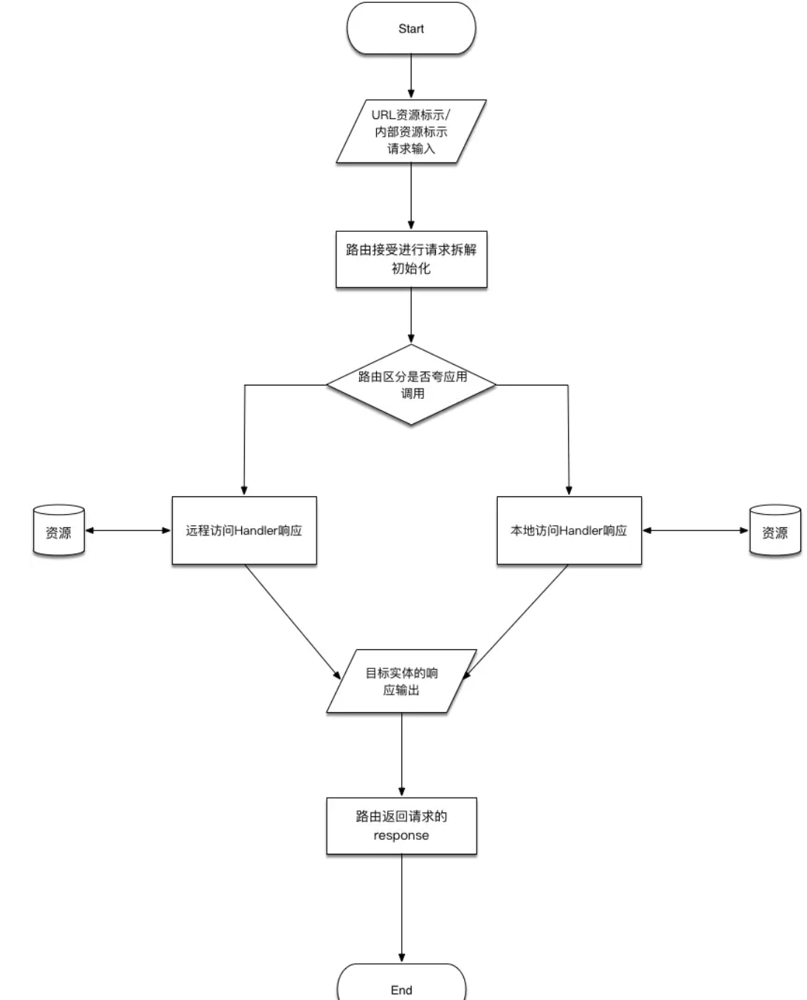
整个统一的访问请求过程如图，关于最后的response返回有一些说明：
在WebService的工作栈中，http的request与response是有标准协议规范的，而App的路由层**只是套用的URI的资源标示和RESTFul风格的交互，没有标准的request和response结构，这部分实现在App内部**，response对外部调用系统而言关心的有三个重要元素，**资源状态码、返回值与错误**，在路由层在响应外部调用的时候需要返回这三种元素

## 路由层逻辑结构
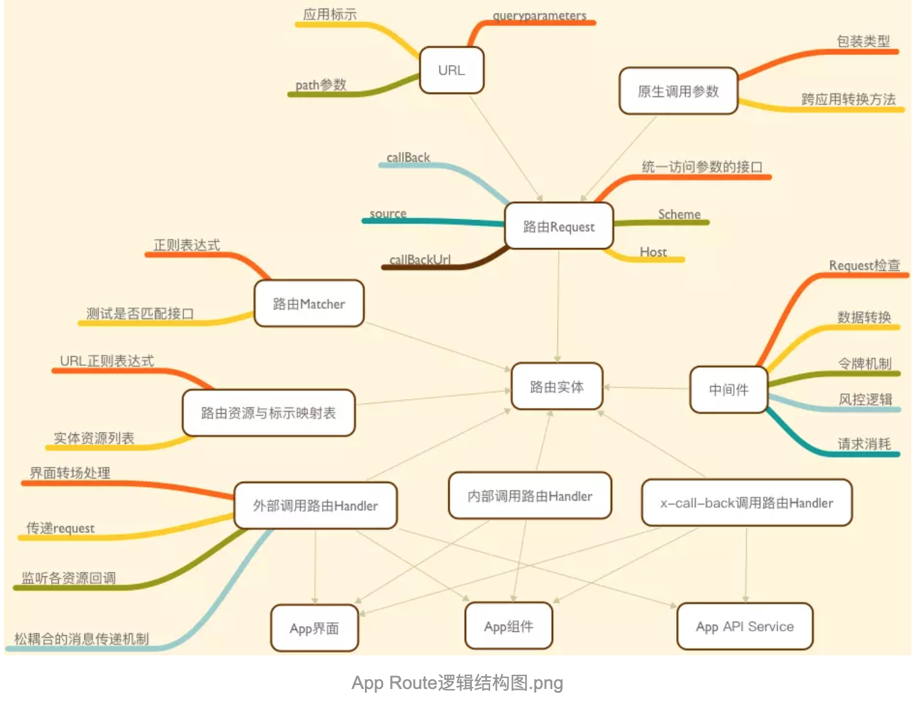

> 路由层安全

路由层的安全包含两个方面：

1. **跨应用时，需要注意注入攻击**，做到敏感参数加密防篡改，同时需要注意路由层应提供能够实现风控的机制
2. 跨业务系统的时候，需要开启会话访问机制，通过令牌或者是session会话等来实现路由层身份认证

# 一步步构建iOS路由 实战篇

> 这个路由究竟是什么鬼？能解决什么问题？

场景1：一个App项目中团队人员比较多，不同的人负责不同的模块开发，有的人直接使用资源文件设计的，有的人用代码直接写的，有的人负责登录，有的人负责订单，突然有一天搞订单的开发A找搞登录的开发B说要调一下登录，登录成功以后你要再回调下我写的模块的方法告诉我成功登录，我要刷新一下订单页面，B傻傻的就答应了，找B的人C、D、F....越来越多，B负责的代码越写越多，同时A也不怎么开心，因为A发现调B写的登录要通过类实例化函数获取模块，调C写的支付使用工厂方法，调D写的计算器组件又是另外一种写法，结果A自己的代码也越来越丑。


我想上面的两个场景出现的问题大家或多或少都会遇见，总结一下就是：

1. 因为不同人负责不同模块，调用他人必须了解他人编写的模块如何调用，对象是啥，初始化方式是啥，这违背了面向对象的封装原则
2. 引入不同的模块头文件，多了以后，所依赖的外部发生一丁点变化你就要跟着变，逻辑变得越来越耦合，不利于维护
3. 调用不同模块要反复与他人沟通传参、回调流程、接口定义等等，沟通效率低下
4. 产品提出各种需求，但是我写的代码都是差不多的，来一个页面我需要写一些相同逻辑的代码，而且产品还抱怨每次加相同的东西就要改代码发版，这显然不能满足复用的要求。

>总结:
依赖多、耦合高、复用低。
可我们都知道有这么句话啊：高内聚、低耦合，职责单一逻辑清晰。

路由就是解决上面的问题

**我们已经发现依赖比较大是因为要导入其他模块的头文件，了解其他模块的逻辑和定义，如果多了，你的代码中引入的头文件或者导入的包名越来越多，改一下牵一发而动全身啊。大概是这个样子**：

依赖的问题很严重，要想破除这样的依赖，我们能想到的办法就是**找个调度中心去做这件事**，其实各个业务模块并不关心其他模块具体的业务逻辑是什么，也不需要知道这个模块如何获取，**我只关心怎么调用和反馈的结果**，而这个有了调度中心这个东西，每个模块不需要依赖其他模块，只需要调度中心关心每个模块的调度。

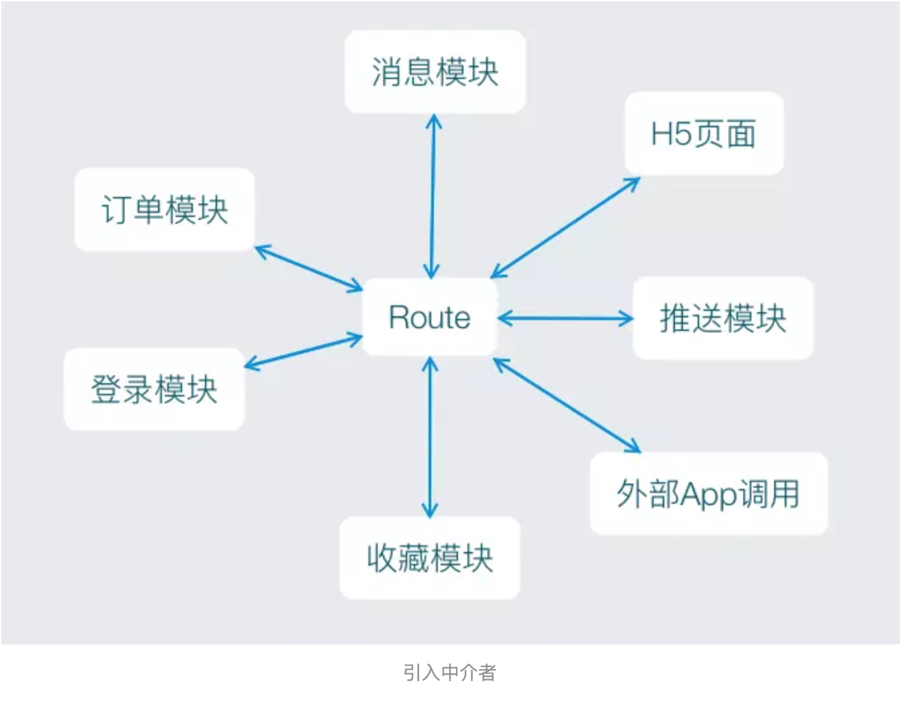

有了Route这个调度中心，每个模块就不用写那么多重复的耦合代码了，也不需要在导入那么多头文件了和引入那么多包名了，这些蓝色的箭头代表着调用方式，如果调用方式再统一一下，沟通效率就提升上去了，因为我们可以用一套约定好的数据协议来代替重复沟通，有时候我们需要靠约定和协议来提高我们的工作效率。

>Tips:
发现问题这个环节很重要，你在工作中经常要反复做的，浪费时间的都是需要你去优化和花大力气去解决的，作为一个专业人士，不断改进你的代码，优化你的工作流程，带动团队向好的协作方式去转型，这是专业人士的习惯，更应该成为你的习惯。同时针对代码存在的问题，也许你经常会隐隐约约感到有问题，就是不知道问题在什么地方，那么需要**问问自己有没有以下情况**：**哪些代码是经常写且重复度很高的，是不是可以抽象出来？哪些代码需要反复的变动，是不是可以做成配置或者是定义一套数据格式来满足动态兼容？有没有一些现成的设计模式可以解决这些问题？比方说，调度中心则使用的是中介者模式。**

## 为啥要说iOS路由呢？

路由层其实在逻辑功能上的设计都是一样的，**很多人把App中的视图切换当做是路由组件的功能职责，这点我持否定态度**，从**单一职责角度和MVC框架分析来看，视图切换属于View中的交互逻辑并不属于消息传递或者是事件分发的范畴**，但路由请求、视图转场的实现部分与Android平台和iOS平台上的导航机制有着非常紧密的关系，Android操作系统有着天然的架构优势，Intent机制可以协助应用间的交互与通讯，是对调用组件和数据传递的描述，本身这种机制就解除了代码逻辑和界面之间的依赖关系，只有数据依赖。而iOS的界面导航和转场机制则大部分依赖UI组件各自的实现，所以如何解决这个问题，iOS端路由的实现则比较有代表性。

其实说白一点，**路由层解决的核心问题**就是**原来界面或者组件之间相互调用都必须相互依赖，需要导入目标的头文件、需要清楚目标对象的逻辑，而现在全部都通过路由中转**，只依赖路由或者某种通讯协议，或者依靠一些消息传递机制连路由都不依赖。其次，**路由的核心逻辑就是目标匹配，对于外部调用的情况来说，URL如何匹配Handler是最为重要的**，匹配就必然用到正则表达式。了解这些关键点以后就有了设计的目的性，let‘s do it~

## 总结一下这个路由都要有什么？(需求分析)
我们先根据上面的模糊的总结梳理一下：

1. 路由需要能够实现被其他模块调度，从而调度另外一个模块
2. 接入路由的模块不需要知道目标模块的实现
3. **调度发起方需要有目标的响应回调**，类似于http请求，有一个request就要有一个response，才能实现双向的调用
4. **调用方式需要统一，统一而松散的调用协议和数据协议**可以减少大量接入成本和沟通成本
那一个完整的调度流程应该是这样的：

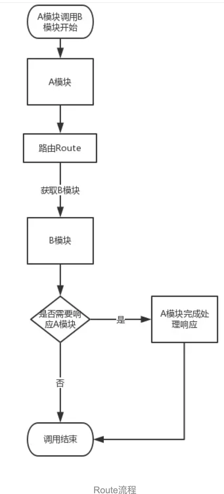

看到这个流程以后，可以确定以下几件事：

1. A模块调用路由，为表达自己需要调用的是B模块，考虑到H5、推送以及其他App的外部调用，可以**使用URL这种方式来定义目标，也就是说用URL来表示目标B**
2. 对一个URL的请求来说，路由需要**有统一的回调处理**，当然，如果不需要回调也是可以的，回调是需要目标去触发的
3. 路由要有处理URL的功能，并调用其他模块的能力

根据以上粗略的定义一下路由的框架：
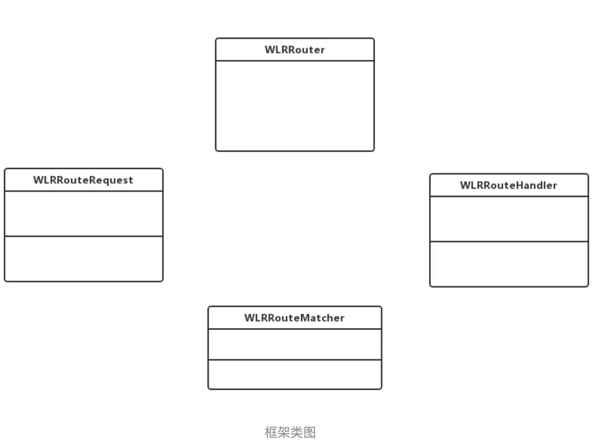
这里面以供有4部分：

1. WLRRouter就是一个**实体对象，用来提供给其他模块调用**。
2. WLRRouteRequest是一个**以URL为基础的实体对象**，为什么不直接用URL字符串？因为考虑到如果路由在内部调用其他模块的时候需要传入一些原生对象，而URL上只能携带类型单一的字符串键值对表示参数，所以需要使用这么一个对象进行包装。
3. WLRRouteHandler是**一个处理某一个WLRRouteRequest请求的对象**，当路由接收一个WLRRouteRequest请求，转发给一个WLRRouteHandler处理，处理完毕以后如果有回调，则回调给调用者。
4. URL的请求与Handler的对应关系肯定需要匹配的逻辑，为了使得路由内部逻辑更加清晰单独使用WLRRouteMatcher来处理匹配的逻辑。

## 深入具体需求，细化功能实现(详细设计)
有了粗略的需求分析接下来就是细化需求并给出详细设计的阶段了，其实**编写一个模块要有系统性思维，粗略的需求里面包含了整个模块要实现的主要核心功能，核心流程是什么，要有哪几个类才能实现这样的流程**，**不要妄图一下子深入到细枝末节上，让细节左右宏观上的逻辑架构，大脑不适合同时考虑宏观和微观的事情**，尤其是对经验不太足的开发者来说，要逐渐学会大脑在不同的时期进行宏观和微观的无缝切换，这样才能专注目标和结果，在实现过程中再投入全部精力考虑细节，才能保证具体的实现是不偏离总体目标的。

### WLRRouteRequest设计

路由层的请求，无论是跨应用的外部调用(H5调用、其他App调用)还是内部调用(内部模块相互调用)，最后都**要形成一个路由请求，一个以URL为基础的request对象**，首先需要有携带**URL**，再一个要携带请求所需要的参数，参数有三种，一种是**Url上的键值对参数**，一种是**RESTFul风格的Url上的路径参数**，一种是**内部调用适用的原生参数**，具体是:

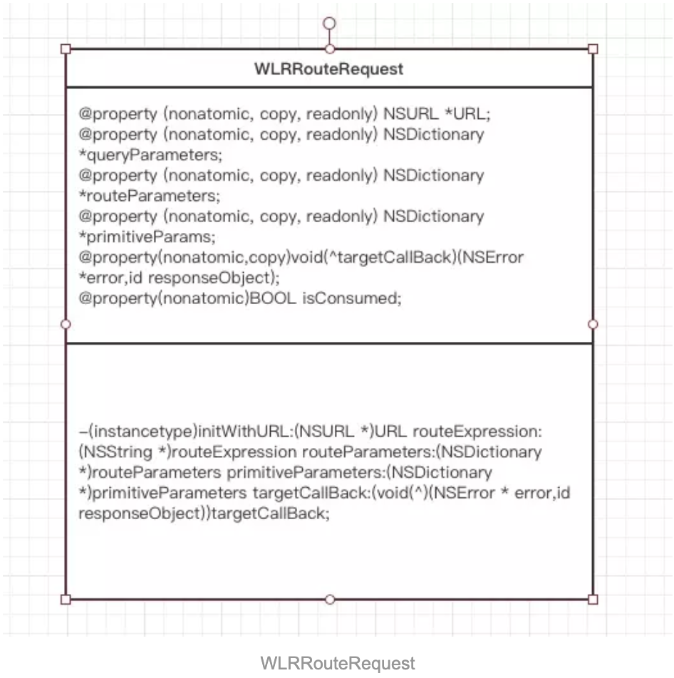
这里说一下路径参数，很多有后端开发经验的人都知道，一个url上传递参数，或者是匹配后端服务的service，Url的路径对于表达转发语义十分重要，比方说 :
http://aaaa.com/login
http://aaaa.com/userCenter

那Url中的login和userCenter可以代表是哪个后端服务，那路由就需要设置正则匹配表达式去匹配http://aaaa.com/ 这部分，截取login、userCenter部分，说回我们的路由，App的路由需要通过设置Url的正则表达式来获取路径参数，同时我们必须知道这些参数的值和名称，那么我可以这样定义Url匹配的表达式
`scheme://host/path/:name([a-zA-Z_-]+)`
熟悉正则表达式的孩子都知道分组模式，path后name是key，([a-zA-Z_-]+)是规定name对应的value应该是什么格式的。那么routeParameters就是存放路径参数的

```
//url
@property (nonatomic, copy, readonly) NSURL *URL;
//url上？以后的键值对参数
@property (nonatomic, copy, readonly) NSDictionary *queryParameters;
//url上匹配的路径参数
@property (nonatomic, copy, readonly) NSDictionary *routeParameters;
//原生参数，比方说要传给目标UIImage对象，NSArray对象等等
@property (nonatomic, copy, readonly) NSDictionary *primitiveParams;
//目标预留的callBack block,当完成处理以后,回到此Block，完成调用者的回调
@property(nonatomic,copy)void(^targetCallBack)(NSError *error,id responseObject);
//是否消费掉，一个request只能处理一次，该字段反应request是否被处理过
@property(nonatomic)BOOL isConsumed;
```

### WLRRouteHandler设计

handler对象要**接收一个WLRRouteRequest对象来启动处理流程**，前面经过我们的分析，这个handler应该担负起通过**url和参数获取目标对象的职责**，在一般的route处理中，目标往往是一个视图控制器，先实现这样一个通过url调用某一个视图控制器的并跳转处理的handler，那么应该是如下的：

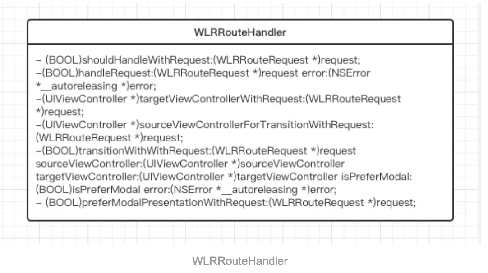
handler**处理一个request请求**是一个具有过程性的逻辑，WLRRouteHandler要作为一个基类，我们知道，这个handler在需要处理**获取目标视图控制器**->**参数传递给目标视图控制器**->**视图控制器的转场**->**完成回调**，那么我们需要设计这样的接口

```
//即将开始处理request请求，返回值决定是否要继续相应request
- (BOOL)shouldHandleWithRequest:(WLRRouteRequest *)request;
//开始处理request请求
-(BOOL)handleRequest:(WLRRouteRequest *)request error:(NSError *__autoreleasing *)error;
// 根据request获取目标控制器
-(UIViewController *)targetViewControllerWithRequest:(WLRRouteRequest *)request;
//转场一定是从一个视图控制器跳转到另外一个视图控制器，该方法用以获取转场中的源视图控制器
-(UIViewController *)sourceViewControllerForTransitionWithRequest:(WLRRouteRequest *)request;
//改方法内根据request、获取的目标和源视图控制器，完成转场逻辑
-(BOOL)transitionWithWithRequest:(WLRRouteRequest *)request sourceViewController:(UIViewController *)sourceViewController targetViewController:(UIViewController *)targetViewController isPreferModal:(BOOL)isPreferModal error:(NSError *__autoreleasing *)error;
//根据request来返回是否是模态跳转
- (BOOL)preferModalPresentationWithRequest:(WLRRouteRequest *)request;
```

### WLRRouteMatcher设计
一个matcher应该具有根据url和参数判断是否匹配某个url表达式的逻辑

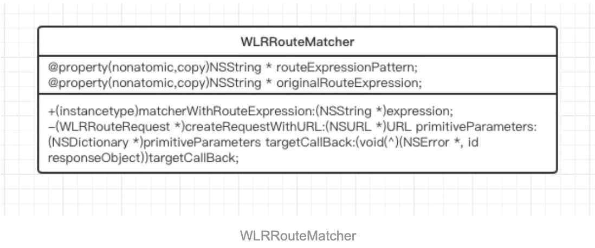
matcher对象必须拥有url的匹配表达式，类似于 `scheme://host/path/:name([a-zA-Z_-]+)` ，也有拥有该表达式真正的正则表达式，`^scheme://host/path/([a-zA-Z_-]+)$`

```
@interface WLRRouteMatcher : NSObject
//url匹配表达式
@property(nonatomic,copy)NSString * routeExpressionPattern;
//url匹配的正则表达式
@property(nonatomic,copy)NSString * originalRouteExpression;
+(instancetype)matcherWithRouteExpression:(NSString *)expression;
-(WLRRouteRequest *)createRequestWithURL:(NSURL *)URL primitiveParameters:(NSDictionary *)primitiveParameters targetCallBack:(void(^)(NSError *, id responseObject))targetCallBack;
```
设计`-(WLRRouteRequest *)createRequestWithURL:(NSURL *)URL primitiveParameters:(NSDictionary *)primitiveParameters targetCallBack:(void(^)(NSError *, id responseObject))targetCallBack`;这个方法，可以**通过传入url和参数**，检查是否返回request请求，来表示该**WLRRouteMatcher对象所拥有的匹配表达式与url是否能够匹配**，这句话有点绕，看不懂的多看几遍。

### WLRRouter
WLRRouter是路由实体对象，后端开发者对于路由挂载的概念非常了解，其实这样**一个路由实体对象可以完成对URL的拦截和处理并返回结果**，事实上，根据前面的梳理和总结，WLRRouter对象内部应该**保存了需要匹配拦截的URL表达式**，而前面我们知道Url的匹配表达式是存储在WLRRouteMatcher对象中的，并且一个Url传入检查是否匹配也是Matcher对象提供的功能，对于匹配上的Url需要有对应的Handler处理，所以**Router对象的内部存在Machter对象和Handler对象一一对应的关系**，并且**拥有注册Url表达式对应到Handler**的功能，也具有**传入Url和参数就能匹配到Handler的功能**，还要有一个**检测Url是否能有对应Handler处理的功能**，所以应该是：

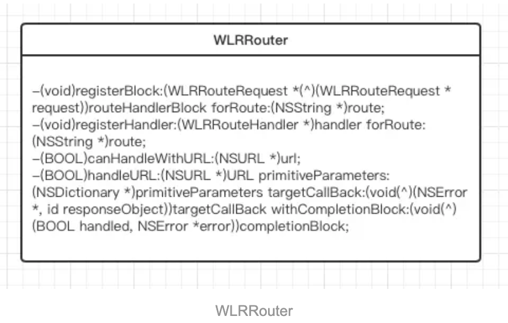
这里有两种注册的方法，**注册handler**的就不需再多描述，另外一个是**注册Block的回调形式，因为有时候可能会需要一些简单的Url拦截，去做一些事情，这里面的Block需要返回一个request对象**，这是因为，如果Block没有对request的回调做处理，Router应该处理调用者的回调问题，否则就会出现调用者设置了回调的Block而没有人调用回来，这样就尴尬了。

```
/**
 注册一个route表达式并与一个block处理相关联
 
 @param routeHandlerBlock block用以处理匹配route表达式的url的请求
 @param route url的路由表达式，支持正则表达式的分组，例如app://login/:phone({0,9+})是一个表达式，:phone代表该路径值对应的key,可以在WLRRouteRequest对象中的routeParameters中获取
 */
-(void)registerBlock:(WLRRouteRequest *(^)(WLRRouteRequest * request))routeHandlerBlock forRoute:(NSString *)route;
/**
 注册一个route表达式并与一个block处理相关联
 
 @param routeHandlerBlock handler对象用以处理匹配route表达式的url的请求
 @param route url的路由表达式，支持正则表达式的分组，例如app://login/:phone({0,9+})是一个表达式，:phone代表该路径值对应的key,可以在WLRRouteRequest对象中的routeParameters中获取
 */
-(void)registerHandler:(WLRRouteHandler *)handler forRoute:(NSString *)route;

/**
 检测url是否能够被处理，不包含中间件的检查

 @param url 请求的url
 @return 是否可以handle
 */
-(BOOL)canHandleWithURL:(NSURL *)url;
/**
 处理url请求

 @param URL 调用的url
 @param primitiveParameters 携带的原生对象
 @param targetCallBack 传给目标对象的回调block
 @param completionBlock 完成路由中转的block
 @return 是否能够handle
 */
-(BOOL)handleURL:(NSURL *)URL primitiveParameters:(NSDictionary *)primitiveParameters targetCallBack:(void(^)(NSError *, id responseObject))targetCallBack withCompletionBlock:(void(^)(BOOL handled, NSError *error))completionBlock;
```

### 梳理总结：
从以上我们规划的几个类的接口，我们可以清楚的看到Router工作的流程。

1. 首先实例化Router对象
2. **实例化Handler或者是Block**，通过Router的注册接口使得一个Url的匹配表达式对应一个Handler或者是一个block
3. Router内部会将Url的表达式形成一个Matcher对象进行保存，对应的Handler或处理的Block会与Matcher一一对应，怎么对应呢？应该使用**路由表达式进行关联**
4. Router**通过handle方法，接收一个Url的请求，内部遍历所有的Matcher对象，将Url和参数转换为Request对象**，如果能转换为Request对象则说明能匹配，如果不能则说明该Url不能被路由实体处理
5. 拿到Request对象以后，则根据Matcher对应的路由表达式找到对应的Handler或者是Block
6. 根据Handler的几个关键方法，传入Request对象，按**照顺序完成处理逻辑的触发**，最后如果有request当中包含有目标的回调，则将处理结果通过回调的Block响应给调用方
7. Handler完成处理后，Router完成本次路由请求

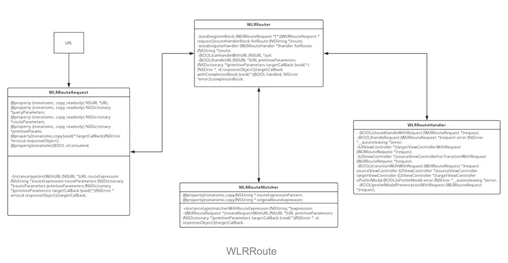

>Tips:
很多开发者把敏捷开发当做来了需求不管三七二十一，一把梭子就是干，不断写不断改。🙊其实敏捷开发是一种模式，并不简单是快速迭代的意思。初入行的程序员其实都是coder(编码员)，基本上在靠模仿代码和代码套路去工作，真正的Programmer(程序设计师)是在设计代码，科班出身的程序员往往在进阶过程中突然发现大学里面的软件工程有多么重要，其实**设计能力的培养需要有一个正规的流程**，就像本教程的大纲一样，**发现问题->需求分析->总体设计->具体实现->测试->发布维护**，有了清晰的流程，把你的精力和时间按照不同的阶段进行分配和投入，你就会豁然开朗，比方说在总体设计过程中，就需要你以宏观的功能流程去考虑大体的模块有几个，模块的关系是怎样，每个模块的核心职责是什么，建议根据需求去画一个逻辑流程图，将每个逻辑分支都补全，再根据流程图规划总体框架，总体框架通过类图来表达，每个类的属性和行为都确定以后，再进入具体设计阶段就非常轻松和容易了，同时类图画完，技术方案的可行性和实现所需时间也就非常容易精确评估了

### 给架子填充骨血(具体实现)：
有了上面大体上的架子我们就能相信只要按照这个架子，就能完成你在需求分析阶段规划的功能目标，现在我们要做的就是在我们设计的这个牛逼的框架里填充血肉，去实现它，这部分是一个非常有意思的过程，在上一步你已经获得了相当大的信心，在这一步你只需要按照规定尽力去实现，在有信心的情况下，你会思维活跃，因为你明确了要实现何种功能的目标，大脑会自动根据目标和现在差距不断想考出各种办法去弥补这样的差距，你所做的就是不断尝试你大脑迸发出的这些代码，选择最有效、可读性最好、性能最好和代码最健壮的代码。

#### WLRRouteRequest:

了解了以上，我们从WLRRouteRequest入手。
其实WLRRouteRequest跟NSURLRequest差不多，不过WLRRouteRequest继承NSObject，实现NSCopying协议，我们再来看一下头文件的声明：

```
#import <Foundation/Foundation.h>

@interface WLRRouteRequest : NSObject<NSCopying>
//外部调用的URL
@property (nonatomic, copy, readonly) NSURL *URL;
//URL表达式，比方说调用登录界面的表达式可以为：AppScheme://user/login/138********，那URL的匹配表达式可以是：/login/:phone([0-9]+),路径必须以/login开头，后面接0-9的电话号码数字，当然你也可以直接把电话号码的正则匹配写全
@property(nonatomic,copy)NSString * routeExpression;
//如果URL是AppScheme://user/login/138********?callBack="",那么这个callBack就出现在这
@property (nonatomic, copy, readonly) NSDictionary *queryParameters;
//这里面会出现{@"phone":@"138********"}
@property (nonatomic, copy, readonly) NSDictionary *routeParameters;
//这里面存放的是内部调用传递的原生参数
@property (nonatomic, copy, readonly) NSDictionary *primitiveParams;
//自动检测窃取回调的callBack 的Url
@property (nonatomic, strong) NSURL *callbackURL;
//目标的viewcontrolller或者是组件可以通过这个
@property(nonatomic,copy)void(^targetCallBack)(NSError *error,id responseObject);
//用以表明该request是否被消费
@property(nonatomic)BOOL isConsumed;
//简便方法，用以下标法取参数
- (id)objectForKeyedSubscript:(NSString *)key;
//初始化方法
-(instancetype)initWithURL:(NSURL *)URL routeExpression:(NSString *)routeExpression routeParameters:(NSDictionary *)routeParameters primitiveParameters:(NSDictionary *)primitiveParameters targetCallBack:(void(^)(NSError * error,id responseObject))targetCallBack;
-(instancetype)initWithURL:(NSURL *)URL;
//默认完成目标的回调
-(void)defaultFinishTargetCallBack;
@end
```
初始化方法就是将三个存放入参的字典初始化，并直接将Url上的？以后的参数取出来：

```
-(instancetype)initWithURL:(NSURL *)URL{
    if (!URL) {
        return nil;
    }
    self = [super init];
    if (self) {
        _URL = URL;
        _queryParameters = [[_URL query] WLRParametersFromQueryString];
    }
    return self;
}
-(instancetype)initWithURL:(NSURL *)URL routeExpression:(NSString *)routeExpression routeParameters:(NSDictionary *)routeParameters primitiveParameters:(NSDictionary *)primitiveParameters targetCallBack:(void (^)(NSError *, id))targetCallBack{
    if (!URL) {
        return nil;
    }
    self = [super init];
    if (self) {
        _URL = URL;
        _queryParameters = [[_URL query] WLRParametersFromQueryString];
        _routeExpression = routeExpression;
        _routeParameters = routeParameters;
        _primitiveParams = primitiveParameters;
        self.targetCallBack = targetCallBack;
    }
    return self;
}
```
在调用方设置传入callBack的时候，因为request是消费型的，所以将TargetCallBack重新包装，在回调的时候需要将isConsumed属性设置为YES，表示该request已经被处理消耗，这里实现的比较简单，其实request是应该具有状态的，比方说未处理，处理中，已处理，实现一个优雅的状态机会更好的表达逻辑：

```
-(void)setTargetCallBack:(void (^)(NSError *, id))targetCallBack{
    __weak WLRRouteRequest * weakRequest = self;
    if (targetCallBack == nil) {
        return;
    }
    self.isConsumed = NO;
    _targetCallBack = ^(NSError *error, id responseObject){
        weakRequest.isConsumed = YES;
        targetCallBack(error,responseObject);
    };
    
}
```

默认的回调方法是为了处理响应者没有触发回调，则需要有默认的回调给调用者：

```
-(void)defaultFinishTargetCallBack{
    if (self.targetCallBack && self.isConsumed == NO) {
        self.targetCallBack(nil,@"正常执行回调");
    }
}
```

#### WLRRouteHandler

https://www.jianshu.com/p/3a902f274a3d

#### WLRRouteMatcher

https://www.jianshu.com/p/3a902f274a3d


#### WLRRouter

https://www.jianshu.com/p/3a902f274a3d

以上我们可以看到，Router将匹配的逻辑单独封装到WLRRouteMatcher对象中，将匹配后的结果生成WLRRouteRequest实例以携带足够完整的数据，同时将真正处理视图控制器的转场或者是组件的加载或者是未来可能拓展的handler业务封装到WLRRouteHandler实例中，匹配逻辑对应的处理逻辑干净分离，Matcher对象将匹配逻辑单独封装，如果有一天需要增加多种URL的匹配逻辑，则可以更换Matcher或者添加Matcher就可以，处理逻辑可以通过继承扩展或者冲洗WLRRouteHandler的生命周期函数来更好的处理回调业务。如果WLRRouteHandler不能提供足够多的扩展性，则可以使用block回调最大限度的进行扩展。

以上，就是路由部分的整体实现。

> Tips:
在具体的实现的过程中，不要被总体设计给套死，前面设计了几个类，设计了几个层次以后，就画地为牢，在**实现具体细节的时候仍可以继续进行局部设计，分割逻辑，控制代码复杂度**，一方面你要注重在局部进行进一步设计和分割的时候带来的究竟是什么，可读性？可维护性？还是帮助你能够进行思考？有时候，注释可能更加能给你的逻辑带来清晰的表述，毕竟几千行的代码很正常，如果没有经验，可能逻辑重点记得不太清楚，那就需要动动笔头好好记录一下，再进一步实现，将**复杂逻辑进行适当分割**，是一种常见的策略

## 最终的路由整体类图和如何设计代码的总结

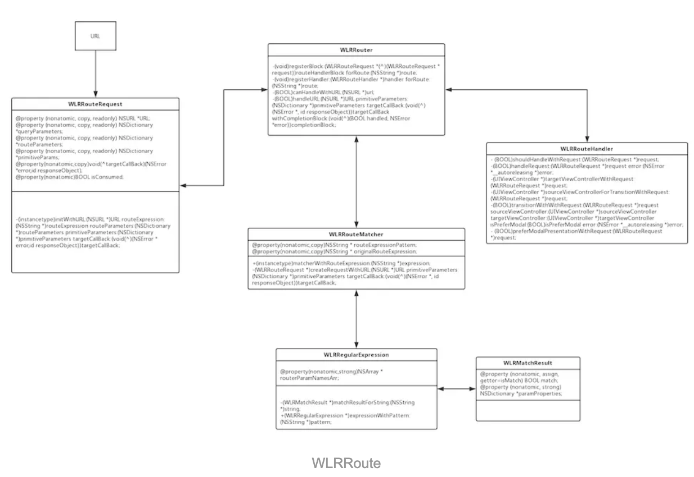
整体的设计就是如此，我们走了一趟**从发现问题到最后通过封装一个路由组件解决问题的过程**，在这里，对于新手程序员我想讨论一些有意义的东西，也就是**手把手写出一个路由的过程中，思路从何而来**？代码设计怎么从无到有？对于一个逻辑问题怎么转换为代码实践？授之以鱼不如授之以渔，在这个过程中我们总结一下哪些是比较重要的：

1. 对于**经常重复的工作和低效的工作流程有没有敏锐的察觉**，是否有想解决的愿望，毕竟能解决了你能节省更多时间，何乐而不为？可有些人宁愿加班做一些简单的重复工作也不希望直面挑战创造一些解决问题的新方式
2. 在__思考问题的解决方案__的时候，大脑有没有将问题**抽象一下去寻找有没有相应解决问题的模式**、方法论或者是方案？(比如说发现路由方案，发现中介者模式，发现分割思想和职责单一，发现软件工程的流程)
3. 天赋并不是最重要的，甚至天赋是一种结论而不是条件，**大脑不擅长同时处理很多事情**，在你**设计或者编码的过程中，通过标准化流程能最大程度的提高大脑思考的效率**，比方说，**总结问题就是总结问题而不要变总结变思考解决方案**，否则会片面或者影响问题的客观描述，**总结问题->需求分析->总体设计->具体实现**，这就是一个简单的大脑思考流程，如果想不清楚，通过思维导图、流程图、UML建模等等，去把大脑需要同时照顾到的东西呈现在眼前，你只要去对比对照，一步步来就可以了，并不是有人特别有天赋，而是有人比你有方法
4. 发散很重要，每当你**从出现问题到解决问题以后，你可以安心的天马行空的头脑风暴**，在这个过程中你可能对解决问题的方式进行重新审视和回顾，发现不足，甚至可以对其扩展使其能解决更多问题，就比如你会考虑路由的效率、安全，从而诞生中间件、异步事件的想法，这点很重要，但却很简单
5. **自我引导能力，看了文章一步步做了出来，其实就跟做菜一样**，你学会了一道菜该怎么做，但为什么别人能做，或者说别人从无到有的过程经历了什么，你为什么没想到，这种想法会激励你自我引导，从而提升自己，进一步改变自己，**如果你从来没有对他人为什么能做到感到好奇，那就说明你的自我意识和自我引导力不够强，需要停下每天写代码的手，认真思考一下人生了**


##  路由的安全

有两个方面可以去做

1. WLRRouteHandler实例中， `-(BOOL)shouldHandleWithRequest:(WLRRouteRequest *)request`中可以检测request中的参数，比方说效验source或者是效验业务参数完整等
2. WLRRouter实例中handleURL方法，将按照中间件注册的顺序回调中间件，而我们可以在中间件中实现风控业务、认证机制、加密验签等等，中间件的实现大家可查看源码

## 路由的效率

目前我们实现的路由是一个同步阻塞型的，在处理并发的时候可能会出现一些问题，或者是在注册比较多的route表达式以后，遍历和匹配的过程会损耗性能，比较好的实现方式是，将Route修改成异步非阻塞型的，但是API全部要换成异步API，起步我们先把同步型的搞定，随后我们将会**参照promise范式**来进行异步改造，提升路由效率。

## 路由的使用

在大部分App实践MVVM架构或者更为复杂的VIPER架构的时候，除了**迫切需要一个比较解耦的消息传递机制**，如何更好的**剥离目标实体的获取和配合UIKit这一层的转场逻辑**是一项比较复杂的挑战，路由实际上是充当MVVM的ViewModel中比较解耦的目标获取逻辑和VIPER中Router层，P与V的调用全部靠Router转发。
 在实施以组件化为目的的工程化改造中，如何抽离单独业务为组件，比较好的管理业务与业务之间的依赖，就必须使用一个入侵比较小的Route，WLRRoute入侵的地方在于WLRRouteHandler的transitionWithRequest逻辑中，通过一个UIViewController的扩展，给 targetViewController.wlr_request = request;设置了WLRRouteRequest对象给目标业务，但虽然如此，你依旧可以重写WLRRouteHandler的transitionWithRequest方法，来构建你自己参数传递方式，这一点完全取决于你如何更好的使得业务无感知而使用路由。


