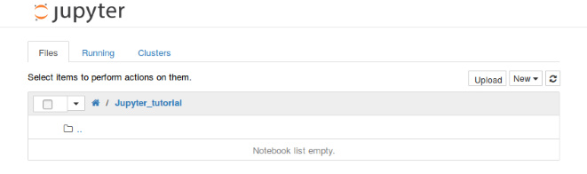

# jupyter-交互笔记本
<!--more-->
## 简介
**Jupyter Notebook**（此前被称为 `IPython notebook`）是一个交互式笔记本，支持运行 40 多种编程语言。在本文中，我们将介绍 Jupyter notebook 的主要特性，以及为什么对于希望编写漂亮的交互式文档的人来说是一个强大工具。

<!--more-->

## 安转与运行
1. 在开始使用 notebook 之前，我们先需要安装该库。
    - 方式1: [Jupyter 官网](https://jupyter.readthedocs.org/en/latest/install.html)
    - 方式二: 使用`pip install jupyter`

2. 然后在命令行运行： `jupyter notebook`，运行上面的命令之后，你将看到类似下面这样的输出：

```
[I 20:06:36.367 NotebookApp] Writing notebook server cookie secret to /run/user/1000/jupyter/notebook_cookie_secret
[I 20:06:36.813 NotebookApp] Serving notebooks from local directory: /home/your_username
[I 20:06:36.813 NotebookApp] 0 active kernels
[I 20:06:36.813 NotebookApp] The IPython Notebook is running at: http://localhost:8888/
[I 20:06:36.813 NotebookApp] Use Control-C to stop this server and shut down all kernels (twice to skip confirmation).
```

同时，会在你开启 notebook 的文件夹中启动 Jupyter 主界面，如下所示



接着在该界面可以进行编程，markdown等等

## LaTex

Use double US dollars sign pair for Block level Math formula, and one US dollar sign pair for Inline Level.

```
For example this is a Block level $$x = {-b \pm \sqrt{b^2-4ac} \over 2a}$$ formula, and this is an inline Level $x = {-b \pm \sqrt{b^2-4ac} \over 2a}$ formula.

\\[ \frac{1}{\Bigl(\sqrt{\phi \sqrt{5}}-\phi\Bigr) e^{\frac25 \pi}} =
1+\frac{e^{-2\pi}} {1+\frac{e^{-4\pi}} {1+\frac{e^{-6\pi}}
{1+\frac{e^{-8\pi}} {1+\ldots} } } } \\]

```

**Result:**

For example this is a Block level $$x = {-b \pm \sqrt{b^2-4ac} \over 2a}$$ formula, and this is an inline Level $x = {-b \pm \sqrt{b^2-4ac} \over 2a}$ formula.

\\[ \frac{1}{\Bigl(\sqrt{\phi \sqrt{5}}-\phi\Bigr) e^{\frac25 \pi}} =
1+\frac{e^{-2\pi}} {1+\frac{e^{-4\pi}} {1+\frac{e^{-6\pi}}
{1+\frac{e^{-8\pi}} {1+\ldots} } } } \\]


