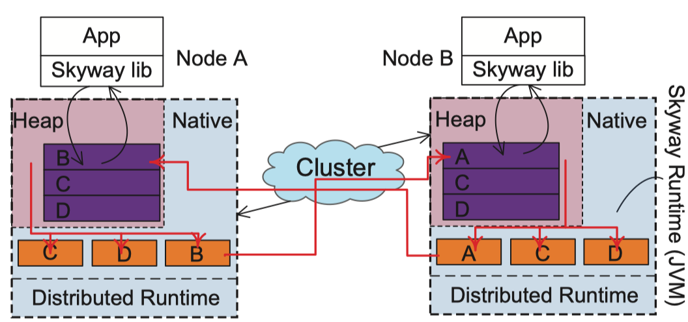
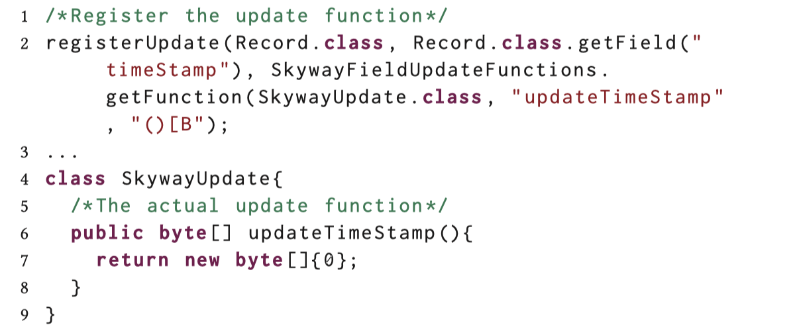
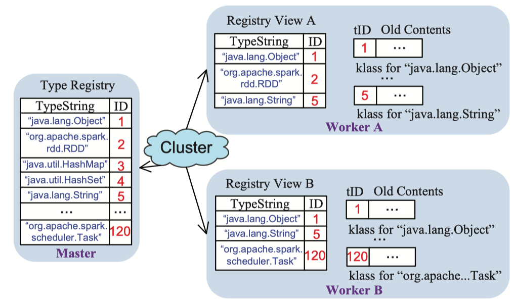
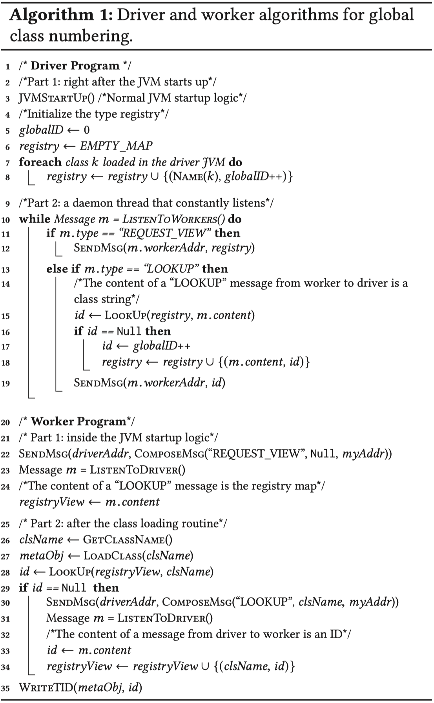
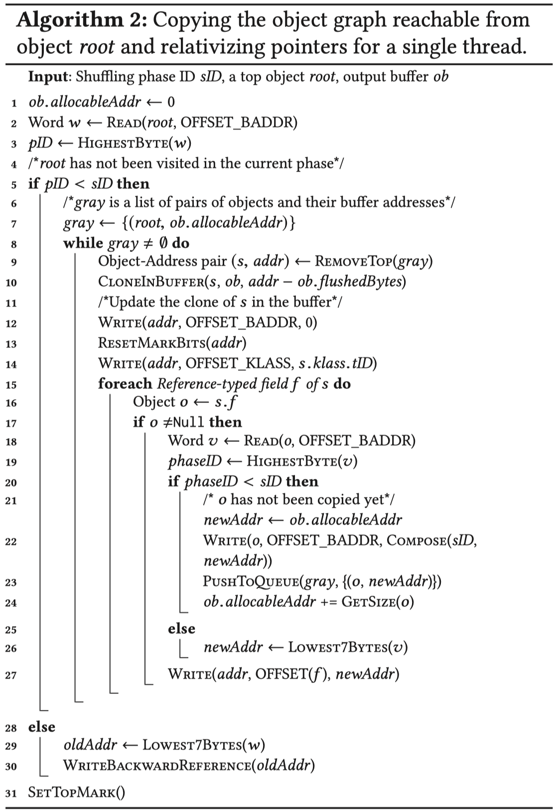
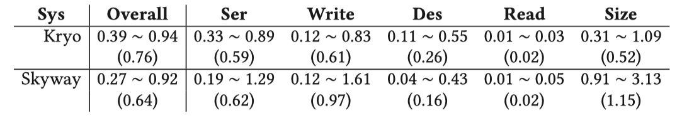

# 前言
课程所需，才是驱动啊。

# 标题
Skyway: Connecting Managed Heaps in Distributed Big Data Systems
Skyway：连接分布式大数据系统中的托管堆
<!--more-->
# Abstract
诸如Java和Scala之类的托管语言普遍用于大规模分布式系统的开发。在托管运行时，**在跨机器执行数据传输时，这是在大数据系统中经常执行的任务，系统需要在通过网络发送对象之前将对象序列化为字节序列**。接收字节的远程节点然后将它们反序列化为对象。这个过程既有消耗性能又浪费资源：（1）对象序列化/反序列化大量使用反射，昂贵的运行时操作和/或（2）序列化/反序列化功能需要手写和容易出错。**本文介绍了Skyway，这是一种基于JVM的技术，可以直接连接不同（本地或远程）JVM进程的托管堆。**在Skyway下，源堆中的对象可以直接写入远程堆，而无需更改其格式。 Skyway完全消除了调用序列化/反序列化功能的需要（1），从而节省了CPU时间，并且（2）减少要求开发人员手写串行化功能，从而为任何基于JVM的系统提供性能优势。

CCS Concepts • Information systems → Data manage- ment systems; • Software and its engineering → Mem- ory management;

**Keywords** Big data, distributed systems, data transfer, serialization and deserialization

# 1 Introduction
现代大数据系统需要经常在群集中混洗数据 - 像Hadoop这样的map / reduce框架会在执行减少之前对每个map worker的结果进行洗牌;像Spark这样的数据流系统支持许多需要在节点之间存储数据的RDD转换。由于大多数这些系统都是用托管语言（如Java和Scala）编写的，因此数据表示为托管堆中的对象。跨节点传输对象很复杂，涉及图1所示的三个过程。（1）序列化过程将整个对象图从o转换为二进制序列。此过程重新格式化每个对象 - 除其他外，它提取对象数据，剥离对象标题，删除存储在对象中的所有引用，以及更改某些元数据的表示。 （2）该字节序列被传送到接收机。 （3）反序列化过程读出字节序列，相应地创建对象，最终在接收器机器的托管堆中重建对象图。

**问题** 
虽然已经开发了许多序列化/反序列化（S / D）库[3,22,32]，但在它们的实现中存在很大的不足。 我们自己的经验（§2）和之前工作的证据[27]表明，S / D占Spark中执行时间的30％。 为了解释为什么S / D如此昂贵，我们讨论了处理三个关键信息，这些信息必须从o可以获得的每个对象中提取，传输和重构：（1）对象数据（即原始类型） “elds”，（2）对象引用（即引用类型“elds”），以及（3）对象类型。

(1)对象数据访问：S / D库需要调用反射函数，例如Reflection.getField和Reflection.setField，在发送方以枚举和访问每个字段来抽取，在接收方然后回写，每个原始对象都是单独的。在大数据系统中，每个数据传输涉及数百万个对象，这些对象会调用这些函数数百万次或更多次。Reflection是一种非常昂贵的运行时操作。它允许程序动态检查或调用类，方法，字段或属性；在没有类型信息静态可用的在以耗时的字符串查找为代价，在性能关键任务中是不可取的。

（2）类型表示：每个类型由托管运行时中的特殊（元）对象表示，并由该类型的对象的标头引用。 但是，类型引用不能用于表示字节序列中的类型，因为表示相同类型的元对象可能在不同的运行时中具有不同的地址。 Java序列化程序通过包含类名及其所有父类的字符串表示每种类型。 该设计使元数据（即，类型字符串）消耗通过网络传输的大部分字节序列。 此外，必须使用反射来在接收器节点上的对象重新创建期间解析每个字符串的类型。
（3）参考调整：需要调整传输对象的引用类型字段中包含的引用，因为这些对象将被放置在接收器节点上的不同地址中。Java序列化程序使用rection来获取引用对象的内容并将其内联到引用对象的二进制表示中。它使用反射构造从接收器机器上的o可到达的所有对象，然后通过反射设置参考字段与刚创建的引用对象的地址。

**最近的进展**
许多第三方库已经开发出来。特别是，Kryo [22]是Spark推荐的库。 Kryo要求开发人员（1）为**数据传输中涉及的类型手动定义S / D函数，这样可以加速对象数据访问**，以及（2）在所有节点上以一致的**顺序手动注册这些类型**，这使得可以使用整数来表示类型。其他图书馆[3,11,32]遵循类似的原则。
然而，基本的“数据传输的缺点仍然存在于Kryo中 - 需要为发送方和接收方的每个传输对象调用用户定义的函数。由于这些调用的数量非常大发送和接收，序列化和反序列化期间的S / D功能仍然占用数据处理任务运行时的很大一部分。
此外，使用Kryo的开发人员承受着巨大的负担。开发人员**很难理解涉及多少和哪些类型**，更不用说一致地注册这些类型并为每种类型开发正确和有效的S / D功能。例如，考虑一个HashMap对象。它的序列化涉及其键值阵列，所有键/值对以及每个键/值对象。它的反序列化需要重新创建键和值对象，将它们配对，并另外重新设置键值/值对以正确地重新创建键值数组，因为键的哈希值可能已更改。

**Our Solution – Skyway**
现有S / D库的关键问题在于，对于现有的JVM，除了第一次反汇编并将它们推送到（不同的）二进制格式之外，没有其他路由来**传输对象，然后重新组装和拉动 他们备份到远程堆中**。 在本文中，我们主张在托管堆之间建立一个“kyway”（如图1所示），这样数据对象就不再需要被推送到较低的级别进行传输。

Skyway增强了JVM，使**对象图可以从堆移动到堆，并在移动后立即在远程节点上使用**。 具体而言，给定应用程序指定的根对象（例如，Spark中的RDD对象），Skyway增强型JVM从o开始执行类似GC的堆遍历，将**每个可到达对象复制到输出缓冲区，并执行轻量级调整存储在对象中的与机器相关的元数据，而无需更改对象格式。 然后可以将此输出缓冲区作为整体直接复制到远程堆中，并在传输后几乎立即使用**。 这为现有和未来的大数据系统提供了以下好处：（1）Skyway完全消除了访问字段和类型的成本，节省了计算成本; （2）开发人员不需要手写任何S / D功能。

为了实现这些目标，Skyway比所有现有的S / D库更加有效地解决了上述三个问题，如下所述。

首先，Skyway通过更改JVM，将**每个对象作为一个整体进行传输，这完全消除了访问单个数据字段的需要**。 此外，由于对象的哈希码被高速缓存在对象的头部中，因此传输每个对象的整体保留了对象的原始哈希码，从而可以在接收器节点上使用基于哈希的数据结构而无需重新划分对象。 在传统的S / D中花费大量时间的过程。

其次，Skyway通过采用**自动全局类型编号过程来表示类型 - 主节点维护所有类型及其ID的注册表**，并且每个工作节点与主服务器通信以在类加载时获得其类的ID。 此过程使群集中的所有类都可以进行全局编号，而无需任何开发人员干预，因此每个ID可用于在不同节点上唯一标识相同的类。

第三，Skyway采用了一种**有效的“复制”技术来调整参考**。 当对象被复制到输出缓冲区中时，存储在它们中的指针在线性时间中被相对化 - 它们从绝对地址变为相对地址。 在接收到缓冲器时，接收器节点上的Skyway客户端执行输入缓冲器的另一线性扫描，以对该缓冲器中的相对信息进行绝对化。

Skyway可能会在网络上推送比S / D库更多的字节，因为它传输整个每个对象，但S / D库不传输对象头。 然而，大量证据[44]表明实际系统中的瓶颈正在从I / O转向计算，因此，我们认为这种设计能够实现正确的设计交易 - 计算成本的节省显着超过额外的网络 在现代网络上传输的额外字节所产生的I / O成本。 我们的实证结果表明，即使在1000Mb / s以太网上（例如，大多数数据中心使用带宽较高的网络），在Spark中为真实图形数据集传输50％以上的数据（总共约100GB）只会增加执行力 4％（在网络和读取I / O上），而通过消除S / D调用实现的节省超过20％。

**它为什么有效？** 
值得注意的是，Skyway**不是通用的序列化器**。 我们深入了解Skyway为大数据处理工作的原因是双重的。 首先，**数据处理应用程序经常洗涤数百万个对象，并且在强烈划分的阶段这样做。 因此，批量发送对象而不改变其格式可提供显着的执行效率**。 其次，使用现**代网络技术可以快速传输额外的字节**，而不会产生太多开销。

我们在OpenJDK 8中实现了Skyway。我们对Java序列化器基准测试集JSBS [34]，Spark [45]和Flink [2]的评估表明，（1）Skyway优于JSBS上所有90个现有的S / D库 ，它使用基于媒体内容的数据集 - 例如，它比Kryo快2.2倍，比Java序列化器快67.3倍; （2）与Kryo和Java序列化器相比，Skyway在四个真实数据集中对四个代表性分析任务的整体Spark性能提高了16％和36％; （3）对于Flink的另一个真实系统，与Flink高度优化的内置串行器相比，Skyway的整体性能提高了19％。

# 2 Background and Motivation
## 2.1 Background
**When Does S/D Happen?**

Spark在整个执行过程中进行S / D.有两类S / D任务：闭包序列化和数据序列化。关闭S / D发生在驾驶员和工人之间。由于驱动程序启动了Spark程序，因此驱动程序需要在远程工作程序上执行部分程序。
图2显示了一个Spark程序，它从文本文件（第27行）读取一系列字符串，每个字符串代表一个日期。它接下来通过在RDD上调用map函数来解析这些字符串（第28行）。 map转换采用lambda表达式（即闭包）作为输入，它通过调用将字符串转换为Date对象的parse函数来解析每个字符串。最后，调用RDD操作collect以将所有Date对象引入驱动程序。
当这个程序由驱动程序执行时，Spark会在工作节点上调度闭包的执行（即传递给map的lambda表达式）。因此需要Closure序列化来将闭包及其所需的一切从驱动程序传输到每个工作节点。在此示例中，闭包引用在其作用域之外创建的对象解析器。因此，解析器也需要在闭包序列化期间进行序列化。这解释了为什么DateParser类需要实现Java Serializable接口。

## 2.2 Motivation
为了理解现实世界中的S / D成本，我们在Spark上进行了一系列实验。 我们在3个工作节点的小集群上执行Spark，每个节点都有2个Xeon（R）CPU E5-2640 v3处理器，32GB内存，1个SSD，运行CentOS 6.8。 这三个节点是通过In“niBand连接的大型集群的一部分。我们在LiveJournal图[4]上运行TriangleCounting算法，计算图形边缘引起的三角形数量。它被广泛用于社交网络分析，用于分析图形 连接属性[38]。我们使用Oracle JDK 8（build 25.71）并让每个slave运行一个执行器 - 每个slave上的单线程执行使我们可以很容易地测量性能的细分。 输入图大约为1.2GB，我们给每个JVM一个20GB的堆 - 一个足够大的堆来执行内存计算 - 就像Spark中的推荐做法一样。钨排序用于重排数据。

图4. Skyway的系统架构。 紫色和橙色矩形分别代表输入（堆内）缓冲区和输出（native）缓冲区; 对象传输沿着红色箭头。

#3 Design Overview
本节概述了Skyway，解释了Skyway如何针对三个目标 - 正确性，高效率和易于集成。

图4显示了Skyway的系统架构，包括三个主要部分。 首先，为了实现正确的数据传输，Skyway修改JVM**以在每个克隆对象中进行对象遍历，对象克隆和调整**。 其次，为了实现高效的数据传输，Skyway谨慎地**维护输入和输出缓冲区，并跨机器传输内容**。 第三，为了使Skyway易于使用，Skyway库为应用程序开发人员提供了一组易于使用且向后兼容的API。

## 3.1 Correctness
Skyway调整每个传输对象的机器特定部分，以保证执行的正确性。 首先，Skyway**在发送期间使用自动维护的全局类型ID填充对象标题的类型字段，然后在接收节点上使用正确的类型表示替换它**。
其次，Skyway**在发送期间用相对化参考替换存储在对象的所有非原始字段中的引用，并在接收期间将它们转回正确的绝对引用**。 详情见§4.2。 
最后，当对象移动到另一台机器时，**需要重置某些元数据，如GC位和锁定位**。Skyway在发送时重置这些标志，并且在接收时不需要访问它们。

Skyway还为**异构集群提供支持，其中不同机器上的JVM可支持不同的对象格式**。 如果发送方和接收方节点具有不同的JVM规范，则Skyway会在将其复制到输出缓冲区时调整每个对象的格式（例如，标头大小，指针大小或标头格式）。 这仅在发送方节点上产生额外成本，而接收方节点不支付使用传输对象的额外成本。 对于同构群集，任何节点都不会产生这种平台调整成本。 Skyway使用的唯一假设是发送方和接收方使用每个与传输相关的类的相同版本 - 如果同一类的两个版本具有不同的字段，则对象读取将失败。 但是，这种假设并不是Skyway独有的; 它也需要适用于所有其他序列化器。

##3.2 Efficiency
kyway使用**类似GC的遍历来发现可从一组根对象访问的对象图**。 为了提高效率，Skyway使用缓冲-Skyway将遍历期间遇到的每个对象**复制到发送节点上的缓冲区（即输出缓冲区）**，并将缓冲区内容流式传输到接收节点上的相应缓冲区（即输入缓冲区）。 输出和输入缓冲器都经过精心设计，以提高效率。 还支持多线程数据传输（参见§4）。
**Skyway输出缓冲区由接收器隔离 - 具有相同目标的对象被放入相同的输出缓冲区**。 每个目标只存在一个这样的输出缓冲区。 发送对象后，可以安全地清除输出缓冲区。 **Skyway输入缓冲区由发送方隔离，因此来自不同发送方的数据对象可以在不同步的情况下同时写入**。 请注意，接收方节点的堆实际上可能包含每个发送方的多个输入缓冲区，每个输入缓冲区都保存在发送方的不同轮次中发送的对象。 除非开发人员使用API明确释放缓冲区，否则Skyway不会重用旧的输入缓冲区 - 例如Spark缓存内存中的所有RDD，因此Skyway会保留所有输入缓冲区。

输出缓冲区位于堆外本机内存中 - 它们不会干扰GC，如果这些缓冲区位于托管堆中，它可以在发送数据对象之前回收它们。 从托管堆分配输入缓冲区，以便来自远程节点的数据直接写入堆中，并可立即使用。 此外，尽**管每个输入缓冲区在图4中显示为消耗连续的堆空间，但我们允许它跨越多个小内存块**，原因有两个。 首先，由于流式传输，接收器可能不知道发送的字节数，因此，确定输入缓冲器大小是困难的。 其次，分配大的连续空间可能很快导致内存碎片，这可以通过使用较小的内存块来有效地减轻（§4.3）。

流式Skyway为这些缓冲器提供的一个重要特性：对于输出缓冲器，如果我们在所有对象都进入之前不发送数据，那么它既无时间且又耗费空间。 对于输入缓冲器，流式传输将允许计算与数据传输并行执行。 支持流式传输会带来许多挑战，例如，如何在没有多次扫描的情况下调整指针以及如何管理接收器节点上的内存（4.2）。

## 3.3 Ease of Integration
Skyway旨在为应用程序开发人员提供简单的界面。 Skyway不仅应该支持全新系统的开发，还应该支持Spark等现有系统的简单S / D库集成。 为此，Skyway提供了一组与标准Java序列化程序直接兼容的高级Java API。

Skyway提供`SkywayObjectOutputStream`和`SkywayObjectInputStream`类，它们是标准`ObjectOutputStream`和`Object- InputStream`的子类。 这两个类为Skyway（本机）实现`readObject`和`writeObject`方法创建了一个接口。 `SkywayObjectOutput- Stream / SkywayObjectInputStream`对象与输出/输入缓冲区相关联。 我们还创建了`SkywayFileOutputStream / SkywayFileInputStream`和`SkywaySocketOutputStream / SkywaySocketInputStream`类，可以像使用Java序列化程序一样使用Skyway轻松编程。

将程序从使用其原始库切换到使用Skyway需要修改代码。 例如，我们根本不需要更改对象写入/读取调用，例如stream.writeObject（o）。 唯一的修改是（1）**将流式例化为SkywayFileOutputStream对象**而不是任何其他类型的ObjectOutputStream对象，以及（2）**使用API函数shuffleStart识别混洗阶段**。 由于我们所有的输出数据都需要在下一个调整阶段开始之前被清除（第4步），因此Skyway需要开发人员的标记才能知道何时清除这些数据。 识别分支阶段通常很简单 - 在许多系统中，一个分支阶段由一个shuffle函数实现，开发人员可以简单地在函数的开头调用shuffleStart。 另请注意，编写为在大数据系统上运行的用户程序（如图2中的程序）大多不直接使用S / D库，因此可以在没有更改的情况下从Skyway获益。

最后，Skyway提供了一个界面，允许开发人员在传输后轻松更新某些对象字段，例如出于语义原因重新初始化某些字段。 例如，下面的代码片段使用用户定义的函数updateTimeStamp在传输Record对象时返回的值更新类Record中的eld时间戳。 当然，我们希望很少使用此接口 - 在我们的实验中从未发生传输后需要更新对象数据内容。

# 4 Implementation
我们在Oracle的生产JVM Open-JDK 1.8.0（版本25.71）中实现了Skyway。 除了实现我们的对象传输技术之外，我们还修改了类加载器子系统，对象/堆布局和Parallel Scavenge垃圾收集器，它是OpenJDK 8中的默认GC。我们还为开发人员提供了一个Skyway库。

图5.用于全局类编号的类型注册表。

## 4.1 Global Class Numbering
Skyway开发了一种**分布式类型注册系统**，该系统可以**自动允许不同JVM实例上同一类的不同表示共享相同的整数ID**。 该系统完全消除了在数据传输期间使用字符串表示类型的需要（如在标准Java序列化程序中）或人类开发人员参与理解和注册类（如在Kryo中）。

**Skyway类型注册在每个JVM内部运行，并维护一个类型注册表，它将每个类型字符串映射到其唯一的整数ID。** 驱动程序JVM为所有类分配ID; 它维护一个完整的类型注册表，涵盖已经加载到集群中的所有类，并且自计算开始以来已为驱动程序所知。 每个工作者JVM都有一个注册表视图，它是驱动程序上类型注册表的一个子集; 它检查驱动程序以获取它加载的每个类的ID，并且在本地注册表视图中不存在。 图5显示了这些注册表的一个示例。

算法1描述了在驱动程序和工作程序JVM上运行的算法。 **用户通过插入客户端代码中的API调用来选择驱动程序**。 例如，对于Spark，可以自然地将运行Spark驱动程序的JVM指定为Skyway驱动程序，并且所有Spark工作程序节点都运行Skyway工作程序。 应用程序提供了容错功能 - 例如，在崩溃时，Spark会在配备Skyway的JVM上重新启动系统; Skyway的驱动程序JVM将在托管Spark驱动程序的节点上启动。

开始时，驱动程序通过在**JVM完成其启动逻辑**之后扫描其自己的已加载类来**填充注册表**（第4行 - 第8行）。 接下来，驱动程序通**过运行监听端口的守护程序线程来切换到后台**，以处理来自工作程序的查找请求（第10行 - 第19行）。

Skyway使用driver和worker之间的拉动式沟通。 在启动worker JVM时，它首先请求（第22行）并通过“EQU EQUET_VIEW”消息从driver**驱动程序获得（第12行）当前完整类型注册表**。 这为每个工作者JVM提供了在其启动时到目前为止在集群中加载的所有类的视图。 这种设计背后的基本原理是，这个worker JVM所需的大多数类可能已经由驱动程序或其他工作者注册。 因此，**批量获取ID比制作单独的远程获取请求更有效**。

我们修改每个worker JVM上的类加载器，以便**在加载类时，加载器获取该类的ID**。加载器首先在其自己的JVM中查询注册表视图。 如果它无法找到该类，则继续通过“LOOKUP”消息与类名字符串进行通信（第29行 - 第34行）。 如果字符串存在于其自己的注册表中，则驱动程序返回ID，或者创建新ID并将其与类名称一起注册（第18行）。 一旦工作人员收到此ID，它就会更新其注册表视图（第34行）。 最后，worker JVM将此ID写入类的元对象（第35行）。 在JVM术语中，元对象称为“klass”（如图5所示）。 我们在每个klass中添加一个额外的字段以容纳其ID。 ???

在反序列化期间，如果我们在worker JVM上遇到一个unload的类，**Skyway会指示类加载器加载缺少的类，因为类型注册表知道完整的类名。** 虽然其他选项（例如，低冲突散列函数，例如MD和SHA系列）可以实现为每个类分配唯一ID的相同目标，但Skyway不能使用它们，因为它们不能用于恢复类名。

与通过网络在每个对象上发送类型字符串的标准Java序列化程序相比，**Skyway在整个计算过程中为每台机器上的每个类最多发送一次类型字符串。** 当然，在Skyway下传递的字符串数量要小几个数量级。 与Kryo相比，**Skyway自动注册所有类**，并且无需开发人员了解哪些类将涉及数据传输，从而显着减少了人力。

## 4.2 Sending Object Graph
### Overview
当在SkywayObjectOutputStream对象上调用writeObject（root）时，Skyway开始遍历并发送可从root访问的对象图。 算法2描述了**复制从用户指定的根可到达的对象图**的单线程逻辑，我们将在本节后面讨论多线程扩展。

在高层次上，Skyway**模仿基于BFS的GC遍历**。 它维护一个灰色队列，保存已访问但尚未处理的每个对象的记录，以及将该对象放置在输出缓冲区ob中的位置addr。 主循环的每次迭代（第8行）以灰色处理顶部记录并执行三个任务。

首先，基于从灰色检索的对象 - **地址对（s，addr）**，将**对象s克隆到从addr计算的位置处的缓冲区ob中（第10行）**。 如果Skyway检测到接收方JVM与发送方JVM具有不同的规范，则在缓冲区中克隆也会调整克隆的格式，遵循用户提供的配置文件，该文件指定不同JVM中的对象格式。 其次，**更新克隆的标题**（第12-22行）。 第三，对于s的每个参考类型字段f，如果尚未访问o，则Skyway将引用的对象o推入工作队列灰色，**然后用相对化的地址（输出缓冲区中的s位置）更新f，这将是 在接收机上进行快速参考调整**（第15  -  27行）。

**当对象被复制到本机存储器中的缓冲区时，可以刷新缓冲区**（即，流式传输过程）。 第10行的分配触发了冲洗 - 分配首先检查该缓冲区是否仍有空间用于对象s; 如果没有，则刷新缓冲区ob和ob的值。 ob.flushedBytes增加了缓冲区的大小。

## Reference Relativization
想象一下，**对象s的参考场f指向一个对象o**。 Skyway需要在输出缓冲区中调整f，因为o可以放在接收器节点上的不同地址。 Skyway**用ob中相对地址替换克隆字段f，其中o将被克隆到。这将允许接收器节点在确定输入缓冲区的起始地址后，轻松地为输入缓冲区中的每个引用计算正确的绝对值。**

我们首先描述**整体相对化算法**，然后讨论Skyway如何解决由**流和多阶段数据混洗**引起的三个挑战。

## Algorithm2 find
如算法2的第15-27行所示，对于每个参考类型字段s.f，Skyway**遵循引用以找到对象（o）**。 Skyway确定当前数据重排阶段是否访问过o; 细节很快就会讨论。 如果不是（第20行），我们知道o将被克隆到ob.allocableAddr位置的输出缓冲区的末尾。 我们使用此位置来填充o的baddr字段（第22行），并将ob.allocableAddr提高大小为o，以跟踪ob中下一个克隆对象的起始地址。 如果访问过o（第26行），我们将从其对象标题中baddr字段的最低七个字节中检索其在输出文件中的位置，稍后我们将对此进行解释。 然后，**我们使用此缓冲区位置newAddr更新f的克隆，在该位置将放置o的克隆（第27行）。**

第一个挑战与streaming有关。 当S**kyway尝试使用o的克隆的输出缓冲区位置更新f（f指向o）时**，此克隆可能已经流出并且不再存在于物理输出缓冲区中。 因此，Skyway必须仔细存储这样的缓冲区位置信息，使其在整个数据处理阶段都可用。 **Skyway使用额外的字段baddr将缓冲区位置保存在原始对象的标头中，而不是克隆**。 修改后的对象布局如图6（a）所示。 当通过来自另一个对象o'的引用再次到达o时，o中的baddr将用于更新o'的克隆中的引用。

第二个挑战也与streaming有关。**存储在对象s的baddr中以及其在灰色队列中的记录中的缓冲区位置都表示在s之前已经提交给输出缓冲区中的其他对象的累积字节。** 但是，当Skyway克隆到缓冲区时，需要考虑物理缓冲区可能已多次刷新的流式传输效果。 因此，Skyway将先前刷新的字节数减去ob。 来自addr的ushedBytes计算应该复制s的地址中的实际地址（第10行）。

第三个挑战是由于多阶段数据混洗。 由于一个对象可能涉及多个混洗阶段，我们需要将其baddr字段的使用分开用于不同的混洗阶段。 **Skyway使用sID来唯一地识别混洗阶段。**每当Skyway更新baddr字段时，当前的sID将被写为baddr的最高字节的前缀。 因此，Skyway可以容易地检查baddr字段中的内容是在数据混洗（即，有效）的相同阶段期间还是在较早阶段（即，无效）期间计算的。 示例在算法2的第2  -  5行和第19  -  20行。在前一种情况下，如果root已经在同一个shuffing阶段被复制（由于另一个根对象启动的复制过程），Skyway只是创建一个向后 指向其在缓冲区中的位置的引用（第30行）。 Skyway提供了一个API函数shuffleStart，开发人员可以使用它来标记一个shuffing阶段。 调用shuffleStart时，sID会递增。

## 4.3 Receiving Object Graph
通过精心设计发送，接收逻辑更加简单。 为了从发送方接收对象，接收方JVM“首先准备一个输入缓冲区，其大小是用户可调的，用于其托管堆中的发送方来存储传输的对象。这里的一个微妙问题**是发送方节点可能使用多个流（在多个线程中）同时向同一接收节点发送数据**。为了避免竞争条件，接收节点为每个发送方的每个流创建一个输入缓冲区，这样不同的流/线程就可以在不同步的情况下传输数据。我们创建 超大缓冲区，以适应大小超过常规缓冲区的对象。

**填充输入缓冲区后，Skyway会对缓冲区执行线性扫描，以对类型和指针进行绝对化。 **对于每个对象的klass字段，Skyway查询本地注册表视图以根据类型ID获取正确的klass指针，并将指针写入字段。 对于存储在参考字段中的相对地址，Skyway将其替换为+ s，其中s是此输入缓冲区的起始地址。

有一个与流媒体相关的挑战。 **由于Skyway在分配缓冲区时可能不知道传入数据的总大小，因此固定长度的一个缓冲区可能不够大。 Skyway通过支持链接的块来解决这个问题 - 当旧的块耗尽空间时，可以创建新块并将其链接到旧块。** Skyway不允许对象跨越多个块以提高效率。 此外，当缓冲区包含多个块时，需要改变上面讨论的地址转换。 我们首先需要计算相对地址a将落入哪个块。然后，因为以前的块可能没有完全填充，我们需要计算第i个块中的a的ffset。 假设s i是块i的起始地址，因此，s i + o ffset是a的最终绝对地址。 该地址将用于替换每个指针字段中的a。

由于每个输入缓冲区对应于不同的发送方，我们可以安全地开始计算以处理每个流式传输的对象。 这不会产生安全问题，因为来自不同节点的对象不能相互引用。 但是，我们确实需要阻止对数据进行流式处理的计算，直到完成绝对化传递。

接收到对象后，接收器JVM上的Skyway客户端必须使**这些对象在垃圾回收中可访问**。 Skyway在托管堆的旧代（tenured）中分配所有输入缓冲区。 在Skyway中，我**们使用Parallel Scavenge GC（即OpenJDK 8中的默认GC），它使用一个卡片表**，将对象分组为固定大小的桶，并跟踪哪些桶包含带有年轻指针的对象。 因此，我们在Skyway中添加了对适当更新卡表的支持，以表示从每次数据传输生成的新指针。

# 5 Evaluation

为了彻底评估Skyway，我们进行了三组实验，一组是**广泛使用的基准测试套件**，另外两组是**广泛部署的系统Spark和Flink**。 第一组实验**侧重于将Skyway与所有现有的S / D库进行比较** - 由于大多数这些库无法直接插入实际系统，我们使用了Java序列化器基准集（JSBS）[34]，这是设计的 特别是评估Java / Scala序列化器，以了解Skyway在现有S / D库中的位置。 JSBS最初设计用于评估单机S / D. 我们修改了这个程序，使其在分布式环境中工作; 细节很快就会讨论。

在第**二组和第三组实验中，我们修改了Spark和Flink代码，以替换使用Kryo和Java序列化程序（在Spark中）和内置序列化程序（在Flink中）与Skyway，以评估的好处 Skyway到现实世界的分布式系统。** 我们所有的实验都在一个拥有11个节点的集群上运行，每个节点都有2个Xeon（R）CPU E5-2640 v3处理器，32GB内存，1个100GB SSD，运行CentOS 6.8并通过1000Mb / s以太网连接。 每个节点运行8个作业实例。 每个节点上的JVM配置为30GB堆。

JSBS包含多个工作负载，在这些工作负载下重复执行每个串行器和解串器。 每个工作负载包含多个媒体内容对象，这些对象由原始int和long字段以及引用类型字段组成。 驱动程序创建了数百万个这样的对象，每个对象的JSON格式大约为1KB。 这些对象被序列化为内存中的字节数组，然后将其反序列化回堆对象。 为了理解传输由不同序列化器生成的字节序列的成本，化器生成的字节序列的成本，我们修改了基准测试，将其转换为分布式程序 - 每个节点序列化这些对象，将生成的字节广播到所有其他节点，并反序列 为了执行这个程序，我们参与了ve节点并重复执行了1000次这个过程。 报告每个对象的平均S / D时间和网络成本。

以上
及其几何平均值。

Spark上Skyway和Kryo的性能总结：在总运行时间，序列化时间，写入I / O时间和反序列化时间，读取I / O时间（包括网络成本）方面标准化为基线（Java序列化器）， 和生成的字节序列的大小。 值越低表示性能越好。 每个单元格显示百分比范围及其几何平均值。

