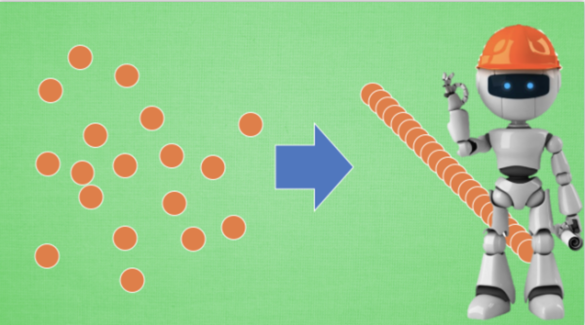

## 卷积神经网络 CNN (Convolutional Neural Network)


<!--more-->

### 卷积 和 神经网络 

卷积神经网络是如何运作的吧, 举一个识别图片的例子, 我们知道神经网络是由**一连串的神经层组成,每一层神经层里面有存在有很多的神经元**. 这些**神经元就是神经网络识别事物的关键**. **每一种神经网络都会有输入输出值, 当输入值是图片的时候, 实际上输入神经网络的并不是那些色彩缤纷的图案,而是一堆堆的数字**. 就比如说这个. 当神经网络需要处理这么多输入信息的时候, 也就是卷积神经网络就可以发挥它的优势的时候了. 那什么是卷积神经网络呢?


先把卷积神经网络这个词拆开来看. “卷积” 和 “神经网络”. 卷积也就是说神经网络**不再是对每个像素的输入信息做处理了,而是图片上每一小块像素区域进行处理**, 这种做法加强了图片信息的连续性. 使得神经网络能看到图形, 而非一个点. 这种做法同时也加深了神经网络对图片的理解. 具体来说, 卷积神经网络**有一个批量过滤器, 持续不断的在图片上滚动收集图片里的信息,每一次收集的时候都只是收集一小块像素区域, 然后把收集来的信息进行整理**, 这时候整理出来的信息有了一些实际上的呈现, 比如这时的神经网络能看到一些边缘的图片信息, 然后在以同样的步骤, 用类似的批量过滤器扫过产生的这些边缘信息, 神经网络从这些边缘信息里面总结出更高层的信息结构,比如说总结的边缘能够画出眼睛,鼻子等等. 再经过一次过滤, 脸部的信息也从这些眼睛鼻子的信息中被总结出来. 最后我们再把这些信息套入几层普通的全连接神经层进行分类, 这样就能得到输入的图片能被分为哪一类的结果了.


我们截取一段 google 介绍卷积神经网络的视频, 具体说说图片是如何被卷积的. 下面是一张猫的图片, 图片有长, 宽, 高 三个参数. 对! 图片是有高度的! 这里的高指的是计算机用于产生颜色使用的信息. 如果是黑白照片的话, 高的单位就只有1, 如果是彩色照片, 就可能有红绿蓝三种颜色的信息, 这时的高度为3. 我们以彩色照片为例子. **过滤器就是影像中不断移动的东西, 他不断在图片收集小批小批的像素块, 收集完所有信息后, 输出的值**, 我们可以理解成是一个高度更高,长和宽更小的”图片”. 这个图片里就能包含一些边缘信息. 然后以同样的步骤再进行多次卷积, 将图片的长宽再压缩, 高度再增加, 就有了对输入图片更深的理解. 将压缩,增高的信息嵌套在普通的分类神经层上,我们就能对这种图片进行分类了.

### 池化(pooling)


研究发现, 在每一次卷积的时候, 神经层可能会无意地丢失一些信息. 这时, 池化 (pooling) 就可以很好地解决这一问题. 而且池化是一个筛选过滤的过程, 能将 layer 中有用的信息筛选出来, 给下一个层分析. 同时也减轻了神经网络的计算负担 ([具体细节参考](http://cs231n.github.io/convolutional-networks/#pool)). 也就是说在卷集的时候, 我们不压缩长宽, 尽量地保留更多信息, 压缩的工作就交给池化了,这样的一项附加工作能够很有效的提高准确性. 有了这些技术,我们就可以搭建一个属于我们自己的卷积神经网络啦.

## 流行的 CNN 结构


比较流行的一种搭建结构是这样, 从下到上的顺序, 首先是输入的图片(image), 经过一层卷积层 (convolution), 然后在用池化(pooling)方式处理卷积的信息, 这里使用的是 max pooling 的方式. 然后在经过一次同样的处理, 把得到的第二次处理的信息传入两层全连接的神经层 (fully connected),这也是一般的两层神经网络层,最后在接上一个分类器(classifier)进行分类预测.

## CNN 卷积神经网络

### 1. MNIST手写数据

```python
import torch
import torch.nn as nn
import torch.utils.data as Data
import torchvision  # 数据库 模块 下载 处理数据
import matplotlib.pyplot as plt
torch.manual_seed(1)
# Hyper parameters
EPOCH = 1 # 训练整批数据的多少次，
BATCH_ZISE = 50
LR = 0.001
DOWNLOAD_MNIST = True # 
# Mnist 手写数字
# 1. use torchvision download mnist dataset
train_data = torchvision.datasets.MNIST(
	root='./mnist/' # 保存位置
  train=True, # this is training data
  transform=torchvision.transforms.ToTensor(), # 转换PIL.Image or numpy.ndarray 或 torch.FloaterTensor (C x H x W), 训练的时候 normalize成[0.0, 1.0]区间
  download=DOWNLOAD_MNIST,
)
# 2. package data with dataloader  
# 批训练 50 example, 1 channel, 28*28 (50, 1, 28, 28)
train_loader = Data.Dataloader(dataset=train_data, batch_size=BATCH_SIZE, shuffle=True)

#plot one example 
print(train_data.train_data.size())  # torch.Size([60000, 28, 28])
print(train_data.data.size())  # torch.Size([60000, 28, 28])
print(train_loader.dataset.data.size()) # (6000, 28, 28)

print(train_data.train_labels.size()) # (60000,)
print(train_data.targets.size())
print(train_loader.dataset.targets.size())

plt.imshow(train_data.train_data[0].numpy(), cmap='gray')
plt.title("%i" % train_data.train_data.labels[0])
plt.show()

plt.imshow(train_data.data[0].numpy(), cmap='gray')
plt.title("%i" % train_data.targets[0])
plt.show()

# 同样, 我们除了训练数据, 还给一些测试数据, 测试看看它有没有训练好.
test_data = torchvision.datasets.MNIST(root='./mnist', train=False)
# 为了节约时间, 我们测试时只测试前2000个
# shape from (2000, 28, 28) to (2000, 1, 28, 28), value in range(0,1)
test_x = torch.unsqueeze(test_data.test_data, dim=1).type(torch.FloatTensor)[:2000]/255.
test_y = test_data.test_labels[:2000]
# tensor.nump(); torch.from_numpy()
# minst data(numpy or PIL image) ->train_data(tensor) ->train_loader(tensor with batchsize)
```

### 2. CNN模型

和以前一样, 我们用一个 class 来建立 CNN 模型.这个 CNN 整体流程是 卷积(`Conv2d`) -> 激励函数(`ReLU`) -> 池化, 向下采样 (`MaxPooling`) -> 再来一遍 -> 展平多维的卷积成的特征图 -> 接入全连接层 (`Linear`) -> 输出

```python
class CNN(nn.Module)：
	def __init__(self):
    super(CNN, self).__init__()
    self.conv1 = nn.Sequential(  # input shape (1, 28, 28)
    	nn.Conv2d(
      	in_channels=1, # input height
        out_channels=16, # n_filters
        kernel_size = 5, # filter size
        stride=1, # filter movement/step
        padding=2, # 如想conv2d出来的图片长宽没有变化，padding=(kernel_size-1)/2 当 stride=1
      )， # out shape (16, 28, 28)
      nn.ReLU(), # activation
      nn.MaxPool2d(2), # output (16, 14, 14)
    )
    self.conv2 = nn.Sequential( # input shape (16, 14, 14)
    	nn.Conv2d(16, 32, 5, 1, 2),
      nn.ReLU(), # activation
      nn.MaxPool2d(2) # output shape (32, 7, 7)
    )
    self.out = nn.Linear(32*7*7, 10) # fully connected layer, output 10 classes
  def forward(self, x):
    x = self.conv1(x)
    x = self.conv2(x)
    x = x.view(x.size(0), -1) # 展平多维平面图 成 (batch_size, 32*7*7)
    output = self.out(x)
    return output, x
cnn = CNN()
print(cnn) # net architecture
"""
CNN (
  (conv1): Sequential (
    (0): Conv2d(1, 16, kernel_size=(5, 5), stride=(1, 1), padding=(2, 2))
    (1): ReLU ()
    (2): MaxPool2d (size=(2, 2), stride=(2, 2), dilation=(1, 1))
  )
  (conv2): Sequential (
    (0): Conv2d(16, 32, kernel_size=(5, 5), stride=(1, 1), padding=(2, 2))
    (1): ReLU ()
    (2): MaxPool2d (size=(2, 2), stride=(2, 2), dilation=(1, 1))
  )
  (out): Linear (1568 -> 10)
)
"""
```

### 3. 训练

下面我们开始训练, 将 `x` `y` 都用 `Variable` 包起来, 然后放入 `cnn` 中计算 `output`, 最后再计算误差. 下面代码省略了计算精确度 `accuracy` 的部分, 如果想细看 `accuracy` 代码的同学, 请去往我的 [github](https://github.com/MorvanZhou/Tensorflow-Tutorial/blob/master/tutorial-contents/401_CNN.py) 看全部代码.

```python
optimizer = torch.optim.Adam(cnn.parameters(), lr=LR) # optimize all cnn parameters
loss_func = nn.CrossEntropyLoss() # the target label is not one-hotted
# training and testing
for epoch in range(EPOCH):
  for step, (b_x, b_y) in enumerate(train_loader): # 分配batch data, normalize x when iterate train_loader
    output = cnn(b_x)[0]
    loss = loss_func(output, b_y)
    optimizer.zero_grad()
    loss.backward()
    optimizer.step()

    if step % 100 == 0:
        test_output, last_layer = cnn(test_x)
        pred_y = torch.max(test_output, 1)[1].data.squeeze()
        accuracy = (pred_y == test_y).sum().item() / float(test_y.size(0))
        print('Epoch: ', epoch, '| train loss: %.4f' % loss.data, '| test accuracy: %.2f' % accuracy)
"""
...
Epoch:  0 | train loss: 0.0306 | test accuracy: 0.97
Epoch:  0 | train loss: 0.0147 | test accuracy: 0.98
Epoch:  0 | train loss: 0.0427 | test accuracy: 0.98
Epoch:  0 | train loss: 0.0078 | test accuracy: 0.98
"""
# print 10 predictions from test data
test_output, _ = cnn(test_x[:10])
pred_y = torch.max(test_output, 1)[1].data.numpy().squeeze()
print(pred_y, 'prediction number')
print(test_y[:10].numpy(), 'real number')
'''
[5 0 4 1 9 2 1 3 1 4] prediction number
[5 0 4 1 9 2 1 3 1 4] real number
'''
```

## 什么是循环神经网络 RNN (Recurrent Neural Network)

在语言分析, 序列化数据中穿梭自如的循环神经网络 RNN

### RNN 的用途

只想着斯蒂芬乔布斯这个名字 , 请你再把他逆序念出来. 斯布乔(*#&, 有点难吧. 这就说明, **对于预测, 顺序排列是多么重要**. 我们可以预测下一个按照一定顺序排列的字, 但是打乱顺序, 我们就没办法分析自己到底在说什么了.

## 序列数据


我们想象现在有一组序列数据 data 0,1,2,3. 在当预测 result0 的时候,我们基于的是 data0, 同样在预测其他数据的时候, 我们也都只单单基于单个的数据. 每次使用的神经网络都是同一个 NN. 不过这些数据是有关联 顺序的 , 就像在厨房做菜, 酱料 A要比酱料 B 早放, 不然就串味了. 所以普通的神经网络结构并不能让 NN 了解这些数据之间的关联.

### 处理序列数据的神经网络


那我们如何让数据间的关联也被 NN 加以分析呢? 想想我们人类是怎么分析各种事物的关联吧, 最基本的方式,**就是记住之前发生的事情. 那我们让神经网络也具备这种记住之前发生的事的能力**. 再分析 Data0 的时候, 我们把分析结果存入记忆. 然后当分析 data1的时候, NN会产生新的记忆, 但是新记忆和老记忆是没有联系的. 我们就简单的把老记忆调用过来, 一起分析. 如果继续分析更多的有序数据 , RNN就会把之前的记忆都累积起来, 一起分析.


我们再重复一遍刚才的流程, 不过这次是以加入一些数学方面的东西. **每次 RNN 运算完之后都会产生一个对于当前状态的描述 , state**. 我们用简写 `S(t)` 代替, 然后这个 RNN开始分析 x(t+1) , 他会根据 x(t+1)产生s(t+1), 不过此时 **y(t+1) 是由 s(t) 和 s(t+1) 共同创造**的. 所以我们通常看到的 RNN 也可以表达成这种样子.

### RNN 的应用

RNN 的形式不单单这有这样一种, 他的结构形式很自由. 如果**用于分类问题, 比如说一个人说了一句话, 这句话带的感情色彩是积极的还是消极的. 那我们就可以用只有最后一个时间点输出判断结果的RNN.**

又或者这是图片描述 RNN, 我们只需要一个 X 来代替输入的图片, 然后生成对图片描述的一段话.

或者是语言翻译的 RNN, 给出一段英文, 然后再翻译成中文.

##  什么是 LSTM 循环神经网络

### RNN 的弊端


之前我们说过, [RNN](https://morvanzhou.github.io/tutorials/machine-learning/ML-intro/2-3-RNN/) 是在有顺序的数据上进行学习的. 为了记住这些数据, RNN 会像人一样产生对先前发生事件的记忆. 不过一般形式的 RNN 就像一个老爷爷, 有时候比较健忘. 为什么会这样呢?


想像现在有这样一个 RNN, 他的输入值是一句话: ‘我今天要做红烧排骨, 首先要准备排骨, 然后…., 最后美味的一道菜就出锅了’. 现在请 RNN 来分析, 我今天做的到底是什么菜呢. RNN可能会给出“辣子鸡”这个答案. 由于判断失误, RNN就要开始学习 这个长序列 X 和 ‘红烧排骨’ 的关系 , 而RNN需要的关键信息 ”红烧排骨”却出现在句子开头,


再来看看 RNN是怎样学习的吧. **红烧排骨这个信息原**的记忆要进过长途跋涉才能抵达最后一个时间点. **然后我们得到误差, 而且在 反向传递 得到的误差的时候, 他在每一步都会 乘以一个自己的参数 W**. 如果这个 W 是一个小于1 的数, 比如0.9. 这个0.9 不断乘以误差, 误差传到初始时间点也会是一个接近于零的数, 所以对于初始时刻, 误差相当于就消失了. 我们把这个问题叫做梯度消失或者梯度弥散 Gradient vanishing. 反之如果 W 是一个大于1 的数, 比如1.1 不断累乘, 则到最后变成了无穷大的数, RNN被这无穷大的数撑死了, 这种情况我们叫做梯度爆炸, Gradient exploding. 这就是普通 RNN 没有办法回忆起久远记忆的原因.

### LSTM


LSTM 就是为了解决这个问题而诞生的. LSTM 和普通 RNN 相比, 多出了三个控制器. (**输入控制, 输出控制, 忘记控制**). 现在, LSTM RNN 内部的情况是这样.

他多了一个 控制全局的记忆, 我们用粗线代替. 为了方便理解, 我们把粗线想象成电影或游戏当中的 主线剧情. 而原本的 RNN 体系就是 分线剧情. 三个控制器都是在原始的 RNN 体系上, 我们先看 输入方面 , 如果此时的分线剧情对于剧终结果十分重要, 输入控制就会将这个分线剧情按重要程度 写入主线剧情 进行分析. 再看 忘记方面, 如果此时的分线剧情更改了我们对之前剧情的想法, 那么忘记控制就会将之前的某些主线剧情忘记, 按比例替换成现在的新剧情. 所以 主线剧情的更新就取决于输入 和忘记 控制. 最后的输出方面, 输出控制会基于目前的主线剧情和分线剧情判断要输出的到底是什么.基于这些控制机制, LSTM 就像延缓记忆衰退的良药, 可以带来更好的结果.


## 什么是自编码 (Autoencoder)

自编码 autoencoder 是一种什么码呢. 他是不是 条形码? 二维码? 打码? 其中的一种呢? NONONONO. 和他们统统没有关系. **自编码是一种神经网络的形式.**如果你一定要把他们扯上关系, 我想也只能这样解释啦.

### 压缩与解压


有一个神经网络, 它在做的事情是 **接收一张图片, 然后 给它打码, 最后 再从打码后的图片中还原**. 太抽象啦? 行, 我们再具体点.


假设刚刚那个神经网络是这样, 对应上刚刚的图片,看出图片其实是**经过了压缩,再解压的这一道工序. 当压缩的时候, 原有的图片质量被缩减, 解压时用信息量小却包含了所有关键信息的文件恢复出原本的图片**. 为什么要这样做呢?


原来有时神经网络要接受大量的输入信息, 比如输入信息是高清图片时, 输入信息量可能达到上千万, 让神经网络直接从上千万个信息源中学习是一件很吃力的工作. 所以, 何不压缩一下, **提取出原图片中的最具代表性的信息, 缩减输入信息量**, 再**把缩减过后的信息放进神经网络学习**. 这样学习起来就简单轻松了. 所以, 自编码就能在这时发挥作用. 通过**将原数据白色的X 压缩, 解压 成黑色的X**, 然后**通过对比黑白 X** ,**求出预测误差, 进行反向传递, 逐步提升自编码的准确性**. **训练好的自编码中间这一部分就是能总结原数据的精髓**. 可以看出, 从头到尾, 我们只用到了输入数据 X, 并没有用到 X 对应的数据标签, 所以也可以说自编码是一种**非监督学习**. 到了真正使用自编码的时候. 通常只会用到自编码前半部分.

### 编码器 Encoder


这 部分也叫作 encoder 编码器. **编码器能得到原数据的精髓**, 然后我们**只需要再创建一个小的神经网络学习这个精髓的数据**,不仅减少了神经网络的负担, 而且同样能达到很好的效果.


这是一个**通过自编码整理出来的数据**, 他能**从原数据中总结出每种类型数据的特征**, 如果把这些特征类型都放在一张二维的图片上, 每种类型都已经被很好的用原数据的精髓区分开来. 如果你了解 PCA 主成分分析, 再提取主要特征时, 自编码和它一样,甚至超越了 PCA. 换句话说, **自编码 可以像 PCA 一样 给特征属性降维**.

### 解码器 Decoder

至于解码器 Decoder, 我们也能那它来做点事情. 我们知道, **解码器在训练的时候是要将精髓信息解压成原始信息**, 那么这就**提供了一个解压器的作用, 甚至我们可以认为是一个生成器** (类似于[GAN](https://morvanzhou.github.io/tutorials/machine-learning/ML-intro/2-6-GAN/)). 那做这件事的一种特殊自编码叫做 variational autoencoders, 你能在[这里](http://kvfrans.com/variational-autoencoders-explained/)找到他的具体说明.

有一个例子就是让它能模仿并生成手写数字.


## AutoEncoder (自编码/非监督学习)

神经网络也能进行非监督学习, **只需要训练数据, 不需要标签数据**. 自编码就是这样一种形式. 自编码能**自动分类数据, 而且也能嵌套在半监督学习的上面**, **用少量的有标签样本和大量的无标签样本学习**. 如果对自编码还没有太多概念, 强烈推荐我的这个[动画短片](https://morvanzhou.github.io/tutorials/machine-learning/ML-intro/2-5-autoencoder/), 让你秒懂自编码.

这次我们还用 MNIST 手写数字数据来压缩再解压图片.


然后用压缩的特征进行非监督分类.


### 1. 训练数据

自编码**只用训练集**就好了, 而且**只需要训练 training data 的 image**, 不用训练 labels.

```python
import torch 
import torch.nn as nn
import torch.utils.data as Data
import torchvision
from matplotlib import cm
import matplotlib.pyplot as plt
from mpl_toolkits.mplot3d import Axes3D
import numpy as np
# hyper parameter
EPOCH = 10
BATCH_SIZE = 64
LR = 0.005
DOWNLOAD_MNIST = TRUE 
N_NEST_IMG = 5 # 显示5张图片
# 下载数据
train_data = torchvision.dataset.MNIST(
	root="./mnist",
  train=True, # training data
  transform=torchvision.transforms.ToTensor(), # convert a PIL.Image or numpy.ndarray to torch.FloatTensor() of shape(C, H, W) and normalize in the range  [0.0, 1.0]
  download=DOWNLOAD_MNIST,
)
# 转换
train_loader = Data.Dataloader(dataset=train_data, batchsize=BATCH_SIZE,shuffle=True)
```


这就是一张我们要训练的手写数字 4.

### 2. AutoEncoder

AutoEncoder 形式很简单, 分别是 `encoder` 和 `decoder`, **压缩和解压**, 压缩后得到压缩的特征值, 再从压缩的特征值解压成原图片.

```python
class AutoEncoder(nn.Module):
  def __init__(self):
    super(AutoEncoder, self).__init__()
    # 压缩
    self.encoder = nn.Sequential(
    	nn.Linear(28*28, 128)
      nn.Tanh(),
      nn.Linear(128, 64),
      nn.Tanh(),
      nn.Linear(64, 12),
      nn.Tanh(),
      nn.Linear(12, 3), # 压缩成3个特征，进行 3D图像可视化
    )
    # 解压
    self.decoder = nn.Sequential(
    	nn.Linear(3, 12),
      nn.Tanh(),
      nn.Linear(12, 64),
      nn.Tanh(),
      nn.Linear(64, 128),
      nn.Tanh(),
      nn.Linear(128, 28*28),
      nn.sigmoid(),  # 激励函数让输出在(0,1)
    )
    def forward(self, x):
      encoded = self.encoder(x)
      decoded = self.decoder(encoded)
      return encoded, decoded
autoEncoder = AutoEncoder()
```

### 3. 训练

**训练, 并可视化训练的过程**. 我们可以有效的利用 `encoder` 和 `decoder` 来做很多事, 比如这里我们**用 `decoder` 的信息输出看和原图片的对比**, 还**能用 `encoder` 来看经过压缩后, 神经网络对原图片的理解.** `encoder` 能将不同图片数据大概的分离开来. 这样就是一个无监督学习的过程.


```python
optimizer = torch.optim.Adam(autoEncoder.parameters(), lr=LR)
loss_func = nn.MSELoss()
for epoch in range(EPOCH):
  for step, (x, b_label) in enumerate(train_loader):
    b_x = x.view(-1, 28*28) # batch x, shape (batch, 28*28)
    b_y = x.view(-1, 28*28) # batch x, shape (batch, 28*28)
    
    encoded, decoded = autoAncoder(b_x)
    loss = loss_func(b_y, decoded) # mean square error 
    optimizer.zero_grad() # clear gradients for this training step
    loss.backward() # backpropagation, compute gradients
    optimizer.step() # apply gradients
```


### 画3D图 

如上；3D 的可视化图挺有趣的, 还能挪动观看, 更加直观, 好理解.

```python
# 要观看的数据
view_data = train_data.data[:200].view(-1, 28*28).type(torch.FloatTensor)/255.
encoded_data, _ = autoencoder(view_data) # 提取压缩的特征值
fig = plt.figure(2)
ax = Axes3D(fig)    # 3D 图
# x, y, z 的数据值
X = encoded_data.data[:, 0].numpy()
Y = encoded_data.data[:, 1].numpy()
Z = encoded_data.data[:, 2].numpy()
values = train_data.train_labels[:200].numpy()  # 标签值
for x, y, z, s in zip(X, Y, Z, values):
  c = cm.rainbow(int(255*s/9)) # 上色
  ax.text(x, y, z, s, backgroundcolor=c)  # 标位子
  
ax.set_xlim(X.min(), X.max())
ax.set_ylim(Y.min(), Y.max())
ax.set_zlim(Z.min(), Z.max())
plt.show()
```

## 什么是 强化学习 (Reinforcement Learning)

强化学习是机器学习大家族中的一大类, 使用强化学习能够让机器学着如何在环境中拿到高分, 表现出优秀的成绩. 而这些成绩背后却是他所付出的**辛苦劳动, 不断的试错, 不断地尝试, 累积经验, 学习经验**.

### 从无到有

强化学习是一类算法, 是让计算机实现从一开始什么都不懂, 脑袋里没有一点想法, **通过不断地尝试, 从错误中学习, 最后找到规律, 学会了达到目的的方法**. 这就是一个完整的强化学习过程. 实际中的强化学习例子有很多. 比如近期最有名的 Alpha go, 机器头一次在围棋场上战胜人类高手, 让计算机自己学着玩经典游戏 Atari, 这些都是让计算机**在不断的尝试中更新自己的行为准则, 从而一步步学会如何下好围棋, 如何操控游戏得到高分**. 既然要让计算机自己学, 那计算机通过什么来学习呢?

### 虚拟老师

原来计算机也需要一位虚拟的老师, 这个老师比较吝啬, 他不会告诉你如何移动, 如何做决定, 他为你做的事只有给你的行为打分, 那我们应该以什么形式学习这些现有的资源, 或者说怎么样只从分数中学习到我应该怎样做决定呢? 很简单, 我**只需要记住那些高分, 低分对应的行为, 下次用同样的行为拿高分, 并避免低分的行为**.

**比如老师会根据我的开心程度来打分, 我开心时, 可以得到高分, 我不开心时得到低分. 有了这些被打分的经验, 我就能判断为了拿到高分, 我应该选择一张开心的脸, 避免选到伤心的脸.** 这也是强化学习的核心思想. 可以看出在强化学习中, **一种行为的分数是十分重要的. 所以强化学习具有分数导向性**. 我们换一个角度来思考.这种**分数导向性好比我们在监督学习中的正确标签**.

### 对比监督学习


我们知道**监督学习, 是已经有了数据和数据对应的正确标签**, 比如这样. 监督学习就能学习出那些脸对应哪种标签. 不过**强化学习还要更进一步, 一开始它并没有数据和标签**.

### RL 算法们


**强化学习是一个大家族**, 他包含了很多种算法, 我们也会一一提到之中一些比较有名的算法, 比如**有通过行为的价值来选取特定行为的方法**, 包括**使用表格学习的 q learning, sarsa**, **使用神经网络学习的 deep q network**, 还有**直接输出行为的 policy gradients**, 又或者了解所处的环境, 想象出一个虚拟的环境并从虚拟的环境中学习 等等.


## 什么是 DQN

今天我们会来说说强化学习中的一种强大武器, Deep Q Network 简称为 DQN. Google Deep mind 团队就是靠着这 DQN 使计算机玩电动玩得比我们还厉害.

之前我们所谈论到的强化学习方法都是比较传统的方式, 而如今, 随着机器学习在日常生活中的各种应用, 各种机器学习方法也在融汇, 合并, 升级. 而我们今天所要探讨的强化学习则是这么一种**融合了神经网络和 [Q learning](https://morvanzhou.github.io/tutorials/machine-learning/ML-intro/4-03-q-learning/) 的方法, 名字叫做 Deep Q Network**. 这种新型结构是为什么被提出来呢? 原来, 传统的表格形式的强化学习有这样一个瓶颈.


我们使用表格来存储每一个状态 state, 和在这个 state 每个行为 action 所拥有的 Q 值. 而当今问题是在太复杂, 状态可以多到比天上的星星还多(比如下围棋). 如果全用表格来存储它们, 恐怕我们的计算机有再大的内存都不够, 而且每次在这么大的表格中搜索对应的状态也是一件很耗时的事. 不过, 在机器学习中, 有一种方法对这种事情很在行, 那就是神经网络. 我们可以**将状态和动作当成神经网络的输入**, 然后**经过神经网络分析后得到动作的 Q 值, 这样我们就没必要在表格中记录 Q 值, 而是直接使用神经网络生成 Q 值**.

还有一种形式的是这样, 我们也能**只输入状态值, 输出所有的动作值, 然后按照 Q learning 的原则, 直接选择拥有最大值的动作当做下一步要做的动作**. 我们可以想象, 神经网络接受外部的信息, 相当于眼睛鼻子耳朵收集信息, 然后通过大脑加工输出每种动作的值, 最后通过强化学习的方式选择动作.

### 更新神经网络


接下来我们基于第二种神经网络来分析, 我们知道, **神经网络是要被训练才能预测出准确的值**. 那在强化学习中, 神经网络是如何被训练的呢? 首先, 我们**需要 a1, a2 正确的Q值**, 这个 **Q 值我们就用之前在 Q learning 中的 Q 现实来代替**. 同样我们还需要一个 **Q 估计** 来实现神经网络的更新. 所以神经网络的的参数就是**老的 NN 参数 加学习率 alpha 乘以 Q 现实 和 Q 估计 的差距**. 我们整理一下.


我们通过 NN 预测出Q(s2, a1) 和 Q(s2,a2) 的值, 这就是 Q 估计. 然后我们选取 Q 估计中最大值的动作来换取环境中的奖励 reward. 而 Q 现实中也包含从神经网络分析出来的两个 Q 估计值, 不过这个 Q 估计是针对于下一步在 s’ 的估计. 最后再通过刚刚所说的算法更新神经网络中的参数. 但是这并不是 DQN 会玩电动的根本原因. 还有两大因素支撑着 DQN 使得它变得无比强大. 这两大因素就是 Experience replay 和 Fixed Q-targets.

### DQN 两大利器


简单来说, DQN 有**一个记忆库用于学习之前的经历**. 在之前的简介影片中提到过, **Q learning 是一种 off-policy 离线学习法, 它能学习当前经历着的, 也能学习过去经历过的, 甚至是学习别人的经历**. 所以每次 DQN 更新的时候, 我们都可以随机抽取一些之前的经历进行学习. 随机抽取这种做法打乱了经历之间的相关性, 也使得神经网络更新更有效率. **Fixed Q-targets 也是一种打乱相关性的机理, 如果使用 fixed Q-targets, 我们就会在 DQN 中使用到两个结构相同但参数不同的神经网络**, 预测 Q 估计 的神经网络具备最新的参数, 而预测 Q 现实 的神经网络使用的参数则是很久以前的. 有了这两种提升手段, DQN 才 能在一些游戏中超越人类.

DQN模型: 接收外界的变化值；自身的记忆库；学习过程

## DQN 强化学习

Torch 是神经网络库, 那么也可以拿来做强化学习, 之前我用另一个强大神经网络库 [Tensorflow](https://morvanzhou.github.io/tutorials/machine-learning/tensorflow/) 来制作了这一个 [从浅入深强化学习教程](https://morvanzhou.github.io/tutorials/machine-learning/reinforcement-learning/), 你同样也可以用 PyTorch 来实现, 这次我们就举 DQN 的例子, 我对比了我的 Tensorflow DQN 的代码, 发现 PyTorch 写的要简单很多.[强化学习教程](https://morvanzhou.github.io/tutorials/machine-learning/reinforcement-learning/)

### 模块导入和参数设置

这次除了 Torch 自家模块, 我们还要导入 Gym 环境库模块


## 什么是批标准化 (Batch Normalization)

### 普通数据标准化



Batch Normalization, 批标准化, 和普通的数据标准化类似, **是将分散的数据统一的一种做法, 也是优化神经网络的一种方法**. 在之前 Normalization 的简介视频中我们一提到, 具有统一规格的数据, 能让机器学习更容易学习到数据之中的规律.

### 每层都做标准化


**在神经网络中, 数据分布对训练会产生影响**. 比如某个神经元 x 的值为1, 某个 Weights 的初始值为 0.1, 这样后一层神经元计算结果就是 Wx = 0.1; 又或者 x = 20, 这样 Wx 的结果就为 2. 现在还不能看出什么问题, 但是, 当我们加上一层激励函数, 激活这个 Wx 值的时候, 问题就来了. 如果使用 像 tanh 的激励函数, Wx 的激活值就变成了 ~0.1 和 ~1, 接近于 1 的部已经处在了 激励函数的饱和阶段, 也就是如果 x 无论再怎么扩大, tanh 激励函数输出值也还是 接近1. 换句话说**, 神经网络在初始阶段已经不对那些比较大的 x 特征范围 敏感了**. 这样很糟糕, 想象我轻轻拍自己的感觉和重重打自己的感觉居然没什么差别, 这就证明我的感官系统失效了. 当然我们是可以用之前提到的对数据做 normalization 预处理, 使得输入的 x 变化范围不会太大, 让输入值经过激励函数的敏感部分. 但刚刚这个不敏感问题不仅仅发生在神经网络的输入层, 而且在隐藏层中也经常会发生.


只是时候 x 换到了隐藏层当中, 我们能不能对隐藏层的输入结果进行像之前那样的normalization 处理呢? 答案是可以的, 因为大牛们发明了一种技术, 叫做 batch normalization, 正是处理这种情况.

### BN 添加位置


Batch normalization 的 batch 是批数据, 把数据分成小批小批进行 stochastic gradient descent. 而且在每批数据进行前向传递 forward propagation 的时候, 对每一层都进行 normalization 的处理,

### BN 效果

Batch normalization 也可以被看做一个层面. 在一层层的添加神经网络的时候, 我们先有数据 X, 再添加全连接层, 全连接层的计算结果会经过 激励函数 成为下一层的输入, 接着重复之前的操作. **Batch Normalization (BN) 就被添加在每一个全连接和激励函数之间**.


之前说过, 计算结果在进入激励函数前的值很重要, 如果我们不单单看一个值, 我们可以说, 计算结果值的分布对于激励函数很重要. 对于数据值大多分布在这个区间的数据, 才能进行更有效的传递. **对比这两个在激活之前的值的分布. 上者没有进行 normalization, 下者进行了 normalization, 这样当然是下者能够更有效地利用 tanh 进行非线性化的过程.**


没有 normalize 的数据 使用 tanh 激活以后, 激活值大部分都分布到了饱和阶段, 也就是大部分的激活值不是-1, 就是1, 而 normalize 以后, 大部分的激活值在每个分布区间都还有存在. 再将这个激活后的分布传递到下一层神经网络进行后续计算, 每个区间都有分布的这一种对于神经网络就会更加有价值. Batch normalization 不仅仅 normalize 了一下数据, 他还进行了反 normalize 的手续. 为什么要这样呢?

### BN 算法


我们引入一些 batch normalization 的公式. 这三步就是我们在刚刚一直说的 normalization 工序, 但是公式的后面还有一个反向操作, **将 normalize 后的数据再扩展和平移**. 原来这是为了让神经网络自己去学着**使用和修改这个扩展参数 gamma, 和 平移参数 β,** 这样神经网络就能自己慢慢琢磨出前面的 normalization 操作到底有没有起到优化的作用, 如果没有起到作用, 我就使用 gamma 和 belt 来抵消一些 normalization 的操作.


最后我们来看看一张神经网络训练到最后, 代表了每层输出值的结果的分布图. 这样我们**就能一眼看出 Batch normalization 的功效啦. 让每一层的值在有效的范围内传递下去**.

BN就是通过**一定的规范化手段，把每层神经网络任意神经元这个输入值的分布强行拉回到均值为0方差为1的标准正态分布**， 就是每次处理之后，用BN拉回N（0,1），这样就避免了梯度爆炸和梯度消失


## Batch Normalization 批标准化

批标准化通俗来说就是对每一层神经网络进行标准化 (normalize) 处理, 我们知道对输入数据进行标准化能让机器学习有效率地学习。 如果把每一层后看成这种接受输入数据的模式, 那我们何不 “批标准化” 所有的层呢

那我们就看看下面的两个动图, 这就是在每层神经网络有无 batch normalization 的区别啦.


