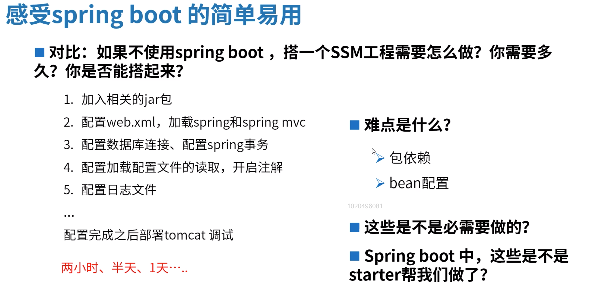

# Spring-boot

1. 快速搭建SSM工程

   <!--more-->

# Spring boot Starter原理解密

1. Starter的作用
   1. 自动包依赖 
   2. 自动配置Bean

2. 以前的配置方法
   1. xml文件配置 
   2. 注解注入 
   3. 基于java代码配置

通过 autoconfigure jar包

> 疑问1: 这些bean的依赖关系是如何自动处理的?

> 疑问2: 这些bean配置需要的参数是如何规定并获取的?

## 分享-互联网Java高级开发工程师必备技能

中级开发工程师: 工程会使用

如何快速成为Java高级工程师？

1. 找到自己的差距
2. 快速学习补短板，针对目标快速补短板

如何快速学习提升：

1. 自学
   1. 要找学习资料
   2. 碰到问题学很久

# 多线程

> Q1: 用多线程的目的是什么?

充分利用cpu资源，并发做多件事

> Q2: 单核cpu机器上不适不适合用多线程?

适合，如果单线程，线程中需要等待IO，CPU就空闲了

> Q3：线程什么是让出CPU

阻塞时， wait, sleep

yeild

over

> Q4: 线程是什么？

一条代码执行流，完成一组代码的执行；这一组代码，称为一个任务

> Q5: cpu是做什么？

执行代码

> Q6: 线程是不是越多越好？

for example?  

<!--任务(IT男)  线程(小姐姐)  CPU(房间服务)-->

> Q7： 该如何正确使用多线程？

## 线程池原理解密

1. 任务用什么表示？

   Runnable,  Callable

   

2. 仓库用什么？

   

> Q8: 如何确定数量的线程？

## 如何正确使用Java的线程池API

Java并发包中提供了丰富的线程池实现

只用满足所有核心线程都在工作，且队列已满，才会创建非核心线程。

java + docker 使用

