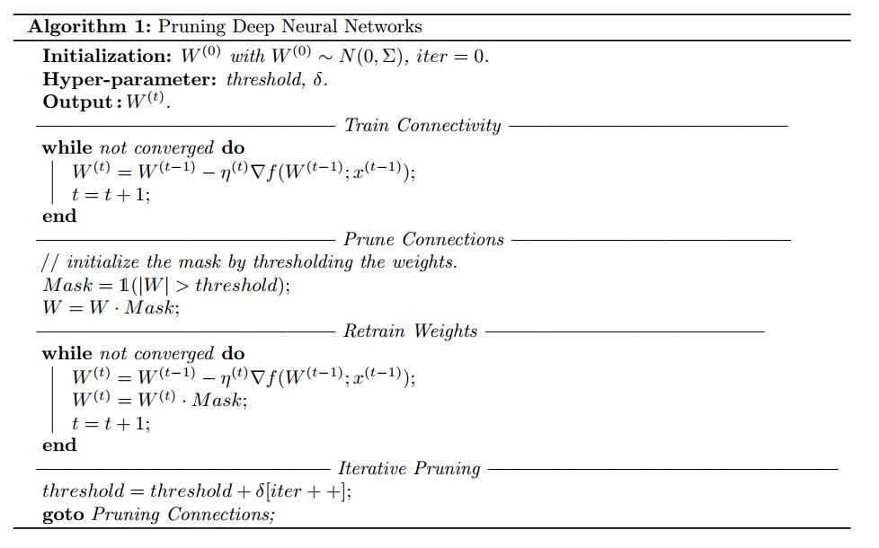

The Lottery Ticket Hypothesis: Finding sparse, trainable neural networks

抽奖彩票假说: 寻找稀疏，可训练的神经网络

<!--more-->

论文: THE LOTTERY TICKET HYPOTHESIS: FINDING SPARSE, TRAINABLE NEURAL NETWORKS

论文来源：ICLR 2019

论文链接：[THE LOTTERY TICKET HYPOTHESIS](https://link.zhihu.com/?target=https%3A//arxiv.org/abs/1803.03635)

论文原作者：MIT CSAIL 的Jonathan Frankle 和 Michael Carbin

#摘要

神经网络剪枝技术可以将**训练好的神经网络参数**减少90%以上，在不影响准确率的情况下，降低存储要求并提高计算性能。然而当前的经验的是: 通过剪枝产生的稀疏参数矩阵从头开始训练很困难，同样也很难提高训练性能。

作者发现**标准的剪枝技术自然的揭示了子网络**(wining ticket), 他们的**初始化能够进行有效的训练**。基于以上结果，作者提出了**彩票假设**: **密集、随机初始化的、前向传播的的网络包含子网络(wining tickets), 这个子网络—当进行隔离的训练时—在近乎相同的迭代次数中达到与原始网络相同的测试精度**，我们发现The wining tickets超过了初始的网络：他们的连接有初始化的权值可以使训练更加高效。 ？？

!作者提出了一个算法来**识别wining tickets**，以及一系列来**支持彩票假说**和**随机初始化**的重要性的实验。作者持续发现the wining tickets 小于全连接和卷积网络结构的10-20%，在MNIST和CIFAR10数据集上。Above this size,？？作者发现the wining tickets学习的比原始网络更快，测试精度更高。

# Introduction

剪枝:消除不需要的网络的权值的技术 可以减少参数数量90%以上并不减少准确率。做这个可以减小尺寸或者训练好网络的能量消耗，使推理更加高效。然而，一个网络如果可以减小尺寸，我们为什么不训练这个更小的网络而是着重于使训练更加高效？**当前的经验表明通过剪枝的网络更难训练从头开始，测试精度更低比原始网络**。[训练一个剪枝后的网络从头开始 表现的效果比重新训练一个剪枝后的网络更差， 这个可能表明小容量的网络结构训练的困难性。 在重新训练时，最好是 保持初始训练阶段的联系的，经过剪枝后保留下的权值，而不是重新初始化被剪枝的层，梯度下降可以找一个好的方法，当网络初始化训练时，但不是重新初始化一些层，来重新训练他们]

考虑一个例子，在图1，我们随机抽样和训练来自基于MNIST全连接和基于CIFAR10的卷积网络的子网络。随机抽样模拟非结构化剪枝的效果。根据几个稀疏，虚线追踪在迭代中的最小验证集的损失[**一个代理，网络学习的速度，我们使用迭代: 一个早期停止的标准结束训练。 我们使用的这个特殊的早期停止的标准 是 最小验证集损失在训练中**]和测试精度。网络越稀疏，学习越慢，最终的准确率越低。

ppt:  背景资料: 压缩，治疗；-> 剪枝； 论文讲解内容

#### 论文 - Learning both Weights and Connections for Efficient Neural Networks

作者的方法分为三个步骤：

- Train Connectivity: 按照正常方法训练初始模型。作者认为该模型中权重的大小表征了其重要程度
- Prune Connection: 将初始模型中那些低于某个阈值的的权重参数置成00（即所谓剪枝）
- Re-Train: 重新训练，以期其他未被剪枝的权重能够补偿pruning带来的精度下降

为了达到一个满意的压缩比例和精度要求，2和3要重复多次

