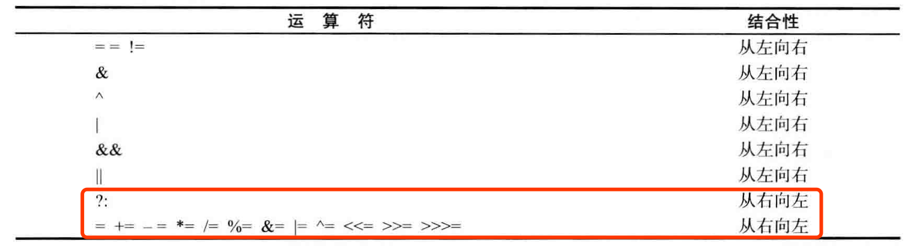

Java的特性：

<!--more-->

1. 简单性
2. 面向对象！
3. 分布式!
4. 健壮性
5. 安全性
6. 体系结构中立
7. 可移植性!
8. 解释型!
9. 高性能
10. 多线程！
11. 动态性


# 第二章 Java程序设计环境

JDK: 编写Java程序的程序员使用的软件，开发环境工具包

JRE：运行Java程序的用户使用的软件，运行环境

Standard Edition： SE，用于桌面或简单服务器应用的Java平台

EE：用于复杂服务器应用的Java平台

### 安装：库源文档和文档

库源文件在JDK中以一个压缩文件 src.zip 的形式发布 ，必须将其解压缩后才能够访问源代码 。建议按照下面所的步骤进行操作。

1. 确保JDK已经安转，并且在jdk/bin目录中执行路径汇中
2. 在主目录中建立一个目录 javasrc 如果愿意 可以在一个终端窗口完成这个步骤 `mkdir javasrc`; 
3. 在jdk目录中找到src.zip
4. 将src.zip文件解压到javasrc中

```java
public class Welcome {
  public static void main(String[] args) {
    String greeting = "Welcome to Core Java!";
    System.out.println(greeting);
    for(int i=0; i<greeting.length(); i++) {
      System.out.println("=");
    }
    System.out.println();
  }
}
```

编写Welcome.java文件；类型名注意大小写

```java
javac Welcome.java
java Welcome
```

从命令行编译和运行一个 Java 程序

javac是一个java的编译器；将Welcome.java编译成Welcome.class; 

java程序启动Java虚拟机；虚拟机执行编译器放在class文件的字节码


# 第三章 Java的基本程序设计结构

主要介绍 程序设计的基本概念(如数据类型，分支以及循环)

##  一个java demo

```java
public class FirstSample {
  public static void main(String[] args) {
    System.out.println("We will not use 'Hello World'");
  }
}
```

1. java区分大小分 main 不是Main！！
2. 关键字 public 访问修饰符(access modifier)；用于控制程序的其他部分对这段代码的访问级别
3. 关键字class 表明Java程序中基本处理的单位是类，所有内容都在类中； class紧跟类名；**名字必须字母开头，后跟字母和数字的组合。类名以大写字母开头，驼峰法**；**源代码命名必须与公共类同名！！**
4. 正确命名后，`javac FirstSample.java`编译这段代码得到一个**包含这个类字节码的文件**。Java编译器将字节码文件自动命名为FirstSample.class，同一目录下。
5. 运行 java已编译程序`java FirstSample`; Java虚拟机将**从指定类中的main方法开始执行**(方法即java中的函数)； **Java 中的所有函數都属于某个类的方法** （ 标准术语将其称为方法而不是成员函数 ）。因此 Java 中的 main 方法必须有一个外壳类。Java 中的 main 方法必须是静态的 最后关键字 void 表示这个方法没有返回值。如果 main 方法正常退出 ， 那么 Java 应用程序的退出代码为 0，表示成功地运行了程序。如果希望在终止程序时返回其他的代码，那就需要调用System.exit方法
6. 使用括号{} 来划分程序的各个部分；一对大括号表示方法体的开始与结束。
7. 在上面这个 main 方法体中只包含了一条语句 其功能是 将一个文本行输出到控制台上；使用了 System . out 对象并调用了它的 println 方法。点号(.)用于调用方法。等价于函数调用。`object.methond(parameters)`

## 数据类型

java是强类型语言；意味着必须为每个变量申明一种类型。共有8中基本类型；

1. 4种整型(int 4字节 刚过20亿；short 2字节； long 8字节； byte 1字节-128-127)；
2. 2种浮点类型； float 4字节； double 8字节 ！！！；
3. 1种用于Unicode编码的**字符单元的字符类型char**； 单个字符，单引号括起来；
   1. 转义序列 \u； 从 \u0000 到\uffff; 转义序列 \ u 还可以出现在加引号的字符常量或字符串之外`public static void main(String\u005B\u005D args )`
   2. 注释中 \u 替换成特殊字符； 回车，换行 最好将字符串作为抽象数据类型处理
4. 1种用于表示真值的boolean类型； false 或 true； 不能和整型转换
5. 还有一个算术包， 大数值，是一个Java对象，不是类型

## 变量

java中， 每个变量都有一个类型(type)；int i; double salary;**变量的声明尽可能地靠近变量第一次使用的地方**

` $` 是一个合法的Java字符，但不要用，只用在Java编译器中。

**变量初始化**： 声明变量， 初始化； int vacationDays = 12;

**常量: 使用 final 表示常量**。 final double PI = 3.14; 该变量只赋值一次，不能再次更改了。全部大写。const是保留字； 使用final 定义常量；希望某个常量在一个类中多个方法中使用，称为类常量。使用 static final设置一个类常量。 static final CM_PI = 3.14;


## 运算符

-; +; /; %; 整数被0产生异常；浮点数被除0得到无穷大或者NaN;

### 数学函数与常量

在Math类中；Math.sqrt(); print方法处理System.out对象；Math类中sqrt方法处理不是对象是静态方法。

double y = Math.pow(x, a);

**floorMod 方法的目的是解决一个长期存在的有关整数余数的问题**；  考虑表达式 n % 2 ， 所有人都知道 ， 如果 n 是偶数; 这个表达式为 0 ; 如果 n 是奇数 表达式则为 1 当然 除 非 n 是负数 如果 n 为负，表达式为-1.

### 数值类型之间的转换

经常需要将一种数值类型转换为另一种数值类型。图 3 - 1 给出了数值类型之间的合法转换


有 6 个实心箭头 ， 表示无信息丢失的转换 ； 有 3 个虚箭头 ， 表示可能有精度 损失的转换

### 强制类型转换

int 类型的值将会自动地转换为 double 类型。 double x = 9.997; int nx = (int) x;

x += 4;

(一般地 ， 要把运算符放在 = 号左边 如 *= 或 ％= )

```java
int m = 7 ; int n = 7 ;
int a = 2 * ++m ;  // now a is 16 , m is 8
int b = 2 * n++ ; //  now b is 14 , n is 8

expression1&&expression2； 短路效果
condition？expression1：expression2
```

在表达式中，前缀形式会先完成加 1 ; 而后缀形式会使用变量原来的值; 单独使用没有区别。

### 位运算符

处理整型时，可以直接**对组成整型数值的各个位完成操作**

```java
&("and") 按位与运算符，无短路效果  
|("or") 参加运算的两个对象，按二进制位进行“或”运算。

^("xor") 异或运算符；运算规则：0^0=0；0^1=1；1^0=1；1^1=0；应位为“异”（值不同），则该位结果为1
“异或运算”的特殊作用：
（1）使特定位翻转找一个数，对应X要翻转的各位，该数的对应位为1，其余位为零，此数与X对应位异或即可。
例：X=10101110，使X低4位翻转，用X ^ 0000 1111 = 1010 0001即可得到。
（2）与0相异或，保留原值 ，X ^ 0000 0000 = 1010 1110。

~("not") 取反运算符；按二进制位进行“取反”运算。
使一个数的最低位为零，可以表示为：a&~1。
<< 左移运算符；将一个运算对象的各二进制位全部左移若干位（左边的二进制位丢弃，右边补0）。左移1位后a = a * 2; 
 >> 操作数每右移一位，相当于该数除以2。
int fourthBit操作数每右移一位，相当于该数除以2。FromRight = ( n & ( 1 « 3 ) ) » 3 ;
>>>  无符号右移运算符； 运算符0填充高位; >> 用符号位填充高位 不存在 <<<
```




### 枚举类型

可以自定义枚举类型 。

```java
enum Size { SMALL , MEDIUM , LARGE , EXTRA LARCE } ;
//现在 ，可以声明这种类型的变量
Size s = Size.MEDIUM;
//Size 类型的变量只能存储这个类型声明中给定的某个枚举值 或者 null 值
```

## 字符串

**注意:**String 类是不可改变的，所以你一旦创建了 String 对象，那它的值就无法改变了。

从概念上讲，Java字符串是Unicode字符串序列。例如，"Java\u2122"由5个字符Unicode字符J、a、v、a和"TM"特殊字符。无内置字符串类型；**在类库中提供预定义类，叫String**。 **每个用双引号括起来的字符串都是Strin类的一个实例**。

子串，String类中的substring方法可以提取子串。[ );substring 的工作方式有一个优点 容易计算子串的长度 字符串 s . substring ( a , b ) 的长度为 b - a。子串 “ Hel ” 的长度为 3 - 0 = 3

### 拼接

允许使用+号连接 （ 拼接 ） 两个字符串。当将一个字符串与一个非字符串的值进行拼接时,**后者被转换成字符串**。

### 不可变字符串

**String 类没有提供用于修改字符串的方法**。如果希望将 greeting 的内容修改为 “ Help ! ”，**不能直接地将 greeting 的最后两个位置的字符修改为'p'和!'.**  greeting = greeting.substring(0, 3)+"p!";

由于不能修改 Java 字符串中的字符 ，所以在 Java 文档中将 String类对象称为不可变字符串. 如同数字 3 永远是数字 3一样， **字符串"hello"包含字符h,e,l,l,o代码单元序列，不能修改其中的任何一个字符。** **可以修改字符串变量greeting，让他引用另外一个字符串。**

看起来好像修改一个代码单元要比创建一个新字符串更 加简洁，对，也不对。通过拼接 “ Hel ” 和 p ! ” 来创建一个新字符串的效率确实不高。但是 ，不可变字符串却有一个优点 ：**编译器可以让字符串共享** 。

为了弄清具体的工作方式，可以想象**将各种字符串存放在公共的存储池中**。字符串变量指向存储池中相应的位置，如果复制一个字符串变量，原始字符串与复制的字符串共享相同的字符。

Java 字符串**大致类似于 char * 指针** ，**不是认为是字符型数组**；greeting = "ess"; 指向新串时，Java自动回收垃圾

### 检测字符串相等

使用equals方法； s.quals(t); 或 "Hello".equals(s); 而不区分大小写 ，可以使用 equalsIgnoreCase方法

### 空串与NULL串

空串 "" 是长度为 0 的字符串；可以调用以下代码检查一个字符串是否为空 ： if(str.length() == 0)或者if(str.equals("")); 空串是一个Java对象，有自己的串长度(0)和内容(空)。

String变量还可以存一个特殊的值，名为null，表示目前没有任何对象与该变量关联。if(str==null)

有时要检查一个字符串既不是null也不为空串，需要使用以下：

if(str != null && str.length() != 0) ; 在null值上调用方法，会出现错误。

### 码点与代码单元

码点 （ code point ) 是指与**一个编码表中的某个字符对应的代码值**。 在Unicode标准中，码点采用16进制书写，加上前缀U+,例如U+0041为拉丁字母A的码点。Unicode的码点可以分成17个代码级别。第一个代码级别，称为多语言级别，从U+0000到U+FFFF;其余从U+10000到U+10FFFF,包括辅助字符串;两个代码单元。

UTF 16 编码采用不同长度的编码表示所有 Unicode 码点。在基本的多语言级别中，**每个字符用 16 位表示，称为代码单元**，而**辅助单元采用一对连续的代码单元进行编码**。如八元数集。

**char 类型描述了 UTF-16 编码中的一个代码单元**。

Java 字符串由 char 值序列组成。从 3.3 . 3 节 “ char 类型 ” 已经看到，char数据类型是一个采用UTF - 16 编码表示 码点的代码单元。大多数的常用Unicode使用**一个代码单元**就可以表示，而辅助字符需要**一对代码单元**表示。**length 方法将返回采用 UTF 16 编码表示的给定字符串所需要的代码单元数量** 。

```
public class StringTest {
    public static void main(String[] args) {
        String greeting = "Hello";
        int n = greeting.length();
        System.out.println(n); // 字符串所需要的代码单元数量
        // 想要得到实际的长度，即码点数量，可以调用:
        int cpCount = greeting.codePointCount(0, greeting.length());
        System.out.println(cpCount);
        // 调用 s.charAt(n) 将返回位置 n 的代码单元，n 介于0~s.length()-1之间
        char first = greeting.charAt(0);
        System.out.println(first);
        char last = greeting.charAt(4);
        System.out.println(last);
        // 想得到第i个码点
        int index = greeting.offsetByCodePoints(0, 4);
        int cp = greeting.codePointAt(index);
        System.out.println(cp);
    }
}
```

### String API

String类中包含了50多个方法。都有用。

```java
 java.lang.String  
  
 char charAt (int index)     返回index所指定的代码单元(字符1：1； 除了辅助字符2个)
 String concat(String str)   将两字符串连接  
 boolean endsWith(String str)    测试字符串是否以str结尾  
 boolean equals(Object obj)  比较两对象  
 char[] getBytes     将字符串转换成字符数组返回  
 char[] getBytes(String str)     将指定的字符串转成制服数组返回  
 boolean startsWith(String str)  测试字符串是否以str开始  
 int length()    返回字符串的长度  
 String replace(char old ,char new)  将old用new替代  
 char[] toCharArray  将字符串转换成字符数组  
 String toLowerCase()    将字符串内的字符改写成小写  
 String toUpperCase()    将字符串内的字符改写成大写  
 String valueOf(Boolean b)   将布尔方法b的内容用字符串表示  
 String valueOf(char ch)     将字符ch的内容用字符串表示  
 String valueOf(int index)   将数字index的内容用字符串表示  
 String valueOf(long l)  将长整数字l的内容用字符串表示  
 String substring(int1,int2)     取出字符串内第int1位置到int2的字符串  

1.构造方法
//直接初始化
String str = "abc";
//使用带参构造方法初始化
char[] char = {'a','b','c'};
String str1 = new String("abc");String str2 = new String(str);
String str3 = new String(char);
2.求字符串长度和某一位置字符
String str = new String("abcdef");
int strlength = str.length();//strlength = 7
char ch = str.charAt(4);//ch = e
for (int i = 0; i < greeting.length(); i++) {
            System.out.println(greeting.charAt(i));
        }

        char[] cArray=greeting.toCharArray();
        for(char cc:cArray){
        }
3.提取子串
用String类的substring方法可以提取字符串中的子串，该方法有两种常用参数:
1)public String substring(int beginIndex)//该方法从beginIndex位置起，从当前字符串中取出剩余的字符作为一个新的字符串返回。
2)public String substring(int beginIndex, int endIndex)//该方法从beginIndex位置起，从当前字符串中取出到endIndex-1位置的字符作为一个新的字符串返回。作者：HCherisher
String str1 = new String("abcdef");
String str2 = str1.substring(2);//str2 = "cdef"
String str3 = str1.substring(2,5);//str3 = "cde"
4.字符串比较
1)public int compareTo(String anotherString)//该方法是对字符串内容按字典顺序进行大小比较，通过返回的整数值指明当前字符串与参数字符串的大小关系。若当前对象比参数大则返回正整数，反之返回负整数，相等返回0。
2)public int compareToIgnoreCase(String anotherString)//与compareTo方法相似，但忽略大小写。
3)public boolean equals(Object anotherObject)//比较当前字符串和参数字符串，在两个字符串相等的时候返回true，否则返回false。
4)public boolean equalsIgnoreCase(String anotherString)//与equals方法相似，但忽略大小写。作者：HCherisher
String str1 = new String("abc");
String str2 = new String("ABC");
int a = str1.compareTo(str2);//a>0
int b = str1.compareToIgnoreCase(str2);//b=0
boolean c = str1.equals(str2);//c=false
boolean d = str1.equalsIgnoreCase(str2);//d=true
5.字符串链接
public String concat(String str)//将参数中的字符串str连接到当前字符串的后面，效果等价于"+"
String str = "aa".concat("bb").concat("cc");
//相当于String str = "aa"+"bb"+"cc";
6.字符串中单个字符查找
1)public int indexOf(int ch/String str)//用于查找当前字符串中字符或子串，返回字符或子串在当前字符串中从左边起首次出现的位置，若没有出现则返回-1。
2)public int indexOf(int ch/String str, int fromIndex)//改方法与第一种类似，区别在于该方法从fromIndex位置向后查找。
3)public int lastIndexOf(int ch/String str)//该方法与第一种类似，区别在于该方法从字符串的末尾位置向前查找。
4)public int lastIndexOf(int ch/String str, int fromIndex)//该方法与第二种方法类似，区别于该方法从fromIndex位置向前查找作者：HCherisher
String str = "I really miss you !";
int a = str.indexOf('a');//a = 4
int b = str.indexOf("really");//b = 2
int c = str.indexOf("gg",2);//c = -1
int d = str.lastIndexOf('s');//d = 6
int e = str.lastIndexOf('s',7);//e = 7
7.大小写转换
1)public String toLowerCase()//返回将当前字符串中所有字符转换成小写后的新串
2)public String toUpperCase()//返回将当前字符串中所有字符转换成大写后的新串
8.字符串中字符的替换
1)public String replace(char oldChar, char newChar)//用字符newChar替换当前字符串中所有的oldChar字符，并返回一个新的字符串。
2)public String replaceFirst(String regex, String replacement)//该方法用字符replacement的内容替换当前字符串中遇到的第一个和字符串regex相匹配的子串，应将新的字符串返回。
3)public String replaceAll(String regex, String replacement)//该方法用字符replacement的内容替换当前字符串中遇到的所有和字符串regex相匹配的子串，应将新的字符串返回。
String str = "asdzxcasd";
String str1 = str.replace('a','g');//str1 = "gsdzxcgsd"
String str2 = str.replace("asd","fgh");//str2 = "fghzxcfgh"
String str3 = str.replaceFirst("asd","fgh");//str3 = "fghzxcasd"
String str4 = str.replaceAll("asd","fgh");//str4 = "fghzxcfgh"
9.其他方法
1)String trim()//截去字符串两端的空格，但对于中间的空格不处理。
String str = " a bc ";
String str1 = str.trim();
int a = str.length();//a = 6
int b = str1.length();//b = 4
2)boolean statWith(String prefix)或boolean endWith(String suffix)//用来比较当前字符串的起始字符或子字符串prefix和终止字符或子字符串suffix是否和当前字符串相同，重载方法中同时还可以指定比较的开始位置offset。作者：HCherisher
String str = "abcdef";
boolean a = str.statWith("ab");//a = true
boolean b = str.endWith("ef");//b = true
3)contains(String str)//判断参数s是否被包含在字符串中，并返回一个布尔类型的值。
String str = "abcdef";
str.contains("ab");//true
str.contains("gh");//false
4)String[] split(String str)//将str作为分隔符进行字符串分解，分解后的字字符串在字符串数组中返回。
String str = "abc def ghi";
String[] str1 = str.split(" ");//str1[0] = "abc";str1[1] = "def";str1[2] = "ghi";
10.类型转换
字符串转基本类型
java.lang包中有Byte、Short、Integer、Float、Double类的调用方法：
public static byte parseByte(String s)
public static short parseShort(String s)
public static short parseInt(String s)
public static long parseLong(String s)
public static float parseFloat(String s)
public static double parseDouble(String s)
int n = Integer.parseInt("12");
float f = Float.parseFloat("12.34");
double d = Double.parseDouble("1.124");
//将char '8' 转换为int 8
String str = String.valueOf('8');
String str = String.valueOf(8.1);
int num = Integer.parseInt(str);
进制转换
使用Long类中的方法得到整数之间的各种进制转换的方法：
Long.toBinaryString(long l)//二进制
Long.toOctalString(long l)//十进制
Long.toHexString(long l)//十六进制
Long.toString(long l, int p)//p作为任意进制
```

```dart
String a = "Hello World!";  
String b = "Hello World!";  
String c = new String("Hello World!");  
String d = "Hello"+" "+"World!";
System.out.println(a == b);//true
System.out.println(a == c);//false
System.out.println(a == d);//true
```

- 首先String不属于8种基本数据类型，**String是一个对象**。
  因为**对象的默认值是null**，所以String的默认值也是null；但它又是一种特殊的对象，有其它对象没有的一些特性。

- 在这里，我们先不谈堆，也不谈栈，只先简单引入常量池这个简单的概念。
  **常量池(constant pool)指的是在编译期被确定，并被保存在已编译的.class文件中的一些数据。它包括了关于类、方法、接口等中的常量，也包括字符串常量**。
- Java会确保一个**字符串常量只有一个拷贝**。
  因为例子中的a和b都是字符串常量，它们在编译期就被确定了，所以
  a==b为true；而"Hello"和" "以及"World!"也都是字符串常量，当一个字符串由多个字符串常量连接而成时，它自己肯定也是字符串常量，所以d也同样在编译期就被解析为一个字符串常量，所以d也是常量池中"Hello World!"的一个引用。所以我们得出a==b==d;
  用**new String() 创建的字符串不是常量,不能在编译期就确定，所以new String()创建的字符串不放入常量池中，它们有自己的地址空间**。

存在于.class文件中的常量池，在运行期被JVM装载，并且可以扩充。String的intern()方法就是扩充常量池的一个方法；**当一个String实例str调用intern()方法时，Java查找常量池中是否有相同Unicode的字符串常量，如果有，则返回其的引用**，如果没有，则在常量池中增加一个Unicode等于str的字符串并返回它的引用，看例3就清楚了。

```java
String a = "Hello";    
String b = new String("Hello");    
String c = new String("Hello");    
System.out.println( a == b );//false
System.out.println( “**********” );    
b.intern();   
c = c.intern(); //把常量池中"Hello"的引用赋给c    
System.out.println( a == b);//false虽然执行了b.intern()但没有赋值给b
System.out.println( a == b.intern() );//true  
System.out.println( a == c ); //true  
```

**String是不可变的 :**
这一说又要说很多，大家只要知道String的实例一旦生成就不会再改变了，比如说：
`String str=”aa”+”bb”+” “+”cc”;`
就是有4个字符串常量，首先”aa”和”bb”生成了”aabb”存在内存中，后”aabb”又和” “ 生成 ”aabb “存在内存中，最后又和生成了”aabb cc”，并把这个字符串的地址赋给了str,就是因为String的“不可变”产生了很多临时变量，这也就是为什么建议用StringBuffer的原因了

#### 三、StringBuffer和StringBuiler

我们对String、StringBuffer、StringBuiler先有一个简单的认识。**String是不可变字符串，StringBuffer和StringBuilder是长度可变的字符串**，区别是前者是线程安全的，后者是线程不安全的，同样后者的效率也会更高。

**StringBuffer 上的主要操作是 append 和 insert 方法，可重载这些方法，以接受任意类型的数据**。每个方法都能有效地将给定的数据转换成字符串，然后将该字符串的字符追加或插入到字符串缓冲区中。append 方法始终将这些字符添加到缓冲区的末端；而 insert 方法则在指定的点添加字符。

例如，如果 z 引用一个当前内容为 "start" 的字符串缓冲区对象，则此方法调用 z.append("le") 会使字符串缓冲区包含 "startle"，而 z.insert(4, "le") 将更改字符串缓冲区，使之包含 "starlet"。

通常，如果 sb 引用 StringBuilder 的一个实例，则 sb.append(x) 和 sb.insert(sb.length(), x) 具有相同的效果。

还有delete删除方法
deleteCharAt(int index)
delete(int start ,int end)

### 构建字符串

每次连接字符串，需要重新生成新的String对象，耗时，浪费空间。可以使用StringBuilder

如 许多小段字符串构建成一个字符串，

首先，构建一个空 的字符串构建器。

```java
StringBuilder builder = new String StringBuilder();
// 每次添加一个部分内容，就需要调用append方法。
builder.append(ch); // 添加一个字符
builder.append(str); //appends a string
// 需要构建字符串时，就调用toString方法，得到一个String对象。
String completeString = builder.toString();
```

StringBuffer是线程安全的，而StringBuilder是非线程安全的。StringBuilder是从JDK 5开始，为StringBuffer类补充的一个单线程的等价类。我们在**使用时应优先考虑使用StringBuilder，因为它支持StringBuffer的所有操作，但是因为它不执行同步**，不会有线程安全带来额外的系统消耗，所以速度更快。

**二、String为什么不可变**

虽然String、StringBuffer和StringBuilder都是final类，它们**生成的对象都是不可变的**，而且**它们内部也都是靠char数组实现的**，但是不同之处在于，**String类中定义的char数组是final的**，而**StringBuffer和StringBuilder都是继承自AbstractStringBuilder类**，它们**的内部实现都是靠这个父类完成的，而这个父类中定义的char数组只是一个普通是私有变量，可以用append追加**。因为AbstractStringBuilder实现了Appendable接口。

```java
- StringBuilder()
构造一个空的字符串构建器 。
- int length ( ) 
返回构建器或缓冲器中的代码单元数量 。 
- StringBui1der append(String str)
追加一个字符串并返回 this 。
- StringBui1der append ( char c )
追加一个代码单元并返回 this 。 
- StringBui1der appendCodePoint(int cp) 
追加一个代码点 并将其转换为一个或两个代码单元并返回 this 
- void setCharAt (int i , char c) 
将第i个代码单元设置为 c 。 
- StringBui1der insert(int offset , String str) 
在 offset 位置插入一个字符串并返回 this 。 
- StringBuilder insert ( int offset , Char c ) 
  在 offset 位置插入一个代码单元并返回 this 。 
- StringBui1der delete (int startindex , int endlndex) 
删除偏移量从 startindex 到 endlndex - 1 的代码单元并返回 this 。 
- String toString () 
返回一个与构建器或缓冲器内容相同的字符串
```

## 输入输出

### 读取输入

 读取 标准输入流; System.in   主语是主机

```java
// 首先 构造一个Scanner 对象，并且与 "标准输入流" System.in关联
Scanner in = new Scanner(System.in);
//现在 就可以使用 Scanner类的各种方法实现输入操作了 例如 nextLine方法将输入一行
System.out.print("What is your name? ");
String name = in.nextLine(); // 使用 nextLine 方法是因为在输人行中有可能包含空格
// 要想读取一个单词 （ 以空白符作为分隔符) 就调用
String firstName = in.next();
// 要想读取一个整数 ，就调用nextlnt 方法
System.out.print("How old are you? ");
int age = in.nextInt();
// 要想读取下一个浮点数 调用nextDouble
// 添加库 import java.util.*;
// Scanner 类定义在 java . util 包中 当使用的类不是定义在基本 java . lang 包中时 一定要使用import 指示字将相应的包加载进来
```

```java
import java.util.*;
public class InputTest {
    public static void main(String[] args) {
        Scanner in = new Scanner(System.in);
//        System.out.println("What's your name? ");
        String name = in.nextLine();
//        System.out.println("How old are you?");
        int age = in.nextInt();
        System.out.println("your name: "+ name + ", your age: "+age);
    }
}
```

```java
// 用给定的输人流创建一个 Scanner 对象
- Scanner(InputStream in)
// 读取输入的下一行内容
- String nextLine()
// 读取输入的下一个单词 （ 以空格作为分隔符)
- String next()
// 读取下一个整型
- int nextInt()
// 读取并转换下一个表示整数或浮点数的字符序列
- double nextDouble()
// 检测输人中是否还有其他单词
- boolean hasNext ( )
- boolean hasNextInt ( )
- boolean hasNextDouble ( )
```

### 格式化输出

可以使用`System.out.print(x)` 将数值 x 输出到控制台上

```java
System.out.printf("%8.2f", x);
System.out.printf("Hello, %s. Next year, you will be %d", name, age);
System.out.printf("%,.2f", 10000.0/3.0);  3,333.33
```

每一个以%字符开始的格式说明符都用相应的参数替换。格式说明符尾部的转换符将指示被 格式化的数值类型。f 表示浮点数;s 表示字符串;d表示十进制整数。还可以给出控制格式化输出的各种标志.

可以使用 s 转换符格式化任意的对象。对于任意现了 Formattable 接口的对象都 将调用 formatTo 方法 否则将调用 toString 方法 它可以将对象转换为字符串。

可以使用静态的String.format方法创建一个格式化的字符串，而不打印输出:

```java
String message = String.format("Hello, %s. Next Year you will be %d", name, age+1);
```

### 文件输入与输出

想要对文件进行读写，需要一个File对象构造一个Scanner对象，如下：

```java
Scanner in = new Scanner(Paths.get("myfile.txt"),"UTF-8");
```

现在介绍前面的任何一个Scanner 方法对文件进行读写。

要想写文件，使用 PrintWriter对象。在构造器中，只需要提供文件名:

```java
PrintWriter out = new PrintWriter("myfile.txt", "UTF-8");
```

如文件不存在，则创建文件。

```java
- Scanner(File f) // 构造一个从给定文件读取数据的Scanner
- Scanner(String data) // 构造一个从给定字符串读取的数据的Scanner
- PrintWriter(String fileName) // 构造一个将数据写入文件的PrintWriter。文件名由参数指定
- static Path get(String pathname) // 根据给定的路径名构造一个Path
```

## 控制流程

使用条件 和循环语句。

### 块作用域

块(Block)概念: 复合语句，由一对大括号括起来的若干条简单的Java语句。确定变量的作用域，可嵌套，但嵌套的两个块中不能声明相同变量。C++可重定义一个变量。

### 条件/ 循环

```java
if (condition) {
	statement1;
	statement2;
}

while(condition) {
	statement1;
	statement2;
}
```

### 确定循环

for 循环语言， 迭代。

```java
for(int i = 0; i <= 10; i++) {

}

read_data:
        while (n == 1) {
            for (int i = 0; i<n; i++) {
                for (int j= 0; j<2; j++) {
                    break read_data;
                }
            }
        }
标签必须放在希望跳出的最外层循环之前,并且必须紧跟一个冒号
```

for 语句的第 1 部分通常用于对计数器初始化;第 2 部分给出每次新一轮循环执行前要检测的循环条件; 第 3 部分指示如何更新计数器

## 大数值

基本的整数和浮点数精度不足，可使用java.math的两个类：BigInteger和BigDecimal。可处理包含任意长度数字序列的整数，浮点数。

使用静态的 valueOf 方法可以将普通的数值转换为大数值：

不能使用算术运算符(+和*)处理，需要使用大数值类中的add和multiply方法。

```java
BigInteger a = BigInteger.valueOf(100);
BigInteger c = a.add(b);
BigInteger d = c.multiply(b.add(BigInteger.valueOf(2)));
```

Java中没有运算符重载的功能。不能重载/ *等运算符； Java只为字符串的连接重载了+运算符。

```java
BigInteger add(BigInteger other);
BigInteger divide(BigInteger other);
BigInteger mod(BigInteger other);
int CompareTo(BigInteger other);
static BigInteger valueOf(long x);
```

## 数组

数组是一种数据结构，用来**存储同一类型值的集合**。通过以下整型下标可以方位数组中的每一个值。例如，a是一个整形数组，a[i]就是数组的中下标为i的整数。

**创建整型数组，所有元素初始化为0；所有boolean初始化为false；对象数组为null**

**字符串长度用string.length(); 数组用array.length;**

使用new和{}初始化数组

在声明数组变量时，需要指出数组类型(数据元素类型紧跟[])和数组变量名。

```java
int[] a; //该语句只声明了变量a，没有讲a初始化一个真正的数组，应使用new
int[] a = new int[100]; // 数组长度不要求是常量 newint [ n ] 会创建一个长度为 n 的数组

int[] a = new int[100];
for(int i =0; i<100; i++) {
  a[i] = i;
}// 
String[] names = new String[10];
for(int i =0; i<10; i++) names[i] = "";
for(int i =0; i<names.length; i++) {
  System.out.println(a[i]);
}
```

一旦创建了数组，就不能再改变大小了；如果要在运行过程中扩展数组大小。就应该使用另一种数据结构--数组列表。

```java
for each循环使用 //这个循环应该读作 “ 循环 a 中的每一个元素 ” （ for each element in a )
for (variable: collection)
	statement
for(int element : a)
	System,out.println(element); 
				int[] a = new int[10];
        for (int i = 0; i< 10; i++) {
            a[i] = i;
        }
        for (int x : a) {
            System.out.print(x+" ");
        }
        System.out.println(Arrays.toString(a));
```

**数组初始化以及匿名数组**

在Java中，提供了一种**创建数组对象并同时赋予初始化**的简化书写形式；

```java
int[] smallPrimes = {1, 2,3, 4,5,6}; 
还可以匿名初始化数组:
new int[] {1,2, 3,54,6}
smallPrimes = new int[] {1, 3, 5};
这是下列语句的简写形式：
int[] anoymous = {1,2,4};
```

这种表示法将创建一个新数组并利用括号中提供的值进行初始化,数组的大小就是初始值的个数。使用这种语法形式可以在不创建新变量的情况下重新初始化一个数组。

**数组拷贝**

在 Java 中，允许将一个数组变量拷贝给另一个数组变量 这时 两个变量将引用同一个数组:

```java
int[] luckyNumbers = new int{1, 3,34};
int[] badLucky = luckyNumbers;

badLucky[2] = 21;
//如果希望将一个数组的所有值拷贝到一个新的数组中去,使用Arrays.copyOf
int[] copiedLuckyNumbers = Arrays.copyOf(luckyNumbers,luckyNumbers.length)
 // 第 2 个参数是新数组的长度,这个方法通常用来增加数组的大小 ：数组元素是数值型,0;boolean->false
```

**数组排序**

使用Arrays.sort(); Arrays的API使用。

### 多维数组

多维数组将使用**多个下标访问数组元素**， 适用于表示表格或更加复杂的排列形式

初始化方式一：

在 Java 中 声明一个二维数组相当简单，**与一维数组一样,在调用new对多维数组进行初始化之前不能使用它**,在这里可以这样初始化

```java
double[][] balances;
balances = new double[NYEARS][NRATES];
```

初始化方式二：另外, 如果知道数组元素 就可以不调用 new, 而直接使用简化的书写形式对多维数组进行初始化 。

```java
int[][] magicSquare = {
 {1, 2, 4, 5},
 {1, 2, 4, 5},
 {1, 2, 4, 5},
 {1, 2, 4, 5},
};
```

一旦数组初始化，可以利用`balances[i][j]`访问

for each 不能自动处理二维数组的每一个元素，他是按照行处理，也是一维数组。需要使用嵌套循环。

```java
for (double[] row : a) {
	for (doule index : row) {
		do
	}
}
//要想快速地打印一个二维数组的数据元素列表
Arrays.deepToString(a);
```

### 不规则数组

Java实际上没有多维数组。只有一维数组；多维数组可称为“数组的数组”。在前面的示例中， balances 数组实际上是一个包含10 个元素的数组 ，而每个元素又是一个由 6个浮点数组成的数组。


表达式 balances[i]引用第 i 个子数组，也就是二维表的第 i 行，它本身也是一个数组。由于可以单独地存取数组的某一行，所以可以让两行交换。还可以**方便地构造一个不规则数组，即数组的每一行有不同的长度**，下面是一个典

型的示例。