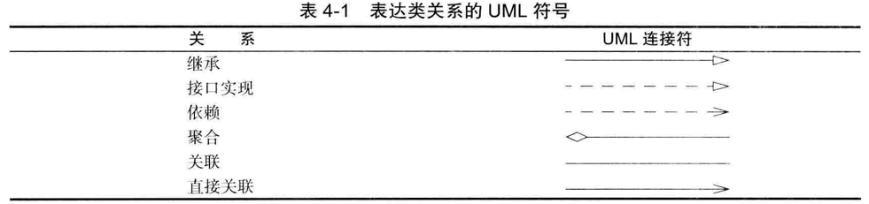
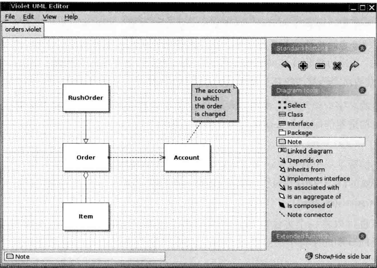
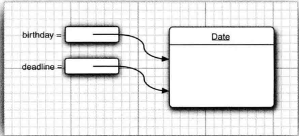

## title: 第四章 对象与类
date: 2019-11-22 21:17:46
tags: [coding]
category: [Java学习]

主要介绍如下：

1. 面向对象程序设计
2. 如何创建标准Java类库中的类对象
3. 如何编写自己的类

<!--more-->

# 概述

面向对象程序设计 （ 简称 OOP)是当今主流的程序设计范型。Java完全面向对象。

面向对象的程序是由对象组成的，每个对象包含对用户**公开的特定功能部分和隐藏的实现部分**。

传统的结构化程序设计通过**设计一系列的过程 （ 即算法） 来求解问题**。一旦确定了这些过程，开始考虑存储数据的方式。算法+数据结构 = 程序。算法是第一位的，数据结构是第二位的。程序员的工作方式, 首先**要确定如何操作数据**，然后**再决定如何组织数据**，以便于数据操作。而OOP却调换了这个次序，将数据放在第一位，然后再考虑操作数据的算法。

对于一些规模较小的问题，将其分解为过程的开发方式比较理想。而面向对象更加适用于解决规模较大的问题。

## 类

类 （ class ) 是构造对象的模板或蓝图。我们可以将类想象成制作小甜饼的切割机，将对象想象为小甜饼 。由类构造 （ construct ) 对象的过程称为创建类的实例 （ instance ) .

用 Java 编写的所有代码都位于某个类的内部。标准的 Java 库提供 了几千个类。尽管如此，还是需要在Java 程序中创建一些自己的类，以便描述应用程序所对应的问题域中的对象。

1. **封装 （ encapsulation , 有时称为数据隐藏 ） 是与对象有关的一个重要概念。**从形式上看，封装不过是将**数据和行为组合在一个包**， 并对对象的使用者隐藏了数据的实现方式。对象中的数据称为实例域，操作数据的过程称为方法(method)。对每个特定的类实例(对象)都有一组特定的实例域值。这些值的结合就是这个对象的当前状态。无论何时，向对象发送一个消息，他的状态就可能改变。

实现封装的关键在于绝对不能让**类中的方法直接地访问其他类的实例域**。仅能通过方法对对象的数据进行交互。

2. 继承，OOP 的另一个原则会让用户自定义 Java 类变得轻而易举，可以通过扩展一个类来建立另外一个新的类，所有的类都源自于一个 “ 神通广大的超类 ”。它就是 Object。这个扩展后的新类具有所扩展的类的全部属性和方法，只需提供适用于这个新类的新方法和数据域

### 对象

要想使用OOP ,清楚对象的三个主要特性：

- 对象的行为(behavior)， 可以施加哪些操作，
- 对象的状态(state), 对象的如何相应
- 对象的标识(identity)。

同一个类的所有对象实例, 对象的行为是可调用的方法定义。

### 识别类

传统的过程化程序设计。必须从顶部的main函数开始编写，在面向对象所谓的顶部，要 首先从设计类开始，然后再往下每个类中添加方法。

识别类的简单规则是在**分析问题的过程中寻找名词**，而**方法对应着动词**。

### 类之间的关系

- 依赖('uses-a');
- 聚合('has-a')
- 继承('is-a')

依赖 （ dependence ) , 即 “ uses - a ” 关系. 如果一个类的方法操纵另一个类的对象 我们就说一个类依赖于另一个类。应该尽可能地将相互依赖的类减至最少，让类之间的耦合度最小。

聚合关系意味着类 A 的对象包含类 B 的对象

继承 （inheritance ) , 即 “ is - a ” 关系 是一种用于表示特殊与一般关系的





# 使用预定义类

使用类。但如 Math类的方法，Math封装了功能，不需要也不必隐藏数据，无数据

### 对象与对象变量

要想使用对象，就必须**先构造对象**，并**指定其初始化状态**。然后，**对对象应用方法**。 Java中，用构造器(constructor)构造新实例。**构造器是一种特殊的方法，用来构造并初始化对象**。

如Java类库中的包含一个Date类。

构造器的名字应该与类名相同，因此Date类的构造器为Date，要想构造一个Date对象，需要在构造器前面加上new操作符，如 new Date().这个表达式**构造了一个新对象** , 这个对象被初始化为当前的日期和时间

如果需要的话 也可以将这个对象传递给一个方法。Date类中有一个toString方法。这个方法将返回字符串

String s = new Date().toString();

在对象与对象变量之间存在着一个重要的区别;

Date deadline; // deadlin doesn't refer to any object;定义了一个对象变量deadline,它可以引用Date类型的对象，但是，变量deadline不是一个对象，实际上也没有引用对象。不能使用方法。

必须首先初始化变量 deadline , 

方法1：deadline = new Date();

方法2：deadline = birthday; 引用已有的对象。



一定要认识到 ： 一个**对象变量**并**没有实际包含一个对象**而**仅仅引用一个对象**

在Java中，**任何对象变量的值都是对存储在另一个地方的一个对象的引用**。new操作符的返回值也是一个引用。

语句： Date deadline = new Date () ;

有两个部分：表达式new Date() 构造了一个Date类型的对象，并且它的值是对新创建对象的引用。这个引用存储在变量deadline中。可以显示将对象置为null，表明这个对象变量目前没有引用任何对象。

如果将**一个方法应用于一个值为 null的对象**上 ，那么就会产生运行时错误。

**局部变量不会自动地初始化为 null** ，而必须通过**调用 new 或将它们设置为 null 进行初始化**

> 很多人错误地认为 Java 对象变量与 C ++ 的引用类似,然而 在 C ++ 中没有空引用 ， 并且引用不能被赋值.可**以将 Java 的对象变量看作 C + + 的对象指针**

将 Java 的对象变量看作 C + + 的对象指针

如果把一个变量的值賦给另一个变量, 两个变量就指向同一个日期.

在 Java 中的 null 引用对应 C ++中的 NULL 指针.

所有的 **Java 对象都存储在堆**中,当一个对象包含另一个对象变量时,这个变量依然包含着指向另一个堆对象的指针

### LocalDate类

Date类中实例有一个状态，即特定的时间点。Date类中： 实际上时间是用距离一个固定时间点的毫秒数表示的。这个点称为纪元epoch。即UTC 1970年1月1日00:00:00,

类库设计者决定将**保存时间**与**给时间点命名分开**. 所以标准 Java 类库分别包含了两个类: 

一个是用来**表示时间点的 Date 类,** 另一个是用来表示大家熟悉的日历表示法的 LocalDate 类.

将**时间**与**日历**分开是一种很好的面向对象设计.

不要使用构造器来构造 LocalDate 类的对象。实际上 应当使用静态工厂方法 ( factory method ) 代表你调用构造器。LocalDate.now() 构造一个新对象。

一旦有 了一个 LocalDate 对象，可以用方法 get Year 、getMonth Value 和 getDayOfMonth得到年 月和日：

```java
LocalDate newss = LocalDate.now();
//通常都希望将构造的对象保存在一个对象变量中
LocalDate newYearsEve = LocalDate.of(1999, 1, 23);
int year = newYearsEve.getYear();
int month = newYearsEve.getMonthValue();
int day = newYearsEve.getDayOfMonth();
// plusDays 方法会得到一个新的 LocalDate ,
        LocalDate aThousandDaysLater = newYearsEve.plusDays(1000);
        year = aThousandDaysLater.getYear();
        month = aThousandDaysLater.getMonthValue();
        day = aThousandDaysLater.getDayOfMonth();
```

plusDays 方法会生成一个新的 LocalDate 对象,然后把这个新对象赋给 aThousandDaysLater变量 原来的对象不做任何改动 我们说 plusDays 方法没有更改调用这个方法的对象.

# 用户自定义类

已经开始编写了一些简单的类；如何设计复杂应用程序的各种主力类(workhorse class)。通常这些类**没有main方法，却有自己的实例域和实例方法**。想创建一个完整的程序, 若干类组合，只有一个类有main方法。

### Employee类

在Java中，最简单的类定义形式：

```java
class ClassName {
	field1;
	field2;
	...
	constructor1,
	constructor2,
	...
	method1,
	method2,
	
}
```

如下面的简单的Employee类，在编写资金管理时，用到

```java
import java.time.LocalDate;
class Employee {
    // instance field 
  	// 可以用 public 标记实例域 但这是一种极为不提倡的做法,public 數据域允许程序中的任何方法对其进行读取和修改。
    private String name;
    private double salary;
    private LocalDate hireDay;

    // constructor
    public Employee(String n, double s, int year, int month, int day) {
        name = n;
        salary = s;
        hireDay = LocalDate.of(year, month, day);
    }

    // a method
    public String getName() {
        return name;
    }
    // more method
}
public class EmployeeTest {
    public static void main(String[] args) {
        // fill the staff array with three Employee objects
        Employee[] staff = new Employee[3];

        staff[0] = new Employee("Carl Cracker", 75000, 1987, 12, 15);
        staff[1] = new Employee("Harry Hacker", 5000, 1993, 10, 16);
        staff[2] = new Employee("Tony Tester", 6000, 2001, 11, 12);
        // raise everyon's salary by 5%
        for (Employee e : staff) {
            e.raiseSalary(5);
        }

        for (Employee e : staff) {
            System.out.println("name="+e.getName()+" salary="+e.getSalary()+" hireDay="+e.getHireDay());
        }

        staff[0].test = "teswt";
    }
}
```

1. 在类中：Employee 类和带有 public 访问修饰符的 EmployeeTest 类。EmployeeTest 类包含了 main 方法 其中使用了前面介绍的指令。源文件名是 EmployeeTest . java 这是因为文件名必须与 public 类的名字相匹配。在一个 源文件中，**只能有一个公有类，但可以有任意数目的非公有类**。

2. 接下来当**编译这段源代码的时候，编译器将在目录下创建两个类文件**: EmployeeTest.class和Employ.class。

3. 将程序中包含main方法的类名提供了给字节码解释器，以便启动这个程序:

`java EmployeeTest`

4. 字节码解释器开始运行EmployeeTest类的main方法中的代码。在这段代码中，先后构成了三个新Employee对象，并显示他们的状态。

### **多源文件使用**

实际上习惯于每一个类存在一个单独的源文件中。将Employee类放在Employee.java中，将EmployeeTest放入EmployeeTest.java中。可通过通配符调用Java编译器: javac Employee*.java; 或者 javac EmployeeTest.java

### **剖析Employee类**

下面对Employee类剖析。首先从这个类的方法开始。通过查看源代码会发现，这个类包含一个构造器和4个方法，用public标记。

用 public 标记**实例域**，但这是一种极为不提倡的做法,public 數据域允许程序中的任何方法对其进行读取和修改。

最后，请注意，有两个实例域本身就是对象: name域是String对象，hireDay域是LocalDate类对象。

### **从构造器开始**

Employee类构造器

```java
// constructor
public Employee(String n, double s, int year, int month, int day) {
    name = n;
    salary = s;
    hireDay = LocalDate.of(year, month, day);
}
```

**构造器与类同名**。在构造Employee类的对象时，构造器会运行，将实例域初始化。`new Employee("Carl Cracker", 75000, 1987, 12, 15);`

**可有多个构造器**。

**构造器没有返回值。**

构造器与其他的方法有一个重要的不同 。构造器**总是伴随着 new 操作符的执行被调用**, 而**不能对一个已经存在的对象调用构造器**来达到重新设置实例域的目的, 将产生编译错误。

请注意 **不要在构造器中定义与实例域重名的局部变量**，这些变量只能在构造器内部访问。这些变量屏蔽了同名的实例域。因此 ，必须注意在所有的方法中不要命名与实例域同名的变量

注意: Java构造器与C++一致，Java对象都是在堆中构造，构造器总伴随着new一起使用。

```java
Employee number007("Tony Tester", 6000, 2001, 11, 12);// 在C++可以这样使用，Java不行
Employee number007 = new Employee("Tony Tester", 6000, 2001, 11, 12); //Java中使用
```

### **隐式参数与显式参数**

**方法用于操作对象以及存取它们的实例域**。例如，方法:

```java
public void raiseSalary(double byPercent) {
  double raise = salary * byPercent / 100;
  salary += raise;
}
// 将调用这个方法的对象的salary实例设置为新值。例如
number007.raiseSalary(5);
// 它的结果将 number007.salary 域的值增加 5 %,具体该调用执行下列指令
double raise = number007.salary * 5 /100;
number007.salary += raise;
```

raiseSalary用两个参数: 1. 隐式参数(implicit)，是**出现在方法名前的Employee类对象**，也可称为方法调用的目标或者接收者。 2. 第二个参数是位于方法名后面括号中的数值。这是一个显式参数(explicit)。显式参数是明显列在方法声明中的，例如double byPercent, 隐式参数没有出现在方法声明中。

在每一个方法中，关键字this表示隐式参数，如需要可用下列方法编写raiseSalary方法:

```java
public void raiseSalary(double byPercent) {
	double raise = this.salary * byPercent / 100;
	this.salary += raise;
}
```

有些程序员更偏爱这样的风格, 因为这样可以**将实例域与局部变量明显地区分开来**。

```c++
void Employee::raiseSalary(double byPercent) { //in C++ not Java 在类外定义方法
	...
}
class Employee {
	...
	int getName(){return name;} // inline C++
}
```

**在Java，所有方法都必须在类的内部定义**， 但不代表他们是内联方法。是否将某个方法设置为内联方法是Java虚拟机的任务，即 编译器会监视调用**那些简洁、经常被调用的，没有被重载以及可以被优化**的方法。

### 封装的优点

最后仔细看下getName方法，getSalary，getHireDay方法。这些都是典型的访问器方法，又称为域访问器。一般需要获取或者设置实例域的值。

- 一个私有的数据域
- 一个公有的域访问器的方法
- 一个公有的域更改器方法: 更改器方法可以执行错误检查

注意：不要编写返回**引用可变对象的访问器**方法，在Employee类中，就违反了该设计原则:

```java
class Employee {
	private Date hireDay;
	public Date getHireDay() {
		return hireDay; //Bad
	}
}
// LocalDate类中没有更改器的方法，但Date类中有一个更改器方法setTime,可以设置
Employee harry = ..
Date d = harry.getHireDay();
double tenYears = 10*365...;
d.setTime(d.getTime() - (long)tenYears);
```

因此，如果需要返回一个可变对象的引用，首先应该先克隆(clone)，对象 clone 指存放在另一个位置上的对象副本。

```java
class Employee{
  private Date hireDay;
 	public Date getHireDay() {
    return (Date)hireDay.clone();
  }
}
```

如果需要返回一个可变数据域的拷贝 ，就应该使用clone

### 基于类的访问权限

方法可以访问所调用对象的私有数据 。一个方法可以访问所属类的所有对象的私有数据。

```java
class Employee{
	...
	public boolean equals(Employee other) {
		return name.equals(other.name);
	}
}
// 典型的调用方式是
if(harry.equals(boss)) ..
```

这个方法可以访问harry的私有域，它**还可以访问boss的私有域，这是合法的。其原因是boss是Employee类对象，而Employee类的方法可以访问Employee类的 任何一个对象的私有域**。

注意： C++也是一样的，方法可以访问所属类的私有特性(feature) , 而不仅限访问隐私参数的私有特性。

### 私有方法

在实现一个类时，公有数据很危险，一般私有化。方法一般公有，特殊情况下，如何一个计算代码，划分成若干独立的辅助方法。使用private。

### final实例域

**可以将实例域定义为 final，构建对象时必须初始化这样的域**。必须确保在每一个构造器执行之后，这个域的值被设置，并且在后面的操作中，不能够再对它进行修改。例如**，可以将 Employee 类中的 name 域声明为 final , 因为在对象构建之后 这个值不会再改变， 被修改 即没有 setName 方法**

```java
class Employee{
    //insance field
//    private String name;
    private final String name;
}
```

final 修饰符大都应用于**基本(primitive)类型域，或者不可变(immutable)类的域**。(如果类中的每个方法都不会改变其对象，这种类成为不可变类，如String类。)

对于可变的类 ，使用 final 修饰符可能会对读者造成混乱

```java
private final StringBuilder evaluations;
// 在Employee构造器中会初始化为
evaluations = new StringBuilder();
```

final关键字只是表示存储在evaluations变量中的对象引用不会指示其他的StringBuilder对象，不过这个对象可以更改:

```java
public void giveGoldStar() {
	evaluations.append(LocalDate.now() + ": Gold star!\n");
}
```

## 静态域与静态方法

前面中，main 方法都被标记为 static 修饰符。**可以给类名直接使用**，生命周期程序延长，给类名使用。

### 静态域

如果将域定义为static，每个类只有一个这样的域，而**每一个对象对于所有的实例域都有自己的一份拷贝**。例如，假定需要给每一个雇员赋予一个唯一标识码，这里给Employee类添加一个实例域id和一个静态域nextId。

```java
class Employee{
    //insance field
    private int Id;
    private static int nextId = 1;
}
```

现在 ，每一个雇员对象都有一个自己的 id 域 ，但这个类的所有实例将共享一个 nextld域.换句话说 ，

如果有 1000 个Employee类的对象 ，则有1000个实例域 id 。但是只有一个静态域nextId。即是没有一个雇员对象，静态域nextId也存在，它属于类，不属于任何独立的对象。在绝大多数的面向对象程序设计语言中，**静态域被称为类域**，沿用了 C ++ 的叫法 并无实际意义

```java
  public void setId(int ID) {
//        this.id = ID;
        this.id = nextId;
        nextId++;
    }
// 假定为 harry 设定雇员标识码
harry.setID(10);
harry的id域被设置为静态域nextId的当前值，并且静态域nextId的值加1:
harry.id = Employee.nextId;
Employee.nextId++;
```

### 静态常量

静态变量使用得比较少，但静态常量却使用得比较多，如

```java
public class Math {
	public static final double PI = 3.1415926;
}
```

在程序中，可通过Math.PI的形式获得这个常量。

**静态变量**（*Static Variable*）在[计算机编程](https://zh.wikipedia.org/wiki/计算机编程)领域指在[程序](https://zh.wikipedia.org/wiki/程序)执行前系统就为之[静态分配](https://zh.wikipedia.org/w/index.php?title=静态分配&action=edit&redlink=1)（也即在运行时中不再改变分配情况）存储空间的一类[变量](https://zh.wikipedia.org/wiki/变量_(程序设计))。与之相对应的是在运行时只暂时存在的[自动变量](https://zh.wikipedia.org/wiki/自动变量)（即局部变量）与以[动态分配](https://zh.wikipedia.org/wiki/动态内存分配)方式获取存储空间的一些对象，其中自动变量的存储空间在[调用栈](https://zh.wikipedia.org/wiki/调用栈)上分配与释放。

static 声明的变量在C语言中有两方面的特征：

1.变量被放**在程序的全局存储区**中，这样在下一次调用的时候还可以保持原来的赋值。这一点是它与堆栈变量和堆变量的区别。

2.变量用static告知编译器，自己**仅在变量的作用范围内可见**。这一点是它与全局变量的区别。

全局变量、静态全局变量、静态局部变量和局部变量的区别
变量可以分为：全局变量、静态全局变量、静态局部变量和局部变量。
按存储区域分，全局变量、静态全局变量和静态局部变量都存放在**内存的静态存储区域**，局部变量存放在**内存的栈区**。
按作用域分，**全局变量在整个工程文件内都有效**；**静态全局变量只在定义它的文件内有效**；**静态局部变量只在定义它的函数内有效**，并**且程序仅分配一次内存**，函数返回后，该变量不会消失；局部变量在定义它的函数内有效，但是函数返回后失效。

static表示“全局”或者“静态”的意思，用来修饰成员变量和成员方法，也可以形成静态static代码块，但是Java语言中没有全局变量的概念。

  static是静态修饰符，什么叫静态修饰符呢？大家都知道，在程序中任何变量或者代码都是在编译时由系统自动分配内存来存储的，而所谓静态就是指在编译后所分配的内存会一直存在，直到程序退出内存才会释放这个空间，也就是只要程序在运行，那么这块内存就会一直存在。这样做有什么意义呢？在Java程序里面，所有的东西都是对象，而对象的抽象就是类，对于一个类而言，如果要使用他的成员，那么普通情况下必须先实例化对象后，通过对象的引用才能够访问这些成员，但是**用static修饰的成员可以通过类名加“.”进行直接访问**。

### 静态方法

静态方法是一种**不能向对象实施操作**的方法。例如，Math类中的pow方式就是一个静态方法:

```java
Math.pow(x, a);//计算，在运算时，没有使用任何Math对象，换句话，静态方法没有隐式参数。
```

Employee 静态方法不能访问Id 实例域 因为它不能操作对象。建议使用类名来调用静态方法。

在下面两种情况使用静态方法:

- 一个方法不需要访问对象状态，其需要的参数是通过显式参数提供。(Math.pow)
- 一个方法只需要访问类的静态域。(Employee.getNextId)

static属于类且不属于类对象的变量和函数

### 工厂方法

**静态方法还有另外一种常见的用途**。类似 LocalDate 和 NumberFormat 的类使用静态工厂(factory method)来构造对象。如LocalDate.now()和LocalDate.of()，NumberFormat类如下**使用工厂方法生成不同风格的格式化对象**：

```java
NumberFormat currencyFormatter = NumberFormat.getCurrencyInstance();
NumberFormat percnetFormatter = NumberFormat.getPercentInstance();
```

为什么 NumberFormat 类不利用构造器完成这些操作呢 ？ 这主要有两个原因:

- **无法命名构造器。构造器的名字必须的对象类型**，但这里希望将得到的货币实例和和百分比的实例采用不同的名字。
- **当使用构造器时，无法改变所构造的对象类型**。而Factory方法返回一个DecimalFormat类对象。

### main方法

需要注意，**不需要使用对象调用静态方法**(object.method)。例如，不需要构造Math类对象就可使用Math.pow。

同理，main方法也是静态方法。

```java
class Application {
	public static void main(String[] args) {
		// construct objects here
	}
}
```

main方法不对任何对象进行操作。事实上，在启动程序时还没有任何一个对象。**静态main方法将执行并创建程序所需要的对象**。

每个类可以有一个main方法。这是一个常用与对类经常进行单元测试的技巧。例如，可以在Employee类中添加

```java
class Employee {
  private String name;
  private double salary;
  
	public Employee(String n, double s) {
    this.name = n;
    this.salary = s;
  }
	public static void main(String[] args) { //unit test
        Employee emp = new Employee("s", 1.1, 1000, 11, 12);
        emp.raiseSalary(3);
    }
}
```

如果 Employee 类是一个更大型应用程序的一部分 就可以使用下面这条语句运行程序`java Application`, Employee 类的 main 方法永远不会执行。

## 方法参数

将参数传递给方法。按值调用(call by value)表示**方法接收的是调用者提供的值**。而引用调用(call by reference)表示**方法接收的是调用者提供的变量地址**。一个方法可以修改传递引用所对应的变量值，而不能修改传递值调用所对应的变量值。

**Java 程序设计语言总是采用按值调用**。也就是说 ，方法得到的是所有参数值的一个拷贝。特别是 ，**方法不能修改传递给它的任何参数变量的内容**

```
double percent = 10;
harry.raiseSalary(percent); // 调用完成之后percent依然是10
```

方法得到是对象引用的拷贝，对象引用及其他的拷贝同时引用同一个对象。

Java参数总结：

- 一个方法不能修改一**个基本数据类型的参数**(即数值型或布尔型)
- 一个方法可以改变**一个对象参数**的状态 。
- 一个方法不能让对象参数引用一个新的对象

C++中值调用和引用调用。引用参数标有&符号。例如void tripleValue(double& x)方法实现修改引用参数目的。

## 对象构造

前面已经学习了编写简单的构造器 ， 可以定义对象的初始状态。由于对象构造非 常重要 所以 Java 提供了多种编写构造器的机制。

### 重载

有些类有多个构造器，例如如下构造一个空的StringBuilder对象:

```java
StringBuilder messages = new StringBuilder();
```

或者，可以指定一个初始化字符串:

```java
StringBuilder todoList = new StringBuilder("To do:\n");
```

这种加重载overloading。同一个类中多个**方法有相同名字、不同的参数**，编译器必须挑选具体的执行方法，通过用各个方法给出参数类型与特定方法调用所使用的值类型进行匹配来挑选对应的方法。找不到，则编译时错误。Java可以重载任何方法, 要**完整描述一个方法，需要指出方法名以及参数类型**，叫方法的签名(signature)。例如，String类中有4个称为indexOf的公有方法。签名是

```java
index(int)
index(int, int)
index(String, int)
```

返回参数不是方法签名的一部分，即不能有两个名字相同、参数类型相同却返回不同类型值的方法。

### 默认域初始化

如果在构造器中没有显式地给域赋予初值，则会自动赋予默认值。数值为0，布尔值未false，对象引用为null。

### 无参数的构造器

很多类都包含一个无参数的构造函数，对象由无参数构造函数创建，其状态设置为默认值。如Employee：

```java
class Employee {
	private String name;
	public Employee() {
		name = " ";
		salary = 0.0;
		hireDay = LocalDate.now();
	}
}
```

默认提供public Employee()，如果没有重写，调用默认值；提供了构造器public Employee(String name)；但是未提供无参数构造器；则构造对象时使用这个这个方法这则是不合法。

### 显示域初始化

通过重载类的构造器方法 可以采用多种形式设置类的实例域的初始状态。可以在类定义中直接将一个值赋给任何域

```java
class Employee {
	private String name = "111";
}
```

在执行构造器之前，先执行赋值操作。当一个类的所有构造器都希望把相同的值赋予某个特定的实例域时 ，这种方式特别有用。

初始值不一定是常量值 。在下面的例子中，可以初始值不一定是常量值 。

在下面的例子中 可以调用方法对域进行初始化。

```java
class Employee {
	private static int nextId;
  private int id = assignId();
  ...
  private static int assignId() {
    int r = nextId;
    nextId++;
    return r;
  }
}
```

注释：在C++中，不能直接初始化类的实例域。所有的域必须在构造器中设置。但是，有一个特殊的初始化器列表语法，如下：

```c++
Employee::Employee(String n, double s, int y, int m. int d):name(n),salary(s),hireDay(y, m, d){
}
```

### 参数名

在编写很小的构造器时(这是十分常见的),常常在参数命名上出现错误。

通常，参数用单个字符命名:

```java
public Employee(String n, double s){
	name = n; salary = s;
}
// 可以命名参数 aName, aSalary
public Employee(String aName, double aSalary) {
}
// 还一种常用的技巧 ，它基于这样的事实 参数变量用同样的名字将实例域屏蔽起来,如果将参数命名为salary,salary将引用这个参数 而不是实例域,可以采用this.salary的形式访问实例域
public Employee(String name, double salary) { // 可以用下划线，Java不常用
  this.name = name; this.salary = salary;
}
```

### 调用另一个构造器

关键字this引用方法的隐式参数，还有另一个含义。如构造器的第一个语句如this(...)，这个构造器将调用同一个类的另一个构造器，如

```java
class Employee {
	public Employee(double s) {
		// calls Employee( String , double)
		this("Employee #"+ nextId, s);
		nextId++;
	}
}
```

当调用 new Employee ( 60000 ) 时, Employee(double)构造器将调用Employee(String, double)构造器。

采用这种方式使用 this 关键字非常有用，这样对公共的构造器代码部分只编写一次

在 Java 中: this 引用等价于 C + + 的 this 指针,C++不能调用另一个构造器。

### 初始化模块

前面已经讲过两种初始化数据域的方法:

- 在构造器中设置值
- 在声明中赋值

Java中还有第三种：成为初始化块(initialization block)。在一个类的声明中，可以包含多个代码块。只要构造类的对象，这些块就会被执行。

```java
class Empployee{
	private static int nextId;
  private int id;
	private String name;
	private double salary;
  // object initialization 建议始化块放在域定义之后
  {
    id = nextId;
    nextId++;
  }
  public Employee(double s) {
    this("Employee #"+nextId, s);
    nextId++;
  }
}
```

这种机制不是必需的 ，也不常见 通常会直接将初始化代码放在构造器中

由于初始化数据域有多种途径，所以列出构造过程的所有路径可能相当混乱。下面是调用构造器的具体处理步骤：

1. 所有**数据域被初始化为默认值** （ 0 false 或 null )。
2. 按照在**类声明中出现的次序，一次执行所有域初始化语句和初始化块**。
3. 如果构造器第一行调用了第二个构造器 则执行第二个构造器主体。
4. 执行这个构造器的主体。

如果对类的静态域进行初始化的代码比较复杂 ，那么可以使用静态的初始化块

````java
// static initialization block
static {
	Random generator = new Random();
	nextId = generator.nextId(10000);
}
````

在类第一次加载的时候 ，将会进行静态域的初始化。与实例域一样 除非将它们显式地 ，设置成其他值 ，否则默认的初始值是 0 、false 或 null 。

### 对象析构与finalize方法

C ++ , 有显式的析构器方法。其中放置一些当对象不再使用时需要执行的清理代码。在析构器中，最常见的操作是**回收分配给对象的存储空间**。Java中自动的垃圾回收器，所以不支持析构器。某些对象使用了内存之外的其他资源 例如 文件或使用了系统资源的另一个对 象的句柄，当资源不再需要时 将其回收和再利用将显得十分重要。可以为任何一个类添加 finalize 方法 。finalize 方法将在垃圾回收器清除对象之前调用。在实际应用中 ， 不要依赖于使用finalize方法，不知道什么时候才能够调用。

如果某个资源需要在使用完毕后立刻被关闭 ，那么就需要由人工来管理。对象用完时 ，可以应用一个 close 方法来完成相应的清理操作。

## 包

**Java允许使用包(package)将类组织起来**。借助包可以方便的组织自己的代码，并将自己的代码与被人提供代码库分开管理。

标准的 Java 类库分布在多个包中，包括 java.lang 、java.util 和 java.net 等。标准的 Java包具有一个层次结构，如目录嵌套。所有标准JavaJava 包都处于 java和 javax 包层次中。

使用包的主要原因是确保类名的唯一性 假如两个程序员不约而同地建立了 Employee类。只要将这些类放置在不同的包中 就不会产生冲突。

建议将公司的因特网域名 （ 这显然是独一无二的 ） 以逆序的形式作为包名。如 `com.org.zju.cst`

每一个都拥有**独立的类集合**。嵌套的包没有任何关系

### 类的导入

一个类可以使用所属包中的所有类 ，以及其他包中的公有类( public class)。采用两种方式访问另一个包中的公有类。第一种方式：每个类名之前添加完整的包名：

```java
java.time.LocalDate today = new java.time.LocalDate.now()
```

第二种使用import语句。

可以使用 import 语句导人一个特定的类或者整个包 import 语句应该位于源文件的顶部( 但位于 package 语句的后面 )。

````java
// 而无须在前面加上包前缀 。还可以导人一个包中的特定类
// java . time . * 的语法比较简单 对代码的大小也没有任何负面影响将会使代码的读者更加准确地知道加载了哪些类
import java.util.*;
````

但是，需要注意的是只能使用星号`(*) ` 导入一个包, 而不能使用 `import java` 或 `import java .*.*`  导入以java 为前缀的所有包。在大多数情况下, 只导入所需的包, 并不必过多地理睬它们。

```java
import java.util.*;
import java.sql.*; // 如果java.util和java.sql包中都有特定日期(Date) 增加一个特定的import语句
import java.util.Date; //如果都要使用
java.util.Date deadline = new java.util.Date();
java.sql.Date today = new java.sql.Date(...)
```

在包中定位类是编译器(compiler)的工作 。类文件中的字节码肯定使用完整的包名来引用其他类

注意：C++，import和#include两者无共同之处，在C++中，必须使用#include将外部特性的声明加载进来，这个因为C++无法查看任何文件的内部，除了正在编译的文件以及在头文件中明确包含的文件，Java编译可以查看其他文件内部。在Java中，通过显示地给出包名，不用import；Import 语句的唯一的好处是简捷，可以使用简短的名字而不是完整的包名来引用一个类 。例如 ，在import java.util.*;

在 C++ 中，与包 机 制 类 似 的 是 命 名 空 间 (namespace)。在Java中，package与import语句类似于C++中的的namespace和using指令。

### 静态导入

import 语句不仅可以导人类，还增加了导人静态方法和静态域的功能。

如果在源文件的顶部，添加一条指令：

```java
import static java.lang,System.*;
```

就可以使用System类的静态方法和静态域 ，而不必加类名前缀：
