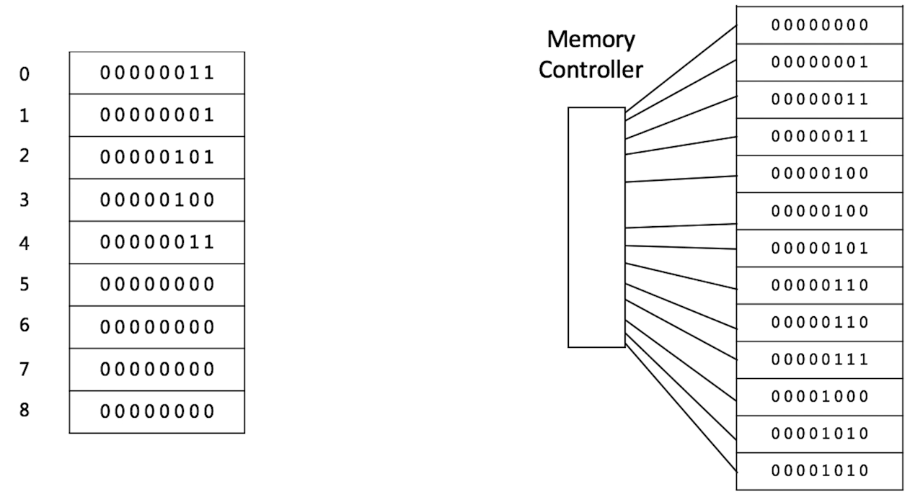
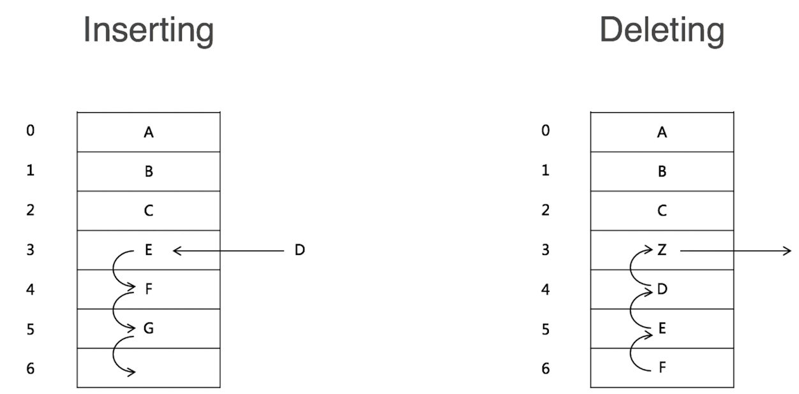
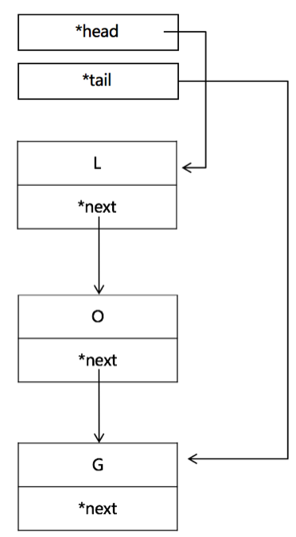

# Array

一块连续的内存地址

<!--more-->

通过下标访问O(1)

Access: O(1)
Insert: 平均 O(n)
Delete: 平均 O(n)

# Linked List -> 改善数组

head-> L-> O -> G

# Doubly Linked List

space      O(n)
prepend  O(1)
append   O(1)
lookup   O(n)
insert     O(1)
delete    O(1)

# 实战题目

三分学，七分练，坚持去做！！！

1. LeetCode 206 反转指针
2. LeetCode 24 swap linked list
3. LeetCode 141 Linked List Cycle 
   1. 硬做 0.5s 记录时间
   2. set，记录节点，判重 O(n)
   3. 快慢指针 O(n)
4. https://leetcode.com/problems/linked-list-cycle-ii
5. https://leetcode.com/problems/reverse-nodes-in-k-group

**链表题目多多记录公式，固定套路**； 开拓思维！！！！！多种解法！！去练习，刻意练习！！

