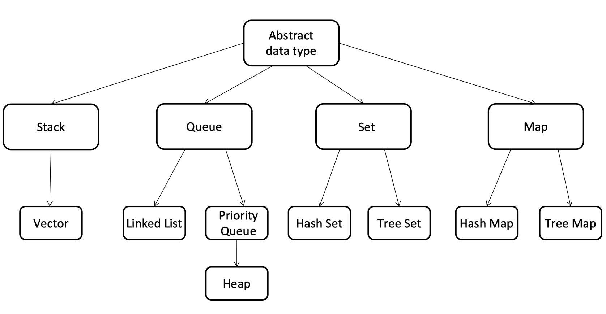
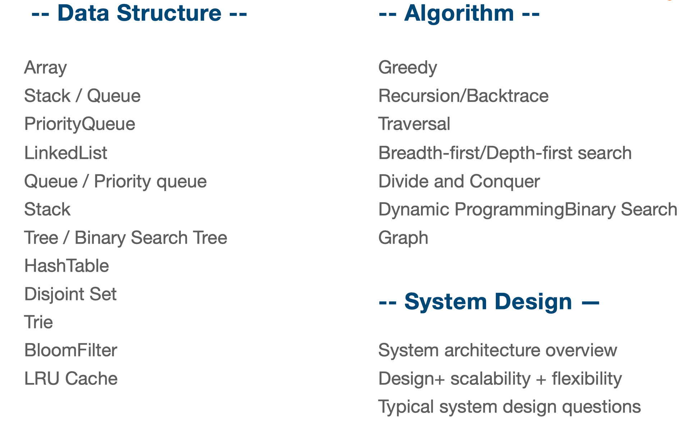
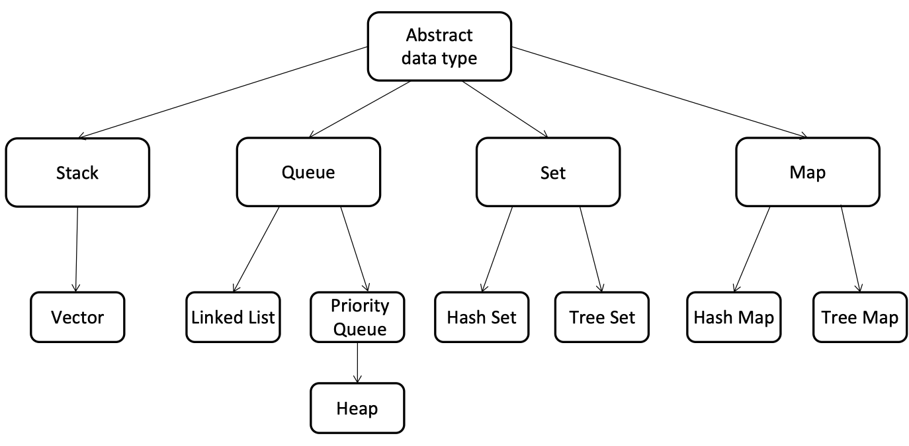
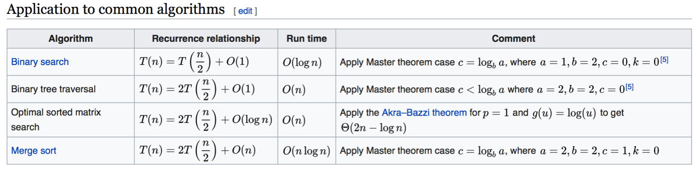

# 介绍

算法的重要性？

<!--more-->

每天的工作任务安排，算法来说，不是队列 来一个处理一个，更不是栈，最新的先处理；

而是优先级队列。很痛苦，但是坚持下来，产出最多，收获最好！！！ 

原因一:  **编程coding是内功的修炼**

原因二: 大公司必备条件

原因三: 硅谷现场手写

原因四: 算法和数据结构实用并有趣的

## 有效学习算法和数据结构

不是记或者背；

第一是要去理解, 明白其结构；

第二是去练习，大量的练习。

<<异类-不一样的成功启示录>> 马尔科姆

任何一个人想要在某个领域达到顶尖的位置: 切碎知识点； 刻意练习； 获得反馈

1. **chunk it up 切碎知识点**  大知识体系 分成 小模块； 购买该领域的专业书籍学习；最后整合回来，**注意每块之间的脉络联系**；一块一块的去学习，去练习

   

   

   理解记知识：**每块知识点之间串起来，关键是找到主干，不断分散，枝叶**

2. **deliberate practicing 刻意练习**

   很重要：大量练习缺陷，不熟悉的地方；会有不舒服，枯燥的地方

   坚持住，才能提升自己，和自己作斗争。

   练习什么：1. review各个知识点整体框架概念，知识点之间的联系,**要在脑子中能够构建起图谱** 2. 针对新知识，不断去写，去coding，去理解，去做笔记。

3. **feed back 反馈**

   1. **及时反馈**
   2. **主动型反馈**(自己去找)
      1. 高手代码(Github, Leetcode!!)
      2. 第一视角直播
   3. **被动式反馈(可遇不可求**，高手给你指点)
      1. 高手 code review 

### 切题四件套

- clarification !!明确题目意思
- Possible solutions 可能的解，范围，拉掉的可能性
  - compare（time/space）
  - optimal（加强）
- Coding **多写**
- Test cases

## 课程总览和算法复杂度

### Data Structure：

**Array; Stack/Queue; PriorityQueue(heap); LinkedList(single/double); Tree/Binary Tree; HashTable; Disjoint Set; Trie; BloomFilter; LRU Cache**

### Algorithm:

**General Coding; In-order/Pre-order/Post-order traversal; Greedy; Recursion/Backtrace; Breadth-first search; Depth-first search; Divide and Conquer; Dynamic Programming; Binary Search; Graph**

### 时间复杂度和 空间复杂度

时间复杂度 这是 常识，习惯；若是无法判断；代入特殊值，1，3，5，7

Big O notation

O(1): Constant Complexity: Constant 常数复杂度； 一次运算；
O(log n): Logarithmic Complexity: **对数**复杂度

O(n): Linear Complexity: **线性时间复杂度** 和N有关， 程序跑多少次
O(n^2): N square Complexity 平方

O(n^3): N square Complexity 立⽅
O(2^n): Exponential Growth 指数

O(n!): Factorial 阶乘

多个只看最高阶的复杂度；大概多少次；

## 如何练习算法

！！！三分学习，七分练习；一定开始自己的练习

练习题 + 练习方式

### 刻意练习

- 坚持 刻意练习：不要自己会做的题目，要花时间去做要做常见，不会的题目。
- 练习缺陷 弱点的地方
- 不舒服 枯燥，难受

运用 **目就用切题四件套**； 条件反射！！！！！

1. 明确题目的意思
2. 看到一个题目，数据的范围，错过的可能性，需要注意的地方；
   1. 想到**可能的解法，找出最佳解法**，对比**时间，空间复杂度**
   2. 改进暴力算法！
3. Coding **多写**
4. 测试用例

## 反馈！！！

solution from leetcode

discussion from leetcode

## !!关键的关键！

- 现在就动手
- **练习 - 坚持 - 机会给予有准备的⼈**
- 每节课的课后作业