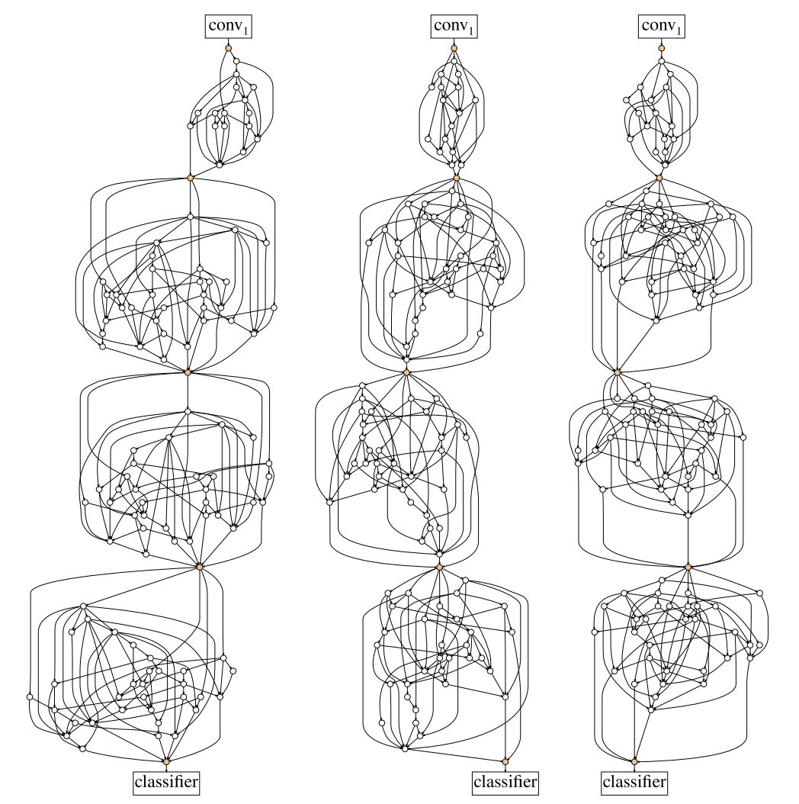
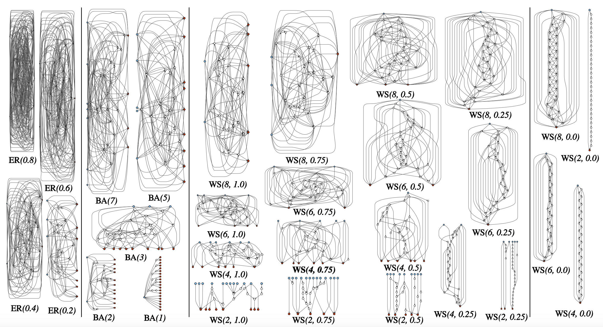
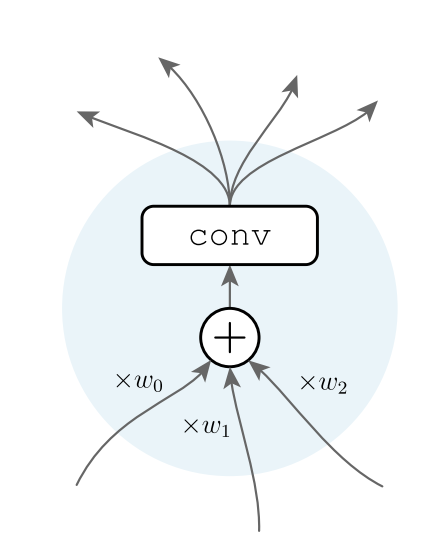
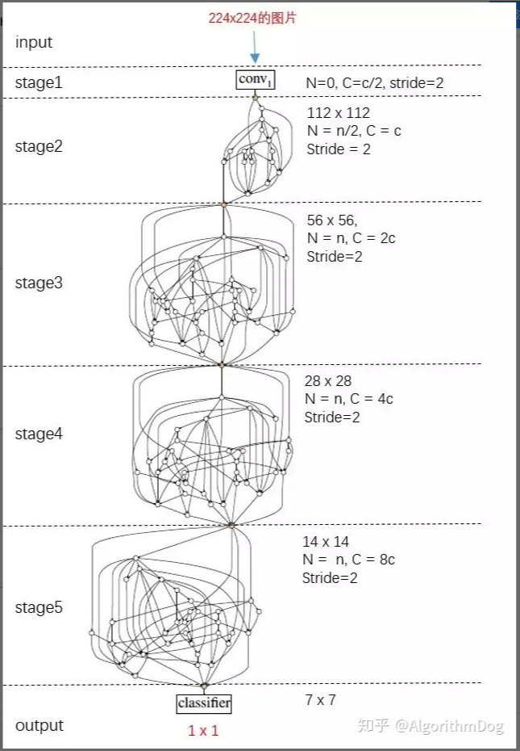
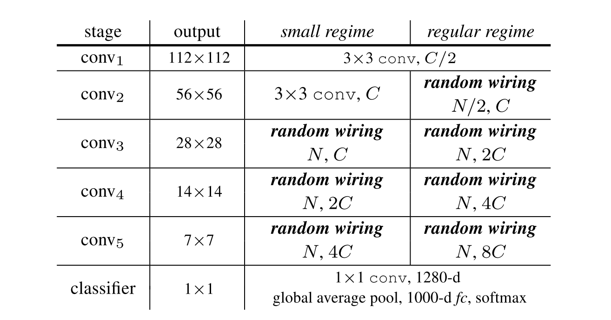
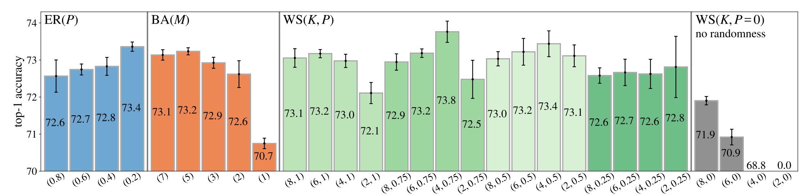
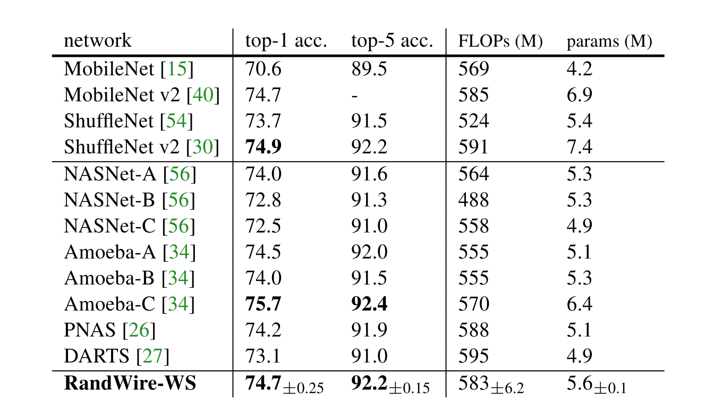
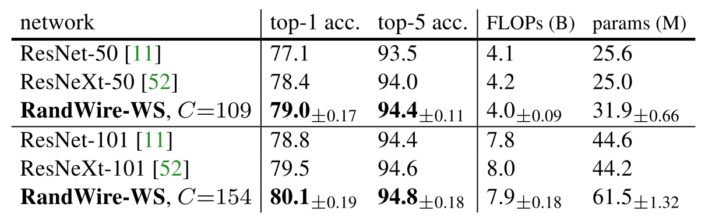
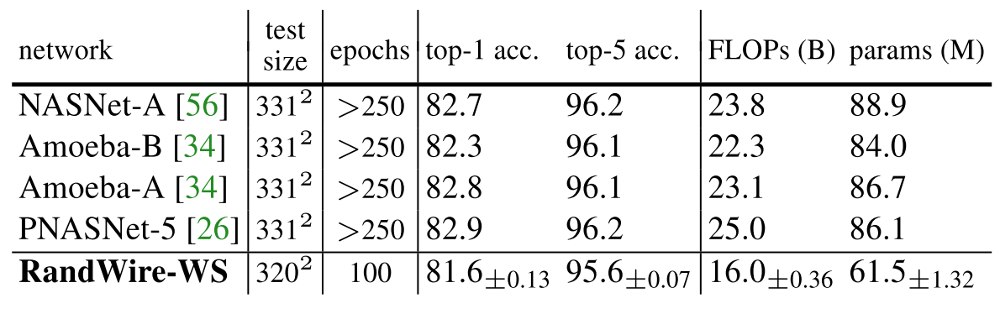
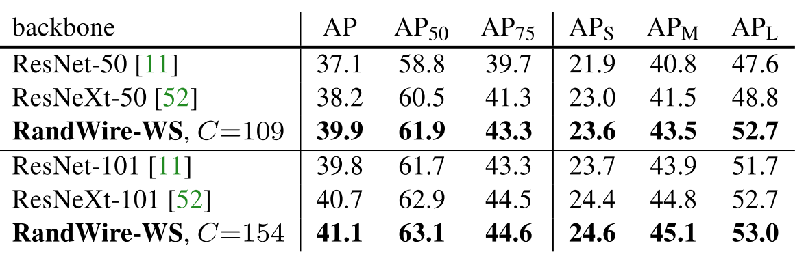

# 论文阅读-RandWiredNN

RandWireNN 基本思想是**研究设计stochastic network generator**，也就是**设计网络构架的机制**，它的关注点**在网络的连接方式上**。论文作者引入了一种网络模型空间的构造方法，即**图论中的random graph，之后用grid search搜索出较好的神经网络子集**，并在ImageNet的1000-class分类任务上进行**验证**。

论文： Exploring Randomly Wired Neural Networks for Image Recognition 【[pdf](https://arxiv.org/abs/1904.01569)】

作者：[Saining Xie](https://arxiv.org/search/cs?searchtype=author&query=Xie%2C+S), [Alexander Kirillov](https://arxiv.org/search/cs?searchtype=author&query=Kirillov%2C+A), [Ross Girshick](https://arxiv.org/search/cs?searchtype=author&query=Girshick%2C+R), [Kaiming He](https://arxiv.org/search/cs?searchtype=author&query=He%2C+K)

参考文章：https://zhuanlan.zhihu.com/p/62837029

<!--more-->

本文阅读有大量参考上述参考文章，也会补充部分个人细节与思考。

## 摘要

RandWireNN 基本思想是研究设计**stochastic network generator**，也就是设计网络构架的机制，它的关注点在**网络的连接方式**上。下图是本文中获得的网络结构：

论文作者引入了一种**网络模型空间的构造方法，即图论中的random graph，之后用grid search搜索出较好的神经网络子集，并在ImageNet的1000-class分类任务上进行验证**。

深度学习模型炼丹师一般手工精心设计网络中不同层之间的连接方式，如CNN的convolution，RNN的recurrent，ResNets的x+F(x)，以及DenseNets的[x, F(x)]等。自动化机器学习/深度学习的研究者则主要关注在巨大的网络模型空间中如何高效地搜索出较好的神经网络，如早期研究人员一般使用random search/gird search，现在演变出reinforcement learning, gradient-based, weight-sharing,以及evolutionary等方法。**论文作者引入了一种网络模型空间的构造方法**，即**图论中的random graph**，之后用**grid search搜索出较好的神经网络子集**，并在ImageNet的1000-class分类任务上进行验证。

## 方法

论文的主要工作包含以下步骤：

（1）基于**图论的随机图方法**生成随机图Random Graph；

（2）将Random Graph**转换为一个神经网络NN**；

（3）将**多个NN堆叠**起来，形成最终的**随机连接神经网络RandWireNN**；

（4）在ImageNet 1000-class任务上验证RandWireNN的表现；

（5）重复（1）到（4）步骤。

### 一、基于图论的随机图方法生成随机图Random Graph

作者引入了三种随机图生成方法，即Erdos-Renyi（ER）、Barabasi-Albert（BA）和 Watts-Strogatz（WS）。这三个方法生成随机图的机制比较简单。

- ER: N个节点，**节点两两之间以P的概率有一条边**。该方法包含一个参数P，故以**ER(P)**表示。
- BA: 初始有M个节点（M<N），每**增加1个新节点**的时候，该节点以一定的概率与已有的所有节点相连（这个概率与已有节点的度有关），**重复，直到这个新节点有M条边**。重复，**直到整个图有N个节点**。该方法包含一个参数M，故以**BA(M)**表示。
- WS: 所有N个节点排成一个圈，每个节点与两边邻近的K/2个节点相连。之后按照顺时针方向遍历每一个节点，**与当前节点相连的某一条边以概率P与其他某个节点相连**。重复K/2次。该方法包含2个参数K和P，故以**WS(K,P)**表示。

其中模型的**节点总数N由论文作者根据网络复杂度（FLOPs）手动指定**，因此ER方法的参数搜索空间为P∈[0.0,1.0]，BA方法的参数搜索空间为M∈[1,N]，WS方法的参数搜索空间为K∈[1,N-1] x P∈[0.0,1.0]。图1是三种方法生成的随机图。

图1：随机图

### 二、把生成的随机图Random Graph转换为一个神经网络NN

### **1. 将随机图转化为DAG**

由图1可知，生成的每个随机图中的边是没有方向的，且不知道哪个是输入节点，哪个是输出节点。

首先要给每条边指定一个方向，即把**生成的随机图Random Graph转换为有向无环图DAG**。方法就是**给每个节点分配一个索引index（从1到N），若两个节点之间有边，则边的方向从小索引节点到大索引节点**。其中ER方法按照随机的方式给N个节点分配索引；BA方法给初始的M个节点分配索引1~M，之后每增加一个节点，其索引加1；**WS方法则按照顺时针方向从小到大给N个节点分配索引**。

### **2. 为DAG的边和节点赋上操作**

边操作：本文中假设**每条边都代表着数据流**，将**一个tensor从一个节点送到另一个节点**。

节点操作：每一个节点代表一个一个**实际操作**。这个操作可以细分为以下三步：

- Aggregation：（输入操作：聚合）输入数据(从一条或多条边)到节点**通过加权求和来聚合**在一起；其中权重是**正向可学习**的。
- Transformation：（转换操作：卷积）**聚合数据由定义为[relu-convolu- bn]三元组的转换处理**。**所有节点都使用相同类型的卷积**，默认情况下为3×3可分卷积。
- Distribution：（输出操作：复制）节点的输出边缘发送转换后的数据的相同副本。

图2：节点的操作

这样设计操作带来的一些特点：

1. Additive aggregation能够维持输入输出**channel数不变**，防止后面的卷积计算越来越大，来避免仅仅因为增加计算量而提高大型输入节点的重要性程度，而忽略网络连接的作用。
2. Transformation应具有相同数量的输出和输入通道(除非切换阶段），以确保转换后的数据可以与来自任何其他节点的数据相结合。固定通道计数之后，不管输入和输出的程度如何，都会保持每个节点的FLOPs(浮点操作)和参数计数不变。
3. 不论输入和输出的程度如何，聚集和分布几乎没有参数(加权求和的参数数目很少)。此外，假设每条边都是无参数的，这样一来，**图的FLOPs和参数数量与节点的数量大致成正比，且几乎与边的数量无关**。

这些属性几乎将FLOPs和参数计数与网络连接解耦，例如，在随机网络实例或不同生成器之间，FLOPs的偏差通常为±2%。这可以在不增加/减少模型复杂性的情况下比较不同的图。因此，任务性能的差异反映了连接模式的属性。

### **3. 设置cell的输入节点和输出节点**

给DAG指定唯一的输入节点（input）和唯一的输出节点(output)。DAG本身包含N个节点，那么额外**指定一个输入节点与DAG中所有入度为0的节点相连**，其负责将输入的图片转发出去；再额外指定一个**输出节点与DAG中所有出度为0的节点相连**，该节点进行均值计算后将结果输出。

### 三、将多个NN堆叠起来，形成最终的随机连接神经网络RandWireNN

借鉴其他经典深度学习神经网络，作者将多个NN堆叠起来形成最终的随机连接神经网络RandWireNN。图3为一个示例，其包含共5个stages，其中stage1是一个卷积层，stage2可以是一个卷积层或者是一个NN，stage3、stage4和stage5均为NN。不同stage之间：卷积操作的stride为2，故feature map的大小逐渐减半；卷积操作的卷积核的数量x2，故feature map的通道数(即C)也x2

其中每个NN的节点数N（不包含输入和输出节点）设置为32，通道数C设置为78或者109/154。不同的（N,C）对应不同的网络复杂度（FLOPs），这样可以跟不同规模（small/regular/larger）的其他经典网络进行实验比较。

### 四、在ImageNet 1000-class任务上验证RandWireNN的表现

（1）三个随机图生成方法（ER，BA，WS）的比较

如图4所示，WS方法的表现最好，于是接下来作者挑选了WS（4,0.75）与其他网络进行比较。论文还进行了另外一个网络结构鲁棒性测试的实验，即将网络中的某个节点或者某条边随机去掉，然后测试网络的表现，最后发现WS的结构最不稳定。这个研究点很有意思，也许将来会有一种网络生成器能够生成又好又鲁棒的网络结构，类似大脑，也许有种大脑结构最不容易得精神疾病。

首先是与小规模网络(smaller)进行比较，此时N=32，C=78。如表1所示，比MobileNet/ShuffleNet/NASNet/PNAS/DARTS等表现好，比Amoeba-C略差。7

其次与中等规模的网络（regular）进行比较，此时N=32，C=109/154，如表2所示，比ResNet-50/101和ResNeXt-50/101表现好。

最后与大规模网络（larger）进行比较，此时直接使用刚才训练好的中等规模网络，不过输入图像的size由224x224提高到320x320，如表3所示，虽然比其他网络表现略差，但是计算量少了很多。

（3）迁移表现

论文将RandWireNN作为骨干网络，用Faster R-CNN with FPN来检测目标（COCO object detection），如表4所示，比ResNet-50和ResNeXt-50效果好。

## 总结与思考

### 总结

本文贡献：

- 使用 WS 模型的最佳生成器生成的多个网络性能优于或可与完全手工设计的同类网络和通过各种神经结构搜索方法找到的网络相媲美。
- 还观察到，对于同一生成器生成的不同随机网络，精度的方差较低，但不同生成器之间存在明显的精度差距。这些观察结果表明，网络生成器的设计很重要。
- 最后，工作表明，从设计单个网络到设计网络生成器的新过渡是可能的，类似于如何从设计特征过渡到设计学习特征的网络。

### 思考

1. 本文还是保持了相当部分的手工设计，对于随机图参数的选择方式是否可以改进
2. 比较有意义的是，本文把NAS领域的重点从运算操作的选择转向了网络连接(拓扑)的构造。

参考文章中俞一鹏博士的思考：

（1）这篇论文将图论的方法引入，并强调network generator的重要性，很有新意，好比“虎父无犬子”，“龙生龙，凤生凤”。

（2）这个idea也许你也能想到，不过快速实现这个idea的能力更重要；

（3）不同stage之间只有一个node连接，这个设计未必合理；

（4）迁移学习表现比较的实验过于简单，且其他实验结果也没有很惊艳。

（5）引入的图论方法有点简单，也许有更复杂的图生成方法，比如Bio-inspired类的；

（6）只与NASNet进行了表现比较，没有与其他AutoML方法进行对比。